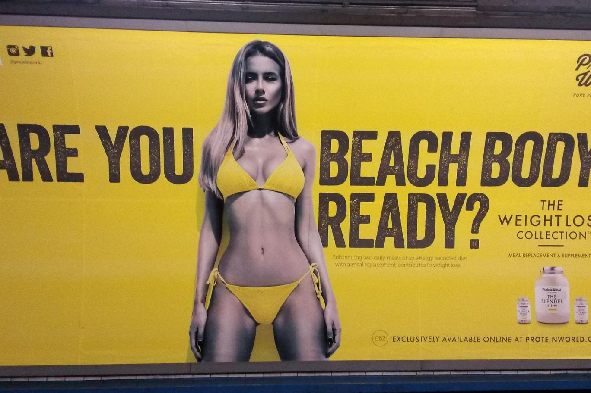
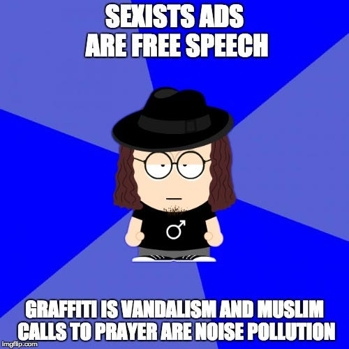
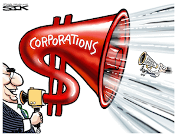
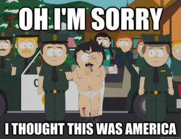
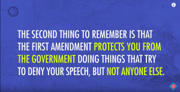

Freedom. An apparently simple concept that you’d think people understand pretty well, after all it’s a fundamental human right. But no. It’s probably the concept people abuse and misuse the most when discussing about politics, law and the role of the state. People defend all sorts of nonsense in the name of freedom. This madness must stop. So let’s take some time to think about it.

Before we start talking about free speech, let’s make sure we have the basics clear. What is freedom?

> *“the condition or right of being able or allowed to do, say, think, etc. whatever you want to, without being controlled or limited” — [Online Cambridge Dictionary](http://dictionary.cambridge.org/dictionary/english/freedom)*

Beautiful. Clearly, freedom is good. After all, we all know that any concept can only be one of two things: good or bad. Nothing in between. Easy, right? Of course not. That brings us to the first item of the list:

## 1. Freedom does not have absolute value

“*Your rights end where mine begin*”. Everyone has heard this piece of conventional wisdom and I guess it’s pretty safe to assume that most agree with it. Of course, there must be limits to freedom, one can’t simply kill whoever they want. But now wait. Should we conclude that freedom is bad!? Of course not. Freedom is one of those things that are good in moderation, but that may be dangerous if taken to an extreme. But where do we draw the line between legitimate and illegitimate limitations of people’s freedoms?

Why is killing people illegal? Because generally it’s conceived that people want to live and don’t want to die and that somehow the right to live trumps the right to kill. There is a wide enough consensus that killing innocent people is immoral and therefore modern democracies concede the monopoly of violence to the state. If you don’t want all hell to break loose you must enforce some boundaries on people’s freedoms. It would be immoral not to. Why is punching people illegal? Also, except for a couple of freaks, nobody likes to be punched. It hurts. It doesn’t feel nice. So it’s fair enough to make it illegal. What about tickling people on the streets though? What about disturbing them by making very loud noises in public spaces?

Very quickly we’re not only talking about freedom anymore, but about ethics and the ***relative value of freedom when compared to different actions which cause different degrees of discomfort***. Clearly, if the suffering caused by a person’s actions crosses a certain threshold, curbing their freedom to do so is not only morally legitimate, but imperative. That’s why it’s illegal to kidnap people and torture them, even if you let them live in the end. Some may accuse me of being overly [utilitarian](https://en.wikipedia.org/wiki/Utilitarianism), but as imperfect as vanilla utilitarianism may be, I still haven’t heard of any account of ethics that manages to deal away with utility altogether.

> *“Morality must relate, at some level, to the well-being of conscious creatures.” — Sam Harris*

## 2. Free speech is already limited and you’re not complaining

Free speech. By far the most trendy freedom nowadays. If you tweet “I hate niggers” and anybody dares to criticize you, there will quickly be legions of supporters coming to your rescue, defending your freedom of speech and condemning the PC-police. Many seem to live this binary illusion that “we still have free speech for the moment, but we’re about to lose it if we don’t stop the social justice warriors”. But is it really that binary?

Of course not. The extent to which freedom of speech is protected is in a spectrum, and varies from country to country. Some countries grant very little freedom of speech to their citizens, while some grant quite a lot. But no country allows 0% or 100% free speech. It’s hard to even imagine what something like that would mean. Here are some examples of situations in which pretty much all modern, liberal democracies limit free speech:

- Incitement to genocide is illegal under international criminal law [^1]
- “publicly inciting to violence or hatred” or “publicly condoning, denying or grossly trivialising” genocide, crimes against humanity or war crimes are offences under European law. [^2]
- Most developed countries have some criminal regulation against “crimes of honor”, such as defamation, calumny, slander and libel, all of which may have slightly different meanings in different legislations. [^3]
- Tobacco ads are illegal in most developed countries [^4]
- Alcohol advertisement is highly regulated [^5]
- Child targeted advertisement is regulated and even illegal in some countries [^6]
- In the U.S., “explicit sexual acts that are publicly accessible […] by the general public” and are labeled as obscene by the Miller Test are considered illegal and are not protected by the First Amendment [^7]. Similarly, in Europe, the article 2 of the [Consolidated ICC Code of Advertising and Marketing Communication](http://www.iccwbo.org/Data/Policies/2011/ICC-Consolidated-Code-of-Advertising-and-Marketing-2011-English/) states that “Marketing communications should not contain statements or audio or visual treatments which offend standards of decency currently prevailing in the country and culture concerned”.
- Pornography depicting minors is considered child pornography and is therefore illegal in most countries even if the production didn’t involve real children [^8]
- [Revenge porn](https://en.wikipedia.org/wiki/Revenge_porn) has been made illegal in many countries in recent years.
- [Harassment laws](https://en.wikipedia.org/wiki/Harassment#Laws) criminalize several behaviors around the world.
- [Threats](https://en.wikipedia.org/wiki/Threat) of violence are usually illegal.
- [Personality rights](https://en.wikipedia.org/wiki/Personality_rights) protect people from having identifiable images of them exposed in public against their consent.
- [Public-order laws](https://en.wikipedia.org/wiki/Public-order_crime) make it illegal to run around naked shouting obscenities in most countries.
- As much as I may like street art, protecting property is often considered a priority and [vandalism laws](https://en.wikipedia.org/wiki/Vandalism#As_a_crime) in many cases criminalize graffiti and other forms of unauthorized street art.

So no, if someone suggests, for example, that [body shaming ads inside the subway](http://www.theguardian.com/media/2016/jun/13/sadiq-khan-moves-to-ban-body-shaming-ads-from-london-transport) shouldn’t be legal, it doesn’t mean that they’re against free speech. It just means they would add an item to that list. Does adding this one item make us cross the threshold between legitimate limitations of free speech and dictatorial censorship? You could argue that it does, but it would be a subtle point that would require very good justification. It wouldn’t be sufficient to say “*you leftards are no better than North Koreans and Saudi Arabians!! This is an affront to free speech!! When is this censorship gonna stop!? Fuck you if you’re offended!!1*”

*“Adverts which put Londoners under pressure over body image are to be banned from the Tube and bus network.” — London Evening Standard*

This selective outrage just reinforces the idea that, in the end, it’s not really the issue at hand that matters, but change itself. The status quo is comfortable. Change is destabilizing.

*Sexist ads are free speech. Graffiti is vandalism and muslims calls to prayer are noise pollution.*

## 3. Freedom of expression was not secured in order to protect commercial speech

> *“Freedom of speech is a principal pillar of a free government; when this support is taken away, the constitution of a free society is dissolved, and tyranny is erected on its ruins. Republics and limited monarchies derive their strength and vigor from a popular examination into the action of the magistrates.” — Benjamin Franklin, 1737*

As democracy started to gain popularity around the world after the Enlightenment, free speech was often evoked as fundamental part of it. Of course, the citizens must be able to criticize the government in a system whose name comes from “*rule of the people*”. In a world with a history of persecution of religious heretics, political dissidents etc, it makes perfect sense.

Other philosophers and intellectuals defended freedom of expression as part of the broader notion of freedom of thought. In order for society to progress, people should be free to disagree with the church, with the academia, with the scientific consensus of the time, and should have the right to expose these ideas in public (freedom of speech) and to associate with those with similar views (freedom of association).

> *“Freedom is absolutely necessary for the progress in science and the liberal arts.” — Baruch Spinoza*

But mass media didn’t exist back then. The most advanced media technology was the printing press. Does it really make sense to religiously apply the same rules created then to our 21st century media saturated society? Would that really contribute to human flourishing? Would that really protect us from tyranny?

I really don’t see how it would. As much as I may think the Westboro Baptist Church, for example, is run by hate-mongering lunatics, I don’t hesitate to defend their right to protest and express their ideas. Do they want to write a book about how wrong it is to be gay? Go for it. Do they want to make a gory movie with explicit scenes of gays being tortured in hell? I guess I’d be ok with that. The same principle that guarantees their right also guarantees my right to go and do the similar things in favor of LGBT rights or whatever cause I support. But if a protein supplement company wants to increase their profits by exposing large posters that exploit people’s insecurities to sell their products, does that really have to do with free speech? I mean, what is the idea they’re trying to promote?

Of course, as telecommunications technology started to evolve and advertisement started to gain relevance, several companies have resorted to the principle of free speech to defend themselves from advertising regulations, some with a certain degree of success [^9], but not much. After all, ***historically, the motivation for free speech has never had anything to do with a company’s right to advertise their product***.

> *“Expression concerning purely commercial transactions has come within the ambit of the Amendment’s protection only recently. […] To require a parity of constitutional protection for commercial and noncommercial speech alike could invite dilution […] of the force of the Amendment’s guarantee with respect to the latter kind of speech. Rather than subject the First Amendment to such a devitalization, we instead have afforded commercial speech a limited measure of protection, commensurate with its subordinate position in the scale of First Amendment values, while allowing modes of regulation that might be impermissible in the realm of noncommercial expression.” — [Supreme Court of Ohio in response to Ohralik v. Ohio State Bar Ass’n](https://en.wikipedia.org/wiki/Commercial_speech)*

## 4. Free speech guarantees that you can express your views publicly, but not that you have the right to use any possible means to do so

So freedom of expression assures Westboro Baptist Church’s right to create a gory anti-gay movie. But what if they wanted to organize public screenings of their movie in areas of high circulation in the city? That’s where their freedom ends and mine begins. They can criticize the government, they can promote their ideas, they can freely assemble with their fellow homophobic, christian fundamentalists, but ***using state of the art mass communications technology to shove your ideas down everybody else’s throats* *is not a fundamental right***.

Even for the activities that are most clearly protected by the principle of free speech, there are regulations that must be respected. You can’t go in front of a hospital at 2 a.m. with a loudspeaker and criticize the government. For a real world example, recently there has been quite a lot of discussion regarding [mosques that use loudspeakers to issue their calls to prayer](https://en.wikipedia.org/wiki/Loudspeakers_in_mosques). Free speech doesn’t necessarily trump the right to peace and quiet and all visual and noise pollution regulations. Needless to say, it is only natural that commercial speech be subject to even more control.

## 5. Freedom of association doesn’t harm free speech, it actually helps it

In the age of social media, many of us are members of groups where people engage in ideological discussions about all sorts of subjects. Of course, most groups celebrate diversity of opinion, but the internet being the internet, of course there is always a dubious character whose hostility quickly lead their membership to be questioned. And when it inevitably happens, their typical response is usually along these lines: “Is this North Korea!? We have no free speech!?”

But does free speech really mean we should always allow anyone to say anything in any setting? Clearly not. Freedom of association, which is next to freedom of expression in the declaration of human rights, guarantees the right to “peaceful assembly and association”. This means Christians can create a Christian-only club, Humanists can create an Humanist-only club, and basically anyone can create any group with any membership rules. Deciding whether to ban someone from a group has nothing to do with free speech, only with the group’s membership rules. If I join a Christian group, claiming to be a Christian, and start posting articles denying that Jesus was the son of God, it is absolutely legitimate for them to ban me from the group. Furthermore, if they decide to make “banana” a forbidden word in the group, and I insist in repeating it, they also have the right to kick me out, even if I conformed perfectly to the definition of a Christian.

It makes perfect sense. The right to meet and discuss with like-minded people, fight for your shared interests and advance certain causes is fundamental for democracy and implies we should also have the right to create an environment that is favorable for this project. If a Humanist group has its activities hindered by constant flame wars triggered by borderline racist and xenophobic posts, or if a feminist group is constantly flooded with antifeminist MRA posts, it is more than reasonable to remove the troublemakers from the respective groups and that doesn’t hurt free speech in any way. Quite the contrary. It allows it to be properly exercised.

Is it good to have a hard-line leadership who bans people on the smallest sign of dissent from the norm? I don’t think it is. But repeatedly referring to your opponents as “*leftards*” and stating that “*Islam is a Nazi ideology*” and then invoking the free speech to defend yourself is at best naïve and at worst a cynical display of bad faith and dishonesty. After all, these same people would be very quick to support the removal of an anti-abortion Christian from a Humanist group without seeing anything wrong with it. Drawing a line between which opinions conform to an ideology and which ones don’t is a difficult task. If you don’t like where the line is being drawn, you should argue that it should be drawn somewhere else. Claiming that it shouldn’t be drawn at all, however, goes directly against the principle of freedom of association.

## 6. Only the government can’t punish you for your speech, anybody else can

*[Freedom of Speech: Crash Course Government and Politics #25](https://www.youtube.com/watch?v=Zeeq0qaEaLw)*

The previous item brings us naturally to our last one. Free speech was instituted to guarantee you can protest against the government and that it can’t stop you. But if you criticize the company you work for or the NGO you’re a member of, they legally have the right to fire or remove you from the organization [^10]. Of course, many organizations claim to abide by democratic values and criticizing the leadership of an NGO you’re a member of should ideally not result in your immediate expulsion. But the voluntary nature of NGO membership (as opposed to the involuntary nature of citizenship) makes the protection of free speech much more lenient in the former case. If you act like a brat and constantly provoke the president of the organization, publicly posting derogatory cartoons and stupid jokes that harm the image of the organization, I wouldn’t be too alarmed by your expulsion. The same attitude towards the president of your country, however, must doubtlessly be firmly protected.

## Conclusion

I’m a huge supporter of free-speech. I tend to oppose laws that limit artistic expression, even if they seem offensive to certain groups of people (such as the [2005 Danish cartoons](https://en.wikipedia.org/wiki/Jyllands-Posten_Muhammad_cartoons_controversy)). I’m very skeptical to anti-defamation laws that aim to protect public figures, especially politicians. I’m absolutely appalled and deeply worried about the new tendency of disinviting speakers from American [^11] and British [^12] university events and other conferences over legitimate ideological differences and negligible diplomatic slips such as [Richard Dawkins’ tweet criticizing regressive left tendencies within feminism](http://www.washingtonexaminer.com/richard-dawkins-disinvited-from-conference-for-offending-feminists/article/2581704).

I will firmly defend The Amazing Atheist and Thunderf00t if their right to say ignorant bullshit about feminism or any other ideology is being questioned. I wouldn’t even support the disinvitation of controversial figures like James Watson [^13] or Donald Trump if they happened to be invited to speak in some university. After all, a university is a place for debate and intellectual exercise, and nobody is forced to participate anyway.

But if they start tweeting rape threats, promoting their content with offensive advertisement that cause visual pollution and challenge obscenity, defamation and privacy regulations or start using loudspeakers in busy areas of the city, then no, I won’t defend them. And please don’t pull the free speech card. As a convinced proponent of free speech, the foolishness of the argument couldn’t seem more blatant.

> *“There’s nothing I like less than bad arguments for a view I hold dear.”
> ― Daniel C. Dennett*

[^1]: [International Criminal Tribunal for Rwanda](https://en.wikipedia.org/wiki/International_Criminal_Tribunal_for_Rwanda#The_Case_of_Ferdinand_Nahimana_and_Jean_Bosco_Barayagwiza)

[^2]: [The Framework Decision on racism and xenophobia](http://ec.europa.eu/justice/fundamental-rights/racism-xenophobia/framework-decision/index_en.htm)

[^3]: [Defamation](https://en.wikipedia.org/wiki/Defamation)

[^4]: [Tobacco Advertisement Countrol](https://en.wikipedia.org/wiki/Tobacco_advertising#Advertisement_control)

[^5]: [Alcohol Advertisement](https://en.wikipedia.org/wiki/Alcohol_advertising)

[^6]: [Advertising to children: Legislation](https://en.wikipedia.org/wiki/Advertising_to_children#Legislation)

[^7]: [Obscenity — New World Encyclopedia](http://www.newworldencyclopedia.org/entry/Obscenity#Miller_test)

[^8]: See for example: [Legal status of cartoon pornography depicting minors](https://en.wikipedia.org/wiki/Legal_status_of_cartoon_pornography_depicting_minors)

[^9]: See [RJR-MacDonald Inc v Canada (AG)](https://en.wikipedia.org/wiki/RJR-MacDonald_Inc_v_Canada_(AG)) and [Ford v Quebec (AG)](https://en.wikipedia.org/wiki/Ford_v_Quebec_(AG)) in Canada, or [Bolger v. Youngs Drugs Prods. Corp.](https://www.law.cornell.edu/supremecourt/text/463/60) in the U.S., for example.

[^10]: [The first amendment ***protects you from the government*** doing things that try to deny your speech, but ***not anyone else***.](https://youtu.be/Zeeq0qaEaLw?t=1m23s)

[^11]: [Disinvitation Season, Free Speech, and Unlearning Liberty](http://www.huffingtonpost.com/greg-lukianoff/disinvitation-season-free_b_4936295.html)

[^12]: [Safe space or free speech? The crisis around debate at UK universities](https://www.theguardian.com/education/2015/feb/06/safe-space-or-free-speech-crisis-debate-uk-universities)

[^13]: [He may have unravelled DNA, but James Watson deserves to be shunned](https://www.theguardian.com/commentisfree/2014/dec/01/dna-james-watson-scientist-selling-nobel-prize-medal)
