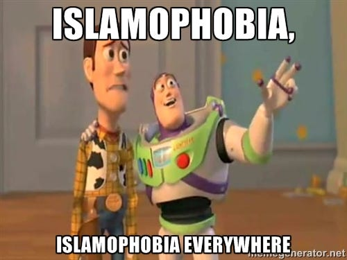
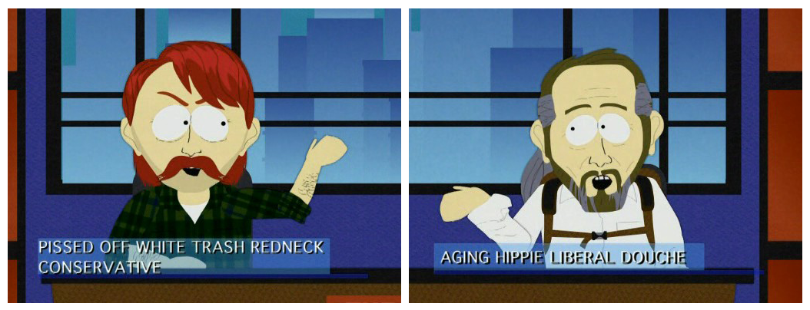

As everybody knows, last month France started enforcing an extremely controversial ban against the so called “burkini”. The ban was eventually overturned, but the debate is still very much alive. In the age of social media, when we all live in echo chambers [^1], I still haven’t had a chance to talk to a person who is actually in favor of the burkini ban. But the mere mention that “it’s hypocritical to display so much outrage towards this and then turn a blind eye to the culture of forced modesty in Muslim communities around the world” or that “I can understand why this ban appeals to the masses” is already enough to trigger some progressive liberals and turn them into paranoid anti-Islamophobia police (or, as [Maajid Nawaz](https://en.wikipedia.org/wiki/Maajid_Nawaz) would call them, [*regressive leftists*](https://en.wikipedia.org/wiki/Regressive_left)).

Don’t get me wrong, the ban is a shamelessly populist move that clearly exploits the Islamophobic feelings of the French masses, yes. But this doesn’t mean the only acceptable reaction to it is to shout “Islamophobic!” and delegitimize any discourse that is critical of Islam in any way because “this is not the moment”. So let’s go over a few things that must be stated clearly:

## The burkini ban is bad but not as bad as Islamic modesty laws

I’ve seen many people express the view that the burkini ban is *as bad* as the conservative Islamic dress codes. Some have even gone as far as saying the French law enforcement system is “almost as bad as ISIS”. This is really not a fair comparison. Forgive my utilitarianism, but in the lack of a more adequate paradigm, I am forced to ask: does the burkini ban really cause as much suffering as the whole culture of modesty forced upon women throughout the Muslim world in all public contexts under threats ranging from imprisonment to stoning [^2]? I don’t think so. What do we gain by uttering such outrageous statements?

It seems some people are so worried about delegitimizing any sort of potentially Islamophobic discourse that whenever they see a glimpse of an opportunity to say “See?? Deep down we’re as bad as them!” they grab it with no second thought. But the truth is: the Muslim world *is* much more messed up than the Western world at the moment. Just like Brazil is much worse than Canada. It’s a fact. This shouldn’t trigger disgust in us, however. It should trigger compassion. How can you be compassionate about a people’s problems if you pretend the problems don’t exist or are smaller than they really are?

> *When a woman cannot leave her home in anything other than a bikini without being deemed immoral and her human worth and family’s honor compromised, then we can make this comparison. — [Hiba Krisht on the Burkini/Bikini false equivalence](http://www.theexmuslim.com/2016/08/24/burkini-bikini-false-equivalence-disproportionate-outrage/)*

## It is questionable whether most Muslim women cover themselves voluntarily

> *[Criticism against conservative religious dress codes], and the defence of women resisting [them], is in no way helped by banning the **voluntary** wearing of arbitrary clothing in liberal countries. — [IHEU, This is not our secularism / Ce n’est pas notre laïcité](http://iheu.org/this-is-not-our-secularism-ce-nest-pas-notre-laicite/) (my emphasis)*

Though I largely agree with this, I have a problem with the repetitive use of the word “voluntary” when covering this topic. The problem is you cannot ban only the *forced* use of religious clothing. And the main reason why you can’t is not only a practical one of lack of human resources to enforce the ban, of money to provide housing and security for the thousands of women who would show up at your door running away from their families, etc. It’s a philosophical problem. Where do you draw the line between *forced* and *voluntary*?

Nowadays it is pretty much accepted by most scientists and philosophers that free-will, at least in the traditional, quasi-religious sense of the term, doesn’t really exist[^3]. Still, for all practical purposes, nobody denies that certain actions are *more free* than others. If somebody peacefully asks me for money on the streets and I give them, this is a pretty free action. If they threaten my life and I give them money, that’s very different. What if they threaten me with being shunned by the community forever? Being sent to burn in eternal hellfire? What if they brainwash me to think I’m a worthless whore if I don’t give them money? I think you see where I’m going. The fact that many Muslim women *say* they choose to cover themselves voluntarily doesn’t say much at all.

My point is that discomfort with conservative religious dress codes is legitimate, and that skepticism regarding the voluntary nature of obeying them is healthy. Of course the ban doesn’t really help the situation, but for those who feel like their voices are not heard, at least it seems somebody is finally doing something. And they are right about one thing: somebody *should* be doing something.

## This does have a lot do with protecting France’s secularism

In a very convoluted, populist, inefficient and self-defeating way. But it does.

> *This wasn’t about protecting France’s secularism; it was about a man’s right to police a woman’s body — still. — [Annalisa Merelli, Quartz](http://qz.com/768185/frances-burkini-ban-wasnt-about-islam-but-about-men-policing-womens-bodies-yet-again/)*

What does that even mean? That this law was passed for the sole reason that the men in power in France have an instinctive urge to police women’s body? That a preference for secularism over medieval religious fundamentalism didn’t play *any role at all*? That this is also the case for anybody who supports the ban? If this is the case, then how come France did so well for so many years, without banning any clothing, until the Islamic conservatism in France started becoming a visible problem? Does anybody really believe this claim? Let me suggest another hypothesis:

The leaders and voters who support the ban feel legitimately uncomfortable to see a growing number of people who are so conservative and religious as to fully cover their women in public because because of primitive ideas about honor. These people are not part of a university educated elite, however, and they’re also religious, so they can’t really articulate a coherent and diplomatic criticism of Islamic conservatism. Even less one that doesn’t backfire against their own religion. They don’t make an effort to be diplomatic because they’re in large part ignorant and easily fall victim to group think, often responding to terrorist attacks by thinking “They’re killing us! Why should I be diplomatic??”. Although they’re mostly religious themselves, they have grown accustomed to the benefits of modernity and secularism, and they fear their comfort is being threatened, and this is a legitimate fear. This brings me to my next point.

## It’s not constructive to vilify the other side of the political spectrum

It is an interesting irony that the elite of young, educated, left-leaning liberals have made arch enemies of the older, ignorant, conservative, working class, sometimes even allying with the much more hard line Muslim conservatives to attack them. This is extremely dangerous.

In the previous section I painted an image of the Christian conservative masses that is not nearly as bad as it is usually imagined by some people on the left. Of course, there are a few neo-nazi groups, but is it really thanks to them that such laws have popular support? I don’t think so. Of course, it’s much more glamorous and exciting to show these extremist groups in the media, but are they really representative of the French, British, American, or Western right in general? And even they are, were are these intolerant feelings coming from? Is it just their intrinsic and pure evil or are they the product of a sick political environment?

## Selective moral relativism is hypocritical

When historically oppressed minorities engage in violent behavior, regressive leftists are very quick to bring attention to the circumstantial factors that caused that behavior, but when white men rape or neo-nazis commit crimes, their evil nature is always the only thing they blame. This double-standard is a clear case of ideology-induced [attribution bias](https://en.wikipedia.org/wiki/Attribution_bias). I don’t want to excuse rapists and neo-nazis, but they are a product of their environment just like any oppressed group and it is simply more rational and pragmatic to foster dialogue with these groups, however depressingly racist and xenophobic they may be, than to adopt a childish and confrontational “no negotiation policy”. We must show them their voice is heard, especially before they become full-fledged neo-nazis, and that they don’t have to choose between regressive leftists and far-right, nationalistic, conservative demagogues. They can be rational and progressive while still worrying about dangerous ideologies finding roots in their country.

*This polarization has to end*

## We don’t want more Brexits, Trumps and Le Pens

If we keep ignoring masses of working class conservatives who’re frustrated with the establishment and the political correctness of left-leaning leaders and dismiss them as nazis who don’t deserve our respect or attention, we will just pave the road for new Brexits, Trumps and Le Pens all over the West. Do we really want that? It’s time we leave our pride aside and prepare for some dialogue.

## A pragmatic approach

Next time we hear someone say something vaguely positive about the burkini ban, instead of shouting “Islamophobe! Hypocrite!”, we should say “I understand your frustration, and this thing that you worry about is a genuinely legitimate issue. But the ban doesn’t really help it. Do you think there’s an alternative measure we could take that wouldn’t be so confrontational and wouldn’t alienate Muslim communities so much, but that would still send the message that such conservative dress codes are oppressive, sexist and have no place in the 21st century?”.

Next time we go out with our progressive friends, instead of circle jerking about how hypocritical the burkini ban is (or whatever is the issue of the moment), why don’t we brainstorm about what alternative measures should be put in place? Because doing nothing is really the worst thing we can do. If we stand passively, either Islamic radicalism will grow unrestrained in the West and become and even greater threat to secularism, or populist right-wing groups will rise to power and take an aggressive anti-Muslim approach that will just increase the tension in society. And I don’t know how much more tension we can take before something really, really bad happens.

[^1]: [How Social Media Created an Echo Chamber for Ideas — Big Think](http://bigthink.com/ideafeed/how-social-media-have-created-echo-chambers-for-ideas)

[^2]: [ISIS stones five women to death for not wearing the veil, says Mamouzini — Iraqi News](http://www.iraqinews.com/iraq-war/isis-stones-five-women-death-not-wearing-veil-says-mamouzini/)

[^3]: It’s complicated, but I recommend [Sam Harris](https://www.youtube.com/watch?v=iRIcbsRXQ0o) and [Daniel Dennett](https://www.youtube.com/watch?v=vBrSdlOhIx4) to see two different opinions that illustrate the ongoing debate in this area. Note that even Dennett defends free-will only in a rather deflated sense.
