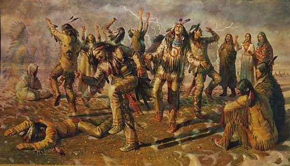
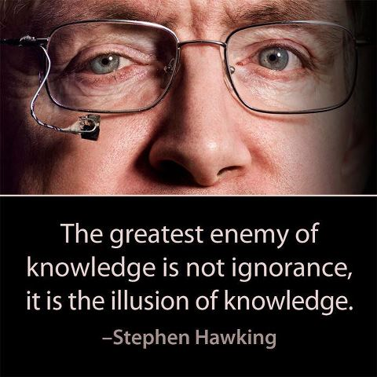

As far into my childhood as I can remember, I believed in a god. It was a personal god, who answered to prayers, cared for humankind, etc. As I grew older, I started being curious about the world and reflecting about life. When I was very young I would occasionally pray for childish things such as superpowers, and my prayers obviously weren’t heard. If I was impatiently waiting for a family visit, for example, I prayed for the “next car to show up in the road to be them”. Of course, it “worked” sometimes, but mostly it didn’t.

As I wondered why my prayers weren’t answered, I started thinking about people who have more urgent needs, and it wasn’t long until I started thinking of all the misery and horror that takes place under the sun. With that in mind, it became hard to understand why anyone bothered praying at all. If the most vile things happen to the most innocent people without anyone to stop it, why would your petty first-world prayers be heard? And if your prayers are not heard for long enough, why do you keep trying? But to my amazement, people did keep trying. When it “works”, it’s proof that god exists. When it doesn’t, it’s because “god has mysterious ways”. Accident survivors are saved by god, children die of cancer at 10 because “their plan on earth is complete”, etc. Needless to say, believers will forever remember the prayers that “worked”, while the ones that didn’t will be quickly discarded. Bad chance is just chance, good chance is God.

“Maybe these people are not so innocent”, I thought. But aren’t we born innocent? Why can one be born the prince of England while another a starving child in a poor third-world country? Growing up in a [Spiritist](https://en.wikipedia.org/wiki/Spiritism) family, this was “explained” by karma. But then I thought: if God is good, how can evil even exist in the first place?

## The problem of evil

Of course, the traditional answer is that God created humans and gave us “free-will”, which in turn was used to do evil. But it didn’t convince me for long. What is evil, after all, if not but a concept created by us humans in order to label roughly all acts that cause suffering? According to Christianity, in the beginning there was no suffering. But somehow, the concept of evil already existed in God’s mind.

> “but of the tree of the knowledge of good and **evil** you shall not eat, for in the day that you eat of it you shall surely die” — Genesis 2:17

If God says certain things are evil, it means he constructed the universe in such a way that certain actions cause suffering and can therefore be called evil. People may have been created with a lack of propensity towards evil, with a lack of awareness that certain things cause suffering or with poor evil skills, but the ability to suffer was either already there, or was somehow stored in the tree, ready to be unleashed. And if God didn’t put it there, who did? The free-will argument just doesn’t hold. We can’t fly, but most people still think we have free-will. Why wouldn’t we still be free even if we didn’t feel any sort of pain?

In a nutshell, God, in its most common modern definition, is an absolute being who’s omniscient, omnipotent, omnibenevolent and who created a universe where there is “good” and “evil”, “right” and “wrong”. Then he proceeded and created a being that could act freely in this universe. He gave these beings, however, a limited set of characteristics, and knew, from the beginning, that they would disobey him. Then God goes on and punishes them harshly for acting according to the characteristics that he himself gave them. When you think about this, God’s goodness becomes at the very least questionable, if not utterly paradoxical.

Still, some say God gave us free-will, and didn’t give us any “characteristic that predisposed us toward anything”, much less evil deeds. This is an extremely weird argument to me, and though I am tempted to dive into the subject of what motivates us to act, I prefer to adopt another strategy. Let’s say God didn’t give us any impulse to act in any specific way. Still, he created the *possibility* of us acting wrongly, *knowing* that we would, and made it so that, after this action, we suffered. If I gave a loaded gun to a child and said “New toy! You can play with it, just don’t pull the trigger!”, would it be ok? It wouldn’t be wrong? Whether it’s because we’re naturally predisposed towards it, because of chance, or because of whatever reason, evil still is ultimately a consequence of God’s actions.

This is called “[the problem of evil](https://en.wikipedia.org/wiki/Problem_of_evil)”, and after I realized omniscience, omnipotence and omnibenevolence just couldn’t apply to a single entity at the same time, I dropped omnibenevolence and started thinking of God as a cold and impersonal being that simply created the universe. But as he became simply an explanation to the origins of the universe, the idea of a god became less comforting and I started hanging on less and less to the concept of a higher power.

## The first cause argument

Soon, even the idea of a “higher spirit or life force” as an explanation for the origin of the universe started to break down. After all, it’s a simplistic and naïve hypothesis based on no evidence. A relic of the human tendency to project intention onto natural phenomena and create gods to explain what we don’t understand (the “[God of the gaps](https://en.wikipedia.org/wiki/God_of_the_gaps)”). The argument that God is the “first cause” of the universe (the “[cosmological argument](https://en.wikipedia.org/wiki/Cosmological_argument)”) is not convincing because, as Bertrand Russell said, if everything requires a cause, then so does God himself. If something may exist without a cause, then this something may very well be the universe itself and we don’t need to bring gods to the problem, adding yet another link to the chain of causation.

## The argument from design

Another common argument is that certain things in the universe, such as life, are too complex to have come into being by chance and, therefore, must have been created by God (the “[teleological argument](https://en.wikipedia.org/wiki/Teleological_argument)” or “argument from design”). It’s usually illustrated by [Paley’s watchmaker analogy](https://en.wikipedia.org/wiki/Watchmaker_analogy).

*Paley says that if you found a watch on the ground, it would be ridiculous to presume its parts just came about together by chance. You would conclude it was made by a watchmaker. Therefore, since life is complex, it must have a creator as well.*

Now I could go on in length about how evolution by natural selection is the opposite of “chance” (Richard Dawkins has [a whole book on the topic](https://en.wikipedia.org/wiki/The_Blind_Watchmaker)), but there is an even deeper flaw in this argument: it is an *argumentum ad ignorantiam* (or [argument from ignorance](https://en.wikipedia.org/wiki/Argument_from_ignorance)). It doesn’t matter if there is an alternative explanation or not. We now happen to know how life evolves from simple structures to complex ones, but at a certain point in history we didn’t, and that didn’t make gods any more real. Not knowing how something works doesn’t imply there’s a god making it work magically. It only means this. That we don’t know. Period.

Suppose there’s an indigenous tribe somewhere where it hasn’t rained in a long time. One day the shaman gathers the whole tribe in order to dance for the God of rain. One of the tribesman, however, doesn’t show up. The shaman goes after him and asks why he didn’t show up for the ritual. He responds by saying he doesn’t believe in the God of rain. The shaman then responds with a rhetorical question that in his mind proves the existence of the God of rain: “*Well, if the God of rain doesn’t exist, then how do you explain the rain!?*”

This brings us to a fundamental difference between religion and science. Some accuse science of arrogance, but at least it is humble enough to acknowledge it doesn’t know something instead of simply postulating an answer out of thin air. The skeptic tribesman from the example above could have provided any alternative explanation to why it rains and it would have been every bit as valid as the existence of a rain god. So why bother making up anything at all?

When it comes to life on Earth, God may be the creator, sure, but it’s just as likely that it was some super advanced alien race who is beyond our understanding or the [Flying Spaghetti Monster](https://en.wikipedia.org/wiki/Flying_Spaghetti_Monster). The only difference between these hypotheses is that one of them is by far more traditionally accepted than the others. People are exposed to it from an early age, it’s part of their group identity and creates social cohesion. That’s it. If you’re not convinced about natural selection, that’s fine. Just withhold conclusions until you have time to learn about it. Until then, remember: *it’s ok to not know*.

Another deep flaw in this argument is that, like the cosmological one, it is circular. If complex things require a conscious creator, why doesn’t the creator require a creator as well? And if you say God is not complex, then how do you define complexity? I may very well say life is not complex either. If the difficulty in understanding something is a valid measure of complexity, then it must equally apply to life itself as well as to any supposed creator. Therefore, if life needs a creator, so does the creator, and so does the creator of the creator, and so on and so forth.

## Dualism

By that time, I was so unconvinced of the existence of God that even the term “agnostic” didn’t feel appropriate anymore. But I didn’t declare myself an atheist. I still had a spiritual side. “Spiritual but not religious”, said my [Orkut](https://en.wikipedia.org/wiki/Orkut) profile. Throughout all this existential crisis, however, I also liked to watch wildlife documentaries a lot, being a huge fan of channels like Animal Planet etc. This deeply influenced my reflections. I’ve always liked animals and, after enough time observing their behavior, it became harder and harder to not to see myself as just another species. It’s fascinating how their behavior is adapted to the environment just as their physical traits.

With time, I became increasingly interested in evolutionary psychology and started finding evolutionary explanations to most human emotions and behaviors as well, and to see clear parallels in the animal world. It becomes hard to see the concept of “justice”, “good” and “evil” as absolute, and emotions such as “love” and “altruism” as divine when all evidence shows they’re very natural, very biological instincts that gave us an advantage compared to our least cooperative competitors. Instincts that are present not only in humans, but [in many other species](https://en.wikipedia.org/wiki/Altruism_(biology)).

When discussing this topic, many people get emotional. Some prefer to not even entertain such thoughts — “*What about love? It’s so beautiful! I don’t just love my children because it increases the chances of survival of my genes!”* If you’re a theist, please bear with me and try to not get carried away by emotion. Love or, more generically, affection, is an instinct that connects relatives, mates in pair bonding species, or even friends in highly social species. Why do you love your closest relatives? Because they share many genes with you. But this should ***by no means*** imply that this is a ***conscious*** reason. Love is the name we give to our subjective experience. To imply that caring for someone is a calculated decision would be denying the experience of love. Nobody is doing that. If an individual is born with the instinct to protect their family, and passes this gene along to their children, they will have a higher survival chance and more numerous offspring, making their descendants more numerous than other variations that lack the respective gene. How does the individual ***experience*** the instinct? By feeling affection towards their kin, suffering for their loss, etc.

Of course, this doesn’t only happen in families. When vampire bats go out for food, for example, they need a great volume of blood because they can only absorb few nutrients. If one day an individual doesn’t manage to get enough blood, their more lucky counterparts will share a bit of their blood with the hungry one. These blood-sharing bats form bonds, and eventually [groups appear that frequently share blood among themselves](https://www.sciencenews.org/blog/wild-things/vampire-bats-share-blood-make-friends). If a bat persistently refuses to share, it will not be able to form a group and will be in disadvantage. How do bats experience the urge to share blood? We will never know. But wouldn’t it be arrogant of us to presume they don’t experience anything at all? That only we are capable of feeling sorry towards other people? To have a sense of debt and guilt when we don’t help someone who has helped us in the past?

Considering that what motivates us to act is an “internal force” that arises involuntarily (more on the topic [here](http://ghostlessmachine.com/en/2007/12/reason-emotion-and-motivation/)), usually called “emotion” or “instinct”, it becomes hard to imagine the existence of a spiritual world. How much sense does it make for immortal spirits to experience fear? To have sexual urges? Or to love for that matter? It makes no sense for a spirit to have instincts considering they’re immaterial, don’t die and don’t reproduce. There would be little left for an immortal spirit to do than drift apathetically through eternity, feeling no urge to ever do anything. That thought was my final revelation. Something inside me clicked and I could no longer believe in an immortal soul.

As I started reading more about the subject, I started to feel silly that I ever believed in spiritual life at all. There was nothing solid to back it up. The arguments in favor of it can be summarized by [anecdotal evidence](https://en.wikipedia.org/wiki/Anecdotal_evidence) about mysterious events and suspicious revelations that provide no real basis for reaching any sensible conclusion.

## Argumentum ad populum

Still, many people say: “But how come the idea of a divinity ruling the universe is a common aspect of all cultures!? This must say something!”. It does. It says a lot about us. Concluding that something must be true because many people believe it is a fallacy called *argumentum ad populum* (or “appeal to the people”). In the case of God, it should be no surprise that isolated tribes have similar ideas about order in the universe. After all, belonging to the same species, we are vulnerable to the same psychological weaknesses and cognitive biases.

### Teleological bias

I don’t mean to offend people who believe to have had “supernatural” experiences and paint them all as dishonest charlatans. I want to make it clear that I think many of them genuinely believe what they’re saying. I just think they draw conclusions from their experience without having a sufficiently solid basis for it. Humans have a tendency to look for patterns in everything we experience (see [pareidolia](https://en.wikipedia.org/wiki/Pareidolia), for example) and, depending on our culture, we will interpret our experiences in one way or another. I say this as a person who used to “see things” in my childhood, and after enough “visions” I considered everything strange to be a “ghost”. Any figure I seemed to see with the corner of my eye and turned out to be nothing, any weird fog or suspicious shadow. As Kardecist Spiritism is prevalent in my family, and as in society overall the idea of a “ghost” is quite well established, this explanation satisfied me.

But in different cultures, the same experience may be an evidence of Hinduism or Christianity. What may seem like the ghost of a recently deceased relative for a Spiritist may be virgin Mary to a devout Catholic, an image of Jesus to a Protestant, or an alien to a [New Age UFO nut](https://en.wikipedia.org/wiki/UFO_religion). Take [sleep paralysis](https://en.wikipedia.org/wiki/Sleep_paralysis) for example. This natural phenomenon has been frequently associated with the paranormal throughout history. What in medieval Europe was considered demons, however, in present day UK and United States is often seen as [alien abductions](http://www.dailymail.co.uk/sciencetech/article-3305792/Think-ve-abducted-aliens-probably-just-sleep-paralysis-Psychologist-attempts-logically-explain-encounters-fourth-kind.html). The description of alien and succubus encounters are uncannily similar. This shows how the way one interprets an experience is heavily influenced by their culture.

The more deeply one is immersed in a belief system, the more they’re predisposed to see things a certain way and the more they will tend to believe in supernatural experiences. In extreme cases, mysterious events in small, isolated communities can trigger a [positive feedback loop](https://en.wikipedia.org/wiki/Positive_feedback) that can even lead people to panic and commit horrendous acts based on superstition, such as in the infamous case of the [Salem witch trials](https://en.wikipedia.org/wiki/Salem_witch_trials) (watch [The Crucible](http://www.imdb.com/title/tt0115988/) if you haven’t). This phenomenon is called [mass hysteria](https://en.wikipedia.org/wiki/Mass_hysteria).

Surely, there are things that intrigue me. Testimonials from my family about things that, if faithfully described, do indeed challenge the current scientific knowledge. But the absence of any evidence that rules out the possibility that these experiences are a product of the human mind keeps me skeptical. And so does the typical response that “I don’t have to prove anything to anyone”, even though James Randi offered a [million dollar prize](https://en.wikipedia.org/wiki/One_Million_Dollar_Paranormal_Challenge) for decades to anyone who proved any supernatural event.

### Wishful thinking

In the end it seems like people really only believe in magic because it’s pleasant. We fabricate convenient answers to complicated questions and believe in them because they comfort us, rejecting the scary idea that death is the absolute end of consciousness. Many seem to live under the illusion that, the more pleasant an idea is, the more likely it is to be true, which makes no sense. The saying “everyone has the right to believe whatever they want” illustrates this nonsense. What do you mean “believe what you *want*”? I, for one, don’t even know how to begin trying to “will myself” into believing something. I may want something to be true, but that’s not enough for me to believe in it. I myself actually kind of wish there was life after death, it would be pretty cool. But I can’t just believe in it because I wish it were true when there really is no evidence that it actually *is* true.

This wishful thinking is also illustrated when people in time of need “look for a religion”. Nobody is looking for a truthful description of reality. They are looking for a religion that makes them feel happy and fulfilled. It should be no surprise that nobody asks for evidence when they start exploring a new religion. If one of these explorers finds teachings they identify with, they’ll join the religion. And it makes sense. After all, pursuits like the search for inner peace, finding poetry and aesthetic value in life etc. are perfectly legitimate. But religion for some reason has the unfortunate talent of unnecessarily mixing them up with all sorts of unfounded claims about the nature of reality (Sam Harris does a good job plucking out the legit parts of spirituality in his book [Waking Up: A Guide to Spirituality Without Religion](https://en.wikipedia.org/wiki/Waking_Up:_A_Guide_to_Spirituality_Without_Religion)). Isn’t it a convenient coincidence that these unfounded claims are always in favor of the followers of a religion? That they always have a bright future ahead in the afterlife? I mean, a religion where Satan is the only God and everybody gets tortured in hell for eternity no matter what they do on Earth just wouldn’t be very popular, would it?

My observations about the animal nature of our human characteristics also reinforce my skepticism towards God even more, since he is largely personified in most popular accounts. Even if I ignore all the hate, anger, and jealousy of the Old Testament God, as most modern Christians like to do, still: love, caring, forgiveness and morality are very animalistic traits, observed not only in humans but in [several other primates](https://www.youtube.com/watch?v=GcJxRqTs5nk) and with widely accepted evolutionary explanations. This shows how God is a personified character, created in our image and likeness.

Besides, if feelings are involuntary and arise without our control, then it makes no sense for an absolute being like God to feel “love” or “compassion”. If you agree that a person with no emotion would probably become an apathetic vegetable, then so would God, leaving little room for feats like creating the universe.

## The definition of God

Another problem is the definition of God. Even if I accepted the cosmological and teleological arguments, for example, why would I assign the word “God” to this unmoved mover or watchmaker? Why not Satan, [Invisible Pink Unicorn](https://en.wikipedia.org/wiki/Invisible_Pink_Unicorn) or Santa?

The “omni” traits of God do not follow in any way from these arguments. Besides, the problem of evil is not the only paradox of the omni-God. Can God create a rock so heavy that he cannot lift it? Can he draw a triangle with two obtuse angles? Either logic limits omnipotence, making it a bit less “omni”, or “God transcends logic”, which is the default theistic answer to these questionings.

Even after providing all these arguments against the existence of God, I wouldn’t say I can “prove that there is no God”. I can prove God doesn’t exist under certain definitions using logic, but if you pull the “God is above logic” trick then reflecting on God rationally is completely pointless. For these reasons I maintained the title of “agnostic” for a while, but I wasn’t satisfied. That’s when I came a cross a few of Bertrand Russell’s quotes.

> “As a philosopher, if I were speaking to a purely philosophic audience I should say that I ought to describe myself as an Agnostic, because I do not think that there is a conclusive argument by which one can prove that there is not a God. On the other hand, if I am to convey the right impression to the ordinary man in the street I think that I ought to say that I am an Atheist, because, when I say that I cannot prove that there is not a God, I ought to add equally that I cannot prove that there are not the Homeric gods.” — Bertrand Russell, Collected Papers, vol. 11, p. 91
>
> “If I were to suggest that between the Earth and Mars there is a china teapot revolving about the sun in an elliptical orbit, nobody would be able to disprove my assertion provided I were careful to add that the teapot is too small to be revealed even by our most powerful telescopes. But if I were to go on to say that, since my assertion cannot be disproved, it is intolerable presumption on the part of human reason to doubt it, I should rightly be thought to be talking nonsense. If, however, the existence of such a teapot were affirmed in ancient books, taught as the sacred truth every Sunday, and instilled into the minds of children at school, hesitation to believe in its existence would become a mark of eccentricity and entitle the doubter to the attentions of the psychiatrist in an enlightened age or of the Inquisitor in an earlier time.”

This was enough to make me settle for my present label. I today believe in God as much as I believe that a 7 ton cubic sphere will materialize out of nothing and fall from the sky next to my building in 15 minutes. Maybe it will happen. I can’t prove it won’t, can I? I’m just pretty sure it won’t. And I think the word “atheist” is the best one for describing this level of belief.

---

*This article is an English adaptation of a [Portuguese post](http://ghostlessmachine.com/pt/2008/01/por-que-nao-sou-teista/) I wrote for my blog in 2008.*
