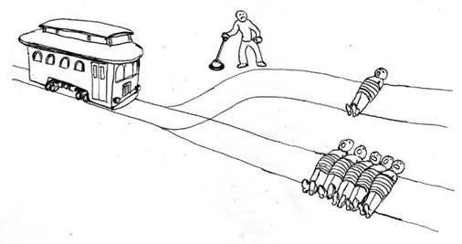
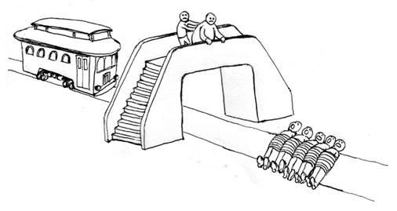
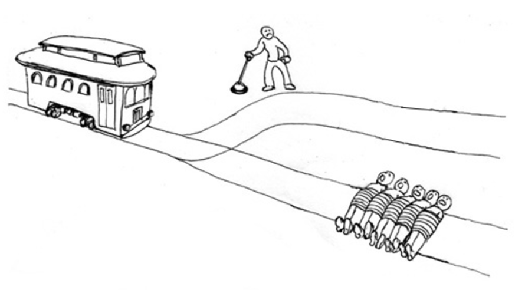
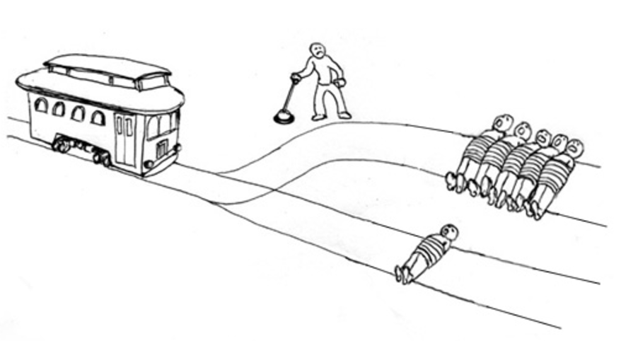
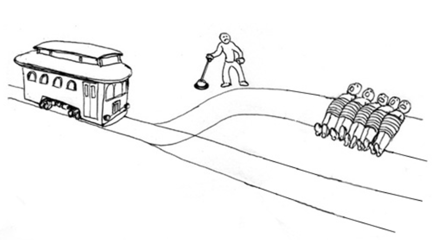
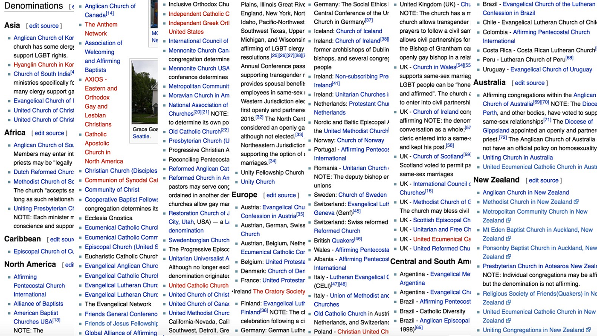
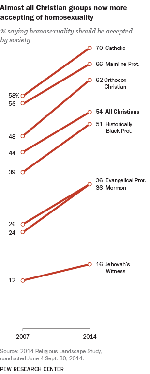

In the age of social media, it’s easy to get stuck in an echo chamber and never get out of your comfort zone. This is a big problem because it leads to a tense and polarized society in which isolated groups make political decisions based on stereotyped ideas about each other and get easily radicalised. That’s why when I joined the team organizing the festival [Serile Filmului Gay (Gay Film Nights)](https://en.wikipedia.org/wiki/Gay_Film_Nights) and we started brainstorming about potential side events, I immediately had the idea of a workshop that encouraged dialogue. In this article I will argue, as I did in the workshop, that you can defend LGBT+ rights regardless of whether you’re religious or not without being a hypocrite.

## An inclusive case for secular humanism

First of all, I’d like to present the Humanist movement in a way that doesn’t alienate religious people. Secular humanists around the world struggle to find a one-line slogan for their movement and I think an inclusive tone is fundamental if we want to have as much impact as possible with our message. So how do I define secular humanism?

> A movement that aims to build a less divisive society by promoting secular, non-confessional ethics

Regardless of whether religion is entirely compatible with Humanism or not, I think we can all agree that it is at least partly compatible with this definition. After all, we very often have common goals and would benefit from an alliance. If you don’t agree, perhaps you have a stereotyped image of the other side.

## Where do our values come from?

This is an extremely complicated question that philosophers have been trying to answer since time immemorial, so I will only scratch the surface here. Let me start with a classical thought experiment.

You’re in the middle of nowhere minding your own business when you suddenly notice an unstoppable trolley running towards five people tied to the tracks. There’s a lever within your reach that you can pull in order to change the course of the trolley, saving the five people, but in the alternative track there’s another tied person who will die anyway. Would you pull the lever?

Now imagine there’s only one track with five people tied to it, but instead of standing next to a lever, you’re on a footbridge and there’s a very fat man next to you leaning over the balustrade. If you push him, he’ll fall in front of the trolley and stop it, preventing the other five from dying, but he’ll be killed. Would you push him?

[According to surveys](http://www.nytimes.com/2013/11/24/books/review/would-you-kill-the-fat-man-and-the-trolley-problem.html), approximately 90% of the people would pull the lever but only about 10% would push the fat man. But where do we find these answers? After all, they’re not written in any holy books and no religious leader has provided an “official” one. Still, most of us “just feel” we should pull the lever but shouldn’t push the fat man. And even if you answered otherwise, I’m sure there is are innumerable variants that we would all agree on:

And we agree regardless of whether we’re Christian, Jewish, Hindu, atheist etc.

## A basis for secular ethics?

My point with this experiment is that we have moral intuitions. Some of them may seem contradictory at times, but the most basic ones seem universal. Regardless of nationality, race or religious background, we all agree that:

- Unnecessary death and suffering are bad
- Life and pleasure are in general good

This is not to say that the most moral thing to do is to engage in a hedonistic lifestyle of irresponsible, short-sighted, pleasure-seeking behavior, as may seem to some at first sight. While resistance to temptation may be seen by many as an exclusively religious ambition, there are many rational reasons to value this skill. After all, short-sighted hedonism is an enemy to long-term, sustainable happiness. Therefore, it is perfectly possible to agree both that pleasure is good and that resisting temptation is important. There is no paradox here.

Additionally, we also use reason and our knowledge about the world to evaluate the morality of our actions. Advertising tobacco and smoking indoors, for example, was widely acceptable throughout the world until we started learning about its health effects. In this case, data informed our moral decisions.

## A secular moral analysis of the situation of LGBT+

LGBT behavior doesn’t cause any deaths, gratuitous suffering or affect the lives of straight people in any way. Sure, you may say parents suffer when they find out their children are not straight or even that gay people suffer themselves with their own identity, but the point is that engaging in non-heterosexual behavior does not increase the amount of suffering in the world in any avoidable way. How could this suffering be prevented, after all?

Simply refraining from your impulses and fighting against your own identity in order to avoid stigma, though perhaps protective of conservative parents, comes at a great cost. Sometimes to the point of [depression](http://www.healthline.com/health/depression/gay) or even [suicide](https://en.wikipedia.org/wiki/Suicide_among_LGBT_youth). So in order to avoid one suffering, you end up causing even more suffering as a result. As if this wasn’t distressful enough, people in the LGBT+ community are often victims of hateful speech and hostility, both [in Romania](https://en.wikipedia.org/wiki/LGBT_rights_in_Romania#Anti-LGBT_incidents) and [elsewhere](https://en.wikipedia.org/wiki/Violence_against_LGBT_people). In many places, LGBT people don’t feel safe doing things straight couples take for granted:

- Holding hands in public
- Expressing affection
- Referring to a partner as anything other than “friend”
- Introducing their partner to friends and family, etc.

Even worse than social stigma, in most countries LGBT couples still lack legal recognition. Marriage is a complex social construct that has many different meanings for different people, but what many seem to forget is that it has a legal aspect that has no connection to religion. Legal marriage brings several pragmatic benefits, for example:

- visitation rights and can make medical decisions, unless otherwise specified in a [living will](http://people.howstuffworks.com/living-will.htm)
- some property and inheritance rights, even in the absence of a will
- the ability to create life insurance trusts
- tax benefits (in the U.S.)
- discount or family rates for [auto](http://auto.howstuffworks.com/buying-selling/car-insurance.htm), [health](http://health.howstuffworks.com/health-insurance/health-insurance.htm) and [homeowners insurance](http://home.howstuffworks.com/real-estate/buying-home/homeowners-insurance.htm)
- [immigration](http://people.howstuffworks.com/immigration.htm) and residency benefits
- visiting rights in [jail](http://people.howstuffworks.com/prison.htm)

[And many more](http://people.howstuffworks.com/marriage1.htm)…

In a secular, liberal state, marriage is legally nothing more than a type of contract. There is no sanctity in it. It is individuals and communities who ascribe meaning to it and this right can never be taken from them. Nobody is trying to pass any law to force any religion to accept gay marriage as equally valuable to straight marriage. This is a societal change that will not be achieved by legislation.

## Is homosexuality unnatural?

A recurring argument espoused by not only religious but also non-religious people against the LGBT+ movement is that homosexuality is “not natural”. But what does this even mean? Strictly, isn’t that which is observed in nature, by definition, natural? And even if we look for a less philosophical and more day-to-day meaning, what definition of “natural” could we possibly come up with that includes “banana” and “rock” but excludes “cellphone” and “homosexual”?

- Something you can’t do in the jungle without technology?
- Something that is very recent in history?

Homosexuality can certainly be practiced in the jungle without technology. Lions, foxes, bears, humans and [several other animals do it](https://en.wikipedia.org/wiki/List_of_animals_displaying_homosexual_behavior). It is also not recent in history at all. Evidence of homosexual behavior has been found dating back [thousands of years](https://en.wikipedia.org/wiki/Timeline_of_LGBT_history).

> “Homosexuality, is regarded as shameful by barbarians and by those who live under despotic governments just as philosophy is regarded as shameful by them, because it is apparently not in the interest of such rulers to have great ideas engendered in their subjects, or powerful friendships or passionate love — all of which homosexuality is particularly apt to produce.” — Plato

But even if it was recent and did require technology, so what? Computers are also recent and require technology but few religions condemn their usage.

### The naturalistic fallacy

The unwarranted assumption that whatever is natural is good and whatever is unnatural is bad is called the [naturalistic fallacy](https://en.wikipedia.org/wiki/Naturalistic_fallacy). By any reasonable definition, rape is perfectly natural. [Orangutans rape](http://onlinelibrary.wiley.com/doi/10.1002/9781118896877.wbiehs319/abstract), [otters rape](http://www.seeker.com/the-other-side-of-otters-1765194766.html), [dolphins rape](http://www.telegraph.co.uk/news/earth/wildlife/9172937/Dolphins-resort-to-rape.html) and, of course, since the dawn of mankind, humans rape. Antibiotics, on the other hand, are clearly not natural. No sane person, however, would use these facts to defend that rape should be morally acceptable and antibiotics should be banned. That’s because the extent to which something is natural or not has zero relevance ethically. Again: we always get back to suffering.

> Morality must relate, at some level, to the well-being of conscious creatures. — Sam Harris, neuroscientist

There are many examples of “unnatural” behavior, even sexual ones, that we accept as not only legal but in many cases morally innocuous:

- Contraception usage
- Sex toys usage
- Porn consumption
- Alcohol consumption
- Junk food consumption

Not to mention driving cars, playing video-games, etc.

## Be well informed

It is generally accepted by schooled people that, in order to develop good policies in a given area of politics such as health, safety, etc, it is important to be well educated in these areas. When it comes to ethics, however, this doesn’t seem to hold anymore. People seem to assume that any idea is equally valid and therefore the only way to defend yours is by force, resorting to referendums and the like to enforce majority rule.

*(my modified version of the [this trolley problem illustration](http://www.nybooks.com/articles/2014/04/24/how-do-we-know-whats-moral/).)*

This is extremely dangerous because, as I’ve argued, information is crucial for making moral decisions. In the illustration above, for example, the person is perfectly justified in pulling the lever in order to save a total of four people. However, little does he know the five in the default track are fake, a realistic drawing on a large piece of paper. This shows how morally well intended actions based on poor data can have terrible consequences. Arguing against LGBT+ rights by claiming it is “unnatural” is an example of a well intended but ill-informed opinion. It is particularly frustrating when the people who espouse these ideas readily admit to have no knowledge or interest in biology or ethics. This should be as disconcerting as hearing the health minister saying he or she has no interest in medicine.

## Religion

I’ve so far argued that we all use our moral intuitions in order to guide our actions. But I would be lying if I said religion no longer plays any role in how people think about right and wrong. So how does religion influence morality nowadays?

1. It makes direct moral claims (e.g. “*Thou shalt have no other gods*”)
2. It makes claims about the natural world that have indirect moral implications (e.g. [the soul enters the fetus](https://en.wikipedia.org/wiki/Ensoulment) during conception according to Christians but only after 40–120 days according to Muslims)

These claims, however, are always open to interpretation…

### The Old Testament is open to interpretation

> So Moses said to the people, “Arm some of your men to go to war against the Midianites so that they may carry out the Lord’s vengeance on them. […] Now kill all the boys. And kill every woman who has slept with a man, but save for yourselves every girl who has never slept with a man — Numbers 31:4,17–18

Plus, men who have sex with other men ([Leviticus 20:13](https://www.biblegateway.com/passage/?search=Leviticus+20%3A13&version=RSVCE)), men who have sex with animals ([Leviticus 20:15](https://www.biblegateway.com/passage/?search=leviticus+20%3A15&version=RSVCE)), mediums and sorcerers ([Leviticus 20:27](https://www.biblegateway.com/passage/?search=leviticus+20%3A27&version=RSVCE)), blasphemers ([Leviticus 24:16](https://www.biblegateway.com/passage/?search=leviticus+24%3A16&version=RSVCE)), people who are caught working on Sabbath ([Exodus 35:2](https://www.biblegateway.com/passage/?search=exodus+35%3A2&version=RSVCE)) and [many others](https://en.wikipedia.org/wiki/List_of_capital_crimes_in_the_Torah) should all be put to death. Eating pork ([Deuteronomy 14:8](https://www.biblegateway.com/passage/?search=Deuteronomy+14%3A8&version=RSVCE)) and crustaceans ([Leviticus 11:10–11](https://www.biblegateway.com/passage/?search=leviticus+11%3A10-11&version=RSVCE)) is also forbidden.

### The New Testament is open to interpretation

> “As in all the congregations of the saints, women should remain silent in the churches. They are not allowed to speak, but must be in submission, as the Law says. If they want to inquire about something, they should ask their own husbands at home; for it is disgraceful for a woman to speak in the church” — 1 Corinthians 14:34–35

Divorce is also forbidden, except in cases of “sexual immorality” ([Matthew 19:9](https://www.biblegateway.com/passage/?search=Matthew+19%3A9&version=RSVCE)), women are required to wear a veil ([1 Corinthians 11:6](https://www.biblegateway.com/passage/?search=1+Corinthians+11%3A6&version=RSVCE)) and slaves are commanded to be respectful towards their masters ([1 Timothy 6:1–2](https://www.biblegateway.com/passage/?search=1+Timothy+6%3A1-2&version=RSVCE)).

### So how do we choose which passages to enforce and which to reinterpret?

1. We use our universal moral intuitions
2. We look for a deeper, underlying message in scripture in order to guide our interpretation

Do these passages illustrate well the overall message of the new testament?

> *“If a man lies with a male as with a woman, both of them have committed an abomination; they shall surely be put to death; their blood is upon them.” — Leviticus 20:13*
>
> “Do you not know that the unrighteous will not inherit the kingdom of God? Do not be deceived; neither the immoral, nor idolaters, nor adulterers, nor homosexuals, nor thieves, nor the greedy, nor drunkards, nor revilers, nor robbers will inherit the kingdom of God.” — 1 Corinthians 6:9–10

Or are these more representative?

> “[…] let us stop passing judgment on one another. Instead, make up your mind not to put any stumbling block or obstacle in the way of a brother or sister.” — Romans 14:13
>
> “Do not judge, or you too will be judged. For in the same way you judge others, you will be judged, and with the measure you use, it will be measured to you.” — Mathew 7:1–2
>
> “Of all the commandments, which is the most important?” “The most important one,” answered Jesus, “is this: ‘Hear, O Israel: The Lord our God, the Lord is one. Love the Lord your God with all your heart and with all your soul and with all your mind and with all your strength.’ The second is this: ‘Love your neighbor as yourself.’ **There is no commandment greater than these**.” — Mark 12:28–31

### Can Christians be pro LGBT+?

*List of pro LGBT+ Christian denominations*

Yes, most certainly. There are [over 100 LGBT+ affirming denominations](https://en.wikipedia.org/wiki/LGBT-affirming_Christian_denominations) around the world. My arguments here are not new. The New Testament is uncannily compatible with secularism. In fact, Christianity is even [credited by historians](https://www.britannica.com/topic/church-and-state) as having played an important role in the rise of modern Western secularism.

> “Give back to Caesar what is Caesar’s and to God what is God’s.” — Mark 12:17
>
> Jesus answered, “My Kingdom is not an earthly kingdom. If it were, my followers would fight to keep me from being handed over to the Jewish leaders. But my Kingdom is not of this world.” — John 18:36

There is not one single passage in the New Testament prescribing any type of punishment to those who disrespect God’s commandments. This is a huge shift from the Old Testament. For Jesus, God is the one responsible for judgement and punishment. Not humans.

There are several examples of things that are condemned by the Bible but are now accepted as legal in most Christian-majority countries:

- [No-fault divorce](https://en.wikipedia.org/wiki/No-fault_divorce)
- Adultery
- [Homosexuality](https://en.wikipedia.org/wiki/LGBT_rights_by_country_or_territory)
- Blasphemy

### Is religion compatible with secular ethics?

Religion is a vastly rich cultural system and historically its role has always gone far beyond providing a strict moral foundation for our laws. Even in a society that embraces secular ethics as the basis for its legal system, religion still plays a central role by inspiring:

- **Cultural identity**: rituals, foods, dances, clothes, etc.
- **Aesthetics**: arts, architecture, music, literature, etc.
- **Spirituality**: many religious people report feelings of transcendence, peaceful states of consciousness and other valuable mystical experiences.
- **Moral illustration**: the use of storytelling to teach morality is a universal aspect of human behavior and, just as Aesop’s fables, Jesus’ parables have become ingrained in Western culture. In a diverse society with a wide repertoire of moral stories, each religion is free to focus on their traditional scripture in order to find inspiration.

So if your religion inspires you to be a better person, if you feel happy to carry on the traditions your ancestors have been transmitting for thousands of years and you feel a sense of inner peace that you think you couldn’t find elsewhere, go for it. Nothing stops you from thinking rationally about morality while still embracing all these positive aspects of religion.

## Conclusion

- **You can be an atheist/agnostic and still be a moral person** by committing to following your basic moral intuitions and using reason to avoid causing unnecessary suffering in the world.
- **You can embrace the cultural legacy of your religion** and identify as a Christian/Muslim/Hindu/etc. while still relying on your knowledge of the world and moral intuitions in order to tell right from wrong.
- **Even if you are religious and do derive your morals from scripture, you can still accept LGBT behavior as moral**, just like you consider it moral for women to speak in church.
- **Finally, even if you reject homosexuality on the basis of your religious beliefs, you can still be in favor of legalizing gay marriage,** just like you can reject no-fault divorce in principle but still agree it should be legal.

Of course, because of my background my arguments focused primarily on Christianity but similar arguments can be made for most religions.

## Resources

Here are a few resources that I highly recommend for those interested in learning more about ethics and being a good person:

- [Crash Course Philosophy](https://www.youtube.com/playlist?list=PL8dPuuaLjXtNgK6MZucdYldNkMybYIHKR) — PBS Digital Studios’ ongoing series on Philosophy
- [Justice with Michael Sandel](https://www.youtube.com/playlist?list=PL30C13C91CFFEFEA6) — Harvard Course on Justice
- [Science can answer moral questions](https://www.youtube.com/watch?v=Hj9oB4zpHww) — TED talk by Sam Harris
- [The why and how of effective altruism](https://www.youtube.com/watch?v=Diuv3XZQXyc) — TED talk by Peter Singer
