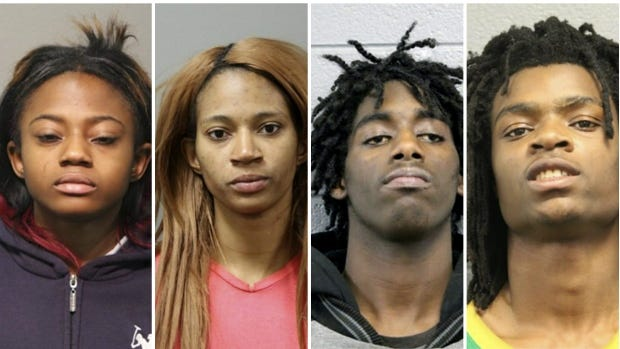
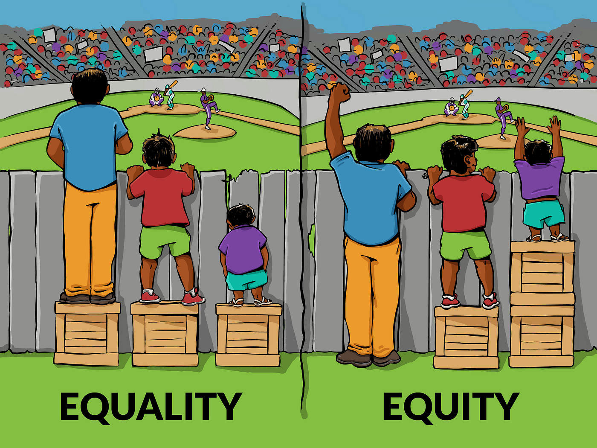

On one end of the spectrum, PC leftists say there’s no such thing as reverse racism because [minorities can’t be racist](http://www.huffingtonpost.com/entry/reverse-racism-isnt-a-thing_us_55d60a91e4b07addcb45da97). At all. Ever. On the other extreme, alt-righters say racism against oppressed minorities is as bad as racism against privileged majorities and therefore the very categorization of racism into “reverse racism” and “regular racism” is [inherently racist](http://www.dailywire.com/news/12156/there-no-such-thing-reverse-racism-amanda-prestigiacomo) because it suggests one may be worse than the other. I’m usually skeptical about such black-and-white statements, so I would like to propose the truth lies somewhere in between. What I want to defend is:

1. Yes, minorities can be racist: reverse racism is real and immoral.
2. However, as bad as reverse racism may be, it is *usually* not as bad as regular racism.
3. Denying (1) as the left does is problematic.
4. Denying (2) as the right does it also problematic.

## Defining racism

> Discrimination: treating a person or particular group of people differently, especially in a worse way from the way in which you treat other people, because of their skin colour, sex, sexuality, etc. — [Cambridge Dictionary](http://dictionary.cambridge.org/dictionary/english/discrimination)

In this article I will define racism simply as discrimination based on race. Most dictionary definitions of racism include the condition that the discrimination be based on a belief in the biological superiority of one’s race, but I think this is too restrictive and far from the day-to-day usage of the term. If we would require such a restrictive definition, it would become questionable even whether Dylann Roof’s killings at the Charleston church were really motivated by racism or not. After all, although it is clear that his actions were based on tribal hatred towards another race, his statements do not imply conclusively that this hatred was motivated by an underlying belief in the biological inferiority of his victims, and it may very well not have been.

## Yes, minorities can be racist

Although I concede that racism is much more common against oppressed minorities, it is absurd to suggest that it couldn’t possibly ever be directed towards privileged majorities. The recent Chicago attack was a perfect example. A group of people, all belonging to a historically oppressed racial minority, targeted a white man based on his race and abused him physically and psychologically, humiliating him using racial terms.

*[Hate crime, battery charges filed in ‘sickening’ Facebook Live attack on disabled man](http://www.cbc.ca/news/world/chicago-beating-disabled-1.3922177)*

> In the video, they can be heard shouting “fuck white people,” “fuck Donald Trump,” and forcing their victim to say, “I love black people,” while crawling on his hands and knees. — [Vice](https://www.vice.com/en_us/article/four-people-were-just-charged-with-a-hate-crime-over-the-chicago-torture-video)

Some people, however, have expressed criticism towards their perception that the media was reluctant to describe the attack as a hate crime and that certain people have played down the seriousness of the crime while they wouldn’t have done so it if the races were reversed. Should the outrage really always be the same though?

## No, reverse racism is not always as bad as regular racism

Now wait, I know this is a taboo thing to say, but before calling me a racist SJW, let me unpack it by discussing a few hypothetical cases:

> 1. A white person says “go back to Africa, dirty nigger!” to a black person.
>
> 2. A black guy shoots a random white person in the head because he hates white people.

Of course, (2) is much worse than (1). There is no question about that. But these scenarios are not really analogous. So let’s take each of these cases and reverse the races:

> 1b. A black person says “go back to Europe, whitey!” to a white person.
>
> 2b. A white guy shoots a random black person in the head because he hates black people.

Now, (2) and (2b) are so gravely immoral and cause so much damage and suffering that it’s hard to compare them and argue that one is less severe than the other. But let’s be honest: (1) and (1b) are *not* the same. *One is clearly worse and causes more suffering than the other*.

Some may say “*that’s not true! White people also get hurt by such racist comments! It’s racist of you to suggest that people of different racial backgrounds experience racial offenses differently!*”. Fair enough, I don’t have any conclusive data that proves that is the case. But really? Does anybody *really* believe that?

Although I don’t have data to support my point, I can imagine what that would look like. I would speculate that you could identify the areas of the brain responsible for offense, dishonor and humiliation using neuroimaging technology and then show that these areas light up statistically more intensely for black people than for white people when racial slur is used against them. It’s not conclusive proof, but it’s a falsifiable hypothesis, so it’s a first step.

Besides, even without this data, I think we have plenty of reason to believe this. Humans are a highly social species and tribalism, hierarchy and domination are hardwired in our brains. It is only natural that belonging to a subjugated group and being bullied by the dominant one should elicit a deeper and more revolting emotion than the one felt when a member of a dominant group is harassed by a low-ranking peer.

> Dominance hierarchies exist in numerous social species, and rank in such hierarchies can dramatically influence the quality of an individual’s life. — [Robert Sapolsky](http://www.annualreviews.org/doi/abs/10.1146/annurev.anthro.33.070203.144000)

So as much as you would like to believe that blacks and whites experience offense in the same way, it seems the only reason to believe this is wishful thinking. We want to believe that racism is over. We want things to be simple and colorblind. But they are not. And pretending we’re already there when we aren’t doesn’t do any good. After all, the first step to solving a problem is acknowledging its existence.

## Societal causes and effects

If an Asian kills a Latino for purely racist motives, how much outcry do you expect on traditional and social media? Sure, people may talk about it quite a lot, after all it’s a rather odd event. But I find it hard to believe that the Latino community would feel threatened by Asians and that this would create any long lasting tensions between the two communities or trigger a debate on how to fight Asian supremacist ideology. After all, what does this event say about our society? Not much. I’m no criminologist but I would expect the killer to turn out to be an eccentric, mentally deranged person.

What if it was a white person who killed a black one? That would be very different. White supremacy has a long history in Europe and all countries with an ethnic European majority. And it’s a social problem that still hasn’t been eradicated. Asian hate against Latinos is not a social problem. If an Asian kills a Latino it’s fair enough to grieve for a while but then shrug it off as a sad one-off incident. Having this attitude about white on black violence, however, is irresponsible. If we don’t do anything, there’s good reason to believe it will happen again. Let’s say your house has been plagued with cockroach infestations for years. You’ve recently tried a new and highly efficient disinfestation method it and haven’t seen a cockroach in months. Would you prefer to see a cockroach in the kitchen one day or a moth?

## The Chicago attack: a study case

The examples I’ve used so far were idealized hypotheticals used to make a point, but they’re overly simplified scenarios. Racism in real life is often more complicated. But before we dive into real life, let’s take an intermediary step with more hypotheticals:

> 3a. A white person says “go back to Africa, dirty nigger!” to a black guy and knocks him out with a punch.
>
> 3b. A black person says “go back to Europe, whitey!” to a white guy and knocks him out with a punch.

Of course, the punch part is pretty much as bad, after all I don’t think the facial anatomy and pain neurology of blacks and whites differ in any essential way. But let’s be honest, the verbal violence is *not* the same. The one directed from the white towards the black is worse and, therefore, scenario (3a) is overall worse than (3b). Thus, I think there are legitimate moral reasons to believe the Chicago attack would have been worse if the races were reversed. The physical and non-racial aspects would be the same, of course. But the racist aspect *wouldn’t*.

Sure, how much worse it would be is debatable. I don’t know how severely mentally ill the victim was, but I concede that sufficient severity would raise the question of how much that individual is capable of experiencing offense and humiliation, and that could indeed make the two cases equal in terms of the amount of suffering caused. Still, to the extent that the victim is psychologically sophisticated enough to perceive social hierarchies and feel humiliated by aggressive subjugation, I maintain that an analogous white on black attack would have been worse.

## Let’s stop calling each other racists

Today the word “racist” in many leftist circles has become little more than an insult. It can be used against anyone who doesn’t agree with their opinions on race, and it can be used even against people of historically oppressed races. As a defense mechanism, people on the right have adopted the same strategy, saying things like “*if you think blacks should receive special treatment, then you’re the racist!*”. This is all terrible because it only hinders mature debate about these difficult subjects as it turns useful concepts into emotionally charged words and makes it harder for people to express nuanced opinions.

Leftists who say “*reverse racism doesn’t exist*” basically define “*racism*” as “*racial discrimination against an oppressed group or minority*”. Of course, you could define it like that. But what’s the point? Is it really how people use the term in practice? The truth is, by defining the term like this, you’re only trying to protect minorities from the negative connotation of the word and bring attention to the fact that the dynamics of oppression are something relevant when talking about racism. This is all fair enough, but is it really necessary? Isn’t it a bit overprotective of minorities? After all, as much as the Chicago attackers may have comprehensible grievances against whites, their actions were still tribal, irrational, immoral and unjustifiable. By adopting such a restrictive definition of racism, we make it seem like race-based tribalism coming from minorities is not an issue, and this is not true. It may be a lesser issue but it’s still an issue and we shouldn’t play it down.

## The equal treatment fallacy

On the other hand, reactionaries who say “*if you treat racism differently depending on the direction, then you’re the racist!*” have a naïve definition of racism that misses an important point of the definition I used earlier:

> Discrimination: treating a person or particular group of people differently, **especially in a worse way** from the way in which you treat other people, because of their skin colour, sex, sexuality, etc. — [Cambridge Dictionary](http://dictionary.cambridge.org/dictionary/english/discrimination)

*[Interaction Institute for Social Change | Artist: Angus Maguire](http://interactioninstitute.org/illustrating-equality-vs-equity/)*

In the end, what matters is not treating people the same in every step of the way, but doing your best to ensure no one suffers more than they deserve in the long run. Of course, you could insist that by being less empathetic towards white victims of racism I will act less compassionately towards them than I would if they were black and that this is unfair and racist. This is not an entirely bad argument, but it is flawed because the reason why I would treat them differently is not because of their race, but because of my assessment of their suffering.

If a white kid in a predominantly black school, for example, is a victim of bullying and one day I catch him or her fighting with a black kid and saying nasty racist things to one another, I will take context into consideration when assessing their suffering and the fact that the white kid is the disadvantaged one in the school’s hierarchy will make me empathize with him or her more strongly. Therefore, it’s not the race of the victim or the aggressor per se that matters, but the social conditions. It just so happens that, in most racially diverse societies, blacks are lower than whites in the social hierarchy.

## Information matters

People who think we should fight racism by not talking about it often say that “*categorizing racism into different types based on its direction is useless*”. It’s fascinatingly ironic how the same people who are often vociferous critics of leftist political correctness basically react by using the exact same weapons: shutting down debate and opposing scientific and academic inquiry by accusing people with different views of bigotry.

> Criminology: scientific study of the nonlegal aspects of crime and delinquency, including its causes, correction, and prevention, from the viewpoints of such diverse disciplines as anthropology, biology, psychology and psychiatry, economics, sociology, and statistics. — [Encyclopædia Britannica](https://www.britannica.com/science/criminology)

Is there any other area of knowledge where people defend that more information is irrelevant? How could it possibly be? In a recent discussion I had, it was argued that understanding different forms of racism might help prevent crime. The argument was met with the following actual response:

> HOW ARE YOU GOING TO PREVENT IT THOUGH? We already know how to treat children right, how to raise them right, what we don’t have is a way to enforce this […]. We already know what to NOT do to kids, or adults, so we don’t fuck them up. We don’t have an invisible hand to enforce this.

As charitable as I may try to be in interpreting this argument, I can’t help but read it as saying that we know all there is to know about criminal psychology and what leads to crime. The only thing we can do to improve crime prevention is what we do with this knowledge. As absurd as this may sound, it seems that many share similar views, even though criminal psychology and criminology in general are far from being dead, with reputable universities around the world offering courses on the topic and publishing papers in the area, generating knowledge that eventually influences trends in policy making, etc. Is this all a waste of time and resources? Perhaps. But it is quite an extraordinary claim and requires extraordinary evidence.

> In 1990, Congress passed the Hate Crime Statistics Act, which required the attorney general to collect data “about crimes which manifest evidence of prejudice based on race, religion, sexual orientation, or ethnicity.” The attorney general delegated the responsibility to the Director of the FBI, who, in turn, assigned the task to the Bureau’s Uniform Crime Reporting (UCR) Program.
>
> Since then, additional categories have been added in an effort to improve the quality of the data collected. The more detailed we can be with the collection, the better all of law enforcement can detect trends and add necessary resources to combat these crimes. — [FBI 2015 Hate Crime Statistics: Importance of Reporting Hate Crime Data](https://www.fbi.gov/news/stories/2015-hate-crime-statistics-released)

Maybe I’m wasting my time by making all these points though. After all, the reasons for this claim do not concern facts, but ideology. There will always be people who subscribe to the ideology that defends social justice is good in principle, but that will always oppose any action that attempts to promote it. These people will emphasize they are not racists and they believe in equality, but that we should just “let it be”, not take any action, and one day society will magically improve. Or maybe it won’t, but then it means the minorities are the only ones to blame, since there was no active discrimination against them. What’s important is to not intervene in the “natural” course of events. Success should always be a result of pure merit. Any aid, not only from the state but even from civil society, is always unjust unless it’s distributed equally both to those who are in need and those who are not. I’m afraid no arguments will ever make these views disappear.

## We need more philosophy and less party politics

Political debate and civic engagement in the social media generation seems to be thriving more than ever. But the quality of this debate is deeply questionable. The [echo chamber effect](http://bigthink.com/ideafeed/how-social-media-have-created-echo-chambers-for-ideas) and recent [fake news scandals](http://www.independent.co.uk/voices/editorials/the-facebook-fake-news-scandal-is-important-but-regulation-isnt-the-answer-a7419386.html) illustrate the problem well.

The truth is, all ideological discussions about politics and ideology boil down to ethics. Yet people are not interested in the subject. People want to watch John Oliver bashing Trump or Milo Yiannopoulos ranting about feminism, not read Jeremy Bentham’s boring arguments about utility, Nozick’s ideas of freedom or Rawls’ thought experiments on justice. We are quick to accuse each other as racists, misogynists or anti-free speech communists, but avoid the deeper discussion: why are these things unethical?

Racism has come to be defined in such a way that it’s impossible to use it for anything that’s morally acceptable. If I support affirmative action and someone says I’m a racist because I think people of different races should be treated differently, I could very well say “*ok, call me a racist, I don’t mind, I still think my position is more ethical*”. But people don’t do that. For those in politics, there is no choice. It would be political suicide to say anything else than “*no, I’m not a racist*”. Their narratives are constrained by the level of education of the electorate, and this means there are often few incentives to delve into complex philosophies when someone accuses you of being racist. It’s easier to just say you’re not. But many times the truth is that it’s really an empty accusation. “Immoral” should be the greatest possible accusation. Not anything else.

In civil society, however, we are not limited by relationships with the electorate and we should be able to make more nuanced arguments about ethics. So next time you’re angry at someone who disagrees with you on matters of race, don’t call them racists. Next time someone disagrees with your views on gender, don’t call them sexist. Instead, just explain why you believe their views will eventually lead to a world with more pointless and unjustified human suffering. And please, if you want keep discussing politics, learn more about ethics. It’s free:

- [Crash Course Philosophy](https://www.youtube.com/playlist?list=PL8dPuuaLjXtNgK6MZucdYldNkMybYIHKR) — PBS Digital Studios’ ongoing series on Philosophy
- [Justice with Michael Sandel](https://www.youtube.com/playlist?list=PL30C13C91CFFEFEA6) — Harvard Course
- [The Moral Foundations of Politics with Ian Shapiro](https://www.youtube.com/playlist?list=PL2FD48CE33DFBEA7E) — Yale Course
