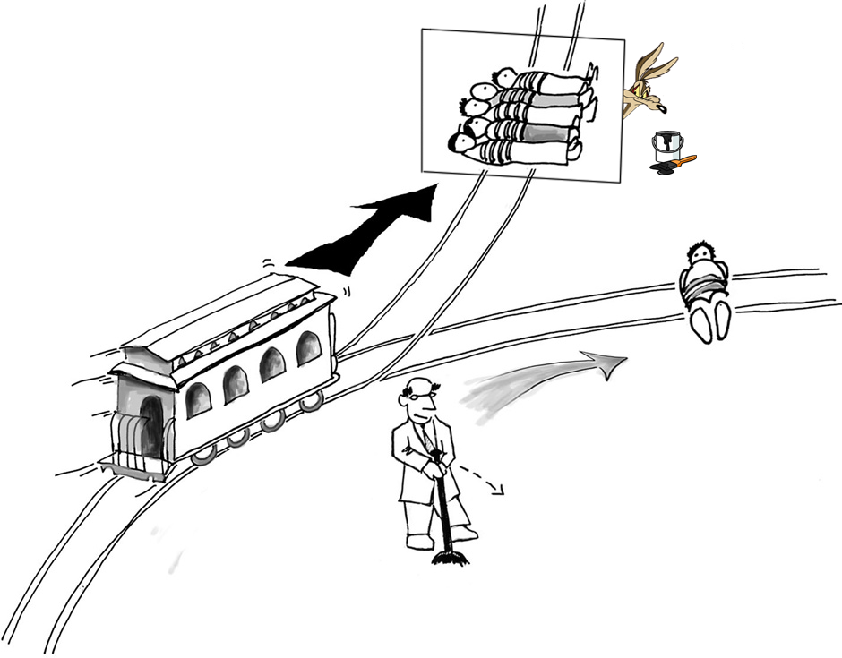

Critics of faith and superstition are often accused of intolerance and radicalism. But should we really be tolerant of everything? Are faith and superstition really harmless as some like to claim? How do we avoid the tolerance of intolerance? Should we leave the faithful and superstitious alone or should we fight for a world where these are things of the past and everybody is shocked they were ever socially accepted?

## What is faith?

> “Strong belief in the doctrines of a religion, based on spiritual conviction rather than proof” — [Oxford Dictionaries](http://www.oxforddictionaries.com/definition/english/faith)
>
> “Now faith is confidence in what we hope for and assurance about what we do not see.” — [Hebrews 11:1](http://biblehub.com/hebrews/11-1.htm)

Of course, faith is a widely used word and will have different meanings in different contexts, but it is this sense of the word that I will address in this text.

## What is superstition?

> “Superstition is the belief in supernatural causality — that one event causes another without any natural process linking the two events” — [Wikipedia](https://en.wikipedia.org/wiki/Superstition)
>
> “Superstition, belief, half-belief, or practice for which there appears to be no rational substance” — [Encyclopædia Britannica](https://www.britannica.com/topic/superstition)
>
> “belief that is not based on human reason or scientific knowledge, but is connected with old ideas about magic, etc.“ — [Cambridge Dictionary](http://dictionary.cambridge.org/dictionary/english/superstition)

Superstition is one of those confusing words that have a rather clear definition, but that in practice people use it in a quite different way. It has a slightly negative connotation and, therefore, people rarely identify with the term even if they believe in astrology, homeopathy, crystal healing, etc. In practice, for something to be called superstition, besides the formal definition, it has to be a small, isolated belief that is outside the framework of any big, organized religion, or even a loose set of beliefs that is popular enough like the new age movement for example. If you believe black cats bring bad luck, you’ll be called superstitious. If you believe Jesus walked over water, you’ll be called religious. If you believe in auras, chakras or other new age stuff, you’ll be called “spiritual” or something similar.

Technically, however, all of these fit the definition of superstition perfectly. Believing in God or immortal souls, a core belief in most religions, is by definition superstition. They are all beliefs “connected with old ideas about magic” and with “no rational substance”.

## Why superstition is harmful

Let’s take some time to think about the fundamentals of moral philosophy using the classical [trolley problem](https://en.wikipedia.org/wiki/Trolley_problem). Imagine you’re a bystander and see a trolley that is moving out of control towards a group of 5 people tied to the tracks who will get killed if nothing is done. Next to you is a lever that can divert the trolley to another track. However, there’s also a person tied to that track, but only one. Would you pull it? I would. It turns out that up to [90% of us would](http://www.nytimes.com/2013/11/24/books/review/would-you-kill-the-fat-man-and-the-trolley-problem.html). Now, what if, after you kill the single person, it turns out that the 5 people you saw on the other tracks were actually fake, drawn on a piece of paper that you would have just ripped without killing anybody if you had refrained from pulling the lever? Does that make you evil?

*My modified version of the [this trolley problem illustration](http://www.nybooks.com/articles/2014/04/24/how-do-we-know-whats-moral/).*

If you ask Western, secularized Christians what they think of Congolese children who have the devil “beaten out of them”, they’ll say it’s “barbaric”. But what if the devil really is inside of them and only a beating can remove it? Wouldn’t the beating be justified then? I’ll make it simple: yes, it would be perfectly justified. Just like you were justified to pull the lever to kill a single person instead of the five you *believed* were going to die instead, even though the belief that motivated your decision was false.

And there is no shortage of barbaric rituals and tragic acts that cause pointless suffering but nevertheless continue to happen because of irrational beliefs.

[Congo's 'child witches' exorcised to have the devil beaten out of them](http://www.dailymail.co.uk/news/article-3276057/My-grandmother-died-said-witch-drink-salt-water-stuck-fingers-throat-pieces-said-d-eaten-Congo-s-child-witches-exorcised-devil-beaten-them.html)

> ’They accused me of killing and eating my grandmother’: Agony of Congo’s 50,000 ‘child witches’ who are brutally exorcised to ‘beat the devil out of them’

[Indian gang rape victim faces 'purification ritual' - BBC News](http://www.bbc.com/news/world-asia-india-32444349)

> In the ritual, the tantric asks the girl several questions and then checks if she is telling the truth by taking a pinch of barley seeds from a bag and asking her to say whether the number of seeds in his hand are even-numbered or odd. If the girl gets the answer wrong then the tantric assumes her answers have been lies. […] “Once the girl is purified and passes the test no-one can point fingers or banish her and her family. But if the girl fails the test and Goddess says she is impure then she might get ostracised from the community,” [the elder] said.

[Anti-Bullet Charms and Destructive Power of Superstition in Africa - The Maravi Post](http://www.maravipost.com/anti-bullet-charms-destructive-power-superstition-africa/)

> Nana Tolofasito, claimed to have spiritual powers and went ahead to test these powers. He asked somebody to shoot him with a gun in order to demonstrate the efficacy of his anti-bullet medicine. In the process, he sustained serious injuries from the gunshot because his so-called medicine did not protect him

How do you explain that such behavior is immoral and self-destructive? There is only one valid argument to be used in each case: there is no such thing as evil spirits, barley seeds have no magical powers, and anti-bullet charms don’t work. Of course, in the case of the Indian tribe, even if they did have a reliable, scientific way to determine if the girl was telling the truth, ostracising girls because of “sexual indecency” would still be immoral, but that’s a topic for another debate.

The truth, as harsh as it may sound, is that any self-righteous Christian from a privileged country who criticizes the behavior of these people is a hypocrite because they too derive their morals from tradition and personal mystical experiences with no connection to reality and rely on supernatural beliefs to make their decisions. It’s just a matter of luck that Christianity was malleable enough to not completely halt progress in the societies where it was dominant. But even supposedly developed Christian majority countries are not safe from the evils of superstition.

[Letting them die: parents refuse medical help for children in the name of Christ](https://www.theguardian.com/us-news/2016/apr/13/followers-of-christ-idaho-religious-sect-child-mortality-refusing-medical-help)

> [**A 1998 medical study**](https://docs.google.com/file/d/0B7gQLq25IOjMbk1DckJvb0R2Z2s/edit?usp=sharing) analyzed cases of child mortality due to faith-based medical neglect and found that of the 172 deceased, 140 had conditions that would have been curable with a probability of greater than 90 percent — [Faith Healing Kills Children, Slate](http://www.slate.com/articles/health_and_science/medical_examiner/2015/05/religious_exemptions_from_medical_care_faith_healing_kills_children.html)

[Thank the Catholic church for terrifying abortion restrictions in Latin America | Erika L Sánchez](https://www.theguardian.com/commentisfree/2013/aug/27/abortion-rights-latin-america)

> The World Health Organization estimates that in Latin America and the Caribbean a staggering 12% of all maternal deaths were due to unsafe abortions in 2008. In the name of religion, girls as young as [9 years old](https://www.theguardian.com/world/2003/feb/18/1) have been inhumanely denied abortions though their pregnancies were life- threatening. Their family members and doctors have even been threatened with excommunication.

[The Long, Tragic History of Violence at LGBTQ Clubs in America](http://www.slate.com/blogs/outward/2016/06/12/pulse_nightclub_shooting_and_tragic_history_of_violence_at_lgbtq_clubs_in.html)

> Gay was angry that his last name could mean “homosexual” and said God had told him to kill gay people. He called himself a “Christian Soldier working for my Lord” and testified in court that he wished he could have “killed more fags.”

At the core of these tragic events are *beliefs*. People genuinely believe that prayer heals, that fetuses have souls and that God condemns homosexuality. If they didn’t, these things wouldn’t happen (or would happen much less). So is Christianity really such a special religion? In the words of Mark Twain:

> “The so-called Christian nations are the most enlightened and progressive… but in spite of their religion, not because of it”

And this is of course not to mention what has been done in the name of Christianity in the past and what is done in the name of Islam today.

### “OK, some superstition is harmful, but not all! Astrology for example is harmless! We should only fight against harmful superstition.”

Unfortunately, the line between harmless and harmful superstition is not as sharp as some would like to believe. Many superstitions start harmless but become harmful. Astrology may seem all fun and games at first sight, but when job candidates are [rejected because of their zodiac sign](http://www.livescience.com/17291-astrology-job-discrimination-china.html), that’s not so harmless anymore, is it? Avoiding black cats because they bring bad luck also seems inoffensive, but when people start [killing black cats](http://www.telegraph.co.uk/news/worldnews/1561382/Bad-luck-for-black-cats-in-Italy.html) we’ve got a problem.

If an individual happens to be a secularist who understands public policy should be based on hard science but chooses to still pay to have psychics give them life advice after reading from a crystal ball, that’s of course better than being a theocratic fundamentalist, but it still means we as a society have failed to teach our population basic scientific literacy and in a post-truth era this means we have an electorate who can’t tell fact from fantasy and is therefore vulnerable to anti-vaxxers, climate change deniers, etc. We can try to imagine a hypothetical society in which people are still faithful and superstitious but don’t support any non-scientific policy, but this would be nothing but an extremely fragile, vulnerable society (besides of course completely unrealistic).

## Why faith is harmful

There are two things that cause people to believe in superstition: faith and ignorance. It is quite unanimously accepted around the world that ignorance is bad, but it is extremely taboo to criticize faith. What is absolutely perverse about our society’s social acceptance of faith is that, in the process of being nice to a few “religious progressives”, we inadvertently give a free license for irrational people to kill their daughters in honor crimes, blow themselves up along with several innocents in the name of invisible deities and beat the devil out of their children. Even privileged, western people who have access to modern education are compelled by faith to oppose wider access to reproductive health, basic scientific education, LGBT rights, etc.

Now, many will say that such opinions don’t follow directly from their faith necessarily. And I will concede that it doesn’t *always* follow. But most of the time it does. Just google for anti-abortion or anti-LGBT arguments and you will see most resources are religious. While knowledge frees us from false beliefs based on ignorance, it doesn’t free us from false beliefs based on faith. Faith is the perfect antidote to knowledge. And knowledge is not only important for building computers and spaceships. It’s important for building a more ethical society.

## Is there anything good about faith and superstition?

Many people argue that it’s simplistic to attack faith and superstition as being harmful because, although it can be harmful sometimes, it can also be beneficial in other scenarios (e.g. it makes people behave better, feel happier, etc.), and the net effect is positive. While I do concede faith and superstition may have their benefits sometimes, it is difficult for me to believe that their net effect is positive.

As far as behaving better is concerned, the number of atheists in prison in the United States for example is [31 times lower](http://www.patheos.com/blogs/friendlyatheist/2015/08/21/atheists-now-make-up-0-1-of-the-federal-prison-population/) than in the general population. [High HDI correlates with low religiosity](http://imgur.com/i6X76wf), although I’m not claiming skepticism *causes* development necessarily, it could be the other way around. The [World Happiness Report](https://en.wikipedia.org/wiki/World_Happiness_Report) also clearly correlates much more with HDI than with religiosity and [depression may actually be more common among believers than non-believers](http://www.huffingtonpost.co.uk/dr-raj-persaud/religion-depression_b_3928675.html), though there seems to be conflicting data on this topic. The only statistic that seems to support a positive side to faith and superstition are the ones showing a [lower number of suicide attempts among the religiously affiliated than the unaffiliated](https://www.ncbi.nlm.nih.gov/pubmed/15569904), but this is raw data and [is open to interpretation](http://www.patheos.com/blogs/friendlyatheist/2016/02/05/the-relationship-between-atheism-and-suicide-is-more-nuanced-than-these-christians-think/). Even if I concede that it is the atheism itself that causes this, and not some other aspect or correlate of irreligiousness (such as not belonging to a supportive community), I’m reluctant to say this compensates for thousands of years of human sacrifice, witch burning and all the barbarism described earlier.

> No culture in human history ever suffered because its people became too reasonable or too desirous of having evidence in defense of their core beliefs
>
> — Sam Harris

## What should we do?

Once you acknowledge that faith and superstition lead to more pointless suffering than prosperity in the world, the logical conclusion is that it’s our moral duty to try our best to eliminate it completely from the face of the earth. So why are we not doing that?

### “It’s intolerant!”

There is a wide consensus in our society that trying to change somebody else’s religious convictions is wrong. To an extent, I understand. I can imagine that it could be unpleasant to have one’s sleep disrupted by Mormons knocking on your door to talk about their unjustified beliefs. Because many non-believers are annoyed by such practices, there is a tendency among many of us to strongly oppose the idea of preaching against faith and superstition.

But what is the cost of such political correctness? I mean, really: if we commit to being respectful and civilized, how unpleasant can it possibly be to be approached by strangers and have your beliefs challenged? How horrible do you feel when Jehovah’s witnesses knock on your door? How morally deplorable is it to wake somebody up when they wanted to sleep? Is it worth watching passively while Jihadism kills thousands in the Middle East and even Europe, while witchcraft accusations remain rampant in Africa and Catholic conservatism causes hundreds of thousands of women to undergo complications and even die from unsafe abortions throughout Latin America, just so religious people don’t feel the discomfort of having their beliefs challenged by peaceful interlocutors?

This seems to be a case of poor moral judgement caused by our cognitive biases. The discomfort and social cost of being “the annoying atheist” can be felt directly and can be quite a burden on one’s social life. In order to avoid this, it’s easy to rationalize and fabricate reasons to justify our passivity. We say “religion is not really the problem”, “I’m tolerant of other people’s faiths”, etc. But the truth is that we’re being selfish and conflict avoidant. We don’t want to be disliked.

### “There will still be violence and suffering in the world!”

There sure will, nobody said there wouldn’t. But there would be less. [ISIS wouldn’t exist](https://www.samharris.org/podcast/item/what-do-jihadists-really-want), faith-healers wouldn’t neglect their children, etc. Cynics who say “the world has always been and will always be like this” think they know better than the naive idealists who still believe in change, but they fail to see that they are the ones who are irrational. The history of humankind has been one of constant change and [moral progress](https://www.youtube.com/watch?v=ramBFRt1Uzk). A few hundreds of years ago superstitious people were burning women in Europe for reasons such as [transforming themselves into cats](https://books.google.ro/books?id=v7aEJ3p1XmQC&pg=PA391&lpg=PA391&dq=1561+Verneuil+cats+witch&source=bl&ots=8rTn4pNBFw&sig=p_jIJswMPGlK0k_JnwJubE4lzdk&hl=en&sa=X&ved=0ahUKEwjx9_ehz6HUAhULJMAKHTdeDgsQ6AEIJjAA#v=onepage&q=1561%20Verneuil%20cats%20witch&f=false). There are reasons this doesn’t happen anymore and not believing in shapeshifting is a crucial one. We are making progress. There’s no reason to believe this is our peak and things can’t get any better.

### “It’s not pragmatic!”

Many insist that it’s impossible to convert billions of believers to atheism and that therefore attempting to convert anyone is futile. They say that instead we should merely encourage believers to reinterpret their faith in a way that is more compatible with our modern values and teach them to separate their religion from politics. There are many unwarranted assumptions hidden in this accusation, so let me clarify what I am *not* proposing we do here:

***I am not proposing we adopt a single strategy to address the problem of harmful superstition***. I am just defending that trying to eliminate superstition is *one* of many valuable strategies. This accusation is based on a false dilemma. There’s no reason to believe we can’t pursue both strategies described above in parallel.

***I am not proposing that we become aggressive proselytizers***. I am just saying that we shouldn’t refrain from engaging with people and challenging their views if they seem to be receptive. And I will assume everybody is receptive until they prove otherwise.

***I am not proposing we launch an indiscriminate attack on religion overall***. Religion means a lot of things to different people. Many are attached to its rituals, aesthetics, sense of community, etc. There is nothing wrong with any of that. The only problem with religion is faith and superstition. If we are clear about that we may sound a lot less aggressive and therefore be much more effective.

### “But there’s no point, you can’t reason somebody out of faith!”

That is just not true. I have reasoned myself and others out of superstitious belief systems. Of course you have to know how to choose your target and when to accept defeat, but it is possible. If you doubt it check the [Converts Corner on Richard Dawkins’ website](https://richarddawkins.net/community/convertscorner/).

Besides, even if I fail to convert a believer to atheism, the attempt may still be constructive for both of us. They may learn to think more critically about superstition, I may learn more about the different ways people experience religion, etc. People are capable of that. This sense that some nonbelievers have that “religious people can’t be reasoned with” is exaggerated and actually quite arrogant. I think this is just an example of a broader sense of skepticism towards dialogue overall that is prevalent in the social media generation. It’s ok to get out of your echo chamber. Not all religious people are narrow-minded, stubborn and will get defensive when approached. I’ve actually been more accused of aggressiveness by atheists than theists. There are many smart and sensible religious people with whom I’ve had meaningful conversations. It’s less rare than some might think.

## Conclusion

Faith and superstition are harmful. Multiple strategies can and should be used in order to minimize their harm. Some attack the root of the problem and try to reason people out of faith and superstition entirely, others are more subtle and try to persuade people to abandon certain practices while maintaining their beliefs. Both are valuable strategies and it is optimal to use both.

However, avoiding the first under the illusion that it is intrinsically immoral and never legitimate is a mistake. If you personally have difficulties engaging in controversial topics without being confrontational, or if your interlocutors happen to be very defensive and unwilling to engage in dialogue, then sure, go for the alternative. But admit that this just one among several valid choices of action.

I for one have a hard time arguing against exorcism rituals if I’m not allowed to say evil spirits don’t exist. Of course, if you’re creative enough you may be able to come up with an argument that will compel the Congolese to stop such rituals without abandoning their whole belief system. By doing this, however, you don’t cut the problem by the root. What stops them from engaging in other behaviors of this type in the future? The seeds of irrationality are still there, ready to germinate and grow into new, equally barbaric and nonsensical rituals. Of course, if other strategies fail, this is better than nothing. But fighting superstition firmly and unapologetically is another, indispensable one.

> “It is wrong always, everywhere, and for anyone to believe anything on insufficient evidence.” — William Kingdon Clifford, The Ethics of Belief
