Why are people so annoyed by vegans? To what extent is their opposition to veganism an irrational reaction based on defensive and flawed reasoning, and to what extent is it a legitimate response to bad strategies employed by vegan activists? What can vegans and non-vegans do to transcend their differences and make the world a better place together?

## Defining veganism

One of the reasons people are suspicious of veganism is that they don’t really understand it. They know vegans don’t eat meat or other animal products but that’s it. It’s a word that makes them think of hippies, new age natural-food freaks, and perhaps even anti-vaxxers. But is it fair to judge vegans in general based on those associations? What is veganism really? There are many reasons that motivate people to go vegan. Traditionally, the main categories are:

**Ethical**

- Animal welfare
- Environmentalism

**Non-ethical**

- Health
- Religion

Of course, we could debate all day about whether this categorization is right. But for the purposes of this article this categorization is good enough, and this is the terminology that I will use. So when somebody criticizes veganism, it is very important for them to specify what type of veganism they’re criticizing. I am an atheist and few domains of knowledge bore me more than nutrition, so I will mostly focus on ethical veganism. This is the veganism I actually consider myself a supporter of, and I’ll focus primarily on animal welfare. Also, perhaps contrary to the stereotype some people have, it is the main reason why people go vegan.

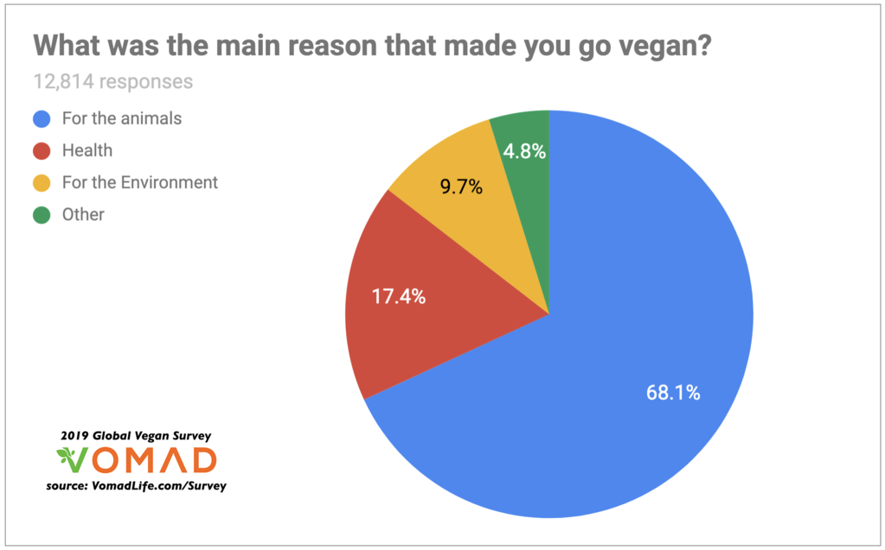

*68.1% of people go vegan “for the animals”*

That being said, the basic argument of ethical veganism is pretty straightforward:

1. The animal product industry produce a lot of needless suffering.
2. By eating animal products, you contribute to this industry and therefore to suffering.
3. Therefore, the most ethical thing to do is to go vegan.

The argument is flawless. But more than any other social movement, people react to it in an extremely defensive manner. Last year I published the following post on social media:

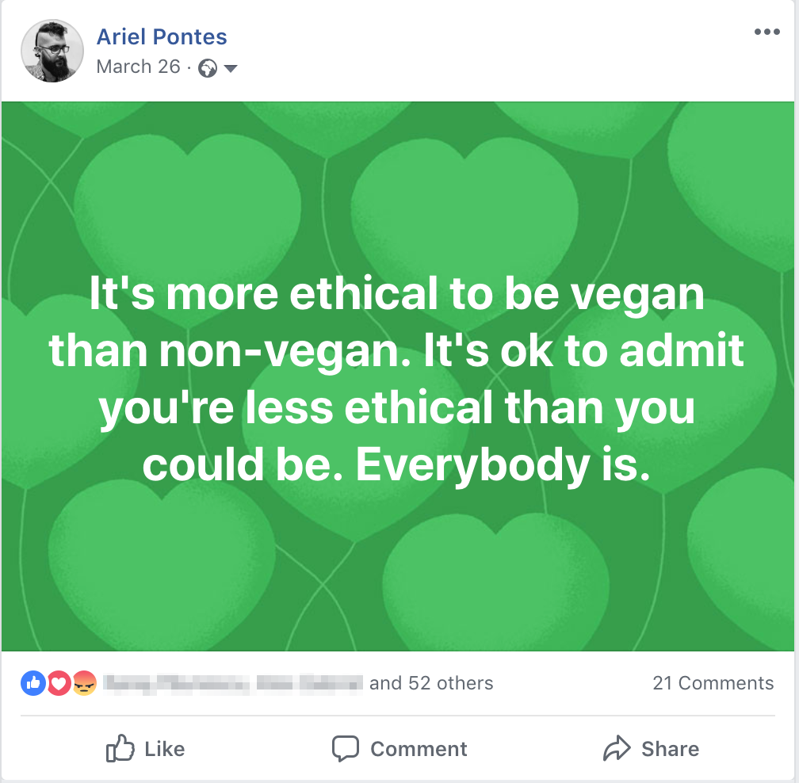

*It’s more ethical to be vegan than non-vegan. It’s ok to admit you’re less ethical than you could be. Everybody is.*

I am used to posting about very controversial topics, such as pedophilia, anti-natalism, pro-mortalism, sex with teenagers, etc. But to my absolute surprise nothing stirred people up more than this post.

## Why are omnivores so defensive?

After enough discussions about the topic, it becomes obvious that most people are extremely sensitive to what they perceive of accusations of immorality. When they feel their lifestyle is being attacked as immoral, they will bring just about any argument to justify it.

### Health concerns

Some of the most common arguments in defense of a heavily animal-based diet are “it’s unhealthy to be vegan” and “humans are naturally omnivores”. This argument is often a result from a misunderstanding of the motivations behind people’s decision to be vegan. If being vegan is unhealthy, going vegan for health reasons makes no sense. But the argument is also used to attack ethical veganism. Basically, it attacks the claim that the suffering caused by eating animals is *needless*. Sometimes these arguments are connected, often going like “humans are naturally omnivore, therefore it’s unhealthy to eliminate meat from our diets”. While [it is true](https://blogs.scientificamerican.com/guest-blog/the-true-human-diet/) that humans are naturally omnivores (in spite of what some radical vegans may say), to consider this a morally relevant question is an example of the [naturalistic fallacy](https://en.wikipedia.org/wiki/Naturalistic_fallacy). Natural does not imply moral.

To be fair, the health argument does make *some* sense. I would concede that, if it was indeed very unhealthy to be vegan, our moral responsibility towards other animals would be lower because we would have a legitimate conflict of interest. But in spite of the fact that we are indeed natural omnivores, it just [doesn’t seem to be true](https://www.health.harvard.edu/staying-healthy/is-a-vegetarian-or-vegan-diet-for-you) that being vegan is unhealthy, as is illustrated by [several top athletes who follow a vegan diet](https://www.businessinsider.com/elite-athletes-who-are-vegan-and-what-made-them-switch-their-diet-2017-10). It may have been true at some point, but there is no evidence suggesting that it is true now, in our high-tech world with abundant fortified foods and dietary supplements.

Besides, although it’s true that we are natural omnivores, there is a whole spectrum of meat consumption between 0% and 100%. To assume our current ratio of animal-based to plant-based food consumption reflects our most “natural” diet is an instance of [presentism](https://en.wikipedia.org/wiki/Presentism_(literary_and_historical_analysis)), a cognitive bias that predisposes us to assume that “things have always been the way they are”. Christopher Ryan calls it, “Flinstonization”, a perhaps more illustrative label. Also, ironically, the people most often bringing up this argument are not athletes who eat fish once a week for fatty acids and B12, but people who eat burgers and meat-lovers pizza every second day, which makes the defensive nature of the argument even more obvious.

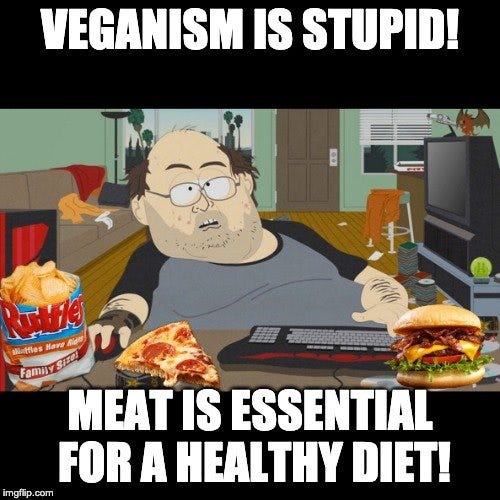

*“Veganism is stupid! Meat is essential for a healthy diet!” said the junk food lover.*

In any case, in terms of overall meat consumption, it seems that [at a global level we have never been so carnivorous](https://www.scientificamerican.com/article/humans-are-becoming-more-carnivorous/). Melanie Joy refers to the cultural framework that justifies the preservation of our current levels of animal-based food consumption as [carnism](https://en.wikipedia.org/wiki/Carnism), and since I heard the term for the first time I keep seeing manifestations of it everywhere in our culture.

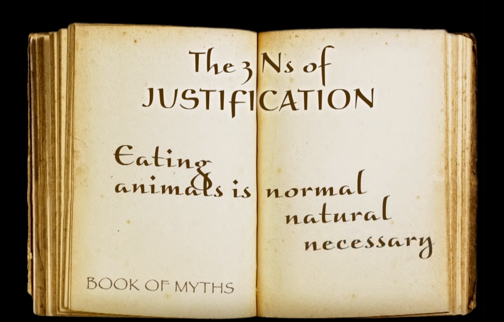

*The 3 Ns of Justification: “Eating animals is normal, natural and necessary” — [Toward Rational, Authentic Food Choices | Melanie Joy | TEDxMünchen](https://www.youtube.com/watch?v=o0VrZPBskpg)*

### Skepticism towards pseudoscience and new age nonsense

Again, this is a [guilt by association fallacy](https://en.wikipedia.org/wiki/Association_fallacy) . To be fair, I can at least partly understand where all the health-related arguments in favor of the consumption of meat come from, especially in the skeptic community, of which I am an enthusiastic member. Veganism does seem to go hand in hand with the new age movement alarmingly often. As a secular humanist, I genuinely believe that [superstition is harmful](https://medium.com/humanist-voices/faith-and-superstition-are-not-harmless-cdb5033ce72e) and that it is our moral responsibility to wipe it from the face of the earth forever. I cringe when I hear vegans praising “natural” foods, rejecting “chemicals” and GMOs, for tribal rather than rational reasons. Or when I see celebrities such as Gwyneth Paltrow promote [vaginal steaming and crystal healing](https://rationalwiki.org/wiki/Gwyneth_Paltrow#Pseudoscience_pushing) alongside with veganism. Or when I read about vegan moms who refuse to vaccinate their children to keep their bodies “[free of toxins](https://broadly.vice.com/en_us/article/8x4gvx/vegan-anti-vaxxer-mom-forced-to-vaccinate-her-kids-by-judge)”. Or when I see famous vegan YouTubers or even institutions promoting pseudo-scientific ideas like “humans are herbivores” based on silly arguments such as “[we can’t kill pigs with our bare hands](https://www.facebook.com/garytvcom/videos/1690268221028419/)” or “if you give a baby a rabbit and an apple they will never eat the rabbit and play with the apple”.

[https://twitter.com/peta/status/556519065112821760](https://twitter.com/peta/status/556519065112821760)

But none of these beliefs are at the core of veganism. Ignorant extremism will always exist in any movement. To reject the whole movement because of this fringe is to reject a [straw man](https://en.wikipedia.org/wiki/Straw_man). There are plenty of rational and scientific vegans out there who are ready to point out irrationality within the movement.



### A perception of vegans as naive idealists

Another common attitude that I find somewhat common among vegans and that I must admit puts me off quite a bit is their naive idealism and how they romanticize animals and nature overall. Even when they don’t say it explicitly, their discourse too often suggests that “animals are better than people”, that “cruelty is exclusively human”, or that “the earth was a beautiful and harmonious place with a stable ecosystem until imperialistic humans showed up and started wreaking havoc and destroying everything”.

None of that makes sense. [Nature is a brutal shitshow of carnage and suffering](https://www.iflscience.com/plants-and-animals/animals-can-be-giant-jerks/): animals kill each other mercilessly for food, territory, access to females, or sometimes even for [reasons that we can only speculate about](https://www.vox.com/2015/2/23/8089019/horrible-animals). Infanticide is also common behavior among species with high levels of male competition. When a new dominant male rises to power, he will usually [kill the babies of his former competitor](https://www.youtube.com/watch?v=KUGf-irpTMQ), which will drive the females to estrus again and allow him to replace the competitor’s babies with his own.

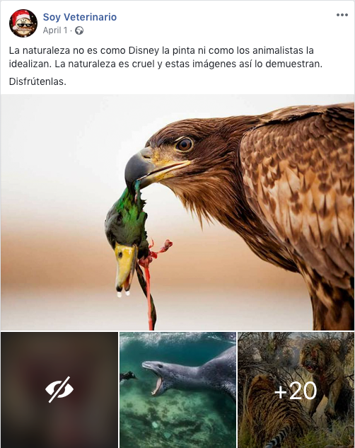

*[Nature is not the way Disney paints it or as the animal lovers idealize it. Nature is cruel and these images demonstrate it. Enjoy.](https://www.facebook.com/SoyVeterinario/posts/933746603452247)*

Sure, humans are the only animals who invented instruments of torture, but we’re also the only animals who invented Amnesty International, who make donations to strangers across the ocean and who pass legislation with the goal of reducing the suffering of beings who don’t even belong to our species.

But does the brutality of nature entitle us to cause unnecessary suffering with a free pass? Some anti-vegans seem to think so. But this again is just another instance of the naturalistic fallacy: the fact that something happens in nature doesn’t make it moral. Infanticide and rape are common in the animal kingdom but nobody questions that it is immoral.

Many also say “well, if eating animals is wrong then we should also stop predators!”. This is an attempt of a *reductio ad absurdum* argument against veganism, but it fails because it commits a [slippery slope fallacy](https://en.wikipedia.org/wiki/Slippery_slope). Unlike humans, carnivores really do need to eat meat in order to survive and, even if they didn’t, they don’t have the cognitive skills to actually stop and analyze how ethical their behavior is. To say you’re morally entitled to eat animals because other animals eat animals is like saying you’re morally entitled to poop on the floor because other animals do it. Sure, we all would like our pets to never poop on the floor again, but we don’t spend too much time condemning them when they do it. If a person poops on the floor in your apartment, however, you will tend to hold them to higher standards.

### Aggressive, disingenuous and excessively emotional arguments

> Meat is murder! Dairy is rape!

Arguments like this are often a turn off for omnivores. They are examples of what I call “the fallacy of appeal to negative connotation”.

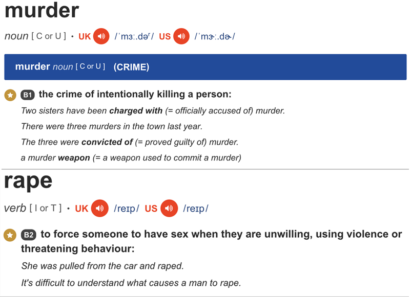

Nobody says lions are murderers. Nobody says stepping on a cockroach makes you a murderer. This is ridiculous. Clearly these words are not used for animals, and forcing this usage just so that the negative connotation of the word makes you feel bad may work on some people but I honestly think it just makes most people roll their eyes and loose sympathy for the vegan cause. The *name* of the things you do to other sentient beings bears no ethical relevance. All that matters is how much suffering you caused, and how avoidable it was.

Also, most pro-vegan movies, documentaries and YouTube videos I’ve seen make me feel very suspicious. They show the most gruesome scenes of animal abuse, but how can I know this is representative of what happens in an average slaughterhouse? It’s hard not to wonder if these scenes aren’t cherry picked for ideological reasons. One of my favorite documentaries about the food industry is [Our Daily Bread](https://www.imdb.com/title/tt0765849/). There is no dramatic music, no dialogue or narration, just a neutral display of images that allows the viewer to make up their own mind about whether they think that is morally acceptable or not. Spoiler alert: things can be improved. A lot. Which brings us to the next argument.

### The belief that animals don’t suffer so much

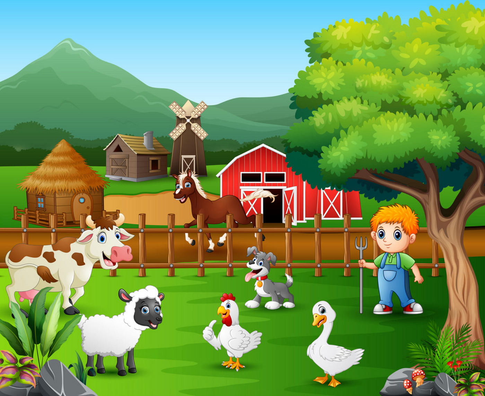

*This is not where your meat, dairy and eggs come from.*

I am far from being an idealistic “animal lover”. Actually, I don’t even value the life of any animal, and that includes humans. I am a hardcore negative utilitarian and although Peter Singer’s Animal Liberation is considered the “Bible of the animal movement”, I may agree with him on some delicate issues that perhaps most vegans would rather not discuss, such as euthanising disabled babies. I am an adept of the [neutral container theory](https://oyc.yale.edu/philosophy/phil-176/lecture-20), meaning I believe only the contents of life have any value, not life *per se*. That is, I care about quality of life, not life itself.

I have no problem in principle with the idea of raising an animal peacefully in a farm and one day slaughtering it for food in a humane manner that causes no fear or pain. However, to assume that this accurately describes modern-day, industrial-scale factory farming, is naive at best, dishonest at worse, and in any case and a clear instance of [self-serving bias](https://en.wikipedia.org/wiki/Self-serving_bias). I would even go as far as saying that I have little moral objection against painlessly and unexpectedly killing a human hermit who lives alone in a hut in a forest completely off the grid and has no friends or family. But even if I go that far, it won’t do much for me in terms of informing my real-life moral decisions. Most people have friends and family, and most murder methods involve a significant degree of pain. And this is also largely true of the animals we farm for food.

> “Whatever the theoretical possibilities of rearing animals without suffering may be, the fact is that the meat available from butchers and supermarkets comes from animals who were not treated with any real consideration at all while being reared. So we must ask ourselves, not: Is it ever right to eat meat? but: Is it right to eat this meat?”
> ― Peter Singer, Animal Liberation

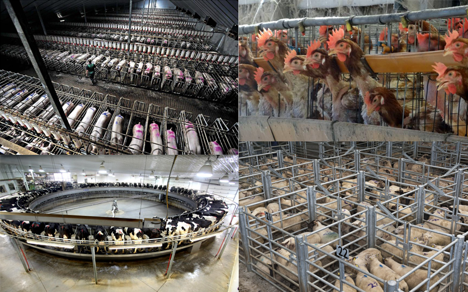

*This is probably where your meat, dairy and eggs come from.*

A few examples of practices that are commonplace and perfectly legal in most western industrialized countries include:

- **[Chick culling](https://en.wikipedia.org/wiki/Chick_culling) —** Male chicks in egg farms are shredded alive shortly after birth because they don’t produce eggs and it’s not economically advantageous to raise them for meat.
- [**Battery cages**](https://www.huffpost.com/entry/eggs-from-caged-hens_b_2458525) — “*To get a sense of a hen’s life in a battery cage, imagine spending your entire life in a wire cage the size of your bathtub with four other people. You wouldn’t be able to move, so your muscles and bones would deteriorate. Your feet would become lacerated. You would go insane. That’s precisely what happens to laying hens.*”
- **Castration without anesthesia —** [Pigs](https://www.eurogroupforanimals.org/pig-welfare-crisis-continues-european-declaration-alternatives-painful-surgical-castration-pigs-fails-deliver) and [cattle](https://www.avma.org/KB/Resources/LiteratureReviews/Pages/castration-cattle-bgnd.aspx) are routinely castrated without anesthesia around the world.
- **[Early separation of cow and calf](https://www.wired.com/2014/06/the-emotional-lives-of-dairy-cows/) —** It may seem overly sentimental to some, cows are mammals that in natural conditions breastfeeds their offspring for a long time just like humans, and who share a long evolutionary history with us. To assume don’t experience any kind of suffering when forcefully separated from their calves is again an instance of wishful thinking and self-serving bias.

### Where do we stop?

But of all the objections brought up against veganism, the most interesting one for me, and the one I struggle with the most, is the following: in the quest to lead a life that is as ethical as possible, where do you stop? How much sacrifice is it your moral obligation to make? This is indeed extremely hard to define, and when people see vegans acting like the world is black-and-white, like you’re either an ethical vegan or an evil animal-eater, they understandably get annoyed. But although the line between ethical and unethical is not sharp, that doesn’t mean there is no difference between them. That would be going from the extreme of rigid black-and-white morality to the total anarchy of moral relativism. Isn’t there something in between?

Ethics is hard. Sometimes. But sometimes it is actually easy. The thing is, in some easy cases our moral intuitions are quite sharp and we can always reach unanimous agreement. We all agree, for example, that blinding a baby by burning their eyes with a cigarette in exchange for a piece of chocolate is immoral. But what if somebody says that paying money in exchange for chocolate is always immoral because you are financing an industry that profits on [child labor, slavery and the destruction of the environment](https://www.onegreenplanet.org/animalsandnature/how-ethical-is-your-chocolate/)? Then things get really complicated.

First, you have to figure out whether this is true, and somehow try to calculate what impact you have by having your chocolate. In order to do this research, you need to eat. But then, what food is ethical? You don’t know. Should you only buy local? Is local always more ethical? What if buying from small farmers is actually more problematic because at least the big producers are certified and are actually forced to follow some strict rules, while the animals in small local farms in remote villages in the developing world are [slaughtered without stunning](https://www.economist.com/blogs/certainideasofeurope/2008/01/christmas_pig_killing_traditio) or may even be abused by farmers who will never be held accountable?

I have recently started to follow a [reducetarian](https://reducetarian.org/) diet, and when asking on social media about a good replacement for milk in the coffee, a friend made the following comment:

> If you want to be vegan because you’re not OK with animal cruelty, that’s fine, but right now we are facing the biggest environmental crisis ever, it would be really nice if we would be conscious about how far coconut milk, coffee, cocoa, avocado, quinoa seeds etc are transported from and the level of CO2 emissions that means. Environmentally that’s much worse than a cow farting (another reason for some people to go vegan). So if you really want to be ethical, you’d skip coffee and everything that’s not produced in a radius of 500 kms of you. Drink teas out of locally picked herbs for example. Even better: go hiking, pick them yourself. Our bodies don’t need caffeine, we voluntarily become junkies.
> Torturing animals is cruel, but environmentally the best choice is to occasionally (once or twice a month) eat meat from animals grown on farms that are ecologically, environmentally and ethically certified, because these animals are good for ecosystems, but instead of wolves or bears, the “predators” are humans (except they finish them more “gently” than a wild animal tearing them apart while alive to pieces)

So what should we do? Give up meat, dairy, eggs, coffee, avocado, plus everything that doesn’t grow near you? Also stop [driving cars](https://www.thoughtco.com/public-transportation-for-fewer-emissions-1203955) and [flying planes](https://www.bbc.com/news/av/world-europe-46362159/the-two-swedish-mums-who-want-people-to-give-up-flying-for-a-year)? Go live in a tribe? If you take it to an extreme, it could even be argued that suicide is the most ethical thing a human could do. If a large enough group of people voluntarily commit suicide, that would be a huge relief for the environment. If not suicide, we should at least stop having children. But vegans and environmentalists don’t seem to be condemning people for having children. Many of them seem to be having kids themselves. Worse yet, many vegans [have carnivorous pets who they feed with non-vegan food](https://www.sciencealert.com/a-surprising-number-of-people-want-to-feed-their-cats-and-dogs-a-vegan-diet).

It is common for omnivores to use this line of reasoning as a *reductio ad absurdum* proof that veganism is simply untenable. I have been in this position myself for many years, and it may actually prevent me from ever becoming a full vegan. But to use this argument to justify not even *trying* to be *more* ethical is also misguided.

## A balanced solution

The *reductio ad absurdum* argument against veganism, if put explicitly, goes as follows:

1. No matter how ethically you behave, you will never be morally perfect, because living a morally perfect life is impossible and absurd.
2. Therefore, there’s no point making any effort towards living a more ethical life.

Clearly, in this simple form, the argument cannot be right. When somebody donates to a charity, nobody says they’re hypocrites because if they *really* cared they would donate *all* their possessions. Most of us easily understand that donating something is better than donating nothing. So why can’t we praise vegans as we praise people who donate to charities?

The critical difference is that there is no easily identifiable movement of people committed to donating a specific amount of money and shouting accusatory slogans against those who don’t agree with that exact specific amount. If there was a movement of “30% donors” who said everybody should donate at least 30% of their income to charity and that it is immoral to donate any less, most people would probably become annoyed by them pretty quickly. But is it more ethical to donate 30% than 29%? Well, mathematically, yes. What about 35% instead of 30%? Or why not 100%?

Our moral intuitions fail when we are forced to think of such extreme cases. One of the reasons is that we understand that we as humans have our own legitimate desires and that some degree of conflict of interest is unavoidable. We can’t help but feel something is wrong if we see someone sacrificing themselves too much in order to help others. It may sound like a platitude, but it really is true that you must take care of yourself before taking care of others. There is such a thing as burnout, and it’s better to donate 5% of your income for 40 years than to donate 30% for 2 years and then realize you can’t keep doing it and go back to donating nothing. So what should we do? Let’s start with the non-vegans.

## Non-vegans

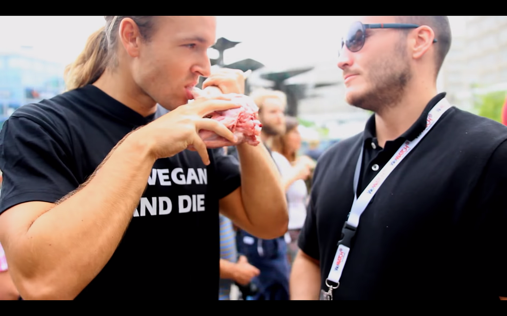

*[Anti-vegan eats raw goat head in Berlin vegan festival](https://www.youtube.com/watch?v=fuH0uy5hYLg). Don’t be like this guy.*

### Stop being anti-vegan and perpetuating carnism

The first step is to stop being anti-vegan. And just to be extra clear, by “anti-vegan” I mean somebody who actively argues against veganism, not simply a “non-vegan”. As I pointed out, although a certain degree of antipathy towards vegans is comprehensible, and partly the fault of some truly problematic strategies on the part of vegans, to actually oppose veganism is morally inexcusable. Harming animals is at best something forgivable in certain situations, but definitely never something *desired*. If there is a group of people willing to spend time and energy dedicating themselves to veganism, the least we could do is stop being an obstacle to their cause. If we rejected an ideology or a group every time a member of that group did something reprehensible, we would not be able to sustain any social institution. There is simply no excuse here. Changing your diet requires effort, but to simply stop actively opposing veganism does not.

Simply disagreeing with the moral arguments of vegans is one thing. But hating on vegans is a childish and immoral act of spite that brings nothing good to the world and only slows down progress. And yet it is [not at all uncommon](https://www.refinery29.com/en-gb/2018/11/215695/vegan-bullying). I understand that it may be funny for carnists to ostracize vegans, make anti-vegan jokes and otherwise bully them. After all we are a social species and tribal hatred towards the outgroup is great for bonding. But the marginal pleasure one gets from this activity cannot be fairly compared to the suffering of millions of chicks who are [shredded alive soon after birth](https://en.wikipedia.org/wiki/Chick_culling) every day because they’re male and therefore not “commercially viable”, or of pigs and calves who are castrated without anesthesia, and many other common unethical practices of the animal industry.

### Become a reducetarian

A second step for non-vegans is to become a reducetarian: somebody who consumes less animal products for ethical/environmental reasons. The beauty of this term is that it is nuanced and repels black-and-white thinking. Even committing to having a single vegetarian day per year is better than having no commitment at all, just like donating one dollar per year to the Against Malaria Foundation or the [effective charity](https://en.wikipedia.org/wiki/Effective_altruism) of your choice is better than never donating anything at all to anyone. But making commitments is important. And I don’t mean “committing yourself to eating less meat overall”. I mean we should establish clear goals, like one or six vegan days a week, and follow through. [Akrasia](https://en.wikipedia.org/wiki/Akrasia) is real, as the creators of [stickk.com](http://stickk.com) know well, and [nudging](https://www.youtube.com/watch?v=xoA8N6nJMRs) yourself into good behavior requires being a smart [choice architect](https://en.wikipedia.org/wiki/Choice_architecture) in your own life.

And where do you stop? Wherever you feel your limits are. Sure, some vegans may say a single vegetarian day per year is way too lazy and unambitious. But again, it’s better than nothing. And another beautiful aspect of the term “reducitarian” is that it has a dynamic spin to it, as opposed to more static terms such as “flexitarian”. A flexitarian also avoids meat without being a full vegetarian, but a reducetarian is to at least some degree committed to *continually* *reducing* that amount.

And by reducing the consumption of animal products you don’t only take part in a collective action that decreases the demand for those products in the market and therefore reduces the number of animals who are raised and slaughtered or otherwise mistreated in order to satisfy our food cravings. By ordering the veggie menu in a fast-food restaurant, by buying meat replacement products in the supermarket, you increase demands for these products and as they become more common and varied, it becomes easier and easier for other meat lovers to adopt a reducetarian diet. What about vegans? Is there anything they could do to promote the cause more effectively?

## Vegans

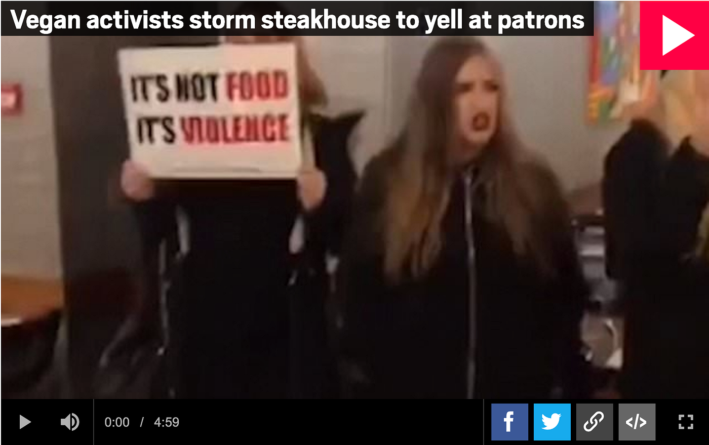

*[Vegan activists storm steakhouse to yell at patrons](https://metro.co.uk/2018/11/27/vegans-storm-steak-restaurant-and-play-sounds-of-cows-being-slaughtered-8182285/). Don’t be like them.*

### Promote plant-based diets instead of condemning omnivorous ones

One thing that I strongly believe vegans should focus more on, is promoting plant-based diets instead of condemning animal-based ones. In marketing it is common knowledge that [positive messages are more effective than negative ones](https://artplusmarketing.com/how-your-phrasing-affects-persuasion-b7346f650ef5). When vegans [storm into a steakhouse](https://www.youtube.com/watch?v=s0x3Wju-3WM) shouting “It’s not food, it’s violence”, they are clearly not being careful about PR.

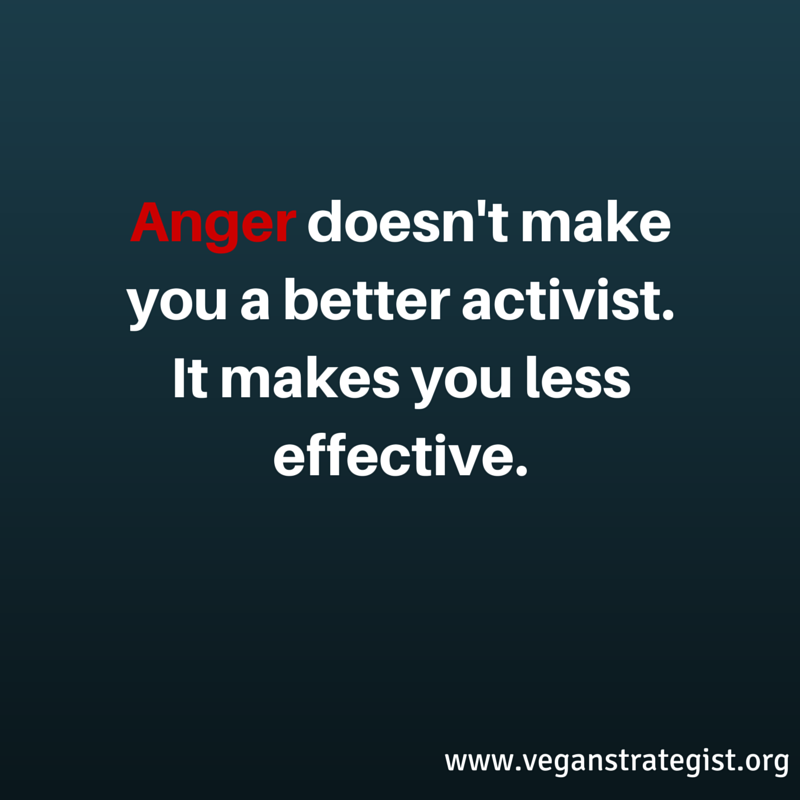

*[Anger doesn’t make you a better activist. It makes you less effective. — Tobias Leenaert](http://veganstrategist.org/2015/07/27/not-our-anger-but-our-love/)*

The few studies that exist on the efficacy of vegan outreach strategies seem [largely inconclusive](https://www.vox.com/future-perfect/2018/10/31/18026418/vegan-vegetarian-animal-welfare-corporate-advocacy), but from my own experience I can definitely say that being exposed to vegan food in friendly environments has had a much more positive effect than trying to be persuaded by accusatory arguments to become a vegan overnight.

### Stop being black-and-white and shaming non-vegans

The other day [the Brazilian supreme court ruled that animal sacrifice in religious rituals is legal](https://riotimesonline.com/brazil-news/rio-politics/brazils-supreme-court-rule-animal-sacrifice-in-religious-ceremony-is-legal/). As a secularist and supporter of animal welfare, I expressed my frustration on social media. In no time, a vegan friend commented that it was “hypocritical for meat eaters to be outraged at this”.

> **Shaming among vegans is inherently unstrategic; it turns off non-vegans whose support we need if our movement is to succeed, it disempowers vegans, and it causes a tremendous waste of time and energy** that could be directed instead toward effective vegan activism. — [Shaming Vegans Harms Animals, by Melanie Joy](http://veganstrategist.org/2015/10/05/shaming-vegans-harms-animals-melanie-joy/)

Of all social movements I have gotten involved with, veganism is definitely the one most infected by black-and-white thinking by far. I believe this is at least partly because the term “veganism” denotes both a diet, which is a clear and well-defined lifestyle choice, and a movement that aims to reduce animal suffering. In order to be a “proper” vegan, you have to promote animal welfare but you also have to adopt a vegan diet. In all other movements, declaring yourself a supporter is enough to be accepted as a supporter. If you identify as a feminist, nobody will say “oh really? What do you *actually* do to fight female oppression??”. Of course, being an active feminist will be considered better, but nobody will bash you for not reaching a “minimum threshold of involvement”, because there is no such threshold and it’s hard to imagine any benchmark that would be easy to identify. The same goes for the LGBT+ movement, racial equality movement, etc. But in the case of veganism there is this very easy to administer “test of commitment”.

But is the existence of this easy to define threshold morally relevant? I don’t see any reason why it would be. To focus on it is an instance of [salience bias](https://thedecisionlab.com/bias/salience-bias/). If the goal of the movement is to reduce animal suffering, isn’t converting two carnists to reducetarianism as good as converting one to veganism? I cannot help but see the purism present in vegan movements as an accidental triggering of the human instinct for exclusivism and group purity or, as Jonathan Haidt would say, the triggering of the [sanctity/degradation and loyalty/betrayal moral centers in our brains](https://blogs.scientificamerican.com/guest-blog/jonathan-haidt-the-moral-matrix-breaking-out-of-our-righteous-minds/). These moral instincts certainly gave us some evolutionary benefit at some point in our history, but they have no use in a social movement. Any movement that wants to effect change should want as many sympathizers as possible. Even if the sympathy is only lazily manifested at a mental level.

Note that this is not to say that anti-vegans are entitled to reject veganism on the basis that “vegans are too aggressive”, although many do that. This is an emotional reaction that makes no sense rationally. It is a mixture of [guilt by association](https://en.wikipedia.org/wiki/Association_fallacy) and straw man fallacy because “being aggressive” is not a core value of veganism. It is an attitude that happens to exist in the community but, as usual, we’re overly sensitive to negative experiences and overestimate the number of people in the movement who actually are this aggressive. Last year I went to a conference organized by vegans where I had the chance to meet Tobias Leenaert and Melanie Joy, both experienced vegan activists and authors. I went to the conference somewhat apprehensive that I would be ostracized for being a mere reducetarian, and thinking that my outsider perspective would allow me to point out flaws in the movement’s strategies that they had so far failed to see. I couldn’t have been more wrong. Not only were they perfectly aware of most of the flaws in the vegan movement that I am pointing out to here, this was the very focus of their talks. And when I revealed I was a reducetarian, I was not ostracized by them or the public at all. I was even praised. So be careful before rejecting a whole movement because “some vegans annoyed you once”.

Some people are committed to feminism, others to racial equality, others to LGBT+ issues, others to the environment, others to poverty, others to secularism. Each of us have a different set of interests, skills and sensibilities and this will naturally take us in different directions. It’s impossible to be fully committed to every noble cause in the world. To reject anything but full commitment to your cause is to reject a lot of potential sympathizers. I myself am mostly involved in the Humanist movement. It aligns with my interests much more than veganism. I support most of the other causes I’ve mentioned as well, but Humanism will remain my main focus for the foreseeable future, and for this reason I will probably never adopt a fully vegan diet.

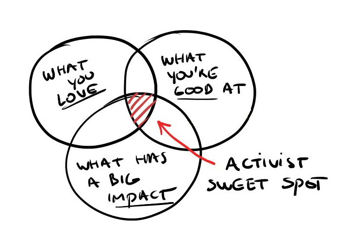

*[Activist sweet spot: what you love, what you’re good at, and what has a big impact — Tobias Leenaert](http://veganstrategist.org/2016/07/28/finding-your-activist-sweet-spot/)*

The amount of meat I consume and the pressure I put on the market for more production of meat may correlate linearly, but the amount of *effort* I make and the impact it has on reducing animal suffering is definitely not linear. It’s a typical case of [diminishing returns](https://en.wikipedia.org/wiki/Diminishing_returns). A [Pareto distribution](https://en.wikipedia.org/wiki/Pareto_principle), rather than a linear one, illustrates my intuitions much better. I feel that roughly 80% of the impact I have in reducing animal suffering comes from 20% of my effort.

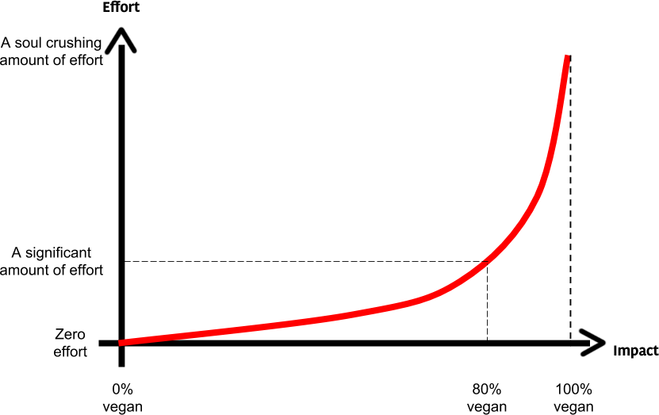

If the effort to go from 80% vegan to 100% vegan is so much greater than the effort to go from 0% vegan to 80% vegan, while the difference in impact is so much smaller, how rational is it for me to invest energy in order to close this 20% gap? Of course this is all speculative to some degree, but in the absence of contradictory evidence, all I can trust is my intuitions. I genuinely believe there are more productive things I can do with my time and energy. Which brings me to the last topic.

### Focus more on corporate and institutional change

With carnism being so deeply ingrained in our culture, convincing significant numbers people to go fully vegan seems like mission impossible. But although this is important, there are many things that can be done but that are neglected for no good reason. Targeting corporations and other institutions is a great example.

> How do [farmed animal advocates] persuade more people to become vegetarian? Over the past decade, they’ve done a lot of research to test which methods of advocacy work, and how and why people become vegetarians.[…] The results, and what they mean, are still being hotly contested within the animal rights community. That disagreement underscores the steep challenge the animal rights community faces in trying to convince the rest of the world to give up meat. It also stands in sharp contrast to the repeated successes the advocacy movement has had in pursuing a different course: pressure campaigns against corporations.
>
> Advocates have convinced companies like Starbucks and General Mills, for instance, to source eggs for their products from cage-free farms through a mix of behind-the-scenes negotiation and protests. — [Want to help animals? Focus on corporate decisions, not people’s plates.](https://www.vox.com/future-perfect/2018/10/31/18026418/vegan-vegetarian-animal-welfare-corporate-advocacy)

Converting people to veganism is hard enough, but even if you do manage to convince them, it’s hard to keep track on how many people actually stayed vegan long-term. Studies have shown that in the U.S. for example 84% of people who were vegetarians or vegans at some point in their lives went [back to eating meat](https://www.thecut.com/2014/12/84-percent-of-vegetarians-go-back-to-eating-meat.html).

It’s also hard to take advantage of human resources when doing outreach. Even if we made the wildly optimistic assumption that one vegan activist in one day of outreach can convert one meat eater, 10 vegans will only be able to convert 10. However, if we are talking about pressuring corporations, legislators or other institutions, the critical mass effect kicks in and the numbers of vegans (and sympathizers) *does* matter. That’s the difference between having a *movement* and not just a set of *individuals*. And once a corporate practice or a law changes, the probability that this progress will revert is almost zero. I do not believe there is any case of a company or government that adopted a more humane policy towards animals and then reverted back to cruel ones. Weakness of will is a human defect. Institutions don’t suffer from it. They may move slow and be hard to change, but once changes happen, they tend to stick. At least in stable democracies.

I live in Romania, an extremely carnivorous country where veganism is very new and unpopular. A few actions I can think of that could have a positive impact at an institutional level and that take advantage of the critical mass of the movement include:

- Target other non-profits that are potential allies and suggest collaborative efforts, for example serving vegan/vegetarian food in conferences.
- Contact McDonald’s and other fast-food restaurants and try to have them include a vegan/vegetarian meal (there is none in Romania at the moment).
- Unite with allies and lobby legislators to enforce animal welfare policies such as making anesthesia mandatory for castration, or stunning mandatory for slaughter.

Of course, being a volunteer myself, I understand that it’s very easy to point fingers and tell other people what to do from the comfort of your couch. That is not the intention of my diagnosis. My point is that, if vegans have energy to argue with people that they should go vegan (and as we all know, they do have a lot of energy for that), then they could perhaps redirect some of that energy to some other activities that not only could receive support from other, non-vegan organizations, but that could actually have more impact in the end.

I recently started a couple of polls in international Humanist groups asking whether people would agree with serving vegan food in the next annual conference. To my disappointment, people were very divided. But still, about 50% of the people agreed. Also, by suggesting vegan food only I was overly ambitious. I’m sure I would have had even more support if I had negotiated for something more moderate, like vegetarian food (instead of vegan) or having the vegan food requirement checkbox ticked by default, in the spirit of nudge theory. Of course, the option would be placed in the form so that it’s as visible and explicit as possible. We don’t want to trick people. The point I’m trying to make is: vegans, you have allies. Let’s work together instead of fighting over dietary purity.

## Conclusion

The core vegan arguments are right. However, many vegans have a bad attitude and a bad strategy. This causes some non-vegans to reject and sometimes actively oppose veganism out of spite. Some are reacting to bad strategies and could become allies if approached more carefully, others are stubborn, spiteful people by nature and will always use isolated cases of crazy vegans as a basis for straw man attacks against veganism. Vegans can adapt their strategy in order to attract as many allies as possible, or double down and attack meat eaters at every opportunity. What kind of vegan do you want to be? What kind of meat eater do you want to be? It’s your choice.
