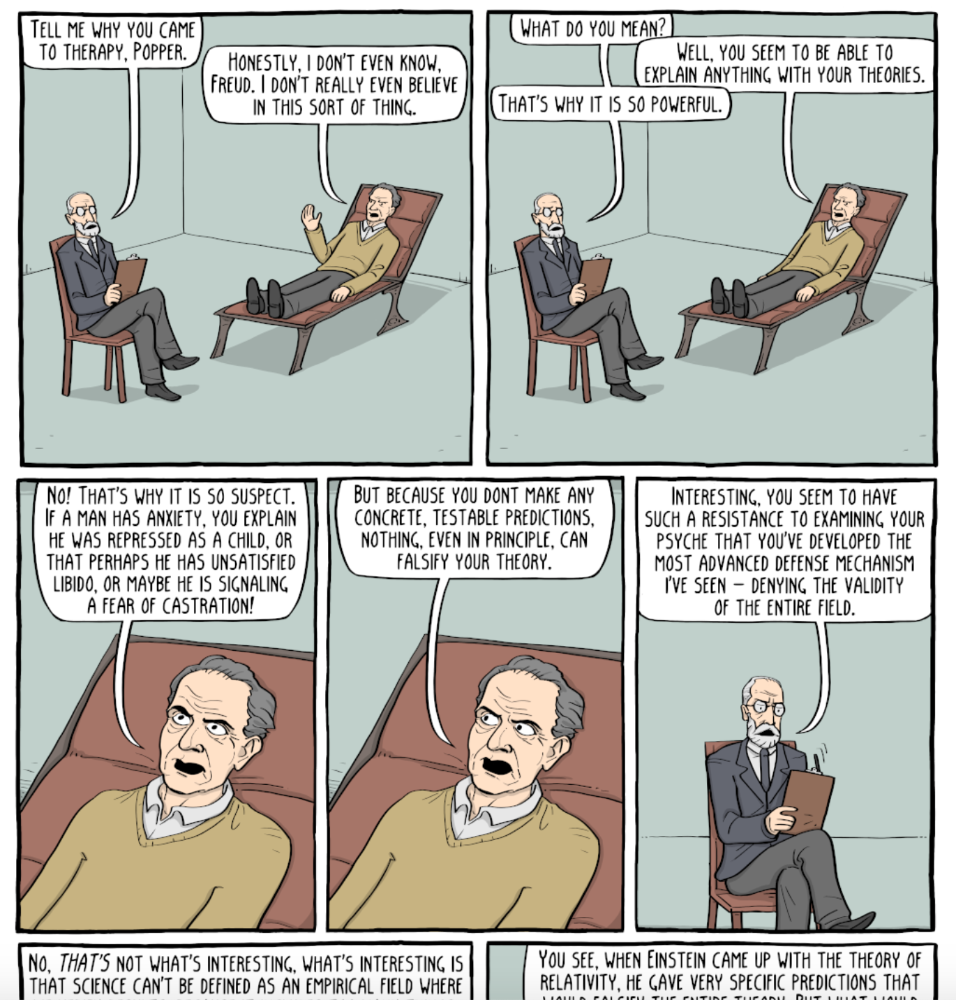
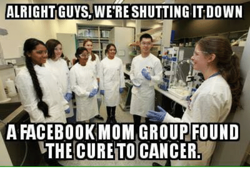

Much has been said about scientific literacy in recent decades, but this concept is often misunderstood, and excessive focus is placed on teaching people large numbers of scientific facts rather than teaching them the means by which scientific knowledge is acquired in the first place. Besides, the word “scientific” is often associated to the natural sciences, leaving political and other beliefs entirely out of the debate. If we want to improve people’s ability to acquire knowledge by themselves, then teaching science is not enough. We need to teach them epistemology.

---

Should we believe that the earth is round? That vaccines are safe? That homeopathy is no more effective than placebo? That fortune telling and astrology are no more than irrational superstition? That 9/11 was a real terrorist attack and not an inside job? Epistemology is the branch of philosophy that deals with the nature of knowledge, trying to answer generic questions such as “what is knowledge?” and “what should we believe?”. To be epistemically responsible is to be prudent rather than careless when choosing your beliefs. But when is it prudent or careless to hold a certain belief? In order to answer this question, we need to delve into the realm of epistemology.

## We don’t really *know* anything

Traditionally, knowledge has been defined by philosophers as “justified true belief” (JTB). This account of knowledge has of course been challenged (as is almost any idea in philosophy). One of my favorite objections is that presented by Peter Unger in “A Defense of Skepticism”.

Unger’s first step is to make a distinction between what he calls [absolute and relative terms](https://en.wikipedia.org/wiki/Absolute_and_relative_terms). Absolute terms denote properties that are binary, like flatness, for example. A flat surface is either flat or not flat. There is no in between. Sure, people say things like “surface A is flatter than surface B” all the time, but according to Unger this is just a shorter way of saying “surface A is closer to being flat than surface B”. Relative terms, however, denote properties that vary in degree and cannot be paraphrased like that. A bumpy surface, for example, can always get bumpier. It will never reach a level of “absolute bumpiness”. To say surface A is bumpier than surface B is *not* to say “surface A is closer to being bumpy than surface B”.

What’s important to note here is that absolute properties almost never truly apply to any object in real life. The words are almost always used in an approximative manner. No surface in the world is truly and absolutely flat if you examine it with a microscope, no line absolutely straight, no towel absolutely dry, etc. With that said, Unger moves on to define “certainty” as an absolute term, and knowledge as requiring certainty. Indeed, when we look at it this way, what do we truly *know*?

> [W]e don’t know anything. Except, perhaps, as Descartes would argue, that we as individual minds exist (I think, therefore I am) and as others would argue, that certain *a priori* statements are true (e.g. 2+2=4). For *a posteriori* beliefs that rely on empirical data, however, you just can’t have any bulletproof justification to believe anything with 100% confidence. For all you know, you could be [a butterfly dreaming you’re a human](https://en.wikipedia.org/wiki/Dream_argument) or a [brain in a vat](https://en.wikipedia.org/wiki/Brain_in_a_vat) living an illusion created by an [evil demon](https://en.wikipedia.org/wiki/Evil_demon), or the universe may have sprung into existence [last Thursday](https://rationalwiki.org/wiki/Last_Thursdayism), with fossils, ruins, and fake memories implanted in all our brains. But although we can’t have 100% confidence in our beliefs, we don’t let this paralyze ourselves in our day-to-day lives. For all intents and purposes, there is such a thing as *sufficient* confidence. We assume we’re not living in the matrix, and we assume that our fellow human beings are not [philosophical zombies](https://en.wikipedia.org/wiki/Philosophical_zombie). We may be wrong, but it seems so unlikely that it is irrelevant.
> – [Ariel Pontes; All animals have sex for pleasure](https://medium.com/humanist-voices/all-animals-have-sex-for-pleasure-9dcf6f5551b8)

But when is our confidence justified, and when is it not?

## How scientists justify their beliefs

Since we can never know with absolute certainty what is true and what isn’t, the “truth” requirement in the JTB theory becomes somewhat irrelevant. Sure, this is not to say that we should abandon words such as “truth” and “knowledge” completely. We can continue to use them, as long as we are aware of their approximate nature. When we say “I know X”, we should be aware that this is just a short way of saying “I believe in X with such a high degree of confidence that for all intents and purposes, I can say X is true”.

Similarly, we don’t have to stop believing in absolute truths. But acknowledging the *existence* of absolute truths doesn’t imply that we have *access* to this truth. We are still cognitively limited animals navigating a world that is overly complex for our brains to grasp. We are fallible, and failing to realize that reveals lack of [epistemic humility](https://en.wikipedia.org/wiki/Epistemic_humility), which is a cornerstone of the scientific method.

> **Science**, any system of knowledge that is concerned with the physical world and its phenomena and that entails unbiased observations and systematic experimentation. In general, a science involves a pursuit of knowledge covering general truths or the operations of fundamental laws.
> – [Encyclopædia Britannica](https://www.britannica.com/science/science)

Many people, especially those with spiritual or post-modern tendencies, tend to be skeptic towards science. They view scientists as arrogant and narrow-minded people who think science is the only valid way to acquire knowledge and accuse them of “scientism”. I believe this is at least partly the result of a linguistic misunderstanding. When skeptics defend “science”, we use the word in the broadest possible sense. This includes not only the natural sciences, but also human sciences such as history, literature, etc.

As the proponents of [prototype theory](https://en.wikipedia.org/wiki/Prototype_theory) have shown, when humans categorize things, we don’t view all members of that category as equal. Some members are seen as prototypical examples of that category, while others are more peripheral. A sparrow is a more common example of a bird than a penguin, for example. But we must be aware that, although this type of fuzzy categorization sometimes makes sense, sometimes it doesn’t, and depending on the context we should resist the urge to treat one member of a category as less of a member than the other. At the end of the day, a sparrow and a penguin are equally good examples of birds, technically speaking.

> [Psychologists] replicated Rosch’s experiments using the most classical, Aristotelian categories they could find, “odd number” and “woman.” The subjects rated “7” as an excellent example of an odd number, and “447” as not such a good example; they thought that a “housewife” was an excellent example of a woman, and a “policewoman” not such a great example. The same gradations emerged in their real-time mental processes: They pushed an “odd number” button more quickly when “3” flashed on the screen than when “2,643” did.
>
> *–* Steven Pinker; *Words and rules, the ingredients of language*

With this in mind, it is understandable that when we hear the word “science” we think of an old man with a white coat mixing chemicals in a lab and not a historian in a library. And indeed, the natural sciences have more scientific tools at their disposal than the social scientists. After all, it’s harder if not impossible for social scientists to test their theories with experiments. But that doesn’t mean the social sciences are pseudosciences or superstitions, as long as they are committed to using all the scientific tools that are available to them and to rejecting their theories when they fail to meet those standards.

In the end, science is essentially a set of clever mechanisms designed over the centuries to bypass the cognitive biases that otherwise prevent us from perceiving reality more accurately.

> [Daniel Kahneman’s] central message could not be more important, namely, that human reason left to its own devices is apt to engage in a number of fallacies and systematic errors, so if we want to make better decisions in our personal lives and as a society, we ought to be aware of these biases and seek workarounds. That’s a powerful and important discovery.
> – [Steven Pinker; Daniel Kahneman changed the way we think about thinking. But what do other thinkers think of him?](https://www.theguardian.com/science/2014/feb/16/daniel-kahneman-thinking-fast-and-slow-tributes)

Being scientific is being aware of your biases and designing mechanisms to bypass them. To say science is not the only valid way to acquire knowledge is to deliberately choose to trust your subjective and biased gut level intuitions and refuse to keep them in check by any higher principle of objectivity and neutrality. To say that science is only one way of looking at reality, and that there are other, equally legitimate ones, is to say that sometimes it is ok to trust your gut feeling and never put them to the test. Is it really ever legitimate to do that? I don’t think so. I think it’s irrational and irresponsible. Cognitive scientists have identified [hundreds of cognitive biases,](https://en.wikipedia.org/wiki/List_of_cognitive_biases) so I won’t go through all of them in this article, but I will try to draw attention to some of the most important ones, and the scientific strategies devised to circumvent them.

### Biases scientists have to control for

**Confirmation bias**
When we have a belief or an expectation, we tend to look for evidence that confirms it and ignore evidence that contradicts it. Let’s say a team of doctors wants to try the efficacy of a new drug, for example. They separate the subjects into two groups: a test group that takes the active substance, and a control group that takes a placebo. The subjects then go for a period of treatment and are periodically evaluated by doctors. It is known that, if the subjects know they took the active substance, they will tend to report feeling better, while if they are told they took a placebo, they won’t report much of a difference (i.e. the placebo effect will not work). Similarly, if the doctors know whether they are examining an individual in the test group, they will have a propensity to overestimate the effect of the treatment, while if they are examining somebody in the control group, they will underestimate the sometimes very real benefits of the placebo effect.

**Patternicity and agenticity**

> “Humans are pattern-seeking story-telling animals, and we are quite adept at telling stories about patterns, whether they exist or not.”
> ― Michael Shermer

Patternicity (sometimes also called [apophenia](https://en.wikipedia.org/wiki/Apophenia)) is the tendency to find patterns in random noise. Results in neurological research and experimental psychology reveal that, as should really be no surprise, humans have a strong propensity to experience this bias. Evolutionarily speaking, it makes perfect sense. Being able to see patterns in nature is indispensable for survival, and failing to see patterns can be a one-way ticket out of the gene pool. Therefore, it makes sense that our brains evolved as a hyper-sensitive pattern seeking machine. If you see something on the ground and you don’t know if it’s a stick or a snake, assume it’s a snake. If it turns out it was just a stick, that’s no big deal. There’s little harm in false-positives. But if you assume it’s a stick and it turns out to be a snake, that’s a false-negative you may have to pay for with your life.

Similarly, if a big rock rolls down from a hill and almost kills you, was it a coincidence or someone trying to kill you? Again, if you assume it was a coincidence when in fact it was someone trying to kill you, you’re in trouble. If it was a coincidence and you think it’s someone trying to kill you, on the other hand, there’s no harm in being extra-vigilant for the next few hours. This tendency to infer agency when there may be none is called agenticity. It is usually beneficial but may be a problem if it causes you to delve into a permanent state of psychotic paranoia, fearing that hidden agents are waiting to catch you at every corner. And indeed research seems to indicate that psychosis and schizophrenia are related with hyper-sensitivity in pattern seeking and agent seeking areas of the brain.



### Anti-bias strategies

**Blind experiments**
Consider the pharmaceutical experiment described earlier. In order to control for those biases, scientists use [blinded experiments](https://en.wikipedia.org/wiki/Blinded_experiment). In our example, a proper blinded experiment would have to be double-blinded: the subjects wouldn’t know whether they took an active or inactive substance, and the doctors doing the evaluation wouldn’t know whether they are examining people in the test or control group. If you believe in a treatment, and after a double-blinded experiment, it is shown that this treatment is no better than placebo, the only epistemically sound conclusion to reach is that the treatment doesn’t work. If you have any commitment to rationality and consistency, you must abandon your former belief.

**Replicability**

*Royal Society’s coat of arms*

“Nullius in verba”, says the motto of the Royal Society, the oldest national scientific institution in the world, meaning: “don’t take anybody’s word for it”. In a historical rupture with traditional mentality, which praised blind reverence to authority, the scientists at the society explicitly promoted skepticism, and required proof for any statement. This principle is reflected today in the requirement that any experiment be replicable. This means the methodology must be transparent and described in sufficient detail so that independent scientists who have no interest in reaching the same results, can retry the experiment.

**Falsifiability**

> “In so far as a scientific statement speaks about reality, it must be falsifiable: and in so far as it is not falsifiable, it does not speak about reality.”
> ― Karl R. Popper, The Logic of Scientific Discovery

A falsifiable statement is one that is open to falsification. If a person makes a statement that they claim to be falsifiable, they must be able to specify what empirical data or experimental result would prove their statement to be false. As an atheist, a common experience when discussing with theists is that whenever an argument of theirs is refuted, they will immediately improvise a new ad hoc argument and no matter what I say or what happens in their lives, nothing will ever be interpreted as evidence that God doesn’t exist. When their prayers are answered, God is great. When they are not, God works in mysterious ways. For theists, the data must be interpreted to confirm the theory, which is unchangeable. For scientists, the theory must adapt to fit the data, which is unpredictable.

One thing people often misunderstand about science, is that it doesn’t prove anything to be true, it only proves things to be false. It is common to hear about a certain theory being “scientifically proven”, but although I understand we want to be succinct, if we want to be really rigorous about language, we should say “this theory is the best hypothesis we have so far, all the evidence we have converge towards this conclusion, and no empirical observation so far has contradicted it”.

> It follows from the nature of the scientific method that no explanatory principles in science are final. “Even the most robust and reliable theory … is tentative. A scientific theory is forever subject to reexamination and — as in the case of Ptolemaic astronomy — may ultimately be rejected after centuries of viability.”
>
> – Michael Shermer; Why People Believe Weird Things: Pseudoscience, Superstition, and Other Confusions of Our Time

The concept of falsifiability was introduced by philosopher of science Karl Popper in his 1959 book *The Logic of Scientific Discovery*, where he used it to distinguish proper science, such as Einstein’s theory of relativity, from pseudoscience such as [Freudian psychoanalysis and Marxism](https://www.youtube.com/watch?v=-X8Xfl0JdTQ). Since then, falsificationism has become a cornerstone of modern science, as is illustrated by the McLean v. Arkansas court case regarding the teaching of “creation science” in public schools. In 1981, a group of parents, teachers, biologists, and representatives of other organizations (including many religious ones) filled a lawsuit against the Arkansas Board of Education, which required that “creation science” be given equal time with evolution. They claimed “creation science” is not a real science, but rather religion masked as science, and therefore had no place in public classrooms. Judge William Overton eventually ruled in their favor, stating that “creation-science” as defined in Arkansas Act 590 “is simply not science”. The judgment defined the essential characteristics of science as being:

1. It is guided by natural law;
2. It has to be explanatory by reference to natural law;
3. It is testable against the empirical world;
4. Its conclusions are tentative, i.e. are not necessarily the final word; and
5. It is *falsifiable*.

Think about your beliefs. Are they falsifiable? Believers in homeopathy, for example, ignore the multiple double-blind experiments that show homeopathy is no better than placebo. Believers in astrology ignore the fact that people will rate generic horoscope descriptions as “high precision”, even when they don’t correspond to their “real” zodiac sign (known as “[the Barnum effect](https://www.youtube.com/watch?v=NBXRzdzFnHk)”), and also ignore that there is no evidence that the time of birth affects our personalities in any measurable way, and that nobody has managed to make a zodiac sign predictor based on personality questionnaires that is more successful than random chance. Think about it: what would make you give up on your belief? Could you think of something? If you could, then your belief is falsifiable. Couldn’t think of anything? Then your belief is unfalsifiable and no matter what data comes in, you will either ignore it or engage in some sophisticated mental gymnastics to reinterpret the data in a way that doesn’t conflict with your beliefs. I may be a skeptic, but at least I can tell you exactly what data I need in order to conclude that homeopathy, astrology, or God are real:

1. **Homeopathy** — Double-blind, placebo controlled trials.
2. **Astrology** — A successful zodiac sign predictor.
3. **God** — A talking face that everybody hears appearing in the clouds and claiming to be God, for example.

This proves I am open to changing my mind. Are you?

*Freud and Popper, Existential Comics ([Continue reading →](https://existentialcomics.com/comic/285))*

### Convergence of evidence

> To be sure, not all claims are subject to laboratory experiments and statistical tests. There are many historical and inferential sciences that require nuanced analyses of data and a convergence of evidence from multiple lines of inquiry that point to an unmistakable conclusion. Just as detectives employ the convergence of evidence technique to deduce who most likely committed a crime, scientists employ the method to deduce the likeliest explanation for a particular phenomenon.
> — Michael Shermer; The Believing Brain

When Holocaust revisionists and creationists, for example, attack mainstream accounts of reality, they look at all the evidence used to defend these theories and then focus on very specific ones that seem particularly weak and problematic to them. Sometimes, they are indeed problematic, but what they fail to see is that the edifice of our best theories don’t rely on a few scattered pillars, but on many of them, such that even if we did concede that pillar was weak, there are many more to support the structure.

> Philosophy ought to imitate the successful sciences in its methods, so far as to proceed only from tangible premisses which can be subjected to careful scrutiny, and to trust rather to the multitude and variety of its arguments than to the conclusiveness of any one. Its reasoning should not form a chain which is no stronger than its weakest link, but a cable whose fibers may be ever so slender, provided they are sufficiently numerous and intimately connected.
> — Charles S. Peirce

## It is immoral to perpetuate unjustified beliefs

Mariah Walton was born with a small atrial septal defect. Such heart defects can be cured with relatively simple treatment, but Mariah wasn’t treated. Why? Because her parents were fundamentalist Mormons who lived off the grid and refused to take their children to doctors believing that “illnesses could be healed through faith and the power of prayer”.

[Letting them die: parents refuse medical help for children in the name of Christ](https://www.theguardian.com/us-news/2016/apr/13/followers-of-christ-idaho-religious-sect-child-mortality-refusing-medical-help)

> Mariah is 20 but she’s frail and permanently disabled. She has pulmonary hypertension and when she’s not bedridden, she has to carry an oxygen tank that allows her to breathe. At times, she has had screws in her bones to anchor her breathing device. She may soon have no option for a cure except a heart and lung transplant — an extremely risky procedure.
> – [Letting them die: parents refuse medical help for children in the name of Christ](https://www.theguardian.com/us-news/2016/apr/13/followers-of-christ-idaho-religious-sect-child-mortality-refusing-medical-help)

In 2010, John Patrick Bedell opened fire and wounded two Pentagon police officers at a security checkpoint in the Pentagon station of the Washington Metro system just outside Washington, D.C. before he was shot dead. He was later found to be a “9/11 truther”, believing that the 9/11 attacks were a conspiracy by the US government to justify wars in the middle-east.

> “Apparently the delusional Bedell intended to shoot his way into the Pentagon to find out what really happened on 9/11. Death by conspiracy.”
>
> – Michael Shermer; The Believing Brain

There are innumerable examples of tragedies that ultimately result from irrational thinking and the perpetuation of unjustified beliefs. I’ve written about it more extensively [in a previous article](https://medium.com/humanist-voices/faith-and-superstition-are-not-harmless-cdb5033ce72e), but the list never really ends. Sure, it’s all fun and games when you read your horoscope in the newspaper and nobody gets hurt, and I can understand that people want to have such seemingly harmless beliefs respected. But what cost are we willing to pay for the social acceptance of irrationality and magical thinking?

> If an individual happens to be a secularist who understands public policy should be based on hard science but chooses to still pay to have psychics give them life advice after reading from a crystal ball, that’s of course better than being a theocratic fundamentalist, but it still means we as a society have failed to teach our population basic scientific literacy and in a post-truth era this means we have an electorate who can’t tell fact from fantasy and is therefore vulnerable to anti-vaxxers, climate change deniers, etc. We can try to imagine a hypothetical society in which people are still faithful and superstitious but don’t support any non-scientific policy, but this would be nothing but an extremely fragile, vulnerable society (besides of course completely unrealistic).
> – [Ariel Pontes; Faith and superstition are not harmless](https://medium.com/humanist-voices/faith-and-superstition-are-not-harmless-cdb5033ce72e)

Belief in astrology and immortal souls is like having a weird but seemingly benign symptom appearing on your body, such as having your skin turn blue. Sure, it doesn’t seem to do any harm, but any sane person would go to a doctor to investigate the underlying cause of this symptom. If the doctor said that this condition could either remain benign, not developing into anything dangerous, or it could become an extremely aggressive and incurable cancer that would kill you in a few months, what would you do? Wouldn’t you ask to be cured, even if you liked your new skin color? Belief in “energies”, “vibrations” and the supernatural are the symptom of a diseased society. And although these specific symptoms may seem benign, the disease most certainly isn’t.

## Contemporary dangers exacerbated by lack of epistemic literacy

Some will probably insist that my previous examples were “extreme”, and that “as long as you’re moderate”, it’s ok to be superstitious. For me this is like saying the [Charleston church massacre](https://en.wikipedia.org/wiki/Charleston_church_shooting) is an extreme example of the harms of white-nationalism and that, as long as we’re moderate, neo-Nazi ideology and white supremacism are harmless. We must ask ourselves: what do we *gain* as a society from tolerating superstition? Sure, some people feel good going to fortune tellers and faith-healers. But I’m sure white supremacists also feel good having a sense of community and a greater cause to fight for.

Still, if it seems far fetched that the irrationality behind belief in astrology could end up fueling more harmful types of actions, I can give some more concrete examples.

### Defining the school curriculum

> A little reflection will show us that every belief, even the simplest and most fundamental, goes beyond experience when regarded as a guide to our actions
> – William Kingdon Clifford

It’s very easy to transform an epistemic issue into a moral one. Just take any supernatural belief and ask yourself: should we allow these to be taught in public schools? Since the publication of *On the Origin of Species*, in 1859, the debate around evolution vs. creationism in schools has been waging around the world, with one side initially trying to ban the teaching of evolution in schools, while the other tried to promote it. Nowadays, fortunately, few countries ban the teaching of evolution. But it is still not taught in many countries and the religious conservatives still try to push their agenda, trying to push for “creation science” being taught alongside Darwinian evolution. They argue “teach kids both and let them decide”. It sounds very nice tolerant, but then where do we stop? Should we also teach them the creation stories of all religions of the world? Should we also teach them the theory of the [Flying Spaghetti monster](https://en.wikipedia.org/wiki/Flying_Spaghetti_Monster)?

Fortunately, the evolution debate has largely been settled by pro-science court decisions in the United States in recent years, and it hasn’t made headlines lately. But with the recent swing to the right, it wouldn’t be a surprise to see religious fundamentalists trying their luck again. Besides, other similar debates are very much alive, with religious groups [questioning LGBT-friendly sex education in schools](https://humanism.org.uk/2018/02/14/faith-groups-demand-governments-permission-for-homophobic-teaching-in-english-schools/), for example, often on pseudoscientific grounds.

### Fake news and disinformation campaigns

In recent years, with the advent of the internet and social media, fake news and disinformation campaigns have become an increasingly important topic. Political campaigns suddenly find themselves flooded with fake news about one candidate or another, driving the population to extremes and endangering our democracy, as the documentary [The Great Hack](https://www.imdb.com/title/tt9358204/) illustrates well.

[Indian authorities blame WhatsApp messages for lynchings](https://www.scmp.com/news/asia/south-asia/article/2155270/death-fake-news-indian-authorities-blame-irresponsible-and)

It is now known that the Russians have been disrupting elections in the West since [Brexit](https://en.wikipedia.org/wiki/Russian_interference_in_the_2016_Brexit_referendum) and [Trump](https://en.wikipedia.org/wiki/Russian_interference_in_the_2016_United_States_elections), and that they continue to take advantage of people’s lack of epistemic literacy to [spread misinformation and influence elections around the world](https://www.europeandatajournalism.eu/eng/News/Data-news/Over-5000-Russian-disinformation-items-in-four-years-and-a-half). Liberal democracy, one of the institutions that is most [responsible for the decline of war and violence in the world](https://www.youtube.com/watch?v=ramBFRt1Uzk), is now under threat largely because of how incapable the electorate is from telling truth from lies.

### Vaccine hesitancy

> Vaccine hesitancy — the reluctance or refusal to vaccinate despite the availability of vaccines — threatens to reverse progress made in tackling vaccine-preventable diseases. [Vaccination](https://www.who.int/features/factfiles/immunization/en/) is one of the most cost-effective ways of avoiding disease — it currently prevents 2–3 million deaths a year, and a further 1.5 million could be avoided if global coverage of vaccinations improved.
> – [World Health Organization, Ten Threats to Global Health in 2019](https://www.who.int/emergencies/ten-threats-to-global-health-in-2019)

“To each his own”, says the generic mantra of tolerance and acceptance. But as is the case with most simplistic clichés, it always turns out it has to be balanced with an equally valid and opposite cliché. In this case, “your freedom ends where mine begins”. Many people seem to think that parents should have absolute freedom when deciding whether to vaccinate their children or not. But are they really harmlessly exercising their freedom when they refuse to vaccinate their children? No. It’s not a harmless exercise of freedom when you’re putting other people in risk. Vaccine hesitancy is harmful because it corrodes what is called [herd immunity](https://en.wikipedia.org/wiki/Herd_immunity).

> [In 2017], a 26-year-old man receiving treatment for leukemia went to a Swiss hospital’s emergency room with a fever, a sore throat, and a cough, and was admitted. His condition worsened, and 17 days later, he died from severe complications of measles. The man’s weakened immune system was unable to fight off the disease, even though he was vaccinated against measles as a child.
> – [Fatal measles case highlights importance of herd immunity in protecting the vulnerable](https://www.sciencedaily.com/releases/2018/11/181101133918.htm)

Basically, the more vaccinated people you have in a population, the less likely is a disease like measles to spread. This helps protect the most vulnerable in the population, such as babies who are still too young to be vaccinated, or people undergoing treatment for other conditions or who simply have their immune system weakened for whatever reason.

Besides, even if herd immunity wasn’t a problem, should parents really have the right to do whatever they want to their children? Shouldn’t children have rights of their own? Mariah Walton, understandably, think they should.

> Yes, I would like to see my parents prosecuted. They deserve it. And it might stop others.
> – [Mariah Walton](https://www.theguardian.com/us-news/2016/apr/13/followers-of-christ-idaho-religious-sect-child-mortality-refusing-medical-help)

Are we really willing to pay for the freedom of irrational, scientifically and epistemically illiterate people with the lives of the most vulnerable? Is this really an ethical stance to take?



### Climate change and animal welfare

I had never felt the pain of pseudoscience so sharply on my skin until I became interested in veganism. People go vegan for many reasons, but 2 of the 3 main ones are [animal welfare and climate change](https://medium.com/humanist-voices/vegans-and-omnivores-must-stop-fighting-8da619f3e49c).

There is overwhelming consensus among experts that [climate change is real, a threat to humanity, and largely attributable to human activities](https://climate.nasa.gov/scientific-consensus/). However, conspiracy theorists continue to deny it, pushing their anti-science agenda to protect their political interests. Similarly, Big Pharma conspiracists and anti-science health freaks oppose advances in food technology for no reason other than gut-feeling, conspiratorial anti-government thinking and vulnerability to [naturalistic fallacies](https://en.wikipedia.org/wiki/Naturalistic_fallacy): the vague (and [unscientific](https://www.youtube.com/watch?v=bkhhCi7nMFI)) idea that “everything unnatural is unhealthy”. Tolerating this type of pseudoscientific thinking has a cost, and it is measured in the number of animals who suffer horrific factory-farming conditions every year and the damage done to our environment. New foods like plant-based meat only use substances that are approved by government institutions after rigorous scientific testing. They have great potential to reduce climate change and animal suffering and we should be embracing them, not resisting them. Does the government sometimes approve harmful substances? Is research sometimes biased because of funding? Sure, no system is perfect. But are Facebook mom groups and New Age blogs really a better system of establishing what is safe and what is not?

*Alright guys, we’re shutting it down. A Facebook mom group found the cure to cancer.*

> The solution to both of the big problems in food technology — how we’re going to feed a burgeoning population and what we’re going to do about climate change — is actually pretty simple: plant-based protein.
>
> [Eric Schmidt] calls the concept “nerds over cattle,” and it’s the reason that the Good Food Institute, which I direct, exists: to promote plant-based and “clean meat” technologies, to solve the problems of animal agriculture and improve life on earth by an order of magnitude in the near future.
> – [Bruce Friedrich, Nerds Over Cattle: How Food Technology Will Save The World](https://www.wired.com/2016/10/nerds-cattle-food-technology-will-save-world/)

## How you should justify your beliefs

So far I’ve talked mostly about how scientists and academics justify their beliefs. But most of us are not scientists and academics. We don’t have the time, resources or expertise to conduct double-blind, placebo controlled experiments, to do [meta-analyses](https://en.wikipedia.org/wiki/Meta-analysis) of the current literature on a given topic, etc, and yet we have to make decisions. We have to decide whether to vaccinate our children or not, whether to eat new plant-based meat replacements or not, who to vote for, etc. So what do we do?

### Trust the right authorities

Justifying your beliefs by appealing to an authority is not always a fallacy. When our resources are limited, it is reasonable to outsource some of our investigative work to experts. But how do we tell reliable authorities from unreliable ones?

**Trust institutions, not individuals**
As the saying goes, “two heads think better than one”. Humans are fallible and corruptible. No single individual can compete with a team when it comes to being an authority on any given topic. Even Einstein, who has become the symbol of human genius, is only considered successful because he managed to convince enough of his colleagues, causing a shift in the scientific consensus. Indeed, [research seems to confirm](https://www.youtube.com/watch?v=469ANHsysXc) that many of our cognitive biases are corrected when we work in groups. In fact, some theorize that this is why these biases evolved in the first place: although they make us poor reasoners individually, they make us good reasoners at the collective level.

**Trust institutions of experts, not ideologues**
When in doubt about homeopathy, for example, listen to France’s National Authority for Health, not Boiron, one of the world’s largest manufacturer of homeopathic products. Trust UK’s National Health Service, not the British Homeopathic Association.

> The French government has announced it will stop reimbursing patients for homeopathic treatment from 2021 after a major national study concluded the alternative medicine had no proven benefit. […]
>
> France’s approach is being closely followed in Germany, where around 7,000 homeopathic doctors are registered. […]
>
> In Britain, the National Health Service decided in 2017 to stop funding homeopathic care, while public health systems in other EU countries such as Sweden, Belgium or Austria do not support the treatment. […]
>
> French company Boiron, the world leader in homeopathic products, denounced the move as “incomprehensible and incoherent”.
> — [France to stop reimbursing patients for homeopathy](https://www.theguardian.com/world/2019/jul/10/france-to-stop-reimbursing-patients-for-homeopathic-treatment)

If someone floods you with links to papers that claim to “confirm” that homeopathy work, you can easily find as many showing that it doesn’t work. But that’s a waste of time. Neither of you are experts, so the reasonable attitude is to outsource the effort to external authorities. Overburdening your opponent with demands that are unreasonable in a given context (e.g. asking for a detailed review of the academic literature on a Facebook discussion) is a type of [Gish gallop](https://en.wikipedia.org/wiki/Gish_gallop). And even if your opponent claims to be an expert, they are only an individual. If they can’t convince the international medical community overall, you can reasonably disregard their arguments. They will call you narrow minded, but that’s just an empty accusation thrown at those who don’t believe what they believe. What they call narrow mindedness I call [epistemic responsibility](https://www.youtube.com/watch?v=AYkhlXronNk). Besides, if they manage to convince the international medical community, and it becomes a scientific consensus that homeopathy actually works, I will change my mind, so in this sense my mind is open. But will anything convince them that homeopathy does *not* work? Or when mainstream institutions fail to be convinced will they simply blame it on Big Pharma conspiracy theories?

**Trust Wikipedia**
Yes, really. As long as the articles cite their sources, Wikipedia is quite a reliable source. People will be quick to say “but anybody can edit it”, but that’s exactly the point. In an encyclopedia that everybody can edit, from the most religious conservative to the most secular progressive, the result is bound to be moderate and somewhat accurate. If a conservative distorts facts, progressives will attack them. If progressives distort the facts, the conservatives will strike back.

Curiously, people go to Wikipedia all the time when they want to learn something about a country, a disease, etc. But when it comes to their superstitions, they never bother to check. Just read the introduction of Wikipedia articles on astrology, homeopathy, etc, and it will state clearly that these are pseudosciences with no basis on reality, and they will provide plenty of sources. And the amazing thing about Wikipedia is that, if you think they’re wrong, you are more than welcome to edit it! Ironically though, when believers are invited to act on their beliefs, their passion suddenly fades. But this is a good thing, and perhaps another factor that makes the [wisdom of crowds](https://en.wikipedia.org/wiki/Wisdom_of_the_crowd) more reliable than that of individuals: the people who constitute those institutions are the people who actually care, and they are usually more knowledgeable.

### Make sure your beliefs are falsifiable

The term “falsifiability” is usually used in a rather technical way. In order for a hypothesis to be falsifiable, you have to be able to think of an experiment that would disprove it depending on the results. But most of us don’t conduct scientific experiments in our daily lives, so how can should the concept of falsifiability guide our behavior? Simple, just ask yourself: what would make me change my mind? You don’t have to think of an experiment. I for example will believe in homeopathy if I see the institutions that I trust and that abide by scientific principles claiming that homeopathy does work. Of course, I will want to read the studies that made them change their minds because I am curious, but in principle declarations from prestigious scientific journals, national and international academies of science, prestigious universities, etc, would be enough to at least make me agnostic about the issue rather than skeptic. If you cannot think of any authority that would change your mind, your belief is not falsifiable.

### Be agnostic about the plausible

In a recent conversation about science vs. pseudoscience, somebody said something along the following lines:

> Although I do believe in science in most situations, I still have some spiritual beliefs because there are things that science cannot yet explain. Science is very recent and still immature, scientists make mistakes all the time and sometimes even theories that were widely accepted turn out to be false. Perhaps one day silence will be more solid and mature and won’t make so many mistakes, then perhaps it will be more reliable. But until then, I keep my mind open to certain ideas even if they’re not considered scientific.

It’s hard to think of a statement that illustrates more perfectly how profoundly misinformed the public is about how science works. Science is trustworthy *precisely because* of its dynamic, self-correcting nature. And if it makes you uncomfortable to trust a system that makes mistakes, think about this: in a way, science never makes mistakes. If you think that, when Newton published his laws of motion and universal gravitation, he was saying that “these equations perfectly describe how bodies move in space at any scale”, then yes, in a way he was wrong. But if you think of him as saying “we don’t know exactly how the universe works, but in the light of the currently available evidence this is the hypothesis that we are most justified in believing”, then he was right and Einstein’s relativity doesn’t contradict him in any way.

> When [Ptolemy] penned the words Terra Australis Incognita at the bottom of his second-century CE world map, he unwittingly also provided a cognitive map that shaped exploration for more than 1,500 years by freeing humanity from the constraints of a dogged and dogmatic commitment to certainty. The knowledge that there was still undiscovered land — codified in Latin as terra incognita — led explorers to new heights of adventure and gave to future generations an earth (and eventually a cosmos) much larger and more variegated than ever imagined. An uncertain and doubting mind leads to fresh world visions and the possibility of new and ever-changing realities.
> – Michael Shermer, The Believing Brain

There is no shame in recognizing you don’t know something. That’s the big difference between science and religion: science admits it doesn’t know everything. Religion doesn’t. That’s why science advances, while ancient religions and pseudosciences like astrology remain stuck on the same ideas for hundreds of years.

> The greatest enemy of knowledge is not ignorance; it is the illusion of knowledge.
> — Stephen Hawking

Therefore, when you feel uneasy about the chemical composition of new plant-based foods appearing in the market, for example, don’t be too quick to reject them as unhealthy artificial food. It’s ok to say “well, I don’t know, I will stay agnostic about this until I can investigate for myself and check what reliable, scientific institutions have to say about this”.

### Be skeptical of the extraordinary

> Extraordinary claims require extraordinary evidence.
> — Carl Sagan

While some claims are plausible, not requiring us to revise our whole scientific world view, other claims are extraordinary, meaning they do require a wild paradigm shift. Of course, there are other factors that count, such as how intuitive a theory is. Einstein’s theory of relativity, for example, was quite counterintuitive, with their mind boggling concepts of time dilation and length contraction. It was also quite revolutionary, since it would overthrow Newton’s theory of gravitation, which had been used with great success for nearly 200 years. One could, therefore, arguably say his claim was extraordinary, even though it didn’t *completely* contradict Newton’s theory, or any other theory in different fields of science. But still, Einstein [did provide extraordinary evidence](https://www.forbes.com/sites/startswithabang/2019/05/29/this-is-how-100-years-ago-a-solar-eclipse-proved-einstein-right-and-newton-wrong/).

But what about people who claim to communicate with the dead? To predict the future? To have been healed by prayer or “energies”, or cursed by the “evil eye”? Should you be agnostic or skeptical towards them? I think people who believe these things simply fail to stop and consider for a moment how profoundly these things go against everything we know about the universe.

The intuitive idea of an immaterial spirit who dwells inside the body and controls it [goes against everything we know about how the brain works](https://www.youtube.com/watch?v=vHrmiy4W9C0), it flies in the face of all evolutionary theory, [***which doesn’t only explain the origin of physical structures in the body, but also of our minds and behavior***](https://www.nytimes.com/2004/09/10/opinion/the-duel-between-body-and-soul.html), and which has been confirmed by such a tremendous amount of observations.

The idea that some gifted people can curse and heal each other using energies is essentially a new age rebranding of magic, witchcraft and common superstitions dating back to the animism of the early Stone Age, which is still the norm in contemporary tribal societies. They can all be easily explained by our cognitive biases and limitations. And they have been explained. We know all these things are superstitions and pseudosciences. That’s why Wikipedia says so. That’s why we don’t learn them in our schools and universities except in lectures on history or religion.

Many people say “I keep an open mind, science hasn’t proven that these things don’t exist”. But it’s impossible to prove a negative. Science hasn’t proven that dragons, fairies and elves don’t exist either. Believing in souls because of a few first-person testimonies is like believing in dragons because some old ladies in a village said they saw one. Wouldn’t it make more sense to assume their interpretation of the events is clouded by their ignorance, their superstitious beliefs, and other psychosocial phenomena?

So how have these beliefs survived to this day, even in modern, urbanized societies built on the foundations of science? Essentially, because it is taboo to question them. The magical thinking of prehistoric animism was past down as tradition from one generation to the other and made its way to many of the big religions of today. Since religion still has a lot of power, many people in developing countries don’t learn about evolution, and even in developed countries where people do learn about evolution, little if anything is said about the evolution of *behavior*. But legs are explained by evolution just as well as forgiveness and love. So if you assert that it’s our souls who forgive and love, you are fundamentally contradicting evolution.

## Conclusion

We humans are naturally biased and irrational, which leads us to formulate and hold false beliefs. Beliefs form a basis for our actions, and false beliefs inevitably leads us to making bad decisions. People and other animals are harmed and suffer as a consequence of these bad decisions. It is therefore immoral to be careless about the beliefs you hold and perpetuate. Everybody plays a role in our [information ecosystem](https://en.wikipedia.org/wiki/Information_ecology). By holding and perpetuating unjustified beliefs you are polluting the information environment, just like you’re polluting the environment when you throw trash out of your car window. It is therefore our moral duty to be epistemically responsible and stop being naive and credulous. In order to do this, you should:

- Trust reliable institutions instead of charismatic individuals.
- Make sure your beliefs are falsifiable.
- Be agnostic about claims you’re unfamiliar with, as long as they’re plausible.
- Be skeptical towards claims that contradict everything we know about the world.

> If men were angels, no government would be necessary. If angels were to govern men, neither external nor internal controls on government would be necessary. In framing a government which is to be administered by men over men, the great difficulty lies in this: you must first enable the government to control the governed; and in the next place oblige it to control itself.
> — Alexander Hamilton

Humans are a bag of contradictions. Most of us wouldn’t be so cartoonishly evil to disagree that we should strive for a world where everybody is as happy and fulfilled as possible. But at the same time, we have behavioral tendencies that are not at all conducive towards that goal. We are greedy, selfish, megalomaniacal and we are also biased and irrational. Just like we need to implement a system of checks and balances such as the separation of powers in a state in order to curb our natural autocratic tendencies, we also need a system to correct for our instinctive irrational tendencies, and this system is science.

> “It is wrong always, everywhere, and for anyone, to believe anything upon insufficient evidence.”
> ― William Kingdon Clifford (1877), The Ethics of Belief and Other Essays
