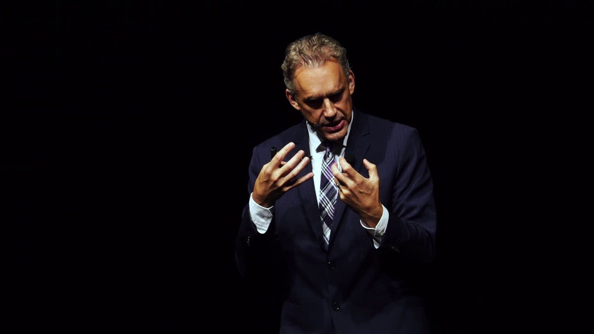

🎙 *This article is also available in [Podcast format](https://anchor.fm/ghostlessmachine/episodes/1-On-Jordan-Peterson---A-review-of-12-Rules-for-Life-and-other-content-ek2btk).*

*Jordan Peterson giving a lecture*

A few months ago, I decided to read 12 Rules For Life. All my progressive friends hated Jordan Peterson, he was the butt of many jokes in most philosophical or political pages I followed, and the target of strong criticism by most publications I read. On the other hand, many friends of mine who are super nice, open-minded, accepting and non-judgemental men and women, but who are completely oblivious about politics, seemed to be enthralled by him. On top of that, Sam Harris, a public intellectual that I deeply admire, seemed to have a very favorable attitude towards Peterson, even though they disagree on some fundamental issues. I had listened to all their debates, but I couldn’t make up my mind, so I finally decided to take a final step and read his (in)famous book in an attempt to formulate my own opinion.

---

Most of my life I’ve read and thought a lot about ideological subjects such as religion, science, politics, philosophy, etc. I completely avoided thinking about life, career, relationships, etc. and I was completely cynical towards any type of self-help. It was only recently that I started spending large amounts of my mental energy on these topics, and being more in touch with my psychology and emotions. As a skeptic, I try to apply the same principles of epistemic humility and vigilance when analyzing my own behavior, and I must say that this is a very humbling experience that makes my lack of free will painfully apparent.

Being somewhat of a centrist, I am often accused both by progressives and conservatives of leaning too much to the other side, and so I was really trying to be neutral when reading this book, so that I could form an authentic opinion. But that is incredibly hard. What does “authentic” even mean when we are always being influenced by something? What does my “true self” think about the book? [Is there such a thing as a “true self”](https://www.youtube.com/watch?v=rMYdKz4xxMc) at all? I feel like I could choose to interpret the many lessons in the book as either positive or negative, depending on whether I choose to embrace my leftist egalitarian side or my centrist dark web intellectual side. And perhaps that’s what’s so tricky about Jordan Peterson, and why it’s hard to point out to what you don’t like about what he says when you get triggered by some of his more controversial statements. That said, I will try to share some of the thoughts I had while reading this book, focusing on the arguments that I stand by most confidently.

## What I partly resonated with

The twelve rules in Peterson’s book are the following:

> 1. Stand up straight with your shoulders back
> 2. Treat yourself like someone you are responsible for helping
> 3. Make friends with people who want the best for you
> 4. Compare yourself to who you were yesterday, not to who someone else is today
> 5. Do not let your children do anything that makes you dislike them
> 6. Set your house in perfect order before you criticize the world
> 7. Pursue what is meaningful (not what is expedient)
> 8. Tell the truth — or, at least, don’t lie
> 9. Assume that the person you are listening to might know something you don’t
> 10. Be precise in your speech
> 11. Do not bother children when they are skateboarding
> 12. Pet a cat when you encounter one on the street

I did resonate with something in almost all rules and, although he did lean towards the conservative side, in my opinion it was always within the bounds of decency. Sure, I had my disagreements there, but I don’t like to discard someone’s entire arguments because of their political affiliation. He is not a nazi or a far-right lunatic. He is a moderately conservative man with some good arguments and a clear emotional attachment to certain elements of his cultural heritage. I could review each rule individually, but most of his central ideas recur throughout the book so I believe it makes more sense to talk about what I perceived to be these central themes.

### Anti-revolutionary arguments

His [Hobbesian](https://www.youtube.com/watch?v=9i4jb5XBX5s)/[Burkean](https://www.youtube.com/watch?v=TKKOWsw2IQI) arguments in favor of moderate conservatism are quite compelling. Indeed, the social structures we have created over centuries may be imperfect but it would be reckless and dangerously over-optimistic to throw them all away in a progressive revolution aiming to create an idealized utopia.

However, it is extremely hard to decide exactly what the perfect balance is between the extremes of preserving the status quo exactly as it is and completely dismantling everything. As someone who scores high on “openness to experience” I clearly tend more towards “Let’s change things! Let’s try it out and see what happens. Slowly and carefully, sure, but determinedly!”. Needless to say, he leans more towards the other side. How much? It’s unclear, and that’s one of the tricky things about Peterson. I’ll come back to it later.

He also means this revolutionary attitude is dangerous not only in the political realm, but in the psychological one as well. If we have no system of values to hold on to, we will spiral into chaos. I don’t know how much I agree with this and he didn’t mention much research to sustain this point as far as I remember. His views seem to be based on personal and clinical experience. I for one don’t feel so completely disoriented just because some ideas about masculinity, sexuality and family are being challenged. Sure, it is to some extent confusing to have so many options. But would it really have been better if I had been forced to conform to a narrow standard? Maybe everything would be easier for people like him, who presumably already sort of fit the standard. But for the weirdos of society, it would be much worse. And that’s why I understand when people accuse him of being a clueless straight white man, even though I usually dislike this type of accusations against people’s identities.

### Over-sensitivity and victim entitlement

It is a modern trend to be over-protective of everybody. Children should never be reprimanded, everybody should get the same participation prize at the end of any game, and there is a “the victim is always right” mentality that sometimes could be toxic. A minimum thickness of skin is something I believe everybody should develop for their own good, and policing society so that nobody gets hurt ever seems to me like a recipe for a generation of immature, infantilized adults. I think it’s annoying for the people being policed, but even more damaging for the people being “protected”. This is a recurring theme in Peterson’s discourse, and I largely agree with it.

Even if we are wrong at the empirical level, and it turns out to be good for people to indulge in their sensitivity with no restraint (which I doubt), I would still maintain at a philosophical level that there is a limit to our moral obligations towards others. A certain level of discomfort in daily life is something normal and unavoidable, and it cannot be my moral duty to get out of my way to prevent that from happening. We have limited resources and it’s costly to make this effort, so it must be legitimate to stop *at some point*. But where should we draw the line? I don’t know. That’s a topic for another article.

### Biological differences between men and women

The behavioral differences between man and women are *partly* explained by biology. This is true, but this is an extremely delicate topic that must be approached with great care. It is debatable whether Peterson approaches it with sufficient care or not, but I share his dismay towards people who simply deny it because it’s ideologically convenient. I have written two articles that explain in a bit more detail where I stand on issues of biological determinism and gender equality:

1. [The dangers of biological determinism](https://medium.com/humanist-voices/the-dangers-of-biological-determinism-858bad8dac3f)
2. [Why Django girls?](https://medium.com/humanist-voices/why-django-girls-fd7e9f1ea77c)

### Hierarchy is natural, to some degree inevitable, and not always bad

*Rising to the top of the lobster hierarchy one damn room at a time*

Peterson starts his book with the now famous analysis of lobster behavior, illustrating rule number one: “stand up straight with your shoulders back”. Indeed, social hierarchies exist in many species, and it’s unrealistic to describe them as purely cultural artifacts and imagine that we could simply abolish them. Also, hierarchies have allowed us to organize ourselves into increasingly complex structures, and as a consequence create technology that we could have never dreamt of otherwise, much of which is used to improve our well-being as humans.

Sure, this is not to say that certain hierarchies cannot become toxic, which he acknowledges, but to demonize all hierarchy is counter-productive, he argues. We should admire our competitors, not resent them. And when we find ourselves too low in a hierarchy, it’s either our job to lift ourselves up by our bootstraps and do some inner work to excel, or to find another hierarchy which is more suitable for us, since in modern life there are many games being played in parallel. You may not be at the top of the hierarchy at your job, but you may be at the sports club.

## What I disliked the most

### Continental approach

Peterson is painfully continental in his approach to philosophy. The divide between “continental” and “analytic” philosophy is a very academic and technical topic, not very known to the general public, but to summarize it grossly, analytic philosophy is more scientific and methodical while continental philosophy is more metaphorical and poetic (forgive the oversimplification). As a geeky atheist, software engineer, and science enthusiast enrolled in a master’s programme in Analytic Philosophy, I guess it’s obvious which one I resonate with the most.

Peterson does quote some scientific studies, but mostly he quotes from fiction to make his points. I honestly don’t understand this approach. Who cares what the Bible says about how I should behave? I want to know if there are studies showing that those rules obtain results. He doesn’t provide much of that sort of arguments at all. Other self-helpish books I’ve read recently are much more straightforward and have a scientific style and are easier for me to resonate with (e.g. “Attached” and “How Emotions Are Made”). Even Esther Perel, who bases most of her arguments on her clinical experience, is much more direct and comprehensible.

### Confusing and chaotic arguments

His style can be extremely chaotic at times. He didn’t seem to find an antidote for that type of chaos (excuse the pun). Honestly, he starts with a rule, and then starts quoting from the Bible, Dostoevsky or Marvel movies and going on tangents that don’t seem to be clearly related to anything.

When discussing rule 2 (treat yourself like someone you are responsible for helping), for example, he starts by analyzing some data about how people fail to follow the treatment prescribed to them by their doctors while succeeding very well at giving their pets the treatment prescribed by their vets. It is a promising start for a sciency guy like me, but then he jumps to analysing the book of Genesis and arguing that in order to understand it, it’s necessary to adopt a pre-scientific mindset. He then starts talking about how order is masculine and chaos is feminine, all in such a manner that is in no clear way relatable to the rule under discussion. A simple look at the chapter’s table of contents illustrates his chaotic style beautifully:

> **Rule 2: Treat yourself like someone you are responsible for helping**
>
> - Why won’t you just take your damn pills?
> - The Oldest Story and the Nature of the World
> - The Domain, Not of Matter, but of What Matters
> - Chaos and Order: Personality, Female and Male
> - The Garden of Eden
> - The Naked Ape
> - Good and Evil
> - A Spark of the Divine

Really: what the fuck? Besides, who is he to tell me what the Genesis *really* means? Who is anyone, really?

> The creator of all the universe calls, and Adam replies: “I heard you, God. But I was naked, and hid.” What does this mean? It means that people, unsettled by their vulnerability, eternally fear to tell the truth, to mediate between chaos and order, and to manifest their destiny. In other words, they are afraid to walk with God. That’s not particularly admirable, perhaps, but it’s certainly understandable. God’s a judgmental father. His standards are high. He’s hard to please.
> – Jordan B. Peterson. “12 Rules for Life: An Antidote to Chaos”

This type of text interpretation reminds me of why I always struggled with literature in school so much. How can I know if his interpretation is correct? What would it even mean for it to be correct anyway? And even if it is, so what? How does it back up his arguments?

### The ideal of the tough, stoic, independent, ascetic man

> Men have to toughen up. Men demand it, and women want it.
> – Jordan B. Peterson. “12 Rules for Life: An Antidote to Chaos”

“Do not bother children when they are skateboarding”, says rule 11. As usual, it starts with somethings that I could agree with. As I have already mentioned, we are becoming an over-protective society and that could be dangerous. However, he quickly derails into a lengthy rant against everything leftist. As a psychologist, he also dedicates much of this chapter to how you should be mature, tough and stoic and stop bitching about the injustices of life, for your own good.

> Consult your resentment. It’s a revelatory emotion, for all its pathology. [R]esentment always means one of two things. Either the resentful person is immature, in which case he or she should shut up, quit whining, and get on with it, or there is tyranny afoot — in which case the person subjugated has a moral obligation to speak up. Why? Because the consequence of remaining silent is worse. Of course, it’s easier in the moment to stay silent and avoid conflict. But in the long term, that’s deadly. When you have something to say, silence is a lie — and tyranny feeds on lies. When should you push back against oppression, despite the danger? When you start nursing secret fantasies of revenge; when your life is being poisoned and your imagination fills with the wish to devour and destroy.
> – Jordan B. Peterson. “12 Rules for Life: An Antidote to Chaos”

To his credit, I do genuinely believe his advice is good for some people. In this chapter it becomes clearer than ever that his book is intended for the so called “losers” of the world: people who smoke weed all day, have no job, no career, no ambition, who live in their mom’s house at 35, have a terrible love life, “play video games in [their] underwear, covered with Cheetos dust” and blame everything on society without doing anything to get out of their situation. For these people, his advice may indeed be good. But not for everyone. Although he acknowledges that resentment can sometimes be a legitimate response to oppression, most of the book treats it as a sign of immaturity. To me, particularly, this discourse seems quite harmful. And it’s hard to explain why without talking a bit about my personal life.

From my early adolescence to my mid-twenties, my life can be summarized for the purposes of this article as a perpetual struggle between what I felt my true self was and that which I felt was expected of a man growing up in Rio, Brazil. Who was I? A quiet, shy, introverted, socially anxious, nerdy boy, interested in rock music, religion, spirituality, science, and philosophy. I didn’t like sports, I wasn’t good at any of them, and I was very non-violent, non-competitive, risk-averse, and conflict avoidant. Who was I supposed to be? A confident, sociable, funny, popular, competitive, sporty guy, who’s particularly good at soccer and surfing, and who seduces as many women as possible.

Did I want to be the person that I was expected to be? To some extent, sure. Did I resent and envy people who succeeded in conforming to those standards? Again, to some extent, yes. Did I toughen up, stood up straight with my shoulders back, and decide to make some changes in my life so I would be more like those guys? Or did I wallow in resentment, intellectualizing the whole problem and finding arguments to justify my low position in the social hierarchy, blaming it largely on society? I did a bit of both, but mostly, I did the second. And the thing is, I am quite happy with that. Because I truly believe my justifications were largely valid.

Sometimes when your values are not aligned with those of society at large, it is your values that are higher and more noble. Sometimes it is the system that has to change, not you. To be clear, I am not saying it’s bad to be interested in sports and competition per se. But there are healthy and toxic ways of pursuing these interests. The superficial, anti-intellectual and sexist pick-up culture in which I grew up was definitely in the latter category.

It took very long until I boldly embraced my truer self. I’ve always been deeply afraid that, if people discovered who I really was, they would all feel sorry for me. I was convinced that women would find me pathetic and unattractive. So I tried to hide my shyness, I tried to hide my resentments, and I tried to deny who I was. I avoided being too different. I avoided styles that deviated too much from the mainstream, afraid that it would made me seem weird, even though that’s what I liked. I avoided talking about intellectual subjects, because I had been convinced that I would be seen as pedantic, nerdy, and unsexy. At some point, however, I was lucky to meet people outside this reality, and I gradually started avoiding the circles that I considered toxic to me. That allowed me to slowly start to become more me, but there was still a lot of work to be done.

It wasn’t until about two years ago, after a series of painful events, that I went through some sort of mental revolution that radically changed my attitude towards life in a way that I find was extremely positive. One of the things that helped me make this transition was reading Lying, by Sam Harris. Combined with the other things that were happening in my life, this long essay made me feel emboldened to embrace radical honesty and be unapologetically me. I slowly started talking openly about all the taboo topics that embarrassed me the most. I started to embrace my shyness, my non-competitiveness, to be open about my fears, needs, desires that I considered weird, etc. Basically, I started opening up, talking about my emotions honestly and being vulnerable, as gay, hippie and leftist as this may sound to tough Peterson fans.

It is hard to overstate how positive this was for me. Nobody reacted negatively as I expected. On the contrary, I felt like for the first time I had true friends. Women didn’t seem at all turned off by this. On the contrary. So what took me so long? In a few words, toxic masculinity. And what helped me finally do it? Many things, probably. But being immersed in a community of left-leaning feminists who saw emotional openness as a virtue, not a vice, definitely helped. The more I hung out with these people and heard women saying positive things about men who open up, and heard men opening up and being honest about their insecurities, the more natural it felt for me to do the same. And the more people reacted positively to my new behavior and I started to see the benefits, the more I started to do it, entering a positive feedback loop. Ironically, nothing improved my confidence more than being honest and opening up about my lack of confidence.

To be fair, Peterson does say that you can always switch from one hierarchy to another in which you have higher chances of success. But this is a brief concession among pages and pages of bashing people who question hierarchies as immature, resentful, envious losers. The message that remained with me after reading this book is:

> Stop complaining about hierarchies, they are natural and you cannot get rid of them. Stop resenting the success of your competitors, this is toxic and destructive. When things are not going well for you, this is most likely your fault. Toughen up and go clean up your room.

If I had read this in my late teens and had let it influence me, perhaps my transition from secretively and ashamedly insecure to unabashedly and confidently insecure would have been much slower, or perhaps it would have never happened. And I would have been vulnerable to this discourse, because I remember how annoyed I was by motivational clichés such as “be yourself”, etc., back in my darkest teenage days. I truly believed that it was irrational, unrealistic, or that at the very least it could apply to some people, but not me. Turns out it did apply to me. Of course, sometimes the problem *is* you and you have to work on yourself. But not always. I am sure Peterson would defend himself, saying he never said this is *always* the case, and that he did acknowledge some hierarchies can be oppressive. But I believe a lot more of the book should be dedicated to helping people figure out in what type of situation they are. The amount of focus he puts on talking about a single side of the issue says something about him, and this brings me to the next section.

### Pandering to the alt-right

So hierarchies are natural, and to some extent desirable. To promote absolute equality is misguided and infringes on people’s freedom. On the other hand, militating for absolute freedom without any care for social responsibility is also misguided. The eternal battle between left and right politics is one of finding a trade-off between the two extremes. Most moderate people would agree with that, Jordan Peterson included. However, it is clear that Peterson is disproportionately devoted to criticizing the left side of the spectrum. Why so?

In the end, I believe the truth is: because the left annoys him more than the right. And to be fair, I am also annoyed by the far left. But the committed rationalist in me forces me to ask questions such as: are annoying cliché leftists the biggest problem our society is facing right now? I really don’t think so. I agree: if far-leftists manage to transform the world to whatever they want overnight, the result will be a dystopia where I don’t want to live. However, if they don’t manage to change the world overnight, but only to exert some pressure in that direction, I believe the world will be improved, while if far-righters manage to do the same, I believe the world will get worse. Perfect equality imposed by force is bad, sure. More equality, produced by egalitarian policies, however, is good. When do we stop? I don’t know. But why stop now?

This is not to say that we shouldn’t criticize the excesses of the left. We should. But if this becomes the main cause you fight for, I believe your priorities are profoundly misguided. And that has clearly become the case for Jordan Peterson. And I believe this says something about his personality. I feel a discomfort towards Peterson like I’d feel a discomfort towards a Holocaust historian who doesn’t identify as a Holocaust denier but whose career consists mainly of publishing attacks on mainstream accounts of the Holocaust, always pointing out to how exaggerated they are, how some studies are flawed, how things could have been much worse, etc. Such a historian may claim he does everything out of a pure commitment to truth, and that he has nothing against Jews (he even has Jewish friends!), but it would be extremely weird and suspicious to dedicate your career to this.

But what if that paid really well? It’s hard for me not to get a vague feeling that Peterson is a slightly shady and opportunistic character. He seems to be a provocateur because this is what gets him views, likes and shares. Perhaps the best example of behavior that I cannot help but see as at least in large part a marketing stunt is his all-beef diet. It’s just so Jordan Peterson that it’s impossible not to see the pattern. It’s impossible not to see it as just another instance of teasing left-leaning vegans in order to pander to his alt-right audience.

Sure, I could be wrong. But I don’t think this is an entirely implausible speculation. All his claims about his diet are just insane. He claims he felt an “overwhelming sense of impending doom” for the whole month and didn’t sleep for 25 days [because he had Apple cider one day](https://youtu.be/9Xc7DN-noAc?t=10759). As Carl Sagan says, extraordinary claims require extraordinary evidence. And he said he figured out this diet by eliminating things one by one semi-randomly until he was only left with beef. I wonder why beef was the last and not first thing he removed. Of all foods beef, is the most damaging to the environment. It’s also very masculine to eat only beef. It’s just too hard to see all this as pure coincidence. Everything Peterson does is exactly everything he should do if his goal was to maximize his fame and wealth. Sure, it could also be that he is truly ideologically committed to the ideas he promotes and that in the course of spreading these ideas he is also getting fame and money in the process. I cannot exclude this possibility. Personally though, I am skeptical.

### Illusion of neutrality

> Since all outcome inequalities must be eliminated (inequality being the heart of all evil), then all gender differences must be regarded as socially constructed. Otherwise the drive for equality would be too radical, and the doctrine too blatantly propagandistic. Thus, the order of logic is reversed, so that the ideology can be camouflaged. The fact that such statements lead immediately to internal inconsistencies within the ideology is never addressed. Gender is constructed, but an individual who desires gender re-assignment surgery is to be unarguably considered a man trapped in a woman’s body (or vice versa). The fact that both of these cannot logically be true, simultaneously, is just ignored (or rationalized away with another appalling post-modern claim: that logic itself — along with the techniques of science — is merely part of the oppressive patriarchal system).
> –Jordan B. Peterson. “12 Rules for Life: An Antidote to Chaos”

Throughout his book, lectures and discussions, Peterson is constantly attacking everything he doesn’t like as “ideological” and “propagandistic”. He, however, presents himself as “neutral” and “rational”. He seems to have no problem with promoting his dubious and convoluted concept of “[darwinian truth](https://youtu.be/VUEiPpDiaj4?t=133)” in order to defend his religious convictions against attacks from atheists, while at the same time vehemently accusing his opponents of being absurd, irrational post-modernists who reject truth and logic.

Nobody is free from ideological bias. Of course, you can try to be moderate and rational, but we all have our values and they inevitably influence our opinions on any political issue. That’s why I never accuse people of being biased. I accuse people of being wrong, of being inconsistent, but not “biased”. That’s an empty tautology. Of course my opponent is biased, everybody is, myself included.

## Conclusion

Ending an article is always hard, especially when it’s possible to draw multiple conclusions. Depending on the tone I choose, I may give the impression that I mostly disapprove of Jordan Peterson, and send the message that it’s the responsibility of their supporters to be more vigilant. Alternatively, if I conclude on a positive tone, I can give the impression that I think he is not that bad, and that progressives shouldn’t be so alarmed. So what’s the final verdict? Well, both. Or neither. The thing is, the message I want to send depends on the audience I’m targeting, so I’ll try to split my conclusion in two parts.

### To Peterson fans

If you’re a Peterson fan, I urge you to be more vigilant and think of the social and political implications of his seemingly apolitical self-help advice. Sure, I don’t doubt that it’s probably beneficial for your own personal growth to believe “everybody can succeed if they try hard enough”. It may give you the confidence boost you need to put your life back on track. But this is also the type of discourse that has justified brutal levels of inequality throughout history.

The idea that certain people are hard workers and achieve success by their own merit while others are lazy freeriders and resentful complainers, or a biologically incapable caste of inferior individuals, and that any state intervention is an attack against nature and fundamentally unfair because it punishes hard work and rewards laziness is a very harmful idea that has been at the core of conservative discourse for centuries. And it can and has been used in the past to oppose the suffragette and the anti-slavery movement, for example. It is therefore our moral responsibility to be rational and avoid the mistakes of the past.

> “That the African Negro is destined by Providence to occupy this condition of servile dependence is not less manifest. It is marked on the face, stamped on the skin, and evinced by the intellectual inferiority and natural improvidence of this race. They have all the qualities that fit them for slaves, and not one of those that would fit them to be freemen.” — Governor George McDuffie, Speech to the South Carolina Legislator, 1835
>
> “A woman’s brain evolves emotion rather than intellect; and whilst this feature fits her admirably as a creature burdened with the preservation and happiness of the human species, it painfully disqualifies her for politics.” — Dr. William Hammond, 19th century brain specialist commenting on the Women’s suffrage movement
>
> “We have some natural, physiological problems of criminality within some of the Romanian communities, especially among Romanian citizens of Roma ethnicity.” — Teodor Baconschi, 2010, then Minister of Foreign Affairs in Romania

Can leftist discourse also be taken to dangerous extremes? Sure. But personally, I believe Peterson dedicates an unreasonable amount of energy fighting a problem that is not so big when compared to others. He seems to do this at least partly because it brings him fame and wealth, and he seems to have no issue with the fact that this has made him one of the main mascots of the alt-right. Again, this is not to say that the excesses of the left should not be criticized. But there are other people doing it much more reasonably than he is, in my opinion. Sam Harris is probably the best example.

### To Peterson haters

If you absolutely hate Jordan Peterson and think he’s an absolute bigot and that all his fans are brainless fascists, I urge you to be a bit more understanding. Not necessarily because it is your moral duty but because I simply believe it’s more effective to understand his appeal and make precise criticism rather than bash him indiscriminately.

I took some positive lessons from this book, but as a left-leaning progressive I feel the need to add caveats to many of them. A few of them include:

- Stand up straight with your shoulders back. Caveat: You don’t need to be a dominant macho, but you shouldn’t let yourself become a victim either. Also, [there is some evidence](https://qz.com/1349656/science-explains-why-good-posture-is-the-ultimate-confidence-boost/) (although somewhat contested) that literally changing your posture can actually have benefits to your confidence.
- When you feel you cannot succeed in a given hierarchy, look for other hierarchies where you can succeed. Caveat: focus on hierarchies where you don’t think the competition is so toxic, and that are based on values you resonate with.
- When thinking about how to improve your life, think about what you can do for yourself, not only what others should do for you. Caveat: when judging others, however, don’t be too quick to assume they’re lazy, resentful crybabies. You don’t know what they’ve been through.
- Pursue what is meaningful (not what is expedient). Learn to delay gratification. Learn to make sacrifices. A similar piece of advice, which is by no means identical but is somewhat related and in my opinion perhaps more valuable, is that by Daniel Dennett: “find something more important than yourself and dedicate your life to it”.
- Tell the truth — or, at least, don’t lie. Watch out for resentment. It is easy to hate on people you resent without admitting that you resent them. Be honest with yourself. Learn to admire the success of those who share your values and get away from hierarchies based on values you despise. Don’t hide the traits that make you embarrassed of yourself. Don’t be in denial about who you are. Accept yourself. Not necessarily because you should be satisfied with who you are, but because this is the first step towards self-improvement.

Jordan Peterson may be a problematic character, but he is far from being a nazi or hate monger and I do believe that he is to a large extent motivated by compassion. It’s just that his compassion is mostly directed towards straight, white, young, “loser” boys who cannot get their lives together. It makes sense because these are the type of people he relates to. And I can relate to that too because although I am not a white Canadian, I had a rather privileged life in Brazil, and still I know that I suffered. I didn’t feel at all like I was at the top of any hierarchy and his discourse would have probably resonated with me, as it resonates today with incels and other “low-ranking” young males in the dark corners of the internet. Few things are more frustrating than being accused of oppression when you struggle daily with the humiliation of being at the bottom of all the hierarchies that most matter to you. By reading Jordan Peterson they feel like finally somebody understands them.

In a way I believe that progressives are partly to blame for the rise of Jordan Peterson. The fact that the struggles of “straight white men” are often ignored (if not outright ridiculed) by progressives has left a vacuum that was promptly filled by problematic characters like Jordan Peterson. Ironically, if we want to fight the alt-right, I believe we must be more vocal in criticizing the excesses of the left, in order to gain some credibility in the eyes of moderates. But perhaps most importantly, we should stop ignoring the “majorities” of our society, leaving them vulnerable to radicalization. If somebody mentions a [PUA](https://en.wikipedia.org/wiki/Pickup_artist) book, for example, instead of ridiculing him, we should recommend feminist-friendly books about dating. This way they won’t feel alienated.

Dismissing the struggle of people such as incels as laughable is cruel and counter-productive. They may seem petty and immature, but evolutionarily speaking, never having sex is literally as bad as dying. We shouldn’t underestimate the levels of psychological discomfort nature has programmed us to experience when confronted with the prospect of potentially remaining forever celibate. And this is only the most stereotypical problem potentially confronting typical Peterson fans. It’s not like all straight white men are drowning in cash and pussy at the expense of oppressed minorities. Life can be cruel to anyone, and when progressives ridicule them and their problems, it’s understandable that they get resentful. Even I feel resentful, and I even know women and sexual minorities who feel alienated by the bitter discourse found in some progressive circles. People may not be as color and gender-blind as they like to believe, but suffering really is.
