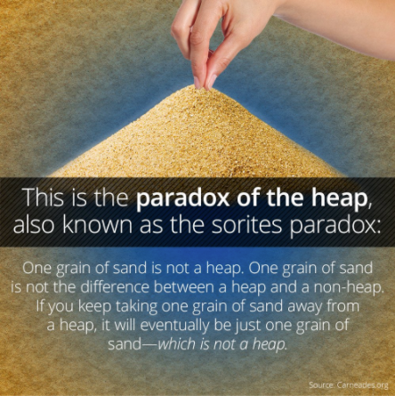
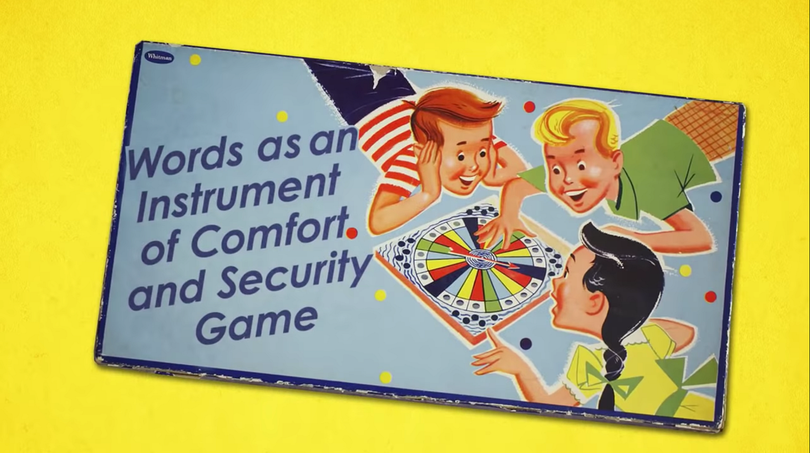
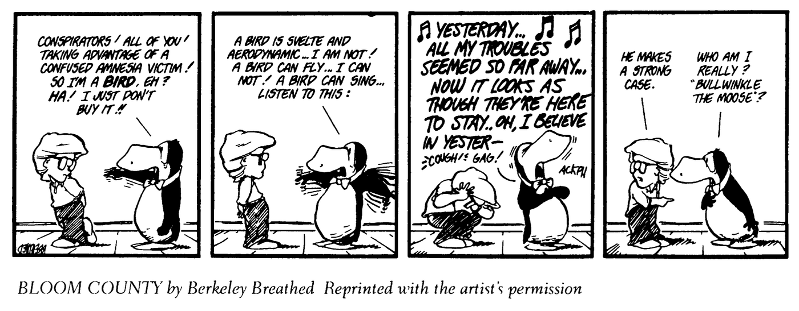
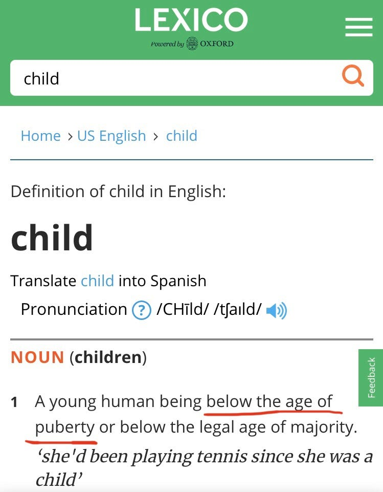
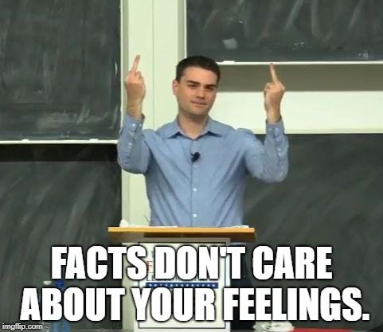

Many say we are living in the post-truth era. As I’m sure many others will point out, however, misinformation and disingenuous persuasion methods have always existed. Still, with the rise of social media, it is a growing concern that we are living a particularly worrying wave of post-truthness, one with an unprecedented scale and full of its own new particularities. People are not just tricked into believing falsities anymore, they no longer care about what’s true or false as long as it supports their narratives and hashtags. But can we draw a sharp boundary between smart, rational, objective people, and crazy, fact-denying post-truthers? Or do we all use non-factual language to some extent? What are we really doing when we say things like “meat is murder” or “all lives matter”?

---

## Important concepts

Before we dive into some real-world examples of how language is used, it is important to briefly go through a few important concepts from the history of the philosophy of language.

### Fuzzy categories

Eubulides of Miletus is known in philosophy for introducing what are today called “[sorites paradoxes](https://en.wikipedia.org/wiki/Sorites_paradox)”. A sorites paradox (from the Greek *sôritês*, meaning *heap*), is a paradox that arises from vague definitions. If you remove one grain of sand from a heap, you don’t turn it into a non-heap. Therefore, you can remove any number of grains from a heap and it will never turn into a non-heap, even when there is only one grain left. But nobody calls one grain of sand a heap.

Most people would probably agree, if asked, that humans are prone to black-and-white thinking, and that this is bad. But few of us actually make as constant conscious effort to avoid this tendency of ours in our daily lives. Our tribal brains are quick to label people as belonging either to our team of that of the enemy, for example, and it’s hard to accept that there are many possibilities in between.

Throughout most of the history of philosophy, systems of logic have been mainly bivalent. That is, they considered that propositions could only have two truth-values: true or false. In 1965, however, Lotfi A. Zadeh challenged this paradigm with the publication of *Fuzzy sets*, according to which a “fuzzy set is a class of objects with a continuum of grades of membership”. In this system, therefore, when somebody asks “does item A belong to set S?”, instead of having to answer 0 (no) or 1 (yes), the answer may be any real number within this interval (e.g. 0.34 or 0.93). When we make an effort to always remember that the answer to a question can have many values between “yes” and “no”, it becomes increasingly obvious that very few categories in real life are actually sharp. Most of them are quite fuzzy.

### Language-games

> Here the term “language-game” is meant to bring into prominence the fact that the speaking of language is part of an activity, or of a form of life.
>
> – [Wittgenstein, 1953](https://en.wikipedia.org/wiki/Philosophical_Investigations)

Before Wittgenstein’s *Philosophical Investigations*, philosophy of language tended to focus primarily on language as a tool for describing facts about reality and the logical relationships between them. Frege, Russell and the young Wittgenstein were the main forces behind what’s today called [ideal language philosophy](https://en.wikipedia.org/wiki/Ideal_language_philosophy), a movement that tried to create a perfect, “ideal” philosophical language, which should be rigorous and free of ambiguities, which they believed were the source of most disagreement. In his early work, Wittgenstein even compared [language to pictures](https://en.wikipedia.org/wiki/Picture_theory_of_language), claiming that both are tools for creating representations of the world. This approach to philosophy was largely responsible for the development of modern symbolic logic and, [according to Scott Soames](https://books.google.ro/books?id=fLSYDwAAQBAJ&lpg=PA407&vq=chapter%206&pg=PA113#v=onepage&q&f=false), subsequently influenced the work of Gödel and Turing, which set the foundations of the digital revolution.

*[PHILOSOPHY — Ludwig Wittgenstein (The School of Life)](https://www.youtube.com/watch?v=pQ33gAyhg2c)*

Although making a perfect descriptive language proved to be a rather fruitful enterprise, natural language does much more than describe reality. After a short philosophical hiatus, this started to become increasingly obvious for Wittgenstein. He realized that too much of what we do with language is not descriptive, and that any theory of meaning must account for that. In *Philosophical Investigations*, he invites us to think of language as a tool used to achieve a purpose in a game. His main example is that of a “builders language game”, which consists of nothing but the words “block”, “pillar”, “slab”, and “beam”. The builders could be immigrants with no common language, and they might not even know what these words really mean in the standard English language, but if they know *what to do* when they hear each word, and they can function as builders, then those words are meaningful for them in that language game. A more everyday example Wittgenstein gives of how words extract the meaning from their contexts is exclamations, such as “Water!” which can mean radically different things in different contexts (e.g. “Bring water fast or he will die!”, or “Stop the car now or we’ll get stuck!”). The important revelation is that utterances have *intentions* that may include describing reality but are in no way limited to it.

> If a parent says to a frightened child: “Don’t worry — everything’s gonna to be fine”, they can’t know it really will be fine. They aren’t playing the “Rational Prediction From Available Facts” game. They’re playing another game: the “Words as an Instrument of Comfort and Security” game.
>
> – [Alain de Botton, 2015](https://www.youtube.com/watch?v=pQ33gAyhg2c)

### Family-resemblance

While discussing language-games, Wittgenstein defends himself against the criticism that he is not properly defining the term. What are the necessary and sufficient conditions that an activity must have in order to be called a language-game? This is when he introduces the second of the two most famous concepts of his work: family-resemblance.

> Consider for example the proceedings that we call “games”. I mean board-games, card-games, ball-games, Olympic games, and so on. What is common to them all? — Don’t say: “There must be something common, or they would not be called ‘games’ “ — but look and see whether there is anything common to all. — For if you look at them you will not see something that is common to all, but similarities, relationships, and a whole series of them at that.
>
> – Wittgenstein, 1953

According to this view, different games are likes different members of a family. Alice may look nothing like her cousin Jack, but her brother Bob may look a lot like Jack’s sister, Jill. When you look at Alice and Jack alone, it may seem like they have nothing in common, and yet when you look at Jill and Bob, if you know all their degrees of relatedness, it becomes clear that Alice and Jack must belong to the same family.

Many people have tried to define “game” since then, and perhaps some definitions may seem quite satisfactory. But we’ve all struggled to define a term before. I personally think a good example is religion. Many people seem to have a tendency to subconsciously assume that all terms have a definitive, authoritative, academic, prescriptive definition. But this is just not the case. This is not how language works. The word “religion” was not invented by academics. Rather, it is constantly *appropriated* by academics who each try to come up with their own working definition that fits the everyday usage close enough to be accepted, and which is precise enough for the purposes of their work. Some may then try to impose that new definition on people, masking their prescriptive nature and portraying them as descriptive fact, but academics don’t own language. A language community collectively owns the language.

This shift in paradigm led to what came to be referred to as [ordinary language philosophy](https://en.wikipedia.org/wiki/Ordinary_language_philosophy). According to this new approach, when answering a philosophical question, philosophers shouldn’t proceed by taking the expressions present in that question, redefining them in their own terms, transforming them into technical jargon with their own particular meaning, removed from everyday language, and then provide an answer using this new terminology. Such an answer would no longer be an answer to the original question, but an answer to a new made up question that only philosophers understand.

> When philosophers use a word — “knowledge,” “being,” “object,” “I,” “proposition,” “name” — and try to grasp the essence of the thing, one must always ask oneself: is the word ever actually used in this way in the language-game which is its original home? — What we do is to bring words back from their metaphysical to their everyday use.
>
> – Wittgenstein, 1953

### Prototype theory

Influenced by Wittgenstein’s concept of family-resemblance, cognitive scientists developed prototype theory, the study of a type of categorization which is believed to be implemented by our brains in which certain members are more central or “prototypical” than others, which are more “peripheral”. These fuzzy, Wittgensteinian categories are contrasted with “classical” or “Aristotelian” categories.

> The psychologists Sharon Armstrong and Henry and Lila Gleitman replicated Rosch’s experiments using the most classical, Aristotelian categories they could find, “odd number” and “woman.” The subjects rated “7” as an excellent example of an odd number, and “447” as not such a good example; they thought that a “housewife” was an excellent example of a woman, and a “policewoman” not such a great example. The same gradations emerged in their real-time mental processes: They pushed an “odd number” button more quickly when “3” flashed on the screen than when “2,643” did.
>
> – Pinker, 1999

This is not to say that words with clear meanings or categories with sharp boundaries don’t exist at all (e.g. triangles, grandmothers and odd numbers) and that trying to clarify vague terms is an utter waste of time. But acknowledging that in many cases absolute precision is unattainable should make the process of clarification much less frustrating, more informed and therefore more fruitful.

> Regular and irregular [verb] forms coexist but require different computational mechanisms [in the brain]: symbol combination for regular forms, associative memory for irregular forms. The same may be true for classical and family resemblance categories.
> – [Pinker, 1999](https://en.wikipedia.org/wiki/Words_and_Rules)

*Comic extracted from Pinker, 1999*

Family-resemblance categories are more complex than simple fuzzy categories because on top of being fuzzy they’re multidimensional. The boundary between bald and non-bald may be fuzzy but it is unidimensional: the only thing that makes you more or less bald is number of hairs. “Birdiness”, however, is much more complex. There are many aspects that might make an animal more or less bird-like: “featheriness”, “beakiness”, “capacity to fly”, etc. And it’s not clear what the “minimum requirements” are for each of these characteristics in order for us to consider an animal a bird. When we look at animals today it might seem that all birds have a common essence, and that the simple definitions from our high school biology class capture them well enough. But start trying to define what the first bird was in the history of animal evolution and you realize things are more complicated than they seemed.

### Speech acts

Once we start seeing language as a tool used to play different games, it becomes natural to ask: what types of games are people playing out there? In his lecture series posthumously published as *How To Do Things With Words*, J. L. Austin introduces the concept of a “performative utterance” or “speech act”, a sentence that does not describe or “constate” any fact, but performs an action. His examples include:

- “I do (take this woman to be my lawful wedded wife)” — as uttered in the course of the marriage ceremony.
- “I name this ship the Queen Elizabeth” — as uttered when smashing the bottle against the stem.
- “I give and bequeath my watch to my brother” — as occurring in a will.
- “I bet you sixpence it will rain tomorrow”

Austin draws a distinction between several aspects of an utterance:

- **Locutionary meaning** — the literal, *factual meaning* of that statement. When interpreted as such, a statement may be true or false.
- **Illocutionary force** — the *performative aspect* of an utterance. An illocutionary act doesn’t have a truth dimension, but it can be *felicitous* or *infelicitous* (i.e. successful or unsuccessful).
- **Perlocutionary effect** — the *effect* of that speech act (e.g. somebody passing you the salt after you ask for it).

Austin mentions several types of speech acts throughout his lectures, including “orders”, “warnings”, “apologies”, “promises”, etc. He groups many of these types under broader categories, but he is not rigid about his categorization, which is pretty *ad hoc*, and isn’t the focus of his analysis. In *A Taxonomy Of Illocutionary* acts, however, Searle takes the role of a proper taxonomist and goes on an expedition aiming to categorize the main types of speech acts that can be found in the wild. He comes back with the following list:

- **Assertives** commit the speaker to the truth of the expressed proposition (e.g. “I am home now.”)
- **Directives** intend to cause the hearer to take a particular action (e.g. “Can you pass me the salt?”)
- **Commissives** commit the speaker to some future action (e.g. “I promise I’ll stop smoking.”)
- **Expressives** express the speaker’s attitudes and emotions towards the proposition (e.g. “Congratulations!”)
- **Declarations** change the reality in accord with the proposition of the declaration (e.g. “I now solemnly declare you husband and wife.”)

Searle seems to present his categorization as final and comprehensive. But as in most things in philosophy, this is a highly contested claim. I for one tend to disagree that it is even possible to ever have a final, comprehensive list of speech act categories. Speech act categories are *created* by us, not discovered. Different categories may be created *ad hoc* as long as they’re *useful*.

## Applying the philosophy of language

There are many more interesting concepts in the philosophy of language, but this should be enough for a start. As I apply them to contemporary, real political discussions, I will introduce additional ones as needed. Let’s start with a fallacy that will serve as a basis for defining other fallacies, then we can proceed to some of the slogans in the article’s featured image.

### Descriptive fallacy

Austin was an active philosopher during the decline of an important movement in philosophy called logical positivism. Logical positivists liked to dismiss entire swathes of philosophy as meaningless if they didn’t pass the verification test, which maintained that in order for a statement to be considered meaningful, its truth value had to be empirically verifiable. This was a reaction to previous philosophical movements (mainly [idealism](https://www.youtube.com/watch?v=ehxSIKa9MjE)) that according to them seemed to deal mostly with obscure, unverifiable, mystical nonsense. Something like a 19th century version of [Deepak Chopra](https://qz.com/917820/we-asked-deepak-chopra-the-guru-of-sayings-that-mean-nothing-to-fact-check-his-own-tweets/)’s work or, as [Chomsky would argue](https://www.youtube.com/watch?v=AVBOtxCfan0), even some of Žižek’s. By the mid 1950’s, however, it started to become increasingly accepted that, although logical positivism had done, in Austin’s own words, “a great deal of good”, it had gone a bit too far.

In his lectures about performative utterances, Austin introduces what he calls the *descriptive fallacy*. This fallacy is committed when somebody interprets a performative utterance as merely descriptive, subsequently dismissing it as false or nonsense when in fact it has a very important role, it’s just that this role is not simply stating facts. If somebody goes on vacation after a stressful period at work and, as they finally lie on their beach chair in their favorite resort with their favorite cocktail in their hands, they say “life is good”, it would be absurd to say “this statement is meaningless because it cannot be empirically verified”. Clearly it is an expression of a state of mind that doesn’t really have a factual dimension at all.

What’s important to emphasize here, however, is that those who attack speech acts as false or meaningless are as guilty as the descriptive fallacy as those who defend their performative utterances on factual grounds, which is regrettably common. People are not usually aware that, besides labelling a statement as “true” or “false”, they can also label it as “purely performative, lacking factual content”. The performative nature of language is not something people are explicitly aware of in general. As a consequence, when a statement is phrased as factual but is confusing and hard to grasp as factually true, our intuitive reaction is to label it as false. On the other hand, if a statement becomes part of our identity as consequence of being used as the slogan of a movement we strongly support, we feel tempted to defend it as factually true even though it might be quite plainly false or factually meaningless.

### Appeal to negative connotation

As I’ve argued, although the coinage of the description fallacy was a reaction to the strict verificationism of the logical positivists, it can easily be applied to the reverse situation as well. It is not only the people who hear the utterances who can commit the fallacy, but those who utter them as well. The slogan “abortion is murder” is a perfect example of it. It is a fallacy that I like to call “appeal to negative connotation”. The rationalist blogger Scott Alexander describes a similar fallacy which he calls the “[non-central fallacy](https://www.lesswrong.com/posts/yCWPkLi8wJvewPbEp/the-noncentral-fallacy-the-worst-argument-in-the-world)”, but I think my label is more self-explanatory. In this type of fallacy, a statement is made as if it’s a statement of fact, when in fact it is more performative than factual. When somebody says “abortion is murder” they are not only making a dispassionate statement of fact. They are making a moral judgement. The problem is that, regrettably often, they themselves don’t realize it. Language is largely performative by nature, but it requires directed intellectual effort to become aware of it. Most people haven’t done this work.

It is common to phrase an accusation as a statement of fact (e.g. “abortion is murder”), then to have somebody object to your accusation pointing out to how it’s factually inaccurate (an instance of the descriptive fallacy), and then for you to defend yourself by defending the factual validity of your initial statement (another instance of the descriptive fallacy). Wittgenstein thought many of the debates in philosophy were a result of misusing language. I believe many arguments in life are a result of not understanding how we ourselves use language. And these misunderstandings plague everything, from our most intimate interpersonal relationships to our public political arguments.

Abortion is not murder literally. Murder is a legal term that applies to intentional, premeditated killing of a [natural person](https://en.wikipedia.org/wiki/Natural_person). Abortion may be fairly described as killing, but that is a technicality. Killing in self-defense and lawful execution of death-row convicts are also killing, and so is stepping on cockroaches for that matter. But you don’t see pro-lifers defending those lives. When anti-abortion activists say “abortion is murder”, they are appealing to the negative connotation of the word “murder”. When we hear the word “murder”, our associative memory is activated and we think of prototypical images of murders. These are nasty, bloody, and invoke archetypal narratives involving an evil villain butchering a helpless victim. Abortion, a peripheral or non-central example (hence Scott’s label “non-central fallacy”) is thereby associated to an imagery that is prompted by a prototypical example (an adult killing another violently against their will). This whole mental process may trigger some people to see abortion as immoral, and that is the intention (fully conscious or not) of pro-lifers.

An analogous case can be made about “meat is murder”. Legally, killing an animal is not murder. Perhaps what vegans mean is that killing animals is as immoral as murdering a human, which would be a rather strong statement, but at least it would be debatable. Unfortunately, however, that hashtag would be too long. “Taxation is theft” is the same. If “theft” is defined so broadly as “taking another’s property against their consent”, then taking back a stolen good by force is also theft, and so is forcing people to pay for damaging your property or fining people for breaking laws.

“Dairy is rape” is a similar example. If inserting a device into an animal’s vagina without their explicit consent is rape, then cervical screening of babies and artificial insemination of protected species are also rape. Of course nobody is opposing these things. One could say “but that is done with their best interest in mind, while the insemination of dairy cows is not”, and fair enough, that’s a valid argument you could use to defend that dairy is *immoral* while the other activities are not. But it is *not* an argument to defend that dairy is more *rape* than the other activities. None of them are rape. The definition of rape, both the coloquial and the legal ones, doesn’t say anything about best interest. If you rape a woman because a crazy psychopath pointed a gun to your head and said if you didn’t do it he’d do it himself in a much more violent and painful way, you’d have her best interest in mind while raping her but it would still be rape. I could give more examples, but you get the point. The bottom line is, whether something is or isn’t called rape, murder, theft, etc, is morally irrelevant. The morally relevant question is: does this activity cause avoidable suffering? Is there a better alternative?

### The “sloganification” of language

I try to be forgiving when defenders of a cause I support commit the fallacy of appeal to negative connotation. But I can’t just turn a blind eye and condone this attitude as if there was no problem with it. This type of accusatory communication strategy is one of the reasons why I believe our society is so politically polarized. In the age of hashtag activism, everything is a slogan. It is becoming increasingly difficult to use factual language. Brazilian columnist Juliana Borges recently [posted on Instagram](https://www.instagram.com/p/CBDmTkapd5u/) that “the claim that black people commit more crimes and are more dangerous than whites is RACISM”. But it is factually true that blacks commit more violent crimes than whites [in the US](https://open.lib.umn.edu/socialproblems/chapter/8-3-who-commits-crime/), where even though they compose [13% of the population](https://www.pewresearch.org/fact-tank/2018/02/22/5-facts-about-blacks-in-the-u-s/#:~:text=More%20than%2040%20million%20blacks,to%202016%20Census%20Bureau%20estimates.) they are responsible for [over 50% of murders](https://ucr.fbi.gov/crime-in-the-u.s/2015/crime-in-the-u.s.-2015/offenses-known-to-law-enforcement/expanded-homicide), and it also seems to be [true in Brazil](https://temas.folha.uol.com.br/e-agora-brasil-seguranca-publica/criminalidade/homens-negros-e-jovens-sao-os-que-mais-morrem-e-os-que-mais-matam.shtml), even though the boundary between black and white is much fuzzier and the data much more scarce in the latter country.

Could it be racist to simply state facts? For many, the answer is obvious: of course not. And when they are accused of racism for stating facts, they are outraged. I sympathize with these people, and I also feel wronged when I’m accused of bigotry for simply stating facts. But as a pragmatist, instead of striking back and accusing the other person of being a crazy irrational “leftard”, I try to understand what they hear when I state those facts. And what I believe they hear is: “I’m not on your team, I don’t support your cause”. That is, in Austin terms, the perlocutionary force (the effect) of my utterance. This is, I believe, the reason why people [get fired](https://wwos.nine.com.au/news/nba-announcer-fired-over-controversial-all-lives-matter-tweet/a9a50198-4b52-4cb7-a800-e0ffacb3302d) for saying things that seem so innocuous at face value such as “all lives matter”. Of course all lives matter. Most BLM activists agree with that. But to say this in the midst of a racial crisis is considered by many an act of “defiance against the forces of good”. An act that they think must be punished. There is much to be said about language and racism, but this is a discussion for a dedicated article.

Sometimes I believe this is not only how statements are perceived, but to some extent also how they are intended. [Virtue signalling](https://www.youtube.com/watch?v=a4d2eQ7fVzc) is something we all do, regardless of our politics. “Dark web intellectual” types may want to show how rational and centrist they are and how they’re not afraid of stating plain facts, which might prompt them to be gratuitously tactless and say truths that are totally uncalled for in that context and therefore acquire a discriminatory connotation in the eyes of many. On the other hand, radical leftists who want to show how woke they are can be misled into believing certain falsehoods just because the idea of disagreeing with it conjures up unpleasant prototypical examples of people who disagree with it, such as right-wing conservatives, and since they don’t want to associate with them, they assume that falsehood must be true. However, as [I have argued before](https://medium.com/humanist-voices/what-should-we-believe-b689a8bba4a3), our inability to tell fact from fiction is costly. And I would dare say that it is more detrimental to progressives than conservatives, because as a progressive I truly believe the facts are on our side.

Language is complex. A statement can always be interpreted in many ways. In the age of social media, where a tweet can be read by millions of people, it is always possible that *somebody* will read a malicious insinuation into an genuinely well intended comment. Because of this, it is often helpful to say what you don’t mean. Of course, no matter how much effort we make, somebody might always attack us. This is a reality we have to simply come to terms with. But it doesn’t mean we shouldn’t try.

When I say black people commit more violent crimes than whites, for example, I’m not saying that “it is no surprise the police is harsher on them, they had it coming”, as some might read it. I simply mean this is a fact we shouldn’t lie about if we want to improve the world. After all, to improve the world we must first be able to agree that the current situation is bad, and we cannot do that without first agreeing on what the current situation is. Only after we share an understanding of how and in what ways the current situation is bad can we start working to effectively improve it.

Black communities have been historically oppressed, marginalized and deprived of basic services such as health, education and safety for centuries. It would be a miracle if the level of violence in these communities wasn’t higher than in privileged and wealthy white communities. People who find it racist to acknowledge these facts seem to assume that the only cause of violence is an innate violent essence. That is simply not true. There is a plethora of factors that contribute to violent behavior. Innate biological predispositions are just a small fraction of them, and there is no evidence that these innate traits are more common in one race than another. There’s [plenty of evidence](https://open.lib.umn.edu/socialproblems/chapter/8-3-who-commits-crime/), however, that the social conditions under which most people of color are raised are conducive to violent behavior.

Although I firmly support factual language, we simply cannot reasonably expect everybody to become emotionless robots overnight. As much as I may try to practice what I preach I cannot say I always succeed (or even mostly succeed). Many times I get angry and say something passive-aggressive. I am human. But even though I agree that it is my responsibility to try to make myself understood, it is also the responsibility of everybody else to make themselves understood, and the first step is to understand what they are actually trying to express when they use these slogans, and then trying to convey it in more precise language instead of falling victim to the descriptive fallacy and appealing to the most convoluted arguments to insist that “dairy really is rape” or “abortion really is murder”.

[WEAVE](https://www.weaveinc.org/) recently posted the following image on social media:

*There’s no such thing [as an underage woman]. An “underage woman” is a child! [There is no such thing as a child prostitute.] Children can’t consent. They are “rape victims” or “sexual assault survivors”. [There is no such thing as sex with minor.] It’s rape. Call it rape. [Non-consensual sex is] RAPE. Rapists don’t deserve politeness and victims deserve validation for what they’ve been through.*

This is a perfect example of performative language posing as factual. Nobody refers to a 17 year old as a child in ordinary language unless they’re trying to be condescending towards them. The legal system doesn’t own language, and journalists write for the general population, not legal professionals. It may be true in some jurisdictions that a child is anybody below 18 years old, but nobody thinks of a 17 year old when they hear the word “child”. A prototypical example of a child is somebody below the age of 13, as a Google image search will reveal.

*Lexico Dictionary (Powered by Oxford) [child] 1. A young human being below the age of puberty or below the legal age of majority.*

Children can’t consent? Well, legally people below the age of consent cannot consent by definition. But should we all speak legalese now? What good would it do for us to abandon the nuance of natural language in favor of the sharp boundaries of legal vocabulary? Even if we assume (for the sake of the argument) that it is immoral for a 30 year old man to have sex with a willing 16 year old girl (which is [perfectly legal in virtually all of Europe](https://en.wikipedia.org/wiki/Ages_of_consent_in_Europe)), it would be absurd to suggest that this is exactly as bad as raping a 16 year old girl who is resisting. Natural language allows us to make this distinction. Again, calling something “rape” doesn’t make it more immoral. What makes one act more immoral than another is its tendency to produce more avoidable and pointless suffering.

Now you may say “but people need to be more aware that consent is important and that child abuse is bad”. Well, sure. But is this really the most effective way? By making factually false claims? Progressives are the first to point out when conservatives weaponize language in their favor. Isn’t it hypocritical to do the same when it serves us? All political debates boil down to moral values, and morality is complicated. Debating constructively about ethics requires nuance. Pretending things are simple when they are not doesn’t do us any good.

### Empathizers vs. systemizers

> According to one of the leading autism researchers, Simon Baron-Cohen, there are in fact two spectra, two dimensions on which we can place each person: empathizing and systemizing. Empathizing is “the drive to identify another person’s emotions and thoughts, and to respond to these with an appropriate emotion.” If you prefer fiction to nonfiction, or if you often enjoy conversations about people you don’t know, you are probably above average on empathizing. Systemizing is “the drive to analyse the variables in a system, to derive the underlying rules that govern the behaviour of the system.” If you are good at reading maps and instruction manuals, or if you enjoy figuring out how machines work, you are probably above average on systemizing.
>
> – Haidt, 2012

We all know the stereotype that some people are more emotional, artsy, empathetic, sociable, intense, while others are cold, rational, mathematical, nerdy, systematic, introverted, etc. Obviously humans are complex and nobody fits perfectly in one stereotype or another, but still they are very recognizable to most of us. Typically the first cluster of characteristics is associated to women, while the second is associated to men. Whether this gender difference is more strongly determined by nurture or nature is a controversial debate that’s out of the scope of this article, but that today these traits are distributed unevenly between the genders is, I would say, quite uncontroversial.

As a straight cis male with a degree in computer engineering who used to be called “autistic” in high school and now studies analytic rather than continental philosophy, I think it’s no mystery where in that spectrum I fit. While for some the philosophy of performative language may seem like overanalyzing something obvious that they’re always known, for people like me having a theoretical framework to make sense of what people say can be extremely helpful. However, I wouldn’t be too quick to assume that empathizers are innately better in communicating. As Paul Bloom argues in *Against Empathy: The Case for Rational Compassion*, although empathy can make us feel compassion, it can also make us feel anger and other negative emotions more intensely.

In the rationalist/atheist community many progressives feel alienated from the progressive community because even though our values are mostly aligned, we simply cannot state simple truths without having people bombard us with accusations of bigotry. This is illustrated perfectly by Richard Dawkins’ infamous tweets comparing different instances of rape.

[https://twitter.com/RichardDawkins/status/494012678432894976](https://twitter.com/RichardDawkins/status/494012678432894976)

Since I started studying the philosophy a language a bit more deeply, it started to become increasingly clear to me that some people are more performative in their use of language while others are more factual. It can be hard, believe me, for a systemizer to understand that a simple statement of fact can trigger such rage in other people because of the way they perceive that statement as a political act. This is not a moment in history in which progressives can afford to be fragmented like this. We need to stop accusing each other and learn to communicate nonviolently. So how can we do this?

### Communicating better

Marshall Rosenberg has many useful things to say about nonviolent communication, and I think anybody who gets involved in political debates should learn [his techniques](https://www.youtube.com/watch?v=8sjA90hvnQ0). Here, however, I am interested in solving a particular philosophical problem: mistaking performative language for factual and vice versa. When somebody says something like “blacks commit more crimes than whites” and your mind is filled with rage and an urge to call them racist, stop for a second and ask yourself: what if it is true? Would it make it racist to say it? Isn’t it perhaps *the way* or *the context* in which they said it that made you feel they implied something racist? If that is the case, then instead of desperately grasping for arguments to defend the opposite factual claim, namely that blacks do not commit more crimes than whites, you can actually criticize them for stating that fact in an inappropriate context that implies something immoral, or for expressing themselves in an unnecessarily provocative tone that is not conducive to civilized debate. Sometimes the rage is justified. We just fail to see that what triggered it was the tone or the implication and not the factual statement itself. It is of fundamental importance for us to train ourselves to become aware of this, or public debate will deteriorate to the point that conversation won’t be a tool we can use anymore and violence will be the only thing we can resort to.

But what if we’re the ones who make a dispassionate statement of fact and are bombarded with accusations? It would be very easy to say “facts don’t care about your feelings”, but what is our goal here? Do we want to live in a world in which people can work together for a better future? Or is it more important to insult people out of sheer retribution?

When logical positivists labelled a statement as unverifiable, they immediately dismissed it as meaningless nonsense, uninteresting to philosophy. However, they failed to see that the people uttering those statements were simply playing another language-game. Now that we know about language-games and the performative nature of language, when somebody says something that is blatantly false in a factual sense, we should first ask ourselves if they’re really playing the “assertion of facts game”. Most often, they’re not, so it would be pointless to attack the factual accuracy of their statement. I believe it is more constructive to try to make them aware of the performative nature of their own utterance. This can often be done by trying to “translate” the performative utterance, with their help, to an empirical one. Here, the method of verification comes in handy.

Recently a very “woke” friend accused me of being “condescending” on a Facebook thread. What does this mean? How can we verify if this is true or not? Well, it depends on what it means. If what is meant is that “I feel patronized”, then it has already been verified by direct experience (or as Russell would say, [by acquaintance](https://en.wikipedia.org/wiki/Knowledge_by_acquaintance)). If what is being meant is that “I believe most people in our culture would feel patronized if you talked to them like that”, then we’d have to do a survey to check if this is really the case. Needless to say, it is often infeasible to actually try and verify a statement in practice. But imagining how we could potentially do it in theory help us clarify what we actually meant by saying it. If our interlocutor rejects the above interpretations, and says instead that we are being condescending in some objective, absolute sense, for example, then indeed this is not verifiable and I don’t know what it means. I can only interpret it as a purely performative “fuck you” masked with pseudo-factual language.

But it is important to note that it is not only “irrationally woke” people who get confused about their own use of language. We all do. Almost all language has a performative dimension to *some* extent. Even the most banal example, like “that guy is dumb” turns out not to be really purely factual if you think of how it’s actually used. People never call somebody they truly like “dumb”, no matter how intellectually limited they may be. Sure, it’s not exactly flattering to be called either “dumb” or “intellectually limited”, but anybody who is not a complete sociopath understands that this “political correctness” or “politeness” is something we do naturally when we care about people. When we say somebody is “dumb” or “stupid”, that’s not a pure statement of fact. It is an attack.

Many people who pose as calm, rational, and committed to facts, are in fact quite performative in their use of language. Ben Shapiro is perhaps the best example. Insisting to refer to a trans woman as a man is not a commitment to facts, it is a refusal to comply with what they’re asking for. The way I see it, it is a defensive reaction by somebody who feels bullied by the trans community. Indeed, some people in the LGBT+ community can be quite aggressive in their communication style, prompting the more sensitive among us to react defensively. Nobody likes to do things because they’re forced to. But instead of admitting this, Ben prefers to clothe his discourse in pseudo-factual language, appealing to scientific notions of biological sex, which in turn prompts some radical progressives to reject the science of sex, which is [problematic](https://quillette.com/2020/06/07/jk-rowling-is-right-sex-is-real-and-it-is-not-a-spectrum/) and unnecessary. But to suggest that day-to-day language should be replaced with scientific terminology is as wrong as suggesting that it should be replaced with legal language. A language is a living organism, it can change and adapt to new situations. If we agree that “man” refers to people who conform to a certain stereotype of masculine behavior closely enough, then that’s what the word “man” will mean.

Of course, certain linguistic changes are hard. If we want “man” to mean “anybody who says they identify as a man”, the gap between this use and the current use of the word is so great that it might be unsurmountable. It may not be impossible, but it is extremely hard to artificially engineer natural language to conform to our ideological preferences. If Jason Momoa said that from now on he wants to be called a woman (without changing his looks), it would be hard for most of us to conform. But if overnight we somehow managed to convince the world to use language like this, then it would be meaningless to say “people may call him a woman but he is *really* a man”. This would be like saying “people may not call that 16 year old a child but she *is* a child” or asking “everybody calls this a table, but is it *really* a table? Or is it just the name we use for it?”.

This type of thinking is [essentialistic](https://www.youtube.com/watch?v=83XFWnUK1nQ) and metaphysical. It is an instance of [metaphorical thinking](https://en.wikipedia.org/wiki/Conceptual_metaphor) gone too far. A table doesn’t have a little table soul inside it that will stay there even if we stop calling it a table. Male, female, child, and table are not [natural kinds](https://www.youtube.com/watch?v=bWj15Utv3os). A biological man isn’t born with an immutable male gender essence inside him. He may change the gender he displays at any point in his life and if our language changes to accommodate that, we have no basis to say “but he is *really* a man”, unless we specify that we mean “biologically male”, which may or may not be something relevant to point out.

Another relevant concept worth pointing out is the Gricean [cooperative principle](https://en.wikipedia.org/wiki/Cooperative_principle). Paul Grice was a philosopher who studied the pragmatics of language. According to him, when we engage in successful communication, we respect four conversational maxims:

1. **The maxim of quality** — we say what we genuinely believe is true based on adequate evidence.
2. **The maxim of quantity** — we make our contribution as informative as possible, but only as informative as it is required for the purpose of the exchange.
3. **Maxim of relation/relevance** — we don’t say things that are completely irrelevant (although Grice acknowledges that in informal conversations this maxim is frequently violated in the process of changing subjects).
4. **Maxim of manner** — we speak clearly and succinctly, avoiding obscure or vague terms and unnecessary prolixity.

If you’re talking to a doctor who needs to know certain information about the patient, it may be perfectly reasonable to mention their biological sex. To withhold relevant information would be a violation of the principle of quantity. If you’re not playing the medicine game, however, then by reminding a trans person that their biological sex doesn’t correspond to their gender identity you’re violating the maxim of relevance and essentially being a transphobic prick.

## Conclusion

We tend to live our lives based on the background assumption that language is a tool to assert facts, and that this is the language game we’re playing when we debate controversial political issues. However, language is often performative. We conspicuously display loyalty to our tribe and perceive others as displaying hostility towards ours. We are often not conscious of this because we are emotional, impulsive, retributive, we lack self-awareness and the relevant conceptual tools to better understand our own use of language. This is normal, as humans, we are all victims of the [introspection illusion](https://en.wikipedia.org/wiki/Introspection_illusion), often assuming we know why we do what we do when deep down we really don’t. It is possible, however, to use language more effectively if we understand ourselves better. I hope in this article I have managed to introduce useful and insightful ideas that can help us communicate more effectively and work cooperatively towards a less polarized world in which there’s less pointless suffering and more joy and justice.
