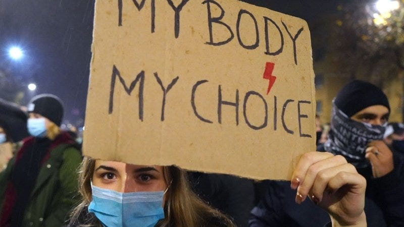
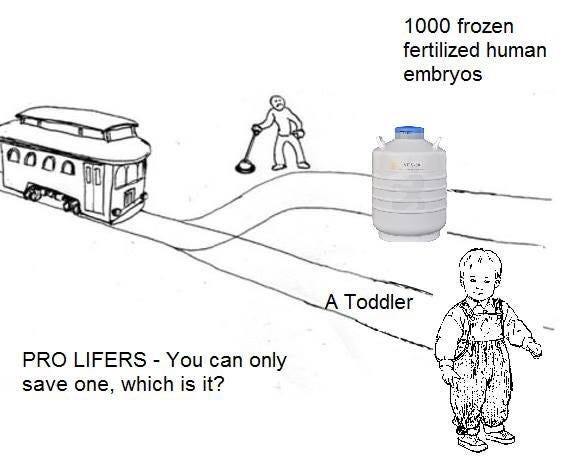

ℹ️ *This article was significantly edited after it was criticized in a [Romanian publication](https://trepanatsii.ro/barbat-pe-internet-ne-explica-ce-e-cu-dreptul-la-avort/). The original contains language that some may find insensitive but it can be read [here](https://docs.google.com/document/d/1ODax4vpTe1vD_F4XwEWpPoUNF4mxgnj_4V3IZnkDlLY/edit?usp=sharing).*

*Source: [https://www.rte.ie/news/world/2020/1023/1173595-poland-abortion-protest/](https://www.rte.ie/news/world/2020/1023/1173595-poland-abortion-protest/)*

Abortion should be legal. It is harmful to make it illegal. But is that because women have a natural right to do whatever they want with their bodies? Not exactly. In this article I will explain why this is a problematic argument, and part of the reason we fail to make progress on the abortion debate. Arguments matter. Sure, people are emotional and some are so blinded by their religion that they will not be persuaded by any arguments. But in any debate, there will always be persuadables. If we manage to spread a pro-choice narrative that appeals to universal moral intuitions rather than to the gut feelings of certain political groups or religious confessions, we might have a chance to make that narrative viral and persuade a critical mass of people. So what is the reason abortion should be legal?

---

## Beyond gut-feeling morality

Are there good and bad ways of finding answers to moral questions? Surely, if somebody finds their answers to moral questions by tossing a coin, that cannot be a very reliable method of finding answers to any question. What if somebody gives answers to moral questions based on gut feeling? They hear a moral question, some emotional reaction is triggered in them, certain associations are made in their minds, and depending on whether those images and associations are positive or negative, they call something moral or immoral. Does that sound like a valid method?

If I ask somebody, for example, if rubbing excrement on your skin is immoral, and based on gut feeling they say “of course, it is disgusting!”. Would that be a valid answer? Or would they be mistaking ethics for aesthetics? Aesthetics is the branch of philosophy that deals with beauty, while ethics is the branch that deals with questions of right and wrong. Aesthetics is generally agreed to be largely subjective. If somebody says pineapple on pizza is delicious, it is delicious to them, even if to me it may be an abomination. Morality doesn’t work the same way. We almost always feel that things are immoral for a reason. So what is it that makes an action moral or immoral?

> Nature has placed mankind under the governance of two sovereign masters, pain and pleasure. It is for them alone to point out what we ought to do, as well as to determine what we shall do. On the one hand the standard of right and wrong, on the other the chain of causes and effects, are fastened to their throne. They govern us in all we do, in all we say, in all we think: every effort we can make to throw off our subjection, will serve but to demonstrate and confirm it. In words a man may pretend to abjure their empire: but in reality he will remain subject to it all the while. The principle of utility recognizes this subjection, and assumes it for the foundation of that system, the object of which is to rear the fabric of felicity by the hands of reason and of law. Systems which attempt to question it, deal in sounds instead of sense, in caprice instead of reason, in darkness instead of light.
>
> — [Jeremy Bentham, 1780. An Introduction to the Principles of Morals and Legislation](https://en.wikisource.org/wiki/An_Introduction_to_the_Principles_of_Morals_and_Legislation/Chapter_I).

Everything in ethics ultimately boils down to pain and pleasure. Traditionally, this view has been labeled by philosophers as utilitarianism. This word has so much baggage, however, that I prefer to avoid it. Instead, I will simply describe my own interpretation of it here and you can call it whatever you want. In short, this moral theory states that:

> We must primarily minimize undesirable experiences and secondarily maximize desirable ones. We must do this in a pragmatic and sustainable way, recognizing the importance of intentions, rules, virtues, fairness, and of being forgiving towards ourselves and others when we prioritize the well-being of our present selves and loved ones in detriment of our future selves and strangers, as long as this favoritism isn’t too extreme.

Once we accept this basic moral framework, we basically have an algorithm that can tell whether any policy is morally acceptable or not, as long as we know the answer to the empirical question: would this policy cause more aggregate pain or pleasure overall? It is important to note here that I mean “pain” and “pleasure” in the broadest sense possible. In fact, I only use these words as shortcuts for “undesirable” or “negative” vs. “desirable” or “positive” experiences.

> The only proof capable of being given that an object is visible, is that people actually see it. The only proof that a sound is audible, is that people hear it: and so of the other sources of our experience. In like manner, I apprehend, the sole evidence it is possible to produce that anything is desirable, is that people do actually desire it. If the end which the utilitarian doctrine proposes to itself were not, in theory and in practice, acknowledged to be an end, nothing could ever convince any person that it was so. No reason can be given why the general happiness is desirable, except that each person, so far as he believes it to be attainable, desires his own happiness.
>
> — [Mill, 1879. Utilitarianism](http://www.gutenberg.org/files/11224/11224-h/11224-h.htm).

I have defended utilitarianism from the most common objections made against it in [another article](https://medium.com/humanist-voices/values-we-can-all-live-by-a3bfc9269b4). In this one I will only consider the implications that this theory has on the abortion debate.

## Implications for abortion

Does legalizing abortion contribute more to the minimization of undesirable experiences? Or does it actually increase the amount of pain in the world? First, we have to consider whose interests are in conflict. Pro-lifers focus on the fetus’ supposed interest to live, while pro-choicers focus primarily on the interests of the mother and of the rest of the family whose life is impacted by this unwanted pregnancy. So who suffers more? Let’s start by considering the suffering of mothers and their families in regions where abortion is illegal.

### Who suffers from illegal abortions

[78000 women](https://pubmed.ncbi.nlm.nih.gov/12294838/) die from unsafe abortions every year. This is [42% less](https://www.theatlantic.com/health/archive/2018/10/how-many-women-die-illegal-abortions/572638/) than in the early 90’s, due to medical advances, but still, it involves a significant amount of suffering, considering that botched abortions also lead to many non-lethal complications and that deaths cause suffering not only to those who die but to all loved ones left behind, including thousands of motherless children.

> Worldwide, some 5 million women are hospitalized each year for treatment of abortion-related complications such as hemorrhage and sepsis, and abortion-related deaths leave 220,000 children motherless. The main causes of death from unsafe abortion are hemorrhage, infection, sepsis, genital trauma, and necrotic bowel. Data on nonfatal long-term health complications are poor, but those documented include poor wound healing, infertility, consequences of internal organ injury (urinary and stool incontinence from vesicovaginal or rectovaginal fistulas), and bowel resections.
>
> — [Haddad & Nawal, 2009](https://www.ncbi.nlm.nih.gov/pmc/articles/PMC2709326/). Unsafe Abortion: Unnecessary Maternal Mortality

In countries where abortion is illegal, most women who suffer complications [are poor](https://www.reuters.com/article/us-abortion-brazil-secrets-idUSKCN0YG1GP), since women in higher income groups have access to safer procedures. In countries where abortion is legal, most people seeking abortions are also poor, many of whom are going through disruptive life events.

> More than half (57%) of the women obtaining abortions experienced a potentially disruptive event within the last year, most commonly unemployment (20%), separation from a partner (16%), falling behind on rent/mortgage (14%) and/or moving multiple times (12%). Poverty status was significantly associated with several of the events, particularly those that could directly impact on a family’s economic circumstances, for example losing a job or having a baby. Information from the in-depth interviews suggested that disruptive events interfered with contraceptive use, but the quantitative survey found no difference in contraceptive use by exposure to disruptive life events, even after controlling for poverty status.
>
> — [Jones et al, 2012](https://srh.bmj.com/content/39/1/36.full). More than poverty: disruptive events among women having abortions in the USA.

### Banning abortion doesn’t prevent them

If you’re a pro-lifer, you may be thinking: this is all terrible, but it wouldn’t happen if these women weren’t attempting to murder innocent babies. The restrictions are there to stop them from doing it. If they keep doing it anyway, their suffering is on them. Before I consider the alleged harm to the fetus that these restrictions are supposed to prevent, let’s consider the efficacy of the restrictions.

[Research has shown](https://www.businessinsider.com/anti-abortion-womens-health-effects-2016-7) that the only effect of banning abortion is driving it underground and making them less safe. The number of abortions per capita is roughly the same in most countries regardless of the legal status of abortion. The only difference is that, when it is illegal, more poor women die and suffer complications from unsafe abortions.

So even if you think abortions are inherently immoral, banning them doesn’t seem to solve the problem, which means if your goal really is decreasing the number of abortions, you should be focusing on strategies that have actually been [proven to work](https://www.businessinsider.com/anti-abortion-womens-health-effects-2016-7), such as sexual education and making contraceptives more accessible or even free to those with low incomes.

Still, even for those few who choose to carry the unwanted pregnancy to term due to the restrictions, although the more privileged ones go on to have babies who grow up to lead healthy and happy lives, you must remember the statistical fact that most people who seek abortions are poor people going through disruptive life events. Their story is not so pretty.

> Statistics show that when compared to wanted ones, unwanted children are exposed to greater risk factors, so that they more likely experience negative psychological and physical health issues and dropout of high school and tend to show delinquent behavior during adolescence. The participants of a research in Australia reported higher level of depression, anxiety and delinquency than compared with those in wanted children group thus child smoking were self-reported at 14-years.
>
> — [Yazdkhasti et al, 2015](https://www.ncbi.nlm.nih.gov/pmc/articles/PMC4449999/). Unintended Pregnancy and Its Adverse Social and Economic Consequences on Health System: A Narrative Review Article.

### Who suffers from legal abortions

In most developed countries, abortion is only legal on demand within the first 12 weeks, with some countries setting higher limits that can go up to 24 weeks. Nobody is proposing the legalization of last-minute abortion. It is only in the 25th week that EEG starts to detect the brainwaves necessary to consider a brain “alive”. It is around this period that fetal brains start to exhibit wave patterns that correspond to [sleep states](https://europepmc.org/article/med/18063233) in adults. Before the 25th week, therefore, a fetus shows no signs of sentience (the capacity to feel pleasant or unpleasant experiences).

> If a grown adult had suffered massive brain damage, reducing the brain to this level of development, the patient would be considered brain dead and a candidate for organ donation. Society has defined the point at which an inadequately functioning brain no longer deserves moral status.
>
> — [Michael Gazzaniga, 2005](https://www.nytimes.com/2005/06/19/books/chapters/the-ethical-brain.html). The Ethical Brain.

It is worth noting that the acceptance of brain death as the legal definition of death is not controversial. If the Pope was declared brain dead tomorrow, he would be declared legally dead by Vatican authorities. If a brain dead Pope is dead, then a brain dead fetus is also dead and abortion is not the killing of a baby. Period.

If you decide to broaden the definition of the word “kill” to also include preventing a being from becoming alive, that’s fine. It’s just words at the end of the day, and using one word or another to describe an action doesn’t make that action more or less moral. If preventing a fetus from becoming alive is, by your definition, killing, then there is nothing wrong with killing fetuses.

### Natural rights don’t exist

When a pro-lifer says “a fetus has a right to life” and a pro-choicer replies “I have the right to choose”, what are they saying? The only way I can interpret these sentences meaningfully is if I assume them to mean that a fetus *should* have the legal right to life or that women *should* have the legal right to choose whether to terminate a pregnancy or not. As a statement of fact, I cannot see what it could possibly mean. In a country where the fetus is granted the legal right to life and abortion is illegal, it is true to say that “a fetus has the right to life”, and it is false to say “I have the right to choose abortion”. If the state hasn’t given you that right, you don’t have that right. Maybe you should, but you don’t.

The idea that certain people have certain rights even if the state doesn’t recognize them is what is called in philosophy the idea of *natural rights*. According to this view, if a woman has a natural right to choose abortion, when she says “I have the right to choose”, she is not merely making a prescriptive statement equivalent to “I *should* have the right to choose”. She is making a statement of fact, regardless of the laws governing her country. A person who believes in natural rights would say “I may not have the legal right to have an abortion, but I have the natural right to do it”.

The idea of natural rights is nothing but the old religious notion of “God given rights” masked under a veneer of secular metaphysics. The problem with these secularized versions of religious concepts is that they are meaningless. If you cannot, even *in principle,* verify whether something exists or not, it is hard to understand what it would even mean for that thing to exist. For example, if I say that there are dragons somewhere in this galaxy, we can at least imagine in principle how we could proceed to test the truth of this statement. We could go planet by planet, looking for dragons, and if we found one we would know that it is true. If you tell me, however, that you have a dragon in your garage who is invisible, untouchable, does not emit heat or anything detectable by any measurement device, I wouldn’t understand what you mean by “dragon” anymore.

> Natural rights is simple nonsense: natural and imprescriptible rights, rhetorical nonsense, — nonsense upon stilts. […] Right, the substantive right, is the child of law: from real laws come real rights; but from imaginary laws, from laws of nature, fancied and invented by poets, rhetoricians, and dealers in moral and intellectual poisons, come imaginary rights, a bastard brood of monsters, ‘gorgons and chimeras dire’.
>
> – Jeremy Bentham, 1796. Anarchical Fallacies.

If there is no way to check whether a fetus really has the natural right to life or not, then what’s the point of bringing it up in a debate? It’s not like the other side will be persuaded if your side screams louder. Similarly, if somebody has the gut level intuition that an embryo has the natural right to life because it is a human life, you are not going to persuade them by simply stating, based on nothing but your own gut level intuition, that a woman’s right to choose takes priority over that. We must find a common ground, something we both agree on, before we can try to build an argument that will persuade anyone of anything.

> [C]laims about what will or won’t promote the greater good, unlike claims about rights, are ultimately accountable to evidence. Whether or not a given policy will increase or decrease happiness is ultimately an empirical question. One can say that national health insurance will improve/destroy American healthcare, but if one is going to say this, and say it with confidence, one had better have some evidence.
>
> — Joshua Greene, 2013. Moral Tribes.

### The absurd implications of rights-based pro-choice arguments

I agree that, in most cases, women *should* have the right to choose. But this is a general conclusion that I have arrived at by reasoning about the logical implications of a moral system that ultimately relies on nothing more than minimizing harm and promoting well-being. We should not confuse our conclusions with our premises. If we do that, we risk making terrible decisions. I believe, for example, that there could be certain *extreme* situations in which granting women the right to choose would do more harm than good.

I know this might be triggering to some, but bear with me. If there is only one week left before birth, and the mother has a fight with the child’s father, who very much wants the child, I’m not convinced that granting her the right to abort would be the best thing to do. At that stage, the brain of the fetus is pretty much fully developed, and we have *some* reason to believe it *might* be capable of suffering. Is the discomfort of carrying this baby one extra week really enough to justify taking the life of a sentient being, especially against the consent of the father?

This is not to say that abortion after the 25th week is never permissible. But now we’re talking about late-term abortion, and that’s a sensitive topic that deserves its own article. In any case, even if you say we have [no scientific reason](https://ibisreproductivehealth.org/sites/default/files/files/publications/LAI_factsheet_fetal_pain_Apr18.pdf) to believe a 39 week fetus can feel pain, my point is that our moral calculation is contingent on the truth of that factual claim. If it turns out that the fetus *does* suffer in a 39 week abortion, then it’s morally problematic to abort it without good reason. If it turns out that it *does not* suffer, then it’s morally innocuous to abort it and it should be legal.

My point is that, if the right to choose was truly an unshakable, inviolable moral axiom, then we would be forced to accept that there should be no time limit to an abortion, no matter how much pain the fetus feels, and that a first month or a nine month abortion are equally acceptable. Also, different abortion methods wouldn’t matter. A woman would be perfectly entitled to choose a hypothetical method that causes excruciating pain to the baby instead of an alternative one that is painless to the baby but costs an extra dollar. As fierce a pro-choicer as you may be, I am sure you can at least imagine a hypothetical scenario in which abortion is unnecessarily cruel compared to other alternatives.

Imagine you woke up after a coma only to find out that a famous violinist had his circulatory system plugged to yours in order to save him from kidney failure, because you were the only person compatible. He only needs one more day plugged to you in order to recover enough to be able to be unplugged without dying. Would it be morally permissible to order his immediate removal, effectively killing him? This example is inspired by the paper “[A Defense of Abortion](https://en.wikipedia.org/wiki/A_Defense_of_Abortion)”, where Judith Thomson uses this scenario to defend that you *should* have the right to remove him, but I believe this thought experiment does more to illustrate the absurdities of rights-based arguments than of the pro-life ones.

Sure, legally speaking I believe it shouldn’t be possible to kidnap people to use their kidneys, as was the case in Thomson’s original thought experiment. But this is out of concern for the long-term effects of such an extreme policy. The instinct of self-preservation is powerful, and people would never accept living under a system that has no regard for their bodily autonomy. So although I do believe that plugging sick people to healthy ones against their consent should be illegal, if due to extreme circumstances I did end up in such a bizarre situation, I would consider it morally problematic to unplug the violinist.

Thomson argues that keeping the man alive would be an act of kindness, but not a moral obligation. I think this is a very dangerous analogy. Abortion before the 25th week is not something that “should be legal” even though it’s “unkind”. A violinist will leave loved ones behind and, if conscious, will be forced to confront the stress and pain of death by kidney failure. Aborting a 24 week fetus wouldn’t cause *any* suffering to *anyone*. Continuing the pregnancy wouldn’t be an “act of kindness”. If choosing not to abort is an act of kindness, then the more babies you have the kinder you are? I’m not ready to bite that bullet.

### The absurd implications of rights-based pro-life arguments

The first absurd implication of a rights-based approach to the abortion debate is the regrettably very real and not at all hypothetical conclusion that the life of an unconscious fetus is more important than the well-being of a poor adult woman who’s been abandoned by her partner. But there are even more outlandish implications.

If we take the right-to-life argument seriously, we would have to completely stop stem cell research and in vitro fertilization immediately, because both prevent millions of fertilized human embryos from developing every year. Many Catholics are willing to bite that bullet, but we would also be forced to prioritize fertilized embryos over the well-being of adults in many other contexts for consistency. If a trolley is coming towards a container with 1000 fertilized human embryos, and the only way to stop that from happening is by diverting the trolley to a track where a single toddler is killed, we should clearly kill the toddler and save all those embryos and make sure they develop into full-grown humans, even if that takes fertilizing women against their consent.

### Does utilitarianism have absurd implications?

Many point out that a moral system that only takes pain and pleasure into account is also too simplistic and has absurd implications. As I said, I have already addressed the most important objections to utilitarianism in [another article](https://medium.com/humanist-voices/values-we-can-all-live-by-a3bfc9269b4), but let’s briefly consider a few arguments brought against it in the context of abortion.

The most common objection is that, if suffering was the only thing that mattered, it would be OK to kill people in their sleep. This objection is invalid for a couple of reasons. First, it only considers the suffering of the victim and not of their loved ones. When you kill a fetus, nobody suffers. Nobody has to find out and, if nobody knows, nobody cares. In the worst case, some people in the family may feel a bit upset, but that’s all. If your best friend is killed in their sleep, however, this will be a devastating and traumatic shock that will haunt you and all their loved ones for years to come.

You may amend your initial objection and say that utilitarianism implies that it is acceptable to kill people in their sleep, as long as they’re unsuspecting hermits who live alone and have no friends and family. But still, if killing people in their sleep was something accepted as a norm, even with the condition that they are unsuspecting hermits with no connections, society would be very different and certainly much more dystopian. People would be afraid of isolating themselves and even those who are not isolated would be afraid of living in a society where cold-blooded murderers walk freely on the streets. Such a needlessly permissive system would also open the door to regular, non-isolated people being mistargeted and killed by mistake, and all of this for what? What benefit would it bring? Whose suffering would we be preventing?

You could say their organs would be donated, or that their possessions would be sold and the money donated to effective charities. But still, the dystopia argument still holds. We humans have our nature, and there’s a limit to how rational and calculated we can be before it starts to have a toll on our mental health. At some point, even aesthetic arguments start to have some relevance. Nobody *actually* wants to live in a world where hermits are killed and have their possessions sold even if this is “for a greater good”. A world that is ugly and disturbing for a sufficiently large number of people is not the world we should fight for. These targeted killings may bring some benefit in terms of reducing suffering, but if they turn people paranoid and depressed, perhaps it does more harm than good at the end of the day. There are much better ways of minimizing suffering in the world.

## Understanding our emotions

For many, abortion is disturbing. I understand. I would feel disturbed watching an abortion myself, just as I would be disturbed if somebody found a dead cat on the streets and started dismembering it for fun. I understand that there is something almost magical and moving about childbirth and the creation of new life, and that an abortion is something that comes with many negative associations. If a pro-lifer is disturbed by people who are crass and talk about their abortions as casually as they talk about a haircut, I can’t say I don’t understand their discomfort. It’s a human being we’re talking about after all. But the way I feel about them is similar to the way I feel about a cat corpse desecrator. I feel disturbed, and these people worry me because I wonder what their cold-bloodedness makes them capable of, but I cannot call them immoral on the basis of that action alone, because at the end of the day, they did not harm anyone.

But although discussions about abortion often make people think of careless, irresponsible women who have one abortion after the other, that is an extremely unfair stereotype, as a quick look at the data undeniably reveals. That’s why we cannot let emotion cloud our judgment. We must understand that our emotions and our personal experiences *do not matter* when we are talking about public policy. What matters is numbers. It is irrational and cruel to support a policy that punishes irresponsible women by forcing them to raise unwanted children or go through a whole pregnancy and then give the child up for adoption, a process that is [extremely hard on a woman’s mental health](https://www.theatlantic.com/health/archive/2019/05/why-more-women-dont-choose-adoption/589759/). It is also unfair, considering that it takes two to tango and the male irresponsibility goes unpunished.

And it is cruel especially because, by promoting this policy, you are not punishing only the irresponsible women, but also those whose contraception failed through no fault of their own, those who have been abandoned by their partners, those who are in debt, etc. It is also unfair because anti-abortion laws only punish female and not male irresponsibility. And the hard truth is that, regardless of how well intended you may be, we’re not only punishing women with unwanted babies, but also with injury and death. Is it really proportional?

## Narrative warfare

If the case for legalizing abortion can be made solely on the basis of utilitarian arguments, why is the “my body my choice” narrative so much more popular? There are surely many valid explanations for this, but I think one of them is that people do it to avoid sounding like faithless atheists who see no intrinsic value in life itself. I presume these people think that, in order to avoid offending religious people, it’s safer to promote a narrative that doesn’t necessarily conflict so deeply with such a core religious value. It’s safer to avoid that debate and simply say that, even if we do assume that non-sentient human life has intrinsic value, still the right of the mother to abort takes precedence over that.

This view is compatible with the idea that abortion is bad and harmful, but sometimes a necessary evil. There are many things that are immoral but are not illegal. Most of us would probably agree that lying, breaking promises, betraying friends, or screaming at people and calling them names are not exactly nice things to do. However, we understand that, unless you’re breaking a contract, none of these things should be illegal, after all it’s impractical and draconian to legislate a society down to such a micro level. Abortion, according to this view, could perhaps be in this category. Something bad that you shouldn’t do, but that is forgivable in certain circumstances and should therefore simply be made legal for practical reasons.

I understand why this would seem like a reasonable strategy for some. This line of reasoning, however, is problematic for a couple of reasons. One is that it shames women who have abortions, and can even serve to guilt-trip them into not having an abortion, even when that would be the most rational decision. Another problem is that it relies on a premise that most pro-lifers don’t share, namely that the right of a woman to get an abortion has priority over the fetus’ right to life. And if this is not a shared premise, you simply shifted the debate from “should abortion be legal?” to “is the right to choose more important than the right to life?”, and now you’re forced to find shared premises so you can build an argument defending that the mother’s right to choose weighs more than the fetus’ right to life. And what shared premise are you going to use if not the idea that harm is bad?

As I said earlier, you simply cannot escape harm when talking about morality. Even the most devout Christian will concede that a first week abortion is better than a hypothetical last week abortion. They will understand that it is better to die a quick and painless death than a long and agonizing one. They understand that harm matters. If we’re going to be forced to talk about harm in the end, why not stop fooling around attempting to avoid the inevitable and just go straight to it? As I have argued, before the 25th week, an abortion is not a necessary evil. It is a completely harmless act, just like desecrating a corpse. It is harmful only by virtue of the pain that they cause on people who find out about it and get upset. But if a woman discusses only with her partner and the doctor and decides to go for the abortion, it is 100% harmless and morally unproblematic.

I know many of us feel uncomfortable when we hear a woman who’s had many abortions talk about them casually. We are raised in a culture that treats childbirth as a miracle, and I honestly believe that we are biologically inclined to see it this way, considering that even I tend to see it like this in spite of being a hardcore secularist with anti-natalist tendencies. But being crass and casual about abortion is only immoral if you gratuitously torment other people with your attitude. If you have an abortion and then keep making abortion jokes in front of your disappointed partner who wants to be a father, or of your parents who would like to be grandparents, you’re being cruel. You shouldn’t let them guilt-trip you, and if they accuse you of having been immoral towards the fetus, you should explain why this is not true. But if they accept your decision and still feel upset for sentimental reasons, you should also accept that this is how they process this event and that their experience is valid.

But even if lots of people have abortions and then are shitty about it, that is not reason enough to ban abortions. Having abortions is like burning Bibles. Some find it offensive, but at the end of the day it *really is just as harmless as desecrating a corpse* and we have no rational reason to believe otherwise. Sure, if somebody starts burning Bibles too much, it ceases to be a subversive statement and it may start to seem more like a gratuitous provocation, just like crass jokes about abortion may be seen as tasteless if you overdo it. But still, how much is too much is in the eye of the beholder and we must have free-speech and the right to do harmless things, otherwise the world quickly becomes dystopian.

## Conclusion

I am under no illusion that I’ll be persuading thousands of pro-lifers with these arguments. But I sincerely believe that it is much more likely that people will be persuaded by this line of reasoning than by rights-based arguments. Rights-based arguments are in fact not arguments. Arguments logically derive conclusions from premises. Rights-based slogans are merely the insistent assertion of premises. There is no argument to be made. No discussion to be had.

A belief is justified when it is grounded on widely held, axiomatic intuitions. Otherwise, it is nothing but an article of faith. Justified beliefs can be debated, because we can discuss the chain of reasoning we used in order to derive it from deeper, shared principles, and we can help each other see if we made a mistake along the way. Faith-based beliefs, on the other hand, cannot be discussed because they are by definition not derived from deeper principles. They stand alone. If we have any hope of converging on moral issues, we have to focus on shared premises. And it is more rational to have this hope than not to have it because we have been doing just that for the past few centuries and show no signs of stopping.

> We have a choice. We have two options as human beings. We have a choice between conversation and war. That’s it. Conversation and violence. And faith is a conversation stopper.
>
> — Sam Harris

Of course, I could be wrong. It could be the case that it is actually more persuasive overall to simply shout repeatedly that the mother’s right to choose takes precedence over the fetus’ right to life. Or perhaps, more reasonably, it could be true that both arguments have their merits and different people will respond better to one rather than the other. Until we have data on this, however, I remain skeptical about the efficacy of rights-based arguments. Whether or not you agree that rights-based arguments should be avoided completely, I hope I have at least convinced you that this class of arguments isn’t the only one available, and that maybe it’s worth giving consequentialist arguments a chance. If not from the beginning, at least when all else fails.
