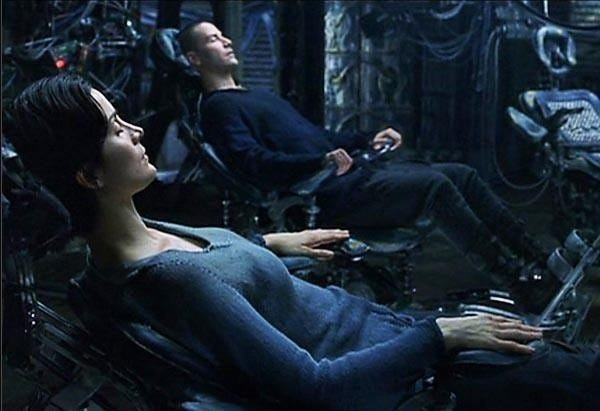

🎙 *This article is also available in [Podcast format](https://anchor.fm/ghostlessmachine/episodes/4-Are-pain-and-pleasure-all-that-matters---What-utilitarians-mean-when-they-promote-pleasure-over-pain-eofjmf).*

*This is the first of a [series of articles](http://ghostlessmachine.com/utilitarianism-series/) defending a compatibilist interpretation of utilitarianism, which can be reconciled with all major moral theories.*

---

Utilitarianism is a moral philosophy proposed by Jeremy Bentham (1748–1832) and later developed by John Stuart Mill (1806–1873) and others. Bentham and Mill were progressive British philosophers who were pioneers in the fight for the abolition of slavery, for women’s rights and even for LGBT and animal rights, which were extremely unpopular causes in their time. The defining principle of utilitarianism is quite simple: the right thing to do is always the thing that minimizes pain and maximizes pleasure.

To many, the principle of utility sounds so obvious at first as to be uninteresting. However, it is easy to imagine situations that make it seem inappropriate. A few obvious things people will say include “but some people like pain” or “suffering is sometimes important to help us grow” or “too much indulgence in earthly pleasures can be bad for you” or even “a life without suffering would be boring”.

Unfortunately, we don’t read Bentham and Mill in schools, so the utilitarian responses to these objections are often not known by lay people, creating a false impression that utilitarianism is a simplistic moral philosophy which fails to take the complexity of human morality into consideration. But these objections have been addressed a long time ago. They essentially result from a misunderstanding of the sense in which the words “pain”, “suffering”, “pleasure”, “happiness”, etc., are used.

## Sustainability

*[Child looking at marshmallow.](https://www.theepochtimes.com/kids-do-better-on-the-marshmallow-test-when-they-cooperate_3252472.html)*

When people hear about utilitarianism for the first time, they sometimes think that it cannot be right because, if it was, you should let your child play video-games instead of studying because this is what brings them happiness. This is of course an extremely naive interpretation of the theory, since it is obvious that the capacity for delayed gratification is important, as is evidenced by the famous [marshmallow test](https://en.wikipedia.org/wiki/Stanford_marshmallow_experiment), in which a child is placed in front of a marshmallow and promised that, if they can wait a number of minutes, they will get two marshmallows instead.

It turns out that children with high capacity for delayed gratification tend to have “*[better life outcomes](https://en.wikipedia.org/w/index.php?title=Stanford_marshmallow_experiment&oldid=990424934), as measured by SAT scores, educational attainment, body mass index (BMI), and other life measures*”. More [recent results](https://www.vox.com/science-and-health/2018/6/6/17413000/marshmallow-test-replication-mischel-psychology) have brought some conclusions of the marshmallow test into question, but the overall idea that the ability to delay gratification is important is undeniable.

When you endure the pain of intense physical exercise, or refuse to go out with your friends in the weekend in order to study more for an exam, you are accepting that suffering because you know (or at least expect) that it will bring you gratification in a later moment, and you consider the expected gratification great enough to compensate for the present suffering. There is no point in maximizing pleasure in the short term and then having to pay with a lot of suffering in the future. We must approach the minimization of suffering in a sustainable, long-term way, not a shortsighted one.

## Desirability

When utilitarians say we must minimize suffering and maximize happiness, we are defining these terms in the *broadest possible sense*. If you prefer to climb the Everest rather than sit and watch TV and eat junk food every day, then that is what brings you true happiness, even if you have to resist the urge to eat that ice cream or watch that next episode of your favorite show. The gratification of being healthy or looking good or simply having accomplished something difficult is a source of happiness for you. If it wasn’t, you wouldn’t do it.

> The only proof capable of being given that an object is visible, is that people actually see it. The only proof that a sound is audible, is that people hear it: and so of the other sources of our experience. In like manner, I apprehend, the sole evidence it is possible to produce that anything is desirable, is that people do actually desire it. If the end which the utilitarian doctrine proposes to itself were not, in theory and in practice, acknowledged to be an end, nothing could ever convince any person that it was so. No reason can be given why the general happiness is desirable, except that each person, so far as he believes it to be attainable, desires his own happiness.
>
> — [John Stuart Mill, 1861. Utilitarianism](http://www.gutenberg.org/files/11224/11224-h/11224-h.htm).

When people climb the Everest, the pain and extreme physical strain are clearly not their final goals. I believe few people would go through that trouble if they knew their memory of it would be erased along with all evidence that they ever climbed the mountain. People seek the thrill, the adrenaline, the feeling of victory, a feeling of confrontation with extreme natural forces which they may find meaningful, etc. It may be true that, without the suffering, they wouldn’t be able to have these positive experiences. But still, it is not the pain itself that they seek. That could be obtained in much easier ways. The pain is a means to an end, not an end in itself.

> Whatever is desired otherwise than as a means to some end beyond itself, and ultimately to happiness, is desired as itself a part of happiness, and is not desired for itself until it has become so. Those who desire virtue for its own sake, desire it either because the consciousness of it is a pleasure, or because the consciousness of being without it is a pain, or for both reasons united; as in truth the pleasure and pain seldom exist separately, but almost always together, the same person feeling pleasure in the degree of virtue attained, and pain in not having attained more. If one of these gave him no pleasure, and the other no pain, he would not love or desire virtue, or would desire it only for the other benefits which it might produce to himself or to persons whom he cared for.
>
> — John Stuart Mill, 1861. Utilitarianism.

Perhaps better than minimizing “suffering” and maximizing “happiness”, we should define the principle of utility as the claim that it is wrong to cause *undesirable experiences* and right to cause *desirable* ones. Or, even more accurately: actions that contribute to a life with a positive balance of desirable minus undesirable experiences are good, while actions that contribute to a negative balance are bad.

When you say “a life without suffering is boring”, therefore, you are failing to imagine a life that is truly free from suffering, because if boredom is something undesirable to you, then according to our definition, it is a type of suffering. A life without suffering may be impossible to obtain or even to imagine, but it is desirable, by definition.

### The experience machine

*Neo and Trinity connected to the Matrix*

An interesting challenge brought against the idea that pain and pleasure are the only things that matter is the “experience machine” scenario, by anti-utilitarian philosopher Robert Nozick. In this thought experiment, Nozick asks: would you exchange real life for a computer simulation that can give you any experience you want? If pain and pleasure are the only things that matter, it seems you should. According to Nozick, however, the fact that most people say they wouldn’t shows that there is more to life than pain and pleasure. But again, if we think of “pleasure” and “pain” as shorter ways of saying “desirable” and “undesirable” experiences, then the fact that people say they wouldn’t enter the machine only reveals that exchanging real life for a simulation is an undesirable experience. So undesirable in fact that those people are willing to give up an entire future of potential bliss just to avoid this one terribly disturbing experience of giving up one’s real life.

### Brave New World

*Citizens of the Brave New World enjoy a lustful, drug-friendly party in NBCUniversal’s adaptation of the book.*

The book Brave New World is another source of inspiration for critics of utilitarianism. In the novel, Aldous Huxley skilfully manages to portray a world where everybody is happy, and yet still make it look dystopian. It feels like there’s something inherently wrong with conditioning people from birth to be happy with their assigned roles in society, or with using soma (a happiness-inducing substance) to drug people who show signs of discontent, even with their consent. But again, the problem with the book is that happiness is defined too narrowly. This superficially utopian society is composed almost entirely of soma-intoxicated zombies, conditioned to live happily in their caste. There is little space for novelty, creativity, or other types of deep and meaningful experiences.

You may be puzzled and ask why a person wouldn’t want to enter the experience machine, since after all the machine can give you any pleasure you can imagine. You may also be puzzled and ask why people wouldn’t want to live in the Brave New World since everybody there is happy in some superficial sense. But at the end of the day, we are complex beings, and sometimes we don’t understand why we want what we want. I don’t even know up to what point it makes sense to try to explain why we want what we want. If you ask me why I like french fries, I will probably say that they’re warm and crunchy and salty. But if you ask me why I like warm and crunchy and salty stuff, I am at a loss. All I can resort to is evolutionary explanations. Humans evolved to crave high-calorie foods, etc.

## Conclusion

Focusing on pain and pleasure seems initially like the obvious way to approach morality, but after some thought, it’s easy to think of situations where pain seems to be good and pleasure seems to be bad. However, these situations result either from a short-sighted approach to maximizing pleasure that fails to see that sometimes it’s worth paying with a bit of immediate suffering if that will buy sufficient happiness in the future, or from too narrow an understanding of the words pain and pleasure.

For utilitarians, pleasure is any experience a person desires to have, and pain is any experience they desire *not* to have. I cannot explain why I’d rather have a mediocre life full of mild suffering, but that is real, rather than a perfect one that is a fake simulation. It is also hard to explain why the world described by Huxley doesn’t appeal to me, but perhaps that’s just because I haven’t tried soma. Still, whatever the reason may be, this is what I want at this point. Again, the sole evidence it is possible to produce that anything is desirable, is that people do actually desire it. If something seems dystopian, it means people don’t desire it, which means it’s not utilitarian.

---

*This is the first of a series of articles defending a compatibilist interpretation of utilitarianism, which can be reconciled with all major moral theories. Follow me on [social media](http://ghostlessmachine.com/) and [subscribe to my newsletter](http://ghostlessmachine.com/newsletter/) in order to be notified about the next articles in the series.*
