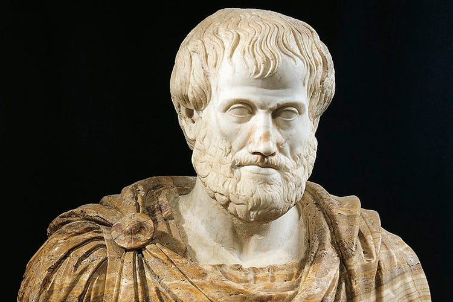

🎙 *This article is also available in [Podcast format](https://anchor.fm/dashboard/episode/epi6o8).*

*This is the second of a [series of articles](http://ghostlessmachine.com/utilitarianism-series/) defending a compatibilist interpretation of utilitarianism, which can be reconciled with all major moral theories. In [the previous article](https://medium.com/humanist-voices/are-pain-and-pleasure-all-that-matters-4d45ac0a3e18), I explain what utilitarians mean when they talk about “pain” and “pleasure”.*

---

> Virtue, then, being of two kinds, intellectual and moral, intellectual virtue in the main owes both its birth and its growth to teaching (for which reason it requires experience and time), while moral virtue comes about as a result of habit, whence also its name (ethike) is one that is formed by a slight variation from the word ethos (habit).
>
> — Aristotle, 350 B.C.E. Nicomachean Ethics.

Virtue ethics is a family of moral theories that emphasizes the cultivation of virtuous habits, rather than defining moral axioms from which we can logically derive answers to practical moral questions. It is one of the three main families of moral theories, alongside deontological ethics (based on duties), and utilitarianism, which promotes the greatest happiness for the greatest number. Some people appeal to notions of virtue to criticize utilitarianism, but any plausible reading of Bentham and Mill, the fathers of the theory, makes it clear that they recognized the importance of cultivating positive habits. Virtue ethics is best seen, therefore, simply as a theory that examines morality from another perspective, and not as an *alternative* theory that *contradicts* utilitarianism.

One of the points virtue ethicists commonly make is that utilitarianism is a doctrine “suitable only for pigs”, since it lumps together the noblest and basest pleasures all in the same bag. Surely, these people say, even if somebody prefers to sit at home and jerk off and watch reality TV all day rather than to climb the Everest, still climbing the Everest is a nobler pleasure, and utilitarianism fails to recognize that. To them, a utilitarian society would be a dystopian, never-ending bacchanal where shameless hedonists perpetually indulge in carnal pleasures as long as this indulgence doesn’t harm anybody.

To this objection, Mill famously replied that “*those who are equally acquainted with, and equally capable of appreciating and enjoying, both, do give a most marked preference to the manner of existence which employs their higher faculties*” and also that “*it is better to be a human being dissatisfied than a pig satisfied*”. Bentham, on the other hand, said that “*prejudice apart*”, any type of entertainment is equally valid. This is an interesting debate that deserves its own article, but here I would like to make another argument. Namely, that sometimes certain activities contribute more than others to the cultivation of virtues, and that cultivating virtues is conducive to a happier and more prosperous society.

If we think about it this way, it becomes clear that it’s not that there’s something inherently wrong with jerking off and watching reality TV or getting high and playing video-games. It is only excess that should be discouraged. Reading, playing instruments, meditating, or climbing the Everest are clearly activities that contribute much more to personal growth, which in turn help us make more positive contributions to the reduction of suffering.

Of course, we can always find someone whose only source of entertainment is pop music, blockbusters, and trashy reality TV, but who eats vegan, donates to effective charities, and supports all the right causes. But the fact that it is rare is unlikely to be a coincidence. The values promoted in this type of entertainment tend to be extremely toxic, and unlikely to influence anyone positively, as many progressive figures have pointed out in documentaries such as [Miss Representation (2011)](https://www.youtube.com/watch?v=W2UZZV3xU6Q) and [Tough Guise (1999)](https://www.youtube.com/watch?v=jqiX9Al-LZ8).

> Unquestionably it is possible to do without happiness; it is done involuntarily by nineteen-twentieths of mankind, even in those parts of our present world which are least deep in barbarism; and it often has to be done voluntarily by the hero or the martyr, for the sake of something which he prizes more than his individual happiness. But this something, what is it, unless the happiness of others, or some of the requisites of happiness? It is noble to be capable of resigning entirely one’s own portion of happiness, or chances of it: but, after all, this self-sacrifice must be for some end; it is not its own end; and if we are told that its end is not happiness, but virtue, which is better than happiness, I ask, would the sacrifice be made if the hero or martyr did not believe that it would earn for others immunity from similar sacrifices? Would it be made, if he thought that his renunciation of happiness for himself would produce no fruit for any of his fellow creatures, but to make their lot like his, and place them also in the condition of persons who have renounced happiness? All honour to those who can abnegate for themselves the personal enjoyment of life, when by such renunciation they contribute worthily to increase the amount of happiness in the world; but he who does it, or professes to do it, for any other purpose, is no more deserving of admiration than the ascetic mounted on his pillar. He may be an inspiriting proof of what men **can** do, but assuredly not an example of what they **should**.
>
> — John Stuart Mill, 1863. Utilitarianism.

Cultivating moral virtues, therefore, is valuable, but only insofar as the cultivation of those virtues contributes to a world with less suffering and more happiness. A common objection against utilitarianism is that it is impossible in practice to make a cost-benefit analysis and actually figure out which is the truly best option every single time you have to make a moral decision. But to think that utilitarianism actually implies this level of micromanagement is to grossly misunderstand the theory.

Utilitarianism is a moral philosophy, not a business strategy. Having to make decisions with insufficient information is a problem that plagues any domain of activity, from policy making to business management to military strategy. All utilitarianism tells us is *what our goal should be*. It says nothing about *how to achieve that goal*. An emphasis on the cultivation of virtues may very well be a very effective way of creating a happier society. This is an empirical question that utilitarianism leaves open.

Sometimes analyzing all possible factors in a decision can be so costly and ineffective that using shortcuts, or “heuristics”, can be better. Sometimes an investment algorithm that looks at enormous amounts of data and comes up with precise investment decisions can be outperformed by a much simpler algorithm that just uses a few simple rules of thumb. In investment, the goal is to make a profit. In ethics, the goal is to make the world a better place. Again, a normative theory such as utilitarianism doesn’t tell us *how* to make the world a better place. It tells us *what it means* to make the world a better place. It is perfectly compatible with utilitarianism, therefore, to adopt a strategy that consists in cultivating some virtues and acting according to them whenever the pros and cons in terms of pain and pleasure are too difficult to analyze. It is important, however, to periodically reevaluate whether this strategy is serving our deeper utilitarian goal.

## Conclusion

If the cultivation of some trait that is generally considered virtuous turns out to not be causing either harm or good, then this trait is best described as an aesthetic virtue, not a moral one. Being a virtuoso pianist, for example, might be in that category. If it is causing more harm than good in our current cultural and historical context, however, then it is not serving as a positive tool anymore and we should no longer consider it a virtue at all. A virtue may have served us in the past, just like a shortcut-based investment algorithm may serve investors now. But as society changes and technologies develop, we must constantly reevaluate the strategies we use in order to achieve our goals. If one day we realize that our heuristic algorithm is reliably outcompeted by an advanced data mining tool, or perhaps even an equally simple algorithm but that relies on different heuristics, then there’s no point in holding on to our old algorithm out of emotional attachment. It may have served its purpose at some point, but now it’s time to ditch it.
