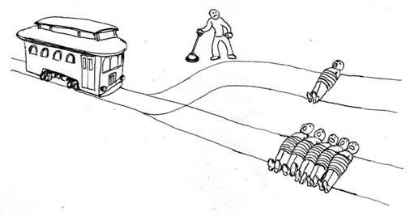
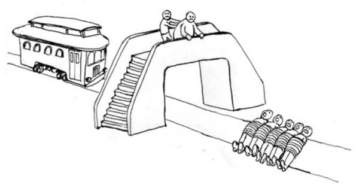
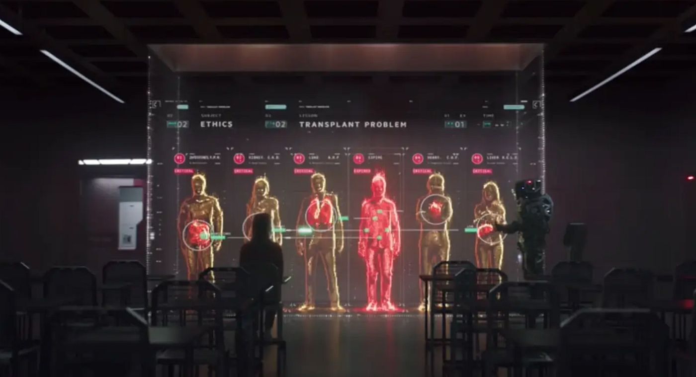

*This is the fourth of a [series of articles](http://ghostlessmachine.com/utilitarianism-series/) defending a compatibilist interpretation of utilitarianism, which can be reconciled with all major moral theories. In the [previous article](https://medium.com/humanist-voices/the-moral-relevance-of-intentions-1f727eada47), I explain why utilitarians are concerned with intentions, even though they’re consequentialists.*

---

Utilitarianism is the moral philosophy that promotes the greatest happiness for the greatest number. Although this philosophy seems very intuitive at first, many object saying that sometimes it just feels wrong to do the thing that minimizes suffering. The most notable examples of this argument are the footbridge and the transplant problems, both variations of the notable trolley problem.

## The trolley problem

In the original trolley problem, there’s an out-of-control trolley coming towards five people and the only way to save them is by pulling a lever and diverting the trolley to another track where a single person is killed.

Is it our moral obligation to pull the lever? [Most people say they would pull it](https://en.wikipedia.org/wiki/Trolley_problem#Survey_data), but there’s still a significant number who say they wouldn’t. [Almost everybody agrees](http://www.psy.vanderbilt.edu/courses/hon182/thomsontrolley.pdf), however, that it would be at least permissible to pull it, killing one to save five.

## The footbridge problem

In the footbridge dilemma, however, there’s a big man standing on a footbridge that goes over the trolley track where those five people are about to be ran over, and the only way to stop the trolley is by pushing him.

The whole thought experiment is by design such that you know with 100% certainty that pushing the fat man will stop the trolley, and yet most people say they wouldn’t do it. Still, a considerable number of people do say they would push the man.

## The transplant problem

Perhaps an even better example is the [transplant problem](http://www.psy.vanderbilt.edu/courses/hon182/thomsontrolley.pdf). In this thought experiment, a surgeon has five patients who each need a different organ and who will all die unless they find a donor. One day a healthy person who’s compatible with all patients comes in for a checkup. Is it ethical to kill him to save the five?

*Scene from the movie “I Am Mother”.*

Nearly everybody feels it is not acceptable to do such a thing, myself included. But is that really a threat to utilitarianism? Again, only under a very naive interpretation of it. Utilitarianism doesn’t say “do whatever it takes to maximize well-being in the short term, regardless of potential adverse effects in the long run”. We don’t need to appeal to metaphysically problematic concepts such as natural rights in order to defend that we shouldn’t kill people who come for checkups. Richard Brandt ([1959](https://books.google.ro/books?id=MnFgAAAAIAAJ)) refers to this short-sighted version of utilitarianism as “act utilitarianism”, and contrasts it with “rule utilitarianism”, which considers an action wrong if the acceptance of that action *as a norm* would bring bad consequences even if, in isolated instances, it seems to maximize happiness. It seems quite clear from a literal reading of Mill that utilitarianism acknowledges the practical importance of firmly enforced rules:

> According to the Greatest Happiness Principle […] the ultimate end […] is an existence exempt as far as possible from pain, and as rich as possible in enjoyments, both in point of quantity and quality; […]. This, being, according to the utilitarian opinion, the end of human action, is necessarily also the standard of morality; which may accordingly be defined, **the rules and precepts for human conduct**, **by the observance of which an existence such as has been described might be, to the greatest extent possible, secured to all mankind**; and not to them only, but, so far as the nature of things admits, to the whole sentient creation.
>
> — [John Stuart Mill, 1879](http://www.gutenberg.org/files/11224/11224-h/11224-h.htm). Utilitarianism. (my emphasis)

Some make a distinction between rule utilitarianism and “[multi-level](https://www.utilitarianism.net/types-of-utilitarianism#multi-level-utilitarianism-versus-single-level-utilitarianism)*”* or “[prudent](https://forum.effectivealtruism.org/posts/nvus8kuGxyacyfXeg/naive-vs-prudent-utilitarianism)” utilitarianism, which encourages the use of rules as a decision procedure, but still considers consequences the only criterion for rightness. Multi-level utilitarianism is technically, under this definition, a form of act utilitarianism.

This means that even act utilitarianism is not incompatible with deference to rules, as a naive interpretation might have suggested. No utilitarian philosopher argues for calculating the impact of every isolated decision we make, since it would be impossible to do that with an acceptable degree of accuracy. This naive version of act utilitarianism, therefore, is perhaps best described as a failed interpretation of utilitarianism, a straw man used by its critics.

Any serious attempt to imagine an actual policy that allows doctors to kill healthy checkup patients quickly leads us to dystopian images when we start considering potential unintended consequences, such as people fearing the public health system, looking for alternatives in the black market, and overall fearing for their lives on a daily basis. But if a utilitarian society seems dystopian and undesirable, then that society is by definition not utilitarian.

Some may go further, however, and say “what if it’s a one off opportunity and the doctor knows for a fact that nobody will find out?” As a pragmatist, this question makes little sense to me. To say something is immoral is functionally equivalent to saying that people who act that way should be reprimanded and held accountable for those actions. In that sense, killing the checkup patient is still immoral because, if caught, the doctor should definitely be disciplined for his actions, because once again a society in which these actions are tolerated would quickly become dystopian.

Some might keep insisting though, and ask “but if I am the doctor and I know for a fact that nobody will ever find out and I want to make the most ethical decision, should I kill him?” Here the scenario starts to become so far-fetched that it becomes difficult to rely on our intuitions. I still feel that it’s wrong to kill the checkup patient, but this is largely because in any reasonably realistic scenario this has a great potential of causing more harm than good in the long run. If you artificially postulate, for the sake of argument, that the risk of that happening is *zero*, then I guess I will indeed be forced to bite the bullet and say it’s OK to sacrifice the patient. But that is irrelevant because although it seems to have dangerous real-world implications, it doesn’t. The risk will never be zero in practice.

Human cognition evolved by natural selection and is therefore necessarily imperfect. Our intuitions are not always consistent, and our decisions are the result of a constant battle between conflicting instincts. Therefore, we can always engineer a thought experiment the pits one intuition against another. In this case, for example, I could always double down and say “what if refusing to kill the checkup patient causes the entire population of China to be tortured to death?”.

Although I strongly believe in the usefulness of thought experiments in philosophy, everything has a limit. A good thought experiment should only be allowed to venture into the bizarre if that helps simplify the conversation and avoid having to consider irrelevant details, but it should always be possible to find a plausible real-life situation that is similar to the original experiment in all relevant ways.

The original trolley problem is an excellent example of a useful thought experiment, as is illustrated by the realistic moral dilemmas posed by self-driving cars and also by real-world [experiments](https://www.youtube.com/watch?v=1sl5KJ69qiA) that try to analyze the actual reaction of unsuspecting subjects to staged trolley dilemmas. The transplant problem, however, with all the proper amendments added, can no longer be compared to anything plausible. How can you quietly kill a healthy person in your clinic and make it look like a natural death? Is it possible to ever be 100% sure that you won’t be caught, that the organ receivers will really survive, that you cannot get the organs in any other way, etc? Our brains evolved, among other things, to analyze risk and evaluate alternative courses of action based on the most probable outcomes. It is impossible to look at such a scenario and not feel like, at some level, it is a very dangerous gamble. And in real life, it is indeed a very dangerous gamble.

Rules are important. They’re actually unavoidable. We simply don’t have the resources to live without rules. Without a legal driving age, for example, we would need a whole system of health professionals measuring how mature and cognitively developed young people are before they can get a certification that allows them to enroll in driving lessons. By simply defining a safe but somewhat arbitrary minimum driving age, we save a lot of resources. Similarly, when we go on diets or any type of self-improvement plan, we create simple heuristics, black and white rules-of-thumb that allow us to focus on other aspects of our lives instead of wasting mental energy on small decisions all the time.

Therefore, if you keep having the same type of moral dilemma all the time, just come up with a conventional rule and stick to it. But remember, a rule exists to serve a goal, and that goal should always be to minimize suffering in the long-run. This is the only *final* rule. All other rules are *instrumental*. If you find yourself in an unforeseen edge case where that rule doesn’t serve that goal anymore, you’re free to break it. You can agree that lying is bad but still lie to a murderer who is looking for his victim. Break it too much, however, and the rule ceases to have its positive effect. If people lie all the time, social trust is corroded and cooperation breaks down.

Certain instrumental rules are so helpful and conflict so rarely with the final rule that it is easy to confuse them for the final rule itself. But that’s a mistake, and indeed one of the most common mistakes made in moral debates. The rule “don’t kill other humans” is almost always worth respecting, but not always. We kill in self-defense, we euthanize people in vegetative states, and we abort embryos with no signs of sentience. Being hunted down by a murderer is terribly scary. Being shot, stabbed or beaten hurts, and the people mourning the victims also suffer tremendously. In the exceptional situations described earlier, however, the suffering caused is less than the suffering avoided, and killing is therefore permissible.

Some may say that, by that logic, it would be morally permissible to painlessly kill an unsuspecting, completely solitary hermit with no friends and family. To them, this is a reductio ad absurdum of utilitarianism. But again, we must bring this sort of thought experiment closer to reality. If we approach this from a rule-oriented perspective, it is clear that a society where this is accepted as a norm would look rather dystopian. Besides, what do we stand to gain by killing this person? How can we be so sure that our execution method is truly painless, and that nobody will mourn them? What about the risk of making mistakes? As small as it may be, it will never be zero. What do we stand to gain from taking this risk? Having a strict rule against the premeditated killing of conscious adults against their consent is so useful in the process of creating the best world possible that we should only be allowed to break such a rule if we have a really good reason. But we don’t.

## Conclusion

As I have mentioned, utilitarianism is often contrasted with deontology, which focuses on respecting rules rather than maximizing good consequences. However, the two theories don’t have to be interpreted as being contradictory. Even Kant, the most notable deontologist, said that we should act “only according to that maxim whereby you can, at the same time, will that it should become a universal law”. This means that, even for deontologists, rules must be justified on some basis. Divine command theorists appeal to the will of a god, while Kantians appeal to the principle of universalizability. Rule-oriented utilitarians appeal to the principle of utility.

In a way, utilitarianism is not a rival theory to deontology, but rather a type of deontology, one that differs from Kant’s in that it appeals to the principle of utility rather than the principle of universalizability when defining its hierarchy of rules. One could argue that it’s not fair to describe utilitarianism as a deontological theory, because it tolerates the occasional breaking of rules in name of a deeper principle. But why couldn’t that deeper principle be described as a rule?

Every time we make a decision, we are choosing from among millions of alternative possible paths between the present and the end of time. Each of these paths generate a different balance of aggregate pleasure over pain. If you want to make the most ethical decision possible, you should pick the path of least aggregate suffering. Of course, it is impossible to know which one will turn out to be the best path due to the complexity of the universe, so we are forced to go with our best guess. This is the ultimate rule of utilitarianism. The only rule which should never be broken.

To some it might seem that this principle would justify breaking higher level rules a lot of the time. But that is not true. A person who breaks lots of rules because they think they can maximize happiness in the long run by doing so is not an example of a committed utilitarian, but of a reckless gambler, overly confident in their ability to predict the future. That’s why it’s important to be [epistemically responsible](https://medium.com/humanist-voices/what-should-we-believe-b689a8bba4a3), or in other words, to be prudent and only believe things you are rationally justified in believing.

Many reject utilitarianism by comparing it to the dangerous utopianism of genocidal communists such as Stalin and Mao. But Stalin and Mao weren’t utilitarians. They were genocidal totalitarian maniacs who didn’t consider the enemies of the regime worthy of moral consideration. Utilitarianism is explicit in its equal consideration of the suffering not only of humans, but any sentient being. Based on the data available at the time, nobody was even remotely justified in being so confident that there was no better alternative than to mass murder the opposition in the name of the greater good. Even if they had made this claim, which they haven’t, this would not justify abandoning utilitarianism. It would only justify abandoning epistemic recklessness and delusional confidence in one’s abilities to predict the future.

There is no deontological theory that claims we should respect whatever rules we feel like. If you have no method of establishing what rules are worth respecting and what aren’t, then you are not a deontologist. You are just postulating ad hoc rules as needed so that you can stick to your gut feelings and reject any utilitarian argument that could challenge your position. Indeed, that is the appeal of deontological sounding arguments. No amount of data in any direction can change the mind of a pseudo-deontologist. Their claims are unfalsifiable. Utilitarian claims, on the other hand, are always up for debate.

> Claims about what will or won’t promote the greater good, unlike claims about rights, are ultimately accountable to evidence. Whether or not a given policy will increase or decrease happiness is ultimately an empirical question. One can say that national health insurance will improve/destroy American healthcare, but if one is going to say this, and say it with confidence, one had better have some evidence.
>
> — Joshua Greene, 2013. Moral Tribes.
