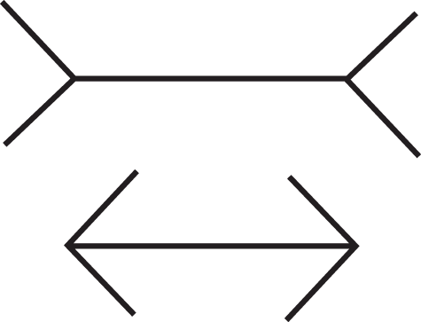

*This is the ninth of a [series of articles](http://ghostlessmachine.com/utilitarianism-series/) defending a compatibilist interpretation of utilitarianism, which can be reconciled with all major moral theories. In [the previous article](https://medium.com/humanist-voices/natural-rights-and-moral-desert-7e0a1b5684f6), I explain why the concepts of rights and moral desert are only valuable insofar as they contribute to a happier society.*

---

If morality is universal as [I claim](https://medium.com/humanist-voices/a-sufficiently-objective-morality-17225b973015), then how come we differ so much on our gut level judgements? As I have argued before:

> The best action is always the one that most improves the quality of the experience of all sentient beings from now until the end of time.

But based on what do I say that? From what premises do I derive this conclusion? Well, none. This claim is a foundational assumption of the entire moral theory I defend. It is a moral axiom, a self-evident truth that needs no justification. But if this truth is so unquestionable and self-evident, how come so many people disagree with it? If a statement is not unanimously agreed to be true by intuition, can it really be called an axiom? In this article I argue that deep down we do all agree with this statement, and that all the disagreement is illusory.

## Moral disagreement

There are two different types of moral disagreement that people rarely distinguish explicitly, but that differ in critical ways. I will call them *factual* and *axiological* disagreements. Factual disagreements unsurprisingly concern facts, while axiological disagreements concern values. Let’s say, for example, that Alice defends the complete decriminalization of sex-work, as is practiced in New Zealand, while Beatrice defends the Scandinavian model, in which getting paid for sex is legal but paying for it is criminalized, with the intention of protecting women.

If Alice and Beatrice agree with me that the best action is always the one that minimizes suffering, and simply disagree on whether the New Zealand model or the Scandinavian one are best suited for that, then their disagreement is factual, and to be settled by research. However, if Alice defends the New Zealand model because it minimizes suffering, but Beatrice defends the Scandinavian model because “prostitution is degrading and should be discouraged”, or because “prostitution is the commodification of the female body”, or because “prostitution is exploitation of women”, then it doesn’t really matter to her which model minimizes suffering: their disagreement is axiological.

It is primarily with axiological disagreements that I am concerned with in this article. In a way, these are the only “true” moral disagreements. All other disagreements are over matters of fact, but because in ordinary language it is common to refer to any disagreement regarding a politically charged issue as a moral disagreement, it is useful to choose our words as carefully as possible, and that’s why I believe this distinction is essential.

## Implicit beliefs

Imagine you have $1000 to play in a game of chance. The game has two steps. In the first, you have to choose between two options:

**A**. a sure gain of $240
**B**. 25% chance to gain $1000, 75% chance to gain nothing

In the second step, you once again have two options:

**C**. a sure loss of $750
**D**. 75% chance to lose $1000, and 25% chance to lose nothing

In step one, most people prefer option A, and in step two, most people prefer option D. If you consider the two steps combined, this means that most people choose A and D. If you explicitly ask people to choose between the A & D or B & C combined, however, you can see that one is clearly the winner:

**A & D**. 25% chance to win $240, and 75% chance to lose $760
**B & C**. 25% chance to win $250, and 75% chance to lose $750

Indeed, 100% of the subjects in [this study](https://www.unipa.it/dipartimenti/dems/.content/documenti/corsi/aprile2020/decision_making/1981-Tversky-and-Kahneman---The-framing-of-decisions-and-the-psychology-of-choice.pdf) chose B & C. So why do they choose the wrong option in the first situation? Because of the framing effect. Basically, when a gamble is framed in a way that emphasizes possible gains, people tend to be risk-averse and choose the certain gain, even if small. When framed in a way that emphasizes possible losses, people become more loss-averse than risk-averse, and cling to any possibility of not losing.

When I say that “deep down” everybody agrees that the best action is always the one that promotes maximum well-being from now until the end of time, what I mean is that those who think they disagree are merely being fooled by their cognitive biases, just like the subjects who choose A and D. If they actually try to be dispassionate and spend time and mental energy making sure they are logically consistent, they will see that their anti-utilitarian instincts are inconsistent with their rational beliefs. Nobody sees the fact that people choose A & D in the first scenario as a challenge to the foundations of mathematics. Similarly, it makes no sense to see moral disagreement as evidence that are no universal moral foundations.

## Dual process theory

It is increasingly accepted in cognitive science that the human brain has evolved [two modes of operation](https://en.wikipedia.org/wiki/Dual_process_theory). In [Thinking, Fast and Slow](https://en.wikipedia.org/wiki/Thinking,_Fast_and_Slow), Daniel Kahneman calls these “System 1” and “System 2”. System 1 (or “heuristic thinking”) is fast, associative, intuitive, and happens at a subconscious level. System 2 is slow, effortful, deductive, and employed deliberately. Heuristic thinking is cost efficient, but prone to error. Deductive thinking is slower and more cognitively costly, but more reliable.

When we make inconsistent choices in the two-step gamble game, that is basically because fast thinking gives us a quick answer, but slow thinking gives us another. In cases such as this, it seems natural to us that we should prioritize the result of careful reasoning over gut feeling. Kahneman calls such brain glitches “cognitive illusions”. They are similar to visual illusions such as the Müller-Lyer illusion.

When we are first asked about the length of the lines, most people say the line at the bottom is shorter than the one at the top based on gut feeling. When evidence is provided to us showing that our answer is wrong, such as measuring the lines with a ruler, we promptly admit our mistake and accept the correct answer.

In the case of moral illusions, however, we are not so quick to abandon our gut feeling in favor of a carefully thought-out alternative. Instead, we actually engage in intense mental gymnastics in an attempt to rationally justify our gut feeling, even when it contradicts many of our beliefs. In [The Righteous Mind](https://en.wikipedia.org/wiki/The_Righteous_Mind), Jonathan Haidt uses a similar terminology to Kahneman’s when talking about the moral brain. In his paradigm, “System 1” is analogous to what he calls “the elephant”, responsible for quick and emotional moral judgement, while “System 2” would roughly correspond to “the rider”, employed when we need to justify our moral intuitions. In theory, the rider is supposed to guide the elephant, but sometimes, he argues, the reverse seems to happen.

> You can see the rider serving the elephant when people are morally dumbfounded. They have strong gut feelings about what is right and wrong, and they struggle to construct post hoc justifications for those feelings. Even when the servant (reasoning) comes back empty-handed, the master (intuition) doesn’t change his judgment.
>
> — [Jonathan Haidt, 2012](https://en.wikipedia.org/wiki/The_Righteous_Mind). The Righteous Mind.

This is well illustrated by studies of harmless taboo violations, in which Haidt presented subjects with hypothetical situations involving disturbing subjects such as incest and sex with dead animals but causing no harm, and then asked whether these actions were immoral. The first reaction of many subjects was to say “yes” but, when asked why, they were “dumbfounded”. The interesting thing to note here is how, when trying to justify their position, they frequently appealed to notions of suffering. When arguing against incest, they would insist on remote possibilities that contraception would fail, even if they had been informed that the people involved took all imaginable measures to avoid it. Their argument would ultimately be that even the remotest possibility of failure could lead to the conception of a baby with genetic defects who would subsequently suffer, therefore making the act fundamentally immoral. This ignores the fact that such low-risk gambles are unavoidable, and we take them every time we drive a car or do other daily tasks.

There are many examples of glitches in our brain’s moral circuitry. People are reliably shown to donate more money to small numbers of identifiable victims rather than large numbers of invisible strangers, for example, even though they agree that this doesn’t make sense when explicitly asked, a phenomenon known as “[compassion fade](https://en.wikipedia.org/wiki/Compassion_fade)”. They are also more willing to use innocent bystanders as trolley stoppers to save five others if they are more [physically distant](https://books.google.ro/books?id=xIeAAgAAQBAJ&printsec=frontcover&dq=moral+tribes&hl=en&sa=X&ved=2ahUKEwjG1b3IlarrAhVrwosKHWHGASUQ6AEwAHoECAUQAg#v=onepage&q=physical%20distance&f=false) from their victim (e.g. by pressing a button that somehow causes a big man to fall off a footbridge and stop the trolley).

People are also more inclined to judge actions as immoral if emotions of disgust (e.g. bad smell) [have been aroused in them](https://www.ncbi.nlm.nih.gov/pmc/articles/PMC2562923/), which might explain the regrettably common fallacy of expressing aesthetic displeasure as moral disapproval. Peer pressure also affects moral judgement, with subjects in [an experiment](https://psycnet.apa.org/record/2013-31183-005) copying the moral judgements of actors posing as peers, even when those judgements were atypical compared to a control group of subjects who made their judgements alone. The list goes on, and as this field of study grows, we are likely to find more and more examples.

## Rational moral thinking

> We speak not strictly and philosophically when we talk of the combat of passion and of reason. Reason is, and ought only to be the slave of the passions, and can never pretend to any other office than to serve and obey them.
>
> — David Hume, 1739. A Treatise of Human Nature.

When reflecting about moral illusions, it is tempting to conclude that we should rely on reason rather than emotion. In a non-philosophical context, I might concede to this recommendation to simplify the discussion. But strictly speaking, this is a rather meaningless statement. Everything we do deliberately, we do in order to achieve a goal. And the desire to achieve that goal is a feeling, a “passion” in Hume’s terminology. It is an inclination that appears in our consciousness involuntarily. Reason is simply a tool that we use in order to achieve that goal.

When you snap out of the Müller-Lyer illusion, for example, it is not because you chose to rely on reason rather than emotion. It is because your intuitions were pitted against each other, and one of them won. The first intuition, your initial gut feeling, was that the bottom line was shorter than the top one. The second intuition was, say, that the ruler is not changing size as it moves from one line to the other. When you are presented with the initial image and subsequently with the measurements, cognitive dissonance immediately floods your consciousness. This experience is unsettling and uncomfortable, and you form an almost involuntary goal of resolving that contradiction in order to once again feel the comfort of sanity. Reason is merely the tool that allows you to see that, if the ruler doesn’t change size, and if according to the measurements made with the ruler, the lines are of the same size, then we must reach the conclusion that the lines are of the same length, and we must therefore discard the weaker intuition we had in order to preserve the consistency of our worldview.

Does that all mean we should ignore our gut feelings and always deliberate rationally about every moral decision we make? It’s not so simple. Heuristic thinking evolved for a reason: they’re resource efficient. Slow thinking is like a 99% accurate weather prediction program that runs on a supercomputer and costs a thousand dollars for each prediction. Fast thinking is like a weather prediction program that runs on a personal computer and costs only 50 dollars for each prediction, but which is only 75% accurate. In most cases, the cheaper program will be fine. You will only need the expensive program when the stakes are really high. It takes millenia and a lot of evolutionary pressure for slow thinking to evolve, because in most cases fast thinking is good enough at keeping us alive. Sometimes, however, it is not. How can we know, therefore, when we need fast or slow thinking?

In Moral Tribes, Joshua Greene compares the moral brain to a digital camera that has automatic modes such as portrait or landscape, but also a manual mode. When the environmental conditions are normal enough, portrait or landscape will do just fine. When you find yourself in unusual conditions that the manufacturer couldn’t have predicted, you need to switch to manual mode. Greene argues that moral intuitions evolved to solve a cooperation problem. Basically, species that cooperate are more successful than species that don’t. But the problem is that evolution is a necessarily competitive process. One gene only becomes predominant if it has a *competitive advantage* over another. If there’s a group of animals living in captivity and being artificially given enough food to survive and equal opportunities to procreate, genes that make an individual faster and stronger than the others will not spread. If you release those animals in the wild, however, and force them to compete for scarce resources, such a gene would spread quickly.

Our “automatic mode morality” evolved to help us cooperate in small tribes of hunter-gatherers. We feel empathetic pain when we see others getting hurt, we feel nervous when we are about to hurt someone, we feel [righteous indignation](https://www.youtube.com/watch?v=meiU6TxysCg) when somebody gets more than their fair share, we feel guilt when *we* manage to get away with more than *our* fair share, and we feel shame when we get caught in the process. This set of gut level instincts is enough to make us cooperate in small groups without stealing food and pushing each other off cliffs or footbridges. There is no need to engage in complex moral reasoning in these situations. There are things, however, that it didn’t evolve to do. These include writing public policy, finding answers to complex moral dilemmas, or resolving moral disputes between groups or individuals.

In this day and age, where different communities with different religions, cultural practices and political convictions all live together in one big global village, moral disputes arise more often than ever, and when it’s the intuition of one group against the intuition of another, we need a higher standard, one that is neutral enough to be accepted by as many people as possible. We need manual mode.

## The right to be logically inconsistent?

In this post-truth era, feelings seem to matter more than reason and the Trumps and Bolsonaros of the world base their campaigns on catchy slogans and hashtags that appeal to emotions without having any basis in reality. When data is presented that contradicts their views, their supporters are quick to say “well, I have the right to my own opinion”. But do we really have the right to *any* opinion? Sure, I’m not saying people should be silenced under the threat of violence, so in that sense I agree that everybody should have the legal right to express their opinion. But should we embrace policies that give equal weight to all opinions? Or should some opinions count more than others?

Modern progressives seem to have no problem demanding that the policies implemented in response to a pandemic be based on science, no problem demanding a scientific education, no problem opposing “intelligent design” or “flat-Earth theory” in schools, etc. We can agree that the opinions of experts matter more than the opinions of lay people when it comes to empirical knowledge. But when it comes to morality, who are our experts? God is dead and we have killed him, but although science has replaced religion as a source of knowledge about the nature of the universe, nothing has replaced religion as a source of moral guidance.

Being wrong about anything always boils down to being inconsistent in one way or another. When you give the wrong answer to the two-step gamble game, that answer is wrong because it contradicts other mathematical facts that you know to be true intuitively. When you’re wrong about an empirical matter such as the shape of the Earth, you’re wrong because your belief contradicts some data that you’re either not aware of or refuse to accept because your mind has entered cult-mode.

If a mathematician claims to have proven something that contradicts another accepted proof, that conflict will have to be resolved in some way so that we don’t end up with a logically inconsistent mathematics. If an empirical observation is made that contradicts our best scientific models, we will be forced to accept that, although our model may be the best prediction device we have at this point, it is broken and will eventually have to be fixed to accommodate that data. We can’t simply accept that geocentrism and heliocentrism are both true at the same time, or that the Poincaré conjecture is true and false at the same time. However, that’s exactly what we’re doing when we allow people to say that, for example, corruption is wrong but factory-farming is fine.

This is not to say that condemning corruption and eating meat is hypocritical. It is condemning corruption while *saying* there is *nothing wrong at all* with mistreating animals that is hypocritical. Most smokers agree that smoking is bad even though they still smoke. All of us have higher standards than we can live up to. All of us have given in to temptation at least a few times in life. But at least at the rational level, we must be able to agree on what that higher standard should be instead of distorting reality just to feel good about ourselves. To deny that the end of animal slaughter is desirable at all, even when presented with all the evidence that this industry causes a horrendous amount of unnecessary suffering, is literally as contradictory as going to space and looking at Earth and still insisting that it is flat.

## Moral claims must be falsifiable

Some people like to say that such strict utilitarianism is simplistic, and that although they of course agree that suffering and happiness are important aspects of morality, there are other things that also matter. However, this type of argument is often brought up when people fail to make a consequentialist case in defense of their gut-feeling, so in order to preserve their opinion they simply commit this “[appeal to the masses](https://en.wikipedia.org/wiki/Argumentum_ad_populum)” fallacy, and say that there are just too many people whose intuitions conflict with utilitarianism, and too many philosophers who embrace other theories, so it cannot be true. The problem with this argument is that it can be used against any moral theory. Committing to it, therefore, effectively makes you a moral relativist.

You might argue that you’re not a moral relativist, but that you simply don’t think any moral theory is 100% right. The mature and nuanced attitude for you, therefore, is to approach morality in a pluralistic way, analyzing each situation individually and taking inspiration from all moral traditions in order to find answers to specific moral questions. Although this may sound appealing to many, it is the perfect antidote against accountability. If every time a consequentialist argument is made against your position, you can always appeal to duty, virtue, desert, rights, etc, and maintain your position unchanged, then how can you ever be proven wrong?

A consequentialist argument can always be broken down into a factual and an axiological component. When you make a consequentialist argument, therefore, you are always leaving yourself open to the possibility of refutation, because it is always possible for your facts to be proven wrong by new data. Unfortunately, however, to be “proven wrong” is a great source of shame and anxiety for most people in our culture. But this has to change. Allowing yourself to be proven wrong is a very important virtue, because it allows us to get closer to the truth, and that in turn allows us to minimize suffering more effectively. We can save lives with antibiotics and laser surgery because academics managed to convince one another that it’s important to make falsifiable claims and accept it when your favorite hypothesis is proven wrong, no matter how counterintuitive the new findings may seem to you.

This principle of epistemic humility is one of the main values that has allowed science to flourish, and we must apply it to ethics as well if we want to make any progress. Making falsifiable moral claims that have a factual component is the only antidote against dogmatism, stubbornness, and confirmation bias. Only consequentialist claims have this property. Duties, virtues, desert, and rights are extremely useful concepts, but they are only valuable insofar as they contribute to the reduction of suffering and the promotion of well-being.

## The dangers of associative thinking

Associative thinking is fundamental for our survival. It allows us to be malleable beings, to explore different environments, to learn what to fear and avoid on the one hand, and what to seek and enjoy on the other. But the capacity to learn fear and disgust can be a problem when we are raised in a cultural environment that teaches us to fear other races and feel disgust towards the culinary and sexual practices of other cultures, especially when the areas of the brain responsible for these emotions are the same areas responsible for gut-level moral judgement. As Robert Sapolsky explains, evolution is a tinkerer, it cannot create new structures from scratch, it can only improvise and adapt existing ones, sometimes quite hackishly:

> Hmm, extreme negative affect elicited by violations of shared behavioral norms. Let’s see.… Who has any pertinent experience? I know, the insula! It does extreme negative sensory stimuli — that’s like, all that it does — so let’s expand its portfolio to include this moral disgust business. That’ll work. Hand me a shoehorn and some duct tape.
>
> — Robert Sapolsky, 2017. Behave: The Biology of Humans at Our Best and Worst.

Different cultures may encourage or discourage the application of abstract, logical reasoning in different areas of life. Even in the West, it is a common trope in romantic movies that “you shouldn’t be rational when it comes to love or spirituality”. But when reason is encouraged and applied in any area, the results are always the same, regardless of culture. That’s why we don’t have Middle-Eastern math, Asian physics, or Western chemistry. This suggests that, before being “corrupted by culture”, we should be more likely to think rationally and provide more convergent answers to moral questions. Indeed, some preliminary studies have shown that children [rely on reasoning](https://psyche.co/ideas/young-children-use-reason-not-gut-feelings-to-decide-moral-issues) more than on gut-feeling to decide moral issues, and even that [children are more utilitarian than adults](https://www.frontiersin.org/articles/10.3389/fpsyg.2015.01345/full).

In schools we use different didactic methods learned throughout the centuries in order to teach children to apply logical reasoning to math and science problems, and to override their gut level intuitions when they give different answers. Similarly, we should also develop didactic methods to teach children to override their gut feelings and apply logical reasoning to solve complex moral dilemmas that cannot be properly answered using only intuition.

The arguments and thought experiments I have used in the previous articles in this series are essentially my own improvised attempt to teach this to an adult audience, but ideally this should be a collective effort involving different disciplines. In fact, I believe this is one of the main goals of moral philosophy: teaching people how to think rationally about moral problems. When we look at it this way, it becomes clear that the boundary between moral philosophy and an empirical science of morality is fuzzy.

## Conclusion

It is true that we disagree about morality. But that is because we are not trained to question our gut level intuitions when it comes to morality. However, just like we cannot trust our gut level intuitions when it comes to mathematics or optics, sometimes we cannot trust our gut level intuitions when it comes to morality either. When we have the intuition that something harmless like having sex with dead animals is immoral, for example, we must ask ourselves: is there any data imaginable that could at least in principle change my mind? Based on what deeper principles can I justify this opinion? What implications would these deeper principles have in other contexts? If it turns out that this intuition conflicts with other, deeper intuitions, we must discard our initial intuition and accept that perhaps that act wasn’t so wrong after all. Perhaps it was only disturbing to us.
