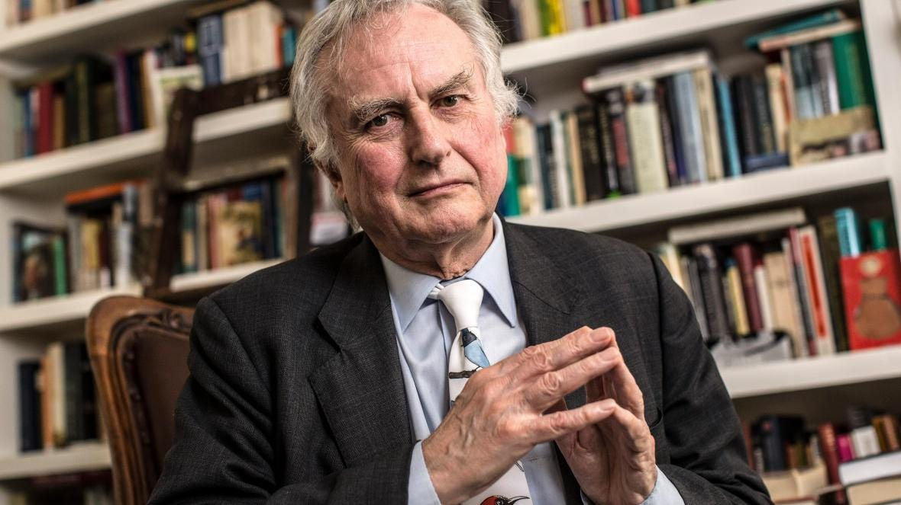

⚠️ *If you are or know a trans person who disagrees with my arguments and would be open to discussing this topic in a podcast, feel free to [contact me](mailto:pontes.ariel@gmail.com)*.

*Source: [The Times](https://www.thetimes.co.uk/article/richard-dawkins-will-give-away-the-god-delusion-to-muslims-bx5zzvzl7)*

***[Disclaimer**: The views and opinions expressed in this article are those of the authors and do not necessarily reflect the official policy or position of Young Humanists International.]*

Last Monday the American Humanist Association (AHA) retroactively [withdrew](https://americanhumanist.org/news/american-humanist-association-board-statement-withdrawing-honor-from-richard-dawkins/) Richard Dawkins’ 1996 award of “Humanist of the Year” due to “a history of making statements that use the guise of scientific discourse to demean marginalized groups”. The reward was withdrawn after a series of tweets about trans identity.

[https://twitter.com/RichardDawkins/status/1380812852055973888](https://twitter.com/RichardDawkins/status/1380812852055973888)

After the backlash, he published a tweet clarifying his point.

[https://twitter.com/RichardDawkins/status/1381665011127451652](https://twitter.com/RichardDawkins/status/1381665011127451652)

In 2015, he had also said he calls trans people by their preferred pronouns “out of courtesy”.

[https://twitter.com/RichardDawkins/status/658622852405534721](https://twitter.com/RichardDawkins/status/658622852405534721)

His explanation, however, was not enough for the American Humanist Association.

> His latest statement implies that the identities of transgender individuals are fraudulent, while also simultaneously attacking Black identity as one that can be assumed when convenient. His subsequent attempts at clarification are inadequate and convey neither sensitivity nor sincerity.
>
> — [American Humanist Association](https://americanhumanist.org/news/american-humanist-association-board-statement-withdrawing-honor-from-richard-dawkins/)

## Radical honesty

Over the last few years I have become a huge fan of [radical honesty](https://en.wikipedia.org/wiki/Radical_honesty), a philosophy that promotes being open about what you feel and believe, no matter how scary or embarrassing, without ever telling white lies or lying by omission. I think this is an extremely powerful tool in conflict resolution. It is in fact one of the principles of [nonviolent communication](https://en.wikipedia.org/wiki/Nonviolent_Communication), and I believe this is something that the Humanist movements really needs in this moment.

To be clear, I am very far from a nonviolent communication guru, and I think their principles are much easier to apply in interpersonal disputes than in political conflicts between entire groups. That being said, I do think it’s important for us to be honest about our thoughts and emotions and to genuinely try to understand the other side, no matter how much we may have grown to despise them. Either we learn to cooperate, or we split into factions, and the last thing I want is a fractured Humanist movement. So here are some of the thoughts I’ve had since Dawkins’ title was withdrawn:

- At first, I honestly and truly didn’t understand how Dawkins’ tweet could possibly be construed as transphobic. I understand it a bit more now but I still find “transphobic” too strong a word.
- I never really understood what people meat when they said “a trans woman is really a woman”. I thought this was only a consequence of defining “woman” by identification and not biology. I now know there are arguments claiming that trans women really are women in some sort of biological sense, but I find those arguments problematic.
- Cancel culture for me is not simply a culture that cancels people sometimes. It is a culture that cancels people too easily. I don’t think it’s always wrong to cancel somebody no matter what they say. I think this a overly simplistic and black and white interpretation of what free-speech enthusiasts promote. I just think that in the last few years this has been done too often, and for too little reason.
- Perhaps we shouldn’t treat Dawkins as an individual, but as the representative of his followers. You may say all you want that Dawkins is a public figure and should have known better, but his followers who also don’t know better will see him as a symbol of themselves. Dawkins’ words are something that I could have said myself with no malicious intent, and when I see him being attacked for it, I feel to some degree personally attacked.
- Dawkins supporters see his tweet not as a gratuitous provocation against trans people, but as an invitation for open debate. An invitation to question ideological dogma and think rationally and honestly about a divisive, difficult, but important issue of our time.
- Although I think offending people gratuitously is bad, I believe there are values that are worth upholding even if they cause some level of discomfort as an unavoidable side-effect. I am always willing to adapt my discourse so as not to offend people, but only to the extent that it’s possible to do it without mischaracterizing my own beliefs.
- I believe offense is a response to taboo violations, and I believe taboos are often, if not always, extremely cultural. I believe it is possible to learn and also to unlearn them.
- When I express my beliefs sincerely, trying to be as polite and inclusive as I can without mischaracterizing my own views, and I am met with hostility, it is impossible to overstate how profoundly disturbing this experience is and how uncannily similar it is to the experience of coming out as an atheist in a Christian family. This, I believe, is why so many atheists resent linguistic taboos and cancel culture.

I think the last point is particularly important, especially to young Westerners who have atheist parents and even grandparents. It is an extremely disturbing experience to feel like you are stuck in a cult, and that your closest relatives cannot be trusted not to react violently if you reveal core beliefs that you find rational and harmless. I was the first person to ever come out as an atheist in my family and, although I was lucky enough to have relatively progressive relatives, I was met with more hostility than I expected, and I still find myself in uncomfortable situations with my family in which I feel peer pressured into pretending to believe things that I don’t believe in and engage in practices that I don’t support.

I believe it’s important to share these thoughts because they will frame my arguments and hopefully people will understand better where I’m coming from. With that said, however, I will now explain what I think is wrong with many of the anti-Dawkins arguments I have heard. I want to make it clear that it is not my intent to mock or ridicule anybody, and that I just find it important to explain my side of the story as a supporter of empathy and compassion but also of honest and open dialogue.

## Interpreting charitably

Any statement is open to interpretation. In philosophy and rhetoric, the principle of charity states that we should always try to be as charitable as possible when interpreting our interlocutor. In other words, we should never assume that our interlocutor is being a dumb asshole when he could reasonably be interpreted as saying something sensible and harmless. My first problem with AHA’s statement is that it is too vague and open to interpretation. I can interpret it in at least four ways.

### Guilty of intentional harm

When the AHA claims that Dawkins’ latest statement “implies that the identities of transgender people are fraudulent”, they seem to be interpreting what was originally phrased as a statement of fact as a blanket accusation against trans people. If they think Dawkins intentionally meant to dismiss trans people as fraudulent, this is not at all a charitable interpretation. Worse still, they are formulating their own interpretation as a statement of fact, as if it is something indisputable. But it is very much disputable. Dawkins himself explicitly stated in his subsequent tweet that he didn’t mean to disparage trans people. What else do we want from him?

### Guilty of harm by neglect

But maybe I’m wrong. Maybe I’m the one interpreting the AHA uncharitably. Perhaps they do concede that Dawkins didn’t mean to accuse, but they think that his tweets are still harmful because it will inevitably be interpreted like this by most, which is hurtful for trans people and fuels conservative narratives that further harm them. In that case, their argument would be that no matter what Dawkins meant in his heart, his reckless use of language causes so much harm that he must be held accountable for his negligent behavior. But is it really true that most people would interpret Dawkins like this? And by framing their own interpretation as a statement of fact, isn’t the AHA actually encouraging other people to interpret it as hurtful, and actually causing harm themselves in a self-fulfilling prophecy?

### Guilty of potential harm by neglect

Some people go even further, and say that it doesn’t matter if Dawkins’ tweets would be interpreted in a negative way by most people or not. If even a single trans person feels hurt, he did something wrong and must be held accountable. But isn’t this an impossible standard? If we would let ourselves be paralyzed by the risk of perhaps offending even a single person, wouldn’t we be forced to abandon many constructive activities, such as creating a culture of free inquiry and peaceful exchange of ideas?

### Guilty of breaking inviolable rules

Finally, some could perhaps go as far as saying that Dawkins acted immorally because he violated the rules that define what language we should use to talk about trans people. These rules, they might argue, are to be respected regardless of whether breaking them is harmful or not. But if that’s the case, who defines these rules and why should we respect them? This type of deontological thinking is dogmatic, a relic inherited from the work of Christian philosopher Emmanuel Kant. It is antithetical to the scientific values of epistemic humility and falsifiability.

## A common moral ground

Before I respond to these possible interpretations, it is worth briefly discussing what it means to say that something is right or wrong. It is often taken for granted that deep down we all know what is right and wrong, and this gives us an impression that whenever somebody does something that seems wrong to us, they are just assholes. Perhaps it would be simple if things were this way, but they are not. There is such a thing as legitimate moral disagreement. If there wasn’t, there would be no such thing as moral philosophy. As I have argued [before](https://medium.com/humanist-voices/values-we-can-all-live-by-a3bfc9269b4), any secular moral system ultimately boils down to the following axiom:

> The best action is always the one we have most reason to believe will maximize the total long-term quality of sentient life.

Because we can never know for sure which action will most contribute to the long-term improvement of well-being, we are forced to use heuristics in order to minimize error. It could be true, for example, that in a certain situation killing a patient in order to harvest their organs and save five others would actually contribute to the long-term well-being of sentient life. However, this is such an unnatural way for humans to behave that it is easy to imagine ways in which this action could backfire and ultimately cause more harm than good. If this became a common practice, doctors would inevitably start making mistakes, killing patients when this wasn’t necessary, which would lead to people fearing the health system, avoiding checkups, seeking revenge against doctors who killed their family members, etc.

For this reason, we simply make a clear law that prevents people from being sacrificed in order to save others and stick to it no matter what. Don’t kill, don’t steal, don’t spoil your children, these are all rules that we generally accept as good rules that promote well-being in general. Even if in some instances respecting the rule does more harm than good, the important thing is that the net effect of collectively respecting that rule is positive in the long run. Indeed, the appeal of Kantian ethics is largely its emphasis on strictly respecting certain rules. But we can recognize this insight and embrace it as part of a syncretic, semi-consequentialist moral framework, while leaving the dogmatism aside.

The cold hard truth is that most of the time we really have no idea whether an isolated action really is conducive to long-term well-being or not. But this is no reason for despair. This is exactly why rules are so useful. Even in a context of extreme uncertainty, we can engage in peaceful dialogue and speculate about the possible effects of enforcing a certain rule or not. After a certain amount of deliberation, we could perhaps reach a consensus, even if by compromise, and define some rules that we hope will be conducive to long-term well-being. We need a clear standard if we want to live in a functional society where we know what to expect from each other. We need clear rules if we want to cooperate.

In the context of Dawkins’ supposedly transphobic tweets, therefore, it is not sufficient to ask if he offended anyone. It’s the internet, somebody will always be offended. What we must ask is: did he violate a rule that he should have known not to violate? If we don’t agree on clear rules, we cannot claim that he did. And that’s the problem. He might very well have violated rules worth enforcing. I’m not necessarily disputing that. But we are not engaging in dialogue and educated speculation in order to collective define a clear moral code. The different political tribes of the 21st century are simply trying to impose their rules by force. In this case, the rules concern what language is acceptable when talking about trans people.

## Offense, cancel culture, and cult behavior

There are many factors that define cult behavior, but none are as evident to me as the violent enforcement of strict rules that are at the same time poorly defined and undebatable. This allows cult leaders to act capriciously, choosing on a whim what is a taboo violation and what isn’t. The withdrawal of Richard Dawkins’ 1996 title of Humanist of the Year illustrates this perfectly. The AHA claims that Dawkins’ tweets “demean marginalized groups” and “[attack] Black identity as one that can be assumed when convenient”. These are not facts. These are personal interpretations. Not everybody feels demeaned by the same things.

The language of taboo is often so vague and abstract that it sounds like poetic word salad. People will say that “Dawkins delegitimized the existence of trans people”. But what does this mean, really, when we look closely? The only way I can interpret this is as “trans people felt delegitimized by Dawkins’ discourse”, which may or may not be true. People choose their wording to make it sound like they are stating objective facts, but all they are doing is saying how they feel subjectively, or speculating about the subjective experiences of other people. An objective statement is only meaningful if it is empirically [falsifiable](https://en.wikipedia.org/wiki/Falsifiability) at least in principle. If you say “Dawkins’ discourse delegitimizes the existence of trans people, even if most trans people don’t feel delegitimized”, you’re losing touch with reality.

This is not to say that it isn’t true that most trans people feel delegitimized, or that subjective experience isn’t important. They may very well feel delegitimized and, as I have argued, subjective experience is the very basis of morality. But by using such an obscurantist narrative we are avoiding the very question we should be trying to answer: what rule exactly has Dawkins violated, and do we really have good reason to believe that enforcing such a rule would be beneficial? In a way, it’s no surprise that people avoid this question. If you simply feel outrage and intense righteous indignation when somebody violates some vague rule that your tribe subscribes to, but you don’t really know how to make sense of those emotions and actually argue for your position rationally, all you can do is repeat the usual slogans you’re familiar with.

Another strategy people use when they are angry but have no arguments is to attack the identity of their opponent. A common criticism is that “straight white men” such as Dawkins approach everything with the distance of a privileged academic, and that his opinion is irrelevant and trans people are the only ones who should be heard. I honestly think this type of identity politics harms exactly trans people first and foremost. One of the most important practices in conflict resolution is exactly to involve an impartial arbitrator that has no skin in the game so that they can analyze the situation from a more neutral perspective and try to rationally find a solution that will please both sides of the dispute.

Of course, this third-party will always have their own biases, and we can and should question that, and we should definitely make more efforts to give a platform to traditionally oppressed voices. But we don’t have to do whatever we’re told just because a self-proclaimed victim is ordering us to do it without providing any real argument. Hearing a neutral third-party is important, even if their neutrality is questionable. This is literally the role of the judiciary system and there is probably no institution that has contributed so much to the reduction of violence in the world.

> Probably Hobbes got it right when he said that a leviathan, a third party with a monopoly on the use of legitimate use of force in a territory, might be among the biggest violence reduction techniques ever invented.
>
> — [Steven Pinker](https://www.npr.org/2012/10/08/162376635/war-and-violence-on-the-decline-in-modern-times?t=1618923000493)

But in our polarized society there is no space for intervention. No space for dialogue. No space for reconciliation. No place for moderation. If you trigger us, we cancel you. If a person or group tries to act as a conciliator, they will be framed as patronizing centrists who are silencing the very minorities whose voices should be heard. Anger is righteous and romantic, reason is elitist and oppressive. This attitude is extremely dangerous and anti-intellectual.

This is the problem that I have with cancel culture. Of course Dawkins still has a platform, of course he still has the legal right to free speech, of course he hasn’t really been “silenced”, of course the AHA has “the right” to reward whoever they want and withdraw whatever reward they want, and of course if a former Humanist of the Year becomes a raging nazi I would support withdrawing his award if dialogue had been attempted and failed. The problem is not that nobody should ever be cancelled no matter what. The problem is that cancelling somebody over a small slip is a punitive, vindictive act of public shaming with no positive value. It serves only to damage the reputation of your opponent as retribution for either having been personally hurt or on behalf of a group you claim to defend and believe was hurt, or perhaps to deter others from violating the rules your tribe is trying to impose. It serves no pragmatic, long-term, [restorative](https://en.wikipedia.org/wiki/Restorative_justice) purpose.

Cancel culture, as many have pointed out, is the 21st century version of angry mobs looking for witches to burn. Supporters of cancel culture are quick to dismiss the comparison for being exaggerated, but of course it is exaggerated. Nobody is suggesting that having an honorary title withdrawn is nearly as bad as being hanged by short drop. But the similarities between the two phenomena are almost impossible to miss. It is a collective hysteria. Individuals spontaneously form a synchronized mob, anger takes over, reason is suspended, and nothing will appease them if not the cancelling of their opponent.

In a way, I can understand why cancelling somebody must feel vindicating, especially for minorities, who have felt powerless throughout their entire lives under systems of oppression and who now feel they finally have a voice if only they synchronize with their peers online. But although we should forgive the cancellers, we shouldn’t condone the cancelling. Fueled by the outrage machinery that is social media, all this culture does is create an atmosphere of fear in which even the most compassionate people are afraid of expressing their opinions because they don’t want to risk being ostracized over an honest mistake. This is not a healthy environment in which we can inquire freely, exchange ideas, and collectively update the rules that guarantee our peaceful coexistence.

## Defining rules together

So far I have mostly criticized the anti-dialogue narrative of cancel culture apologists. But even though this narrative is becoming mainstream in some progressive circles, it is not the only one. It is possible to be progressive, to support trans rights, and to be rational and open to dialogue. So are there rational arguments to be made in favor of socially enforcing clear rules regarding what constitutes trans-inclusive language?

### Rachel Dolezal

The first mistake made by Dawkins, according to his critics, was to compare transgender people with transracial ones. According to their interpretation, this is a way to mock trans people by comparing them with a group that is generally perceived as “ridiculous”. This comparison is therefore seen as Dawkins’ way to make a slippery slope argument. Men are asking to be called women now, next think you know white people will call themselves black. But is this really what Dawkins meant?

That’s the problem with this debate. It is all based on subjective interpretation. I honestly didn’t interpret it like this when I read his tweets. I read about Dolezal and she seemed like a troubled person with a difficult history who could potentially be genuine. I didn’t think Dawkins was using her to make a subtler version of an “[attack helicopter](https://knowyourmeme.com/memes/i-sexually-identify-as-an-attack-helicopter)” joke. Could I be wrong? Of course. But I could also be right. The truth is gender dysphoria is a very perplexing and difficult thing for most people to understand. It’s only natural for people to see transgender and transracial people as similar in some ways.

Of course transgender people are much more common, and actually exhibit some identifiable psychological patterns that earn them a medical label, while identifying as another race seems to be a symptom that results from extremely different circumstances in different people. But still, cancelling Dawkins over this comparison might send the message that, if transgenderism seems similar to transracialism to you, you’re a transphobic bigot who should be silenced. How is that a good idea if you’re a trans activist and want to get ordinary people from diverse backgrounds to support your cause? In any case, if trans people who actually have experience with these issues find it counterproductive to make this comparison, I am happy to comply and avoid it myself.

### Choice

One of the passages from Dawkins’ tweet that seems to have triggered many progressives was “Some men choose to identify as women”. They might say, for example, that if a man develops gender dysphoria, she will simply identify as a woman, period. It is an involuntary process. If I wake up tomorrow and discover that I actually have a female body, and that my memories of being a cis man are false, I will still feel and identify as a man. It may be a choice for me to *publicly* identify as a man, but not to simply identify as a man. That is beyond my control. No matter how much I may want to identify as a woman, I can’t. Personally, I find this a reasonable use a language. Having seen how sensitive people feel about this, I will avoid this language in the future and I encourage Dawkins and others to do the same.

### Literally a woman

Another passage people seem to have taken issue with is “You will be vilified if you deny that they literally are what they identify as”. To some supporters of trans rights, this suggests that to be literally a woman is to be a biological woman with XX chromosomes. And yes, I know sex is more complicated than XX and XY, but just because not everybody fits the male/female binary, it doesn’t mean that nobody does. Most of us do.

In any case, here we face a problem of convention and semantics. The reality is that humans are [natural-born essentialists](https://www.psychologicalscience.org/observer/why-we-like-what-we-like). Throughout most of hour history, the word “woman” was used to denote “people born with vaginas” while “men” was used for “people with penises”. Of course not everybody fits that binary. There are chromosomal males who are born with female phenotype due to an [enzyme deficiency](https://www.independent.co.uk/life-style/health-and-families/health-news/guevedoces-girls-who-grow-penises-age-12-10510919.html) and only develop a penis and other typically male traits during puberty. In small villages in the Dominican Republic, where this is a common phenomenon, people give these people alternative names, such as “Guevedoces” (“penis-at-12”) or “Machihembras” (“first women, then man”), which suggests that they see them as women who become men.

When we discovered chromosomes, and realized that in [over 98% of cases](https://en.wikipedia.org/wiki/Intersex#Prevalence) XX means vagina and XY means penis, it was natural to incorporate that into our language and think of women as people with XX chromosomes, men as people with XY chromosomes, and intersex as the rest. [We now know](https://blogs.scientificamerican.com/voices/stop-using-phony-science-to-justify-transphobia/), however, that even embryos with typical XX or XY chromosomes can still develop intersex conditions. To some, this is enough reason to say that even if you have XY chromosomes and a typically male phenotype, genes and other biological and environmental factors can cause chemical imbalances during the development of sexual traits, turning you essentially into some sort of cognitively or neurologically intersex person who cannot reasonably be called a man in spite of your external male phenotype.

They conclude, therefore, that if a phenotypic male identifies as a woman, she probably has developed in such a way that the functioning of her body at the neurological or otherwise biochemical level is more similar in some ways to the functioning of a typical cis woman. Since we are entirely a product of our biology and how it interacts with the environment, we could therefore say that a trans woman really is, internally, a biological woman, since the most important aspects of her biology, such as cognition, neurochemistry, etc, are more typically female than male, and this supposedly compensates for the typically male phenotype.

Although I could concede that this is a reasonable linguistic convention in principle, there are a couple of problems. First, scientists and medical professionals cannot simply establish their own linguistic conventions and then say that if the general population doesn’t adopt the same conventions, they are using language incorrectly. That’s just not how language works. If in ordinary language “literal woman” means “phenotypical” or even “chromosomal woman”, this is what it means and there is nothing factually wrong about that. If you think people should adopt the new scientific meaning of an ordinary word, you are making a prescriptive claim, and therefore entering the territory of moral philosophy.

Should we use this scientific convention? If so, why? Is it because using scientific terms in ordinary language makes us more scientifically literate and helps us communicate more precisely? Or is it because trans people feel more included if we use language like this? Whatever it is, if it is a moral claim, you have to argue that enforcing this linguistic rules would be beneficial in some way, and better than any other alternative.

The second problem with this convention, however, is that it defines gender dysphoria by appeal to certain measurable biological traits that should be typically associated with the sex the person identifies as. This creates the possibility that in the near future we may start to categorize people who claim to have gender dysphoria as “real” trans people and “fake” trans people. A real trans woman, for example, would have to exhibit some genetic, hormonal, or neurological patterns that are more typical of cis males, while a fake trans woman would look as typical as any other man by any possible metric. Would this mean that we now only have reasons to refer to “real” trans women as “women”? Do we really want to open the door to this possibility? I don’t, which brings me to my final comment about Dawkins’ discourse.

### Courtesy

> Is trans woman a woman? Purely semantic. If you define by chromosomes, no. If by self-identification, yes. I call her “she” out of courtesy.
>
> — Richard Dawkins

A lot of people seem to have been triggered, ironically, by the fact that Dawkins calls trans people by their preferred pronouns out of “courtesy”. He shouldn’t call a trans woman a woman out of courtesy, they say, but because she really is a woman. But again, this is confusing facts and values. Even if we accept all the science, and accept that doctors adopted this convention, we still don’t have any reason to use the same convention as them in ordinary language. If you are offended with the way I use language, that’s because you object *morally* to the way I use language.

Imagine we find a [twin Earth](https://en.wikipedia.org/wiki/Twin_Earth_thought_experiment) that is an exact replica of our Earth. For every mountain, tree, person, language, or country we have, they have an identical one. The only difference is that in the twin Earth, water is not H2O, but “XYZ”. Let’s say we introduce H2O to their planet, and they accept it as a second form of water that is indistinguishable at the macro level from their own water. Let’s say, however, that they refer to this new water as “H2O water”, and to their own water as “real water”. Would anybody be offended? Would anybody insist that they must say that H2O water is literally, real water? Sure, that would be an option, and it would make some sense, but do we have any basis to say that their choice of language use is “wrong” in any way? Factually or morally?

I do think we should call trans people by their preferred pronouns. But it is out of courtesy, and there is nothing wrong with that. I don’t believe there is a moral obligation to replace ordinary language with scientific jargon for any other reason. Perhaps a case could be made in favor of adopting more scientific language in order to promote scientific literacy, and I would be curious to hear those arguments, but although I believe there is potential there, at the moment I still believe that compassion for trans people is the strongest argument for using their preferred pronouns.

The fact that some people find the word “courtesy” patronizing is extremely problematic. It seems to me as a refusal to admit that you might have needs, that you might wish other people to be more courteous or compassionate towards you. That you are a vulnerable and sensitive creature who can be hurt by words. But everybody can be hurt by words. I have been hurt by words countless times. Everybody has. If somebody says they haven’t, they are lying and playing tough. Changing your behavior out of courtesy and compassion is what it means to be moral. It’s what I do every time I take a deep breath instead of screaming back at somebody, every time I refrain from stealing something I could easily steal, every time I refrain from eating meat, etc.

## The limits of avoiding offense

Perhaps Dawkins would also agree to adapt and use language differently, if somebody explained it to him. Some may say that he has received plenty of explanations, and that if he won’t listen it’s his problem. But what if he disagrees? What if he simply doesn’t find this a reasonable use of language? What if he thinks it’s fair enough to say “some men choose to identify as women even though they’re not literally women”, and that it shouldn’t be interpreted as suggesting that their identities are any less legitimate?

Here we have a problem of establishing what is the level of sensitivity that we want to foster in our society. If entire communities feel offended by a certain words (e.g. “nigger”) or practices (e.g. blackface), and these words and practices are very specific and easy to avoid, it is easy to accept that they should be avoided. It is easier the more we can see historically how this language has been oppressive, and we can be empathetic and understand that, if we were in their place, we would probably also feel offended by those things. When it’s an angry internet mob, however, who says they are offended by a regular everyday expressions that we find hard to see as offensive, it is easy to see them as “oversensitive snowflakes”, and harder to adjust our behavior.

So how do we find a balance? It’s hard to say. This is an empirical question that mental health professionals are most well-equipped to answer. Whatever the answer is, however, the recommended policy will probably be to recommend some people to be more careful with their language, and other people to be more charitable in their interpretations of what others say, and perhaps also a bit more stoic and willing to learning how to manage their own emotions without exploding and blaming others.

I know that suggesting that some people may need to “toughen up” and be more stoic is taboo in today’s political climate, but I think most would agree that it is absurd to suggest as a policy that the first one to declare victimhood should *always* be considered right. It is as absurd as suggesting that they are always wrong. Clearly the ideal solution must be somewhere in between, and until the data is in, all we can do is cool down, be cooperative, and try to negotiate our boundaries peacefully.

Our feelings matter. As sentient beings, in fact, feelings are all that matters. There is no shame in asking somebody to treat you and your community in a certain way out of courtesy. If somebody mocks you for your “weakness”, they are assholes. Period. Don’t talk to them anymore. But that doesn’t mean you should never ask for courtesy from anybody again. The world is full of assholes, but it is also full of nice people. If we let assholes traumatize us and turn us into defensive, resentful, vindictive people, we will end up fighting the nice people who have nothing to do with it.

## Conclusion

Trans people are human and they deserve happiness as much as any other sentient being. Perhaps Richard Dawkins could have been more careful with his language. It was difficult for me to see what was so hurtful about what he said initially, but I am not trans and I am not a public figure. As somebody with a large platform, perhaps it would have been more responsible of him to be more aware of the sensibilities of minorities. That could have avoided unnecessary harm. On the other hand, I believe holding Dawkins to a higher standard than we hold his followers might be a problem because it will cause his followers to be defensive. I believe the ideal response would have been to invite Dawkins to discuss this issue in a public online dialogue.

The discourse of the woke fundamentalists, however, is so flawed and categorical that it prevents honest communication and cooperation. They express their own interpretation of what people may have implied as hard fact, they express their speculations about how people will react as hard fact, they try to mask prescriptive statements as descriptive ones, and they make accusations of immorality without even trying to explain how those supposedly immoral actions cause easily avoidable harm.

Of course, making people feel hurt is bad, and if we can do something to transform this world into a place where nobody ever feels hurt, that would be great. But at what cost? This is what is at the essence of this debate. What’s more important? Fostering a culture of rational and open exchange of ideas? Or transforming the world into a rigid safe space where nobody ever feels hurt by absolutely anything? I believe we must find a balance, and the only way we’re going to be able to do that is if we cool off, take a deep breath, and talk to each other calmly, rationally, and cooperatively, without insults and accusations.

The truth is trans people and all minorities need as many “persuadables” on their side as possible. In order to do that, we need to develop a narrative that’s reasonable, easy to understand for people with different levels of education, and that doesn’t require changes in linguistic convention that are too radical. We need this because we need to convert people to our cause via persuasion, not intimidation. Intimidation simply doesn’t work in a democracy. If you shame people you don’t agree with, calling them bigots and transphobes instead of trying to persuade them, they will vote for the opposition, not join your cause. This is what has given us Trump and Bolsonaro. Who should decide who’s transphobic? All of us. Together. If trans people use such a broad definition of transphobia that most people end up being labeled as transphobes, they will only alienate potential allies.

If we want minorities to be understood and supported, we need to value free speech and open dialogue, and I don’t mean free speech as a law, I mean it as an ideal. A world that values free speech as an ideal is a world in which people don’t say bigoted things because they don’t believe them, not because they’re afraid of the backlash. Of course there should be limits to free speech, I [have argued](https://medium.com/humanist-voices/six-facts-free-speech-fundamentalists-love-to-ignore-8e0daa6fa78b) in favor of these limits myself. But again, it’s simplistic to think of free speech debate in binary terms. The question has never been whether free speech should be limited at all, but how much it should be limited. I believe cancel culture limits it too much.

I know it will be hard for some readers not to put me in the heartless free speech fundamentalist box, but I’m really trying to be fair to both sides here. I find the natural human propensity to create in-group and out-group dichotomies extremely inconvenient, and I really wish my narrative could be seen as a third alternative. I want to make it clear that my beliefs about the benefits of promoting open dialogue are to some degree speculative, just as the beliefs of those who think cancelling Dawkins was the right thing to do. Maybe they are right, and cancel culture really will prove to be good when we look back one century from now. But I don’t think so. Although I don’t think we have enough data to be too confident of either hypothesis, I think I have good reason to be mildly confident that I’m right. And that’s why I think my narrative should be perceived as an alternative.

All I am promoting is epistemic humility. We must start our conversation from position of agnosticism. That’s why I believe a consequentialist morality is so important. It forces us to recognize the humbling truth that we don’t really know what’s the best thing to do most of the time. There is a name for the phenomenon of holding beliefs with an amount of confidence that is disproportionate to the amount of evidence in favor of those beliefs, and that name is faith. We are all ignorant little creatures spinning around a giant fireball and trying to figure out together how this universe works. Sometimes we will disagree, but we have to be able to resolve our disputes without vilifying each other. That’s the only way to make progress without violence.

> We have a choice. We have two options as human beings. We have a choice between conversation and war. That’s it. Conversation and violence. And faith is a conversation stopper.
>
> — Sam Harris
