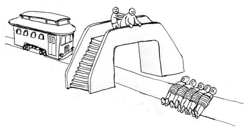

Imagine there’s a non-profit that claims to offset the meat, dairy, and eggs consumption of one average omnivore for X dollars per month. In other words, the amount of suffering that they manage to prevent with those X dollars every month is exactly the same as the amount of suffering that you would prevent if you went vegan. Now imagine two average omnivores just watched some documentary about animal cruelty and decided to do something about it. One of them decided to go vegan, and the other decided to offset their consumption of animal products. Are their decisions morally equivalent? Or is one decision better than the other?

From a strictly consequentialist perspective, their decisions are perfectly equivalent. Many vegans, however, feel uncomfortable about the idea of offsetting one’s consumption of animal products. If this is permissible, they argue, people might as well rape and then offset the harm by donating to some NGO that helps rape victims, organizes educational programs to prevent rape, etc. But does this argument really stand?

As sincere as this argument may be, it is a type of appeal to emotion. If “[reductio ad Hitlerum](https://en.wikipedia.org/wiki/Reductio_ad_Hitlerum)” attempts to invalidate somebody’s position on the basis of it being somehow linkable to Hitler, today a perhaps even more common strategy is “reductio ad stuprum”, in which any action can be attacked as morally monstrous simply by doing some linguistic gymnastics to categorize it as rape, or at least analogous to rape in some crucial way. If you manage to corner your opponent in such a way that they have no choice other than to bite the bullet and say “well, maybe sometimes rape is permissible”, the debate is over and you won. But under sufficiently unusual conditions, any action can be framed as permissible. It is permissible, if not an obligation, to commit one genocide to prevent five others from happening in a perverted trolley-problem-like situation, for example.

Part of being rational is being able to accept emotionally uncomfortable realities instead of finding excuses to preserve a fairytale world. If somebody puts a gun to your head and tells you to decapitate a child or else they will decapitate five, of course you don’t want to decapitate the one child. You will desperately grasp for excuses not to do it, appealing to idealistic notions of divine rules that should never be broken because you don’t want to admit that, in reality, you should decapitate the child and the only thing preventing you is the fact that you have such a powerful visceral reaction against it that you experience the decision as psychological torture.

If you refuse to decapitate one child and your captor goes and decapitates the five others, you don’t want to believe that you were weak and failed to do the right thing. You want to believe you’re righteous and did the best thing. But you didn’t do the best thing, and it’s important to be able to come to terms with this reality. I’m not saying you should feel guilty or ashamed of your failure to do the right thing. Having a visceral reaction against violence is in the vast majority of cases a very good evolved trait that prevents a lot of suffering, so many people would naturally react by freezing or refusing to directly cause harm. But if you’re creative enough, it’s always possible to find a hypothetical situation where a good instinct backfires, and this is one of them.

## Manual mode

In [Moral Tribes](https://www.goodreads.com/book/show/17707599-moral-tribes), Joshua Greene compares the moral brain to a digital camera that has automatic modes such as portrait or landscape, but also a manual mode. When the environmental conditions are normal enough, portrait or landscape will do just fine. When you find yourself in unusual conditions that the manufacturer couldn’t have predicted, however, you need to switch to manual mode.

Our “automatic mode morality” evolved to help us cooperate in small tribes of hunter-gatherers. We feel empathetic pain when we see others getting hurt, we feel nervous when we are about to hurt someone, we feel [righteous indignation](https://www.youtube.com/watch?v=meiU6TxysCg) when somebody gets more than their fair share, we feel guilt when *we* manage to get away with more than *our* fair share, and we feel shame when we get caught in the process. This set of gut level instincts is enough to make us cooperate in small groups without stealing food, raping, or pushing each other off cliffs or in front of trolleys. There is no need to engage in complex moral reasoning in these situations.

There are things, however, that it didn’t evolve to do. These include writing public policy, finding answers to complex moral dilemmas, or resolving moral disputes between groups or individuals. When we allow ourselves to be guided by gut-feeling while trying to solve these problems, we risk becoming irrational idealists who miss opportunities to effectively reduce suffering.

## Offsetting violence

As I have argued, in certain extreme theoretical situations, anything could potentially be justified, even the most brutal kinds of violence against humans. But does that mean offsetting violence is permissible? As I have [argued](https://medium.com/humanist-voices/values-we-can-all-live-by-a3bfc9269b4) before:

> The best action is always the one we have most reason to believe will maximize the total long-term quality of sentient life.

Now let’s say a human rights NGO decides to reduce the murder rate by selling expensive murder offsets on their website. If you kill someone, all you have to do is anonymously buy a murder offset and the harm you caused is cancelled out. Let’s assume, for the sake of argument, that this strategy, however absurd, actually works and causes the murder rate to drop even lower than it was predicted to drop by extrapolating on previous data. Now imagine two serial killers hear about this NGO. One of them decides not only to offset his murders, but to also donate a few extra dollars to the NGO, while the other one decides to simply stop killing. Who did the best thing?

One of the reasons why it’s so difficult for most people to answer this question is that all the words we have for describing our values are extremely imprecise and mean different things in different contexts. Evolutionary psychologist Geoffrey Miller, for example, argues that [we are virtue ethicists by nature](https://www.researchgate.net/publication/6254570_Sexual_Selection_for_Moral_Virtues), focusing on ranking people based on their score on a few crucial traits instead of coldly analyzing the impact of every little action they perform in terms of the suffering or happiness they caused. It is unnatural for us to analyze actions in isolation. Our brains are primed to see an action as an opportunity to evaluate someone’s character.

> When faced with a difficult question, we often answer an easier one instead, usually without noticing the substitution.
>
> — [Kahneman, 2011](https://www.goodreads.com/book/show/11468377-thinking-fast-and-slow)

Would you be a close friend or even get romantically involved with a murderer who offsets his harm? I probably couldn’t. But that is not the question I asked earlier. That’s a subjective question. I asked whether the strategy of killing and offsetting the harm is morally worse than the strategy of simply not killing in any objective sense. It may be disgusting and counterintuitive to say it for most people, but if a murderer donates more than it takes to offset his harm, then he does more against murder than a murderer who stops killing, and therefore his strategy is, in a strictly consequentialist sense, better.

## When thought experiments go wrong

Another reason why the idea of offsetting murder is counterintuitive is that it is extremely unrealistic. In modern philosophy, it has become common practice to deliberately appeal to the most bizarre and surreal thought experiments without making any serious effort to bring them closer to reality. I believe thought experiments are extremely useful, because they allow us to evaluate our principles and imagine what they would imply in different situations, but they lose their power if they cannot in any obvious way be adapted to be more realistic. Appealing to unrealistic thought experiments as a rhetorical device is useful because, by sacrificing realism, we can maximize briefness.

The [trolley problem](https://en.wikipedia.org/wiki/Trolley_problem) for example sounds a bit absurd at first and raises questions in the minds of many people, but it can easily be transformed into an [actually realistic scenario](https://www.youtube.com/watch?v=1sl5KJ69qiA). The footbridge variant, where you have to stop the trolley by pushing a fat man in front of it from a footbridge, however, is much harder to transform into something realistic, because in real life you can never realistically be so confident that the man will really stop the trolley. Sometimes “assume for the sake of argument” just doesn’t work for our primate brains. You have to actually describe something that I can imagine vividly so that I can actually feel like I have reason to feel confident, otherwise I feel that I risk just killing a fat man for nothing.

It is understandable, therefore, if you still feel skeptical about the hypothetical NGO that reduces the murder rate by selling offsets. In reality, it is hard to imagine how this could ever be achieved. Sexual violence is a sensitive topic and I have preferred to avoid this analogy, but the whole reason why vegans make this analogy is to invoke intense feelings of moral disgust, so I think it’s important to respond to this specific argument directly, even if briefly.

Rape is already illegal, there is social stigma around it, most people don’t feel the urge to rape, and it is [currently estimated that last year](https://worldpopulationreview.com/country-rankings/rape-statistics-by-country), for every 100,000 people in the world, 8 reported being raped. Of course, because of underreporting we cannot know for sure how many rapes actually happen, and it is reasonable to assume that it’s more than 8.

Still, even if we assume that only 10% of rapes are reported, and that in fact the number of rapes is 80 for every 100,000 people, it is important to understand that this is a very low number compared to the number of animals slaughtered for food per 100,000 people per year, which means it’s much harder to reduce. If we consider pigs, sheep, goats, cattle, and chickens alone, [it is estimated](https://www.weforum.org/agenda/2019/02/chart-of-the-day-this-is-how-many-animals-we-eat-each-year/) that we slaughter 2.76 billion animals per year. That’s 35,965.60 animals slaughtered per 100,000 people per year. In other words, for every person who reports a rape, at least 4,495.7 animals are slaughtered.

Of course, to compare rape with the slaughter of animals in this day and age is to ask for trouble. But my point here isn’t that “rape is a non-problem when compared to animal agriculture”, my point is simply that the cost-efficiency of preventing rape or murder cannot reasonably be compared to that of preventing animal suffering. It is [estimated](https://www.upc-online.org/slaughter/2011americans.pdf) that, in 2011 alone, 27 animals were slaughtered to feed a single average American. This means that for every average American who goes vegetarian, approximately 27 animals are indirectly saved every year, or one animal is saved for every 14 vegetarian days. That is a tangible difference that a person can make by a relatively simple change of behavior.

There is nothing we know of, however, that could possibly have such a tangible impact on reducing the rate of rape or murder. The sheer number of animals slaughtered every year is so colossal that even by extremely pessimistic estimates, it is still reasonable to assume that a certain amount of money has a certain specific impact. If we assume, for example, that an average American eats 3 meals per day, all including meat, we could assume that the impact of financing 3 vegetarian meals per day is equivalent to going vegetarian for a day. Multiply that by 14, the number of vegetarian days necessary to save an entire animal, and you have a very reasonable way to offset one animal death.

An even easier way of thinking about meat offsets is to focus on meals instead of animals. The whole premise of veganism is that each meaty meal that is prevented reduces harm by reducing demand for meat. If a vegan person decides to cheat and have a meaty meal one day, all they have to do to offset that harm is give a vegan meal gift-card to somebody who would have otherwise eaten meat for that meal and their harm is cancelled out. Of course, it’s hard to know for sure if the recipient of the gift really would have eaten meat were it not for the gift-card, but with enough creativity we could find ways to compensate for that uncertainty. What matters is the total number of meaty meals in the world that you replaced by vegan ones, that’s the only thing that affects demand for meat in the market. It doesn’t matter who eats them, as long as a meaty meal is prevented.

I cannot imagine, however, anything that a murderer could do to offset his murder. It is simply impossible, or even if somebody does come up with some creative solution, it will be prohibitively expensive. I think deep down we all have this intuition, and therefore we are skeptical about murder offsets. But imagine we lived in a dystopia where a pandemic infected most people with a virus that cause them to occasionally lose control of themselves and become zombie-like murderers. Imagine that this shot up the murder rate sky high, but that a cure was discovered, only that this cure requires taking a pill every day for the rest of your life, and these pills are kind of expensive to make, so not everybody has access to it. On any given year, you could either take the pills yourself, or buy the pills for somebody else. Does it make any difference which option you choose?

Again, from a consequentialist perspective, it doesn’t. But even if we assume the pandemic is over and everybody was immunized for life, would I want to be friends with somebody who used to kill and then offset his harm by financing somebody else’s pills? Or would I prefer to be friends with a person who always took their pills, even if they occasionally had to steal money to afford them? Clearly, the latter. I don’t know what to expect from a person who can calmly live with the knowledge that they killed a bunch of people in fits of zombie-like rage. I would be scared of this person, and I would be scared of tolerating this behavior as a social norm. And I believe that I would be scared for good reason. My instincts didn’t evolve by chance. They evolved as a result of real evolutionary pressures.

## Conclusion

Human psychology is complicated. When we’re asked whether some pattern of behavior is moral, our brains hear multiple questions at the same time:

1. How much harm does it cause? (the act-utilitarian interpretation)
2. Would I be friends with somebody who acts like that? (the virtue ethics interpretation)
3. Should we tolerate this behavior as a social norm? (the rule-utilitarian interpretation)

Sometimes the answer to these questions can be quite different, and that’s OK. It is possible that a certain isolated action whose net-impact on well-being is positive should still not be tolerated as a social norm because of practical concerns. A surgeon who kills a check-up patient and donates their organs, saving five other people, may prevent suffering in the short-term. But it is easy to see how attempting to tolerate this behavior as a social norm could end up provoking more harm than good simply by increasing the level of background fear in society. It is also easy to understand if the spouse of such a surgeon gets shocked and divorces them upon hearing their confession.

In the case of offsetting the consumption of non-vegan products, however, it isn’t so easy to see how the tolerance of such behavior could backfire. Like it or not, the reality is that most people love meat and have a lot of difficulty going vegan. Most of us still live in extremely [carnist](https://en.wikipedia.org/wiki/Carnism) cultures and are bombarded with burger ads and sights of people enjoying meat next to us all the time like it is perfectly harmless. Trying to go vegan in our world is like trying to quit smoking in the 50’s. I’m sure it’s possible and many people succeed, but it is hard for most.

If you cannot personally befriend or date meat eaters because they arouse too much moral disgust in you, that’s fine. We all have our tastes and deal-breakers. But I don’t think there is any sensible reason to believe that tolerating meat offsets as a social norm would backfire and prevent us from reducing suffering. On the contrary, I believe it is an extremely good opportunity to reduce suffering.

It is important to note that I am not promoting offsets as a long-term solution. Indeed, offsets are unsustainable long-term. The more vegan the world becomes, the harder it will be to find a meat eater who only eats vegan because it’s free, and therefore the harder it will be to offset a meal. If the non-profit that offsets meat consumption works basically as a vegan food bank that uses offset money to serve vegan food for free, then if at some point they don’t have enough meat eaters eating their food, they will not be able to offset all the harm they’re paid to offset. But we are still very, very far from this reality.

If we implement them well, meat offsets could not only reduce suffering in the short-term, but it could help us turn the world into a place where eating meat is so rare that meat offsets are unaffordable and no longer viable. Free vegan food could make veganism more familiar to new segments of the population, and the more the public is open to vegan food, the higher the demand will be and the more companies will invest money in becoming more vegan-friendly, producing high-tech meat replacements, or even creating cultured meat.

Maybe one day we will live in a vegan utopia where animal slaughter is illegal and the violation of this law is as infrequent as cases of rape or murder today, making it virtually impossible to offset the death of one animal for any realistic amount of money. Until then, meat offsets sound not only permissible to me, but something we should all passionately promote if we really care about the reduction of animal suffering.
