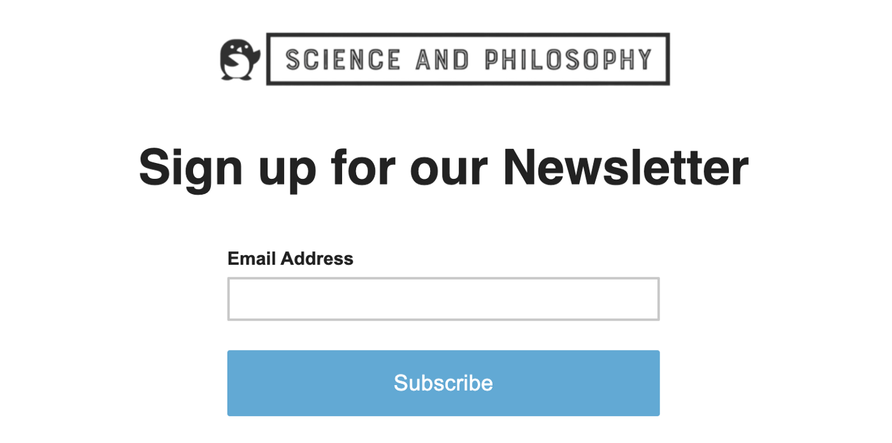

In moral philosophy, it is usually said that something innocuous, such as eating french-fries, is morally permissible, and that something very harmful, such as burning children alive, is impermissible. Something is called a moral obligation when we think it is impermissible *not* to do it, such as for example helping a child who’s drowning in a pool. Doing what’s impermissible is considered an immoral act of commission, while failing to do one’s obligation is an immoral act of omission. But is there really a sharp, objective boundary between permissible and impermissible, obligatory and optional, commission and omission? And if there isn’t, does it mean moral relativists are right and morality is just a matter of opinion? In this article I defend the perhaps controversial view that, although morally imperfect, eating meat is neither permissible nor impermissible.

## The subjective side of ethics

Logical positivism was a philosophical movement that attempted to approach philosophy as rationally as possible. Inspired by the success of the natural sciences, they concluded that philosophical claims that cannot be empirically verified are nothing but meaningless metaphysics. This was called the principle of verification, and although it has been somewhat controversial, it was extremely influential and eventually matured into the principle of falsifiability, a widely accepted idea in contemporary philosophy of science. Falsificationism argues that, in order for a claim to be considered scientific, there must be conditions that would prove it false. If there aren’t, we are talking about faith and speculation, not science.

The problem with absolute claims about moral permissibility and obligation is that they are unverifiable and therefore factually meaningless, like “[the present king of France is bald](https://en.wikipedia.org/wiki/Definite_description#Russell's_analysis)” or “[colorless green ideas sleep furiously](https://en.wikipedia.org/wiki/Colorless_green_ideas_sleep_furiously)”. If you cannot, even *in principle*, verify whether an action is permissible or not, it is hard to understand what it means for something to be objectively permissible. For example, if I say that there are dragons somewhere in this galaxy, we can at least imagine in principle how we could proceed to test the truth of this statement. We could go planet by planet, looking for dragons, and if we found one we would know that it is true. If you tell me, however, that you have a dragon in your garage who is invisible, untouchable, does not emit heat or anything detectable by any measurement device, I wouldn’t understand what you mean by “dragon” anymore.

Whether an action is morally better than another, however, is perfectly verifiable. If not in practice, at least in principle. If we verify and confirm that an action contributes more than another to the minimization of long-term aggregate suffering in the universe, that is the objectively better action. Talking about morality is like talking about height. Some people are objectively taller than others just like some actions are objectively better than others. But if you ask whether a certain person is tall in general, without establishing a reference point, any answer will be subjective. Similarly, it is impossible to determine whether an action is morally permissible without a reference point, and a reference point can only be established by convention. Permissibility and tallness are “[fuzzy concepts](https://en.wikipedia.org/wiki/Fuzzy_logic)” or “[vague predicates](https://en.wikipedia.org/wiki/Vagueness)” if you like jargon.

Of course, most would agree that Michael Jordan is tall and Danny DeVito is short, just like most would agree that Hitler was bad and Nelson Mandela was good. But convergence of opinion is not the same as objectivity. If we all agree that a certain painting is beautiful, we can say that the beauty of the painting is objective in an [intersubjective](https://www.jstor.org/stable/27902304) sense, but not in an absolute sense. If a single person says the painting is ugly or boring, they cannot be meaningfully said to be wrong in any way. It can only be said that their taste is unusual. If Danny DeVito says he’s taller than Michael Jordan, however, he wouldn’t be merely exhibiting eccentric taste, he would be delusional.

Does that mean we shouldn’t say that Hitler was a morally bad person? We don’t have to go that far. When there is sufficient agreement on the badness of a person, referring to them as morally bad is natural and doesn’t cause any controversy. It would be unrealistic to expect people to stop using common sentences like “Hitler was a bad person” or “Michael Jordan is tall”. But what if there isn’t sufficient agreement? Is it productive in any way to call people unethical just because they don’t meet our subjective notion of minimum decency?

## The ethics of meat eating

Many vegans seem to think that eating meat, no matter how rarely, is impermissible. They oppose [reducetarianism](https://en.wikipedia.org/wiki/Semi-vegetarianism) on the grounds that promoting a reducetarian diet is like asking violent husbands to beat their wives less often. But does this comparison really make sense? As I have argued, nothing is objectively impermissible. But this doesn’t imply that everything is permissible. This would be like saying that, because nobody is objectively tall, then everybody is short.

Because we cannot *discover* whether wife beating is objectively permissible or not, we have to stipulate by convention whether this is a behavior we want to tolerate as a society or not. In most developed societies, we have decided that we do not want to tolerate this behavior. This means we have created laws and social norms that attempt to protect women from violence and to hold abusers accountable. We enforce these social norms when we intervene to stop violent behavior, when we hear violent fights and call the cops, and when we fund women’s shelters. This all shows that wife beating is in a practical sense impermissible in our society. It is impermissible because it is treated as impermissible. You cannot publicly beat your wife and get away with it easily.

But what about eating meat? Vegans know very well that eating meat is largely tolerated in our society, but they usually say that this is wrong and that one day we will look back and realize that we were wrong to tolerate it. Still, even the most staunch vegan wouldn’t go as far as physically preventing a person from eating meat. This means that even they participate in tolerating this behavior to some extent. In what sense then could it be said that eating meat is impermissible? I don’t see any. Vegans may wish that meat eating wasn’t tolerated all they want, but if they can’t convince a critical mass of people to enforce their social norms, this will remain a distant dream.

The nature of domestic violence was such that we managed to stigmatize it without needing to take intermediate steps such as promoting reduction. But is it really reasonable to assume that the same strategy will be effective in the case of meat eating? There isn’t much data available on the number of perpetrators of domestic violence, but in the U.S. there are [780,407](https://www.safehome.org/data/registered-sex-offender-stats/) registered sex-offenders, and in 2020 the total number of violent crimes was [1.31 million](https://www.statista.com/statistics/202714/number-of-committed-crimes-in-the-us-by-type-of-crime/). Even if we assume that each crime was committed by a different person, this means that violent criminals are less than 0.4% of the population. This is an order of magnitude lower than the [staggering 92%](https://www.ipsos.com/sites/default/files/ct/news/documents/2018-09/an_exploration_into_diets_around_the_world.pdf) of people who eat meat in the world. One cannot reasonably expect meat eating and domestic violence to be solvable using the same strategies.

But I don’t think vegans are so delusional as to hope that we can stigmatize meat eating in the same way that we have managed to stigmatize wife beating. I don’t think they promote the notion that eating meat is impermissible because they think that this is pragmatically the best strategy. I think they genuinely believe that, if morality is objective, then moral permissibility must also be objective. But as I have argued, this is not the case. Being vegan is better than eating meat, I agree that this is an objective moral truth. But that doesn’t mean eating meat is objectively impermissible. Nothing is. Just like nobody is objectively tall.

## A moral baseline

The discussion about moral permissibility is a discussion about our collective moral baseline. What do we consider morally tolerable as a society? We could all be better people than we are, but what is the bare minimum that we should do? You may be a vegan, but do you also make regular donations to effective animal charities? And if you do, why don’t you donate more? If saving animals by being vegan is a moral obligation, then why is it that saving animals via donations is optional?

Here many vegans will bring up the distinction between omission and commission. Eating meat is impermissible, they say, because it is an act of commission, while failing to donate is merely an act of omission. But is this distinction really relevant? Are you really ready to say that it’s permissible to pass by a child drowning in a shallow pond and do nothing? Sure, you might say that failing to save a child is not as bad as actively pushing the child into the pond, but I doubt most people would go as far as saying the former is permissible. From the perspective of an animal, whether they’re being saved by donations or strict veganism clearly doesn’t matter.

Besides, the boundary between omission and commission is really not as sharp as it may seem at first. Imagine the Jigsaw Killer has implanted an unwitting victim with a device that will explode and kill them unless you follow the instructions on an app. Every day, the app gives you different challenges, and you have to complete them or else the other person will be killed. You also have a monitoring device implanted in you, so one day the app may tell you to fast for 24h, on another day it might tell you to take 10,000 steps, etc. If one day you got tired of the game and let the other person die, would that have been an act of omission or commission?

We are programmed to pay attention to effort and intention because it’s adaptive. By observing the efforts a person makes intentionally, we can infer their goals and values. We judge people who push children into ponds to drown because these people are dangerous and it is adaptive to judge them and fear them. They take action and make efforts in order to harm others. If you cause a death by refusing to play a game, the amount of blame you will receive will be inversely proportional to the effort that was required from you. If you refused to skip lunch, you would probably be judged very harshly. If you refused to cut off your leg, probably not so much.

Passively going with the flow and eating meat everyday because that’s what everybody around you does may not be ideal, but it doesn’t make you a threat to other humans. In our society, it is veganism that requires effort and planning, not omnivorism. If we lived in a vegan utopia and still some people got out of their way to kill animals and eat them, the situation would be very different.

In any case, even if you still think omission and commission matters, this doesn’t threaten my argument. Vegans still cause active harm through their actions in myriad ways. We fly planes, buy goods wrapped in plastic and transported by carbon-emitting vehicles, eat resource-intensive foods, industrially farmed vegetables, etc. This is all harmful to the environment and to animals, but we do it anyway because it’s convenient and we don’t all have the time, energy, and motivation to be like Belle, the “superlocavore” described by Tobias Leenaert in [How to Create a Vegan World](https://www.goodreads.com/book/show/35468340-how-to-create-a-vegan-world):

> Let me present to you Belle, the superlocavore (SV) vegan (from locavore: eating locally). Belle takes into account the fact that in the mechanized harvesting of plants, many small rodents and birds, not to mention insects, are killed. So Belle only eats what she harvests (by hand) from her own organic garden (and those of her fellow SVs). She doesn’t purchase anything from stores.
>
> — [Leenaert, 2017](https://www.goodreads.com/book/show/35468340-how-to-create-a-vegan-world)

So how come is it impermissible to eat meat but permissible to finance the killing of small rodents, birds, and insects? Drawing the line at “normal veganism” instead of “superlocavoreism” is completely arbitrary.

## A pragmatic approach to permissibility

> Asking people to give more than almost anyone else gives risks turning them off. It might cause some to question the point of striving to live an ethical life at all. Daunted by what it takes to do the right thing, they may ask themselves why they are bothering to try. To avoid that danger, we should advocate a level of giving that will lead to the greatest possible positive response. […] Hence in this chapter I propose a much easier target: roughly 5% of annual income for those who are financially comfortable, with less for those below that level, and significantly more for the very rich.
>
> — [Singer, 2019](https://www.goodreads.com/book/show/49005196-the-life-you-can-save)

[Approximately 92%](https://www.ipsos.com/sites/default/files/ct/news/documents/2018-09/an_exploration_into_diets_around_the_world.pdf) of all people in the world eat meat at least occasionally. Humans have evolved and adapted to hunt animals and to crave, cook, and digest meat. It is part of our biology and it pervades almost all human cultures. This is not to say that we shouldn’t try to reduce our meat consumption down to zero, we should. But to think we can do this by persuading people to go vegan overnight is simply delusional. I believe it is much more realistic to promote a reducetarian diet. Once we have a critical mass of reducetarians, making the transition to a vegan society will be much easier.

> As reducers together consume many more vegetarian and vegan meals than vegetarians and vegans, we may assume they are also the main buyers of veg meals and products. It makes sense that producers and distributors of vegan meals and products see this segment of the market as their primary target (Shore). Yves Potvin is the founder and president of the Canadian company Gardein, which produces meat alternatives. In a personal correspondence, he told me: “Flexitarians are the key to changing the world and the largest group that purchases Gardein, as vegans and vegetarians are still a small percentage of the population and flexitarians are on the rise.”
>
> [Leenaert, 2017](https://www.goodreads.com/book/show/35468340-how-to-create-a-vegan-world)

The term “permissibility”, therefore, should ideally be avoided when discussing meat consumption. Unfortunately, the words “moral” or “ethical” are often used as synonyms for “morally permissible”, so it won’t be easy to adapt our language, but I believe it is important. It is important because most people don’t feel that eating meat is morally impermissible, and no movement can expect to become mainstream if its central claim is completely incompatible with the intuitions of 92% of the population.

Of course, slavery was once considered permissible and we managed to change it, that’s true. But slavery wasn’t defeated by self-righteous activists convincing the general public that buying cotton was impermissible. It was defeated by pragmatic activists who focused on legal advocacy rather then attempting to change consumer behavior.

## A better moral language

Being a reducetarian, I’m in a weird twilight zone between vegans and regular, non-reducetarian omnivores. I am sure that many vegans will describe my arguments as “excuses” to eat meat, while omnivores will object to my claim that being vegan is objectively better than not being vegan, all other things being equal. To the vegans, all I can say is that I don’t need excuses. I can easily go back to eating meat every day and I will suffer no consequences. I don’t need to explain my behavior to anybody. I live in a [carnist](https://en.wikipedia.org/wiki/Carnism) society and there is no pressure on me to do that.

To non-reducetarian omnivores, all I can say is that recognizing that eating meat has a moral cost does not imply that it is impermissible. You’re not a hypocrite if you don’t become a vegan. People are in very different places in terms of how radically they can afford to change their diets. Going vegan is hard for some people and requires a time and energy investment that not everybody is able or willing to make. Reducing your meat consumption by any amount is better than nothing.

> This is the essence of intuitive heuristics: when faced with a difficult question, we often answer an easier one instead, usually without noticing the substitution.
>
> — [Kahneman, 2011](https://www.goodreads.com/book/show/11468377-thinking-fast-and-slow)

When we’re asked questions about morality, our brains have a tendency to interpret that question in different ways depending on the context:

1. How much harm does it cause? (the act-utilitarian interpretation)
2. Would I date or be friends with somebody who acts like that? (the virtue ethics interpretation)
3. Should we tolerate this behavior as a social norm? (the rule-utilitarian interpretation)

Sometimes, the answer to each of these questions is different. When you say a certain practice is impermissible, your brain is operating in “virtue ethics mode”. You are expressing subjective moral disgust towards that practice and the people who engage in it. You may say you’re just trying to be honest about your factual beliefs, but if that is the case your factual beliefs are wrong. They are wrong in the same way that you would be wrong if you were trying to convince a friend that Joe Biden is objectively tall at 1.82m. Biden may strike you as tall but, if your friend disagrees, they are not wrong. You just have different subjective thresholds for tallness.

In my case, wife beating triggers my moral disgust, but eating meat doesn’t. I am friends with many meat eaters, but I probably wouldn’t be able to be friends with a wife beater. I have eaten meat all my life and so has my family and virtually everybody around me. It was only very recently that I started interacting more with vegetarians and vegans and decided to reduce meat consumption. When I look at meat I don’t see an animal, I see food. I don’t like to eat fish when I can see their entire face on my plate, but I can easily eat fish-fingers without thinking about the suffering of the fish who thrashed around and suffocated to death so that I could enjoy the taste of its flesh.

Virtually all of the people I care about eat meat at least occasionally. They are caring, compassionate people, and I cannot think of them as immoral. They are morally imperfect, as we all are to different degrees, but it’s just not natural and intuitive for us to think about our kindest friends and family members as immoral, and I cannot see any functional difference between saying “your behavior is morally impermissible” and “you are immoral”. It is hard not to interpret these accusations as attempts to shame, guilt-trip, or ostracize. It is an attempt to change behavior not by persuasion but by punishment. It is an attempt to make people feel bad for eating meat.

I’m not saying that shaming people is inherently wrong because it violates some sacred moral rule. But as any effective communication strategist will tell you, shaming is simply ineffective.

> Shaming among vegans is inherently unstrategic; it turns off non-vegans whose support we need if our movement is to succeed, it disempowers vegans, and it causes a tremendous waste of time and energy that could be directed instead toward effective vegan activism.
>
> — [Joy, 2015](http://veganstrategist.org/2015/10/05/shaming-vegans-harms-animals-melanie-joy/)

Supporting reducetarianism, therefore, is a much better strategy. I prefer to avoid words like “unethical”, “immoral”, or “impermissible” altogether. I think our moral language needs an update. I prefer to use terms that are less black-and-white, like “morally ideal”, “morally imperfect”, “morally suboptimal”, “morally improvable”, or “morally costly”. But if we absolutely must use traditional words, perhaps because we’re used to them, or because we think they’re more commonplace and easier for the general public to understand, we should at least use them in a way that is compatible with more nuanced philosophies such as reducetarianism. We can say that it is impermissible not to take any steps to reduce meat consumption, that it’s unethical to actively oppose veganism, etc, but we should really ask ourselves what we’re trying to achieve before we say that eating meat is never permissible.

## Conclusion

Wherever we draw the arbitrary and subjective line between moral and immoral, what’s important is that we draw it in a place that doesn’t make 92% of the population feel alienated from our movement. If we want to make a difference, we need a movement of people who are committed to contributing to the reduction of animal suffering to whatever extent, from giving up meat on Mondays to giving it up every day.

> We’re at a place in society where very few people are vegan or vegetarian, in order to move that movement forward we need more people, and I don’t think we’re going to be successful in doing that if we’re promoting an all or nothing message.
>
> — [Kateman, 2015](https://www.reuters.com/article/us-environment-meat-campaigning-idUSKBN0U51TH20151222)

---

