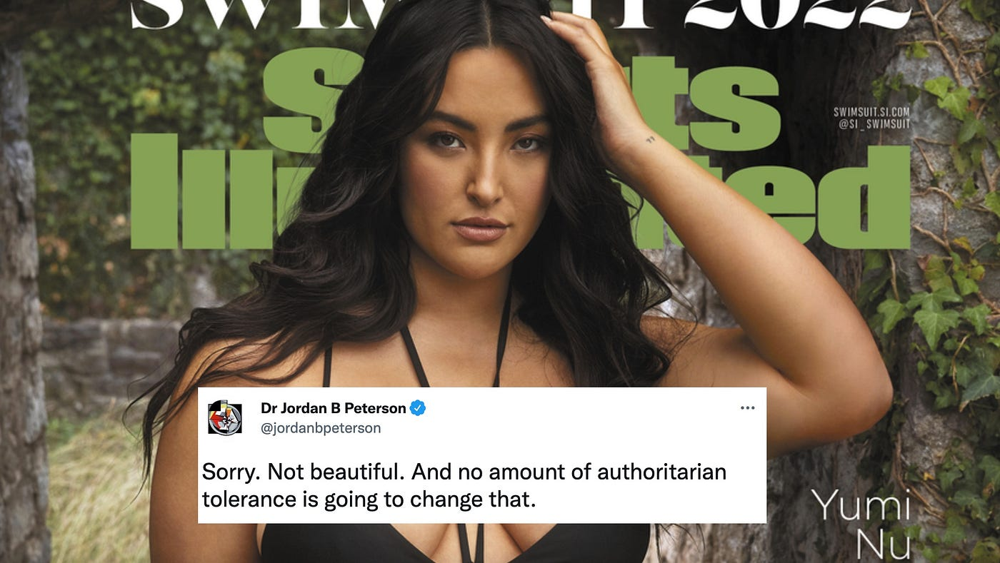

A few weeks ago, George Buhnici, a Romanian blogger and podcaster I had never heard of, went viral after making some pretty [nasty remarks](https://romani-buni.info/2022/07/video-george-buhnici-val-de-critici/) towards women during an interview at the beach. Some of the most controversial comments were the following:

> We come to the seaside to see skin, and I would like that skin not to have stretch marks. So, if you would invest in a gym membership as much as you invest in tattoos, I think we would all be better off. I encourage everybody to drop by the gym every now and then. Why? Because if you want to come to the seaside, you will show me your skin and, if you want to be friends with me, as you surely do, you should convince me with something more than cleavage. […]
>
> I’m lucky I have a wife who looks like an underaged girl. Look at her! How old would you say she is?

As should be no surprise, he got a lot of negative attention. What should also be no surprise, however, is that there were also those who came to his defense. At this point this is a recognizable dynamic of the culture wars: somebody says something offensive, they get a lot of backlash, but others always come to defend them from the “woke leftist PC police”, no matter how horrible their remarks. In progressive circles, the tendency is to dismiss these people as intrinsically bigoted and irredeemably immoral. But I think things are a bit more complicated than that.

I think one reason why people defend him is because they share his preferences and they feel shamed and guilt-tripped by the left-leaning progressives who criticize him imprecisely, focusing on his preferences rather than his actions. Don’t get me wrong, I personally believe Buhnici deserved most of the criticism he got, but when thousands of people debate about a viral event, it is inevitable that some arguments will be bad on both sides, and I think we should always criticize bad arguments regardless of whether they’re coming from our side or the other. I know it’s hard, after all humans are tribal by nature, but in order to avoid polarization I believe it’s important to resist our tribal urges and focus on arguments. Criticizing a bad anti-Trump argument doesn’t make you a Trump supporter. We should always keep that in mind. So how should we criticize body shamers without making bad arguments?

## What we shouldn’t criticize

There is nothing wrong with preferring thinner, younger women over curvier, older ones. There is nothing wrong with disliking stretch marks or tattoos. There is nothing wrong with admiring what you like, as long as you do it discreetly and respectfully. There is nothing wrong with wishing to live in a world where most people look attractive to you, and there is nothing wrong with feeling disappointed when people around you look unattractive. There is nothing wrong with any of that because we don’t choose our preferences. As Schopenhauer said:

> A man can do what he wants, but not want what he wants.

In other words, we can choose what to do, but we cannot choose what to want. Needless to say, this applies to everyone, regardless of gender identity, sexual orientation, etc. There is nothing wrong with preferring taller, richer men, nothing wrong with preferring to date people of one race over another, preferring to date cis people over trans people, etc. None of these preferences make you sexist, racist, transphobic, or regressive in any way. Of course, it would probably be beneficial for all of us if we questioned our preferences sometimes and tried to be more flexible regarding the physical attributes of our partners, but as much as I may believe this type of inner work should be encouraged, I don’t think it’s effective to frame it as a moral obligation.

Even a pedophile shouldn’t be judged for liking children, only for abusing them. Many people find this uncomfortable to accept, but the reality is that pedophilia is not a crime, but a psychiatric disorder that should be treated. Child abuse is of course illegal, but not pedophilia. You can’t ban a mental disorder. Nobody chooses to be a pedophile. If our goal is to reduce child abuse, we should actually encourage pedophiles to seek help before they offend, as is done in the [Netherlands](https://www.bbc.com/news/magazine-31114106) and [Germany](https://www.theguardian.com/society/2015/oct/16/how-germany-treats-paedophiles-before-they-offend), for example. Judgement and violence don’t reduce child abuse, they just scare pedophiles into hiding, which makes them even more miserable and dangerous.

Instead of judging people by their preferences, therefore, we should judge them by the consequences of their actions. So what are the consequences of promoting body shaming narratives as Buhnici has done?

## What we should criticize

The first thing I would criticize about his discourse is that it fails to recognize that aesthetics is mostly subjective. His tone seems to suggest that thin women who have no tattoos or stretch marks and who look like they are underaged are objectively more attractive than other women. But nobody is objectively attractive. Sure, you could say that most people prefer a certain set of body types over another, but that still wouldn’t give us objectivity. There will always be a niche for most aesthetic styles and body types, even if some niches are smaller than others. Still, even if there really is a lot of agreement regarding certain styles and body types, that still wouldn’t have any prescriptive implications. Which brings us to the next problem in his discourse.

As obvious as it might sound to most of us, some people seem to genuinely struggle to understand that other people don’t exist to please them. It’s OK to wish that the world conformed more closely to your particular aesthetic preferences but, if you start taking measures to make that happen at the expense of others, then you are being selfish and trying to create a world that is not better overall, but better only for you specifically.

When you express your personal preferences in public, as if they were objective and everybody had to conform to your standards, what you’re doing is basically peer pressure and body shaming. You’re imposing your personal tastes on everybody else, shaming people into compliance, forcing them to conform to your preferences. You may be expressing yourself authentically, but you’re doing it in a toxic and not in a healthy way. You’re oversharing, not giving them new relevant information that they will be grateful for. We’re all perfectly aware of what the mainstream beauty standards of our cultures look like. And it doesn’t matter if your preferences are common or not. People have the right to look however they want, regardless of whether this will make them attractive to most people, to a particular niche, or to nobody at all.

But are the people who fail to conform to the mainstream beauty standard really happy? You might ask. People like Buhnici, Jordan Peterson, and their followers often mock the body positivity movement as being delusional and harmful. For them, to say everybody looks beautiful is a blatant lie that promotes unhealthy lifestyles. To be fair, I do concede that this movement often promotes simplistic slogans. If aesthetics is subjective, saying that everybody is beautiful is meaningless. You might as well say nobody is beautiful and that would be equally true. It’s also true that, like in any movement, some people might indeed go too far and [promote what’s unhealthy](https://www.ncbi.nlm.nih.gov/pmc/articles/PMC6032838/). But if you have legitimate concerns regarding the body positivity movement, there are better ways to express them than by shaming the people you’re not attracted to.

*Earlier this year Jordan Peterson was also mocked after tweeting “Sorry. Not beautiful. And no amount of authoritarian tolerance is going to change that.” in response to a magazine cover featuring Yumi Nu.*

In a [subsequent statement](https://adevarul.ro/entertainment/celebritati/george-buhnici-reactie-declaratiile-controversate-pedofilia-crima-obezitatea-problema-sanatate-nu-opri-spun-gandesc-1_62d53be85163ec4271bc8404/index.html), Buhnici kept repeating that “obesity is a health problem” and that he “won’t stop saying what he thinks”. The subtext seems to be that, when he shames overweight people, he is doing a good thing because this should wake them up to reality and motivate them to be healthier. There are two problems with this claim.

The first is that he seems to think that whoever is not attractive to him is obese and unhealthy, and therefore he has the right and perhaps even the duty to encourage women to become more attractive to him, because by doing that he would automatically be encouraging them to be healthier. But that is simply not true. There are plenty of curvy people with cellulite and stretch marks who are perfectly healthy in spite of failing to conform to society’s ideal.

The second problem is that shaming people is simply [not an empirically effective strategy](https://www.ncbi.nlm.nih.gov/pmc/articles/PMC6565398/) for changing their behavior. We are already bombarded by images of what we’re supposed to look like and this is not exactly making us look increasingly fit and healthy. In the statement mentioned above, Buhnici said the only thing he apologizes for is his sarcastic tone, but there is a lot more to apologize for.

At the same time that we are bombarded by images of what we’re supposed to look like, we’re also bombarded with ads that promote addictive junk food that appeals to basic instincts no longer adaptive in our modern environment. By perpetuating the idea that obesity is a personal failure, a result of character flaws such as lack of discipline and self-control, he is contributing to the problem, not helping to solve it.

Our society’s obsession with notions such as merit and moral desert are at least in part the result of a cognitive bias called “fundamental attribution error”, which predisposes us to overemphasize innate personality traits and underemphasize circumstantial factors when explaining other people’s behavior. This bias is [exacerbated](https://www.pnas.org/doi/10.1073/pnas.1701916114) by the widespread belief in traditional religious notions such as free-will, causing us see obese people as weak individuals who deserve contempt rather than sympathy, instead of seeing them as victims of their circumstances.

Sure, discipline and self-control are important and most of the people who succeed in losing weight and staying healthy learn to train these skills. But we live in a world where billions of people spend most of their waking hours working [unsatisfying jobs](https://www.forbes.com/sites/jackkelly/2019/10/25/more-than-half-of-us-workers-are-unhappy-in-their-jobs-heres-why-and-what-needs-to-be-done-now/) just to survive, and then when they get home [ego depleted](https://www.verywellmind.com/ego-depletion-4175496) by the end of the day, they are expected to have the willpower to exercise and cook a healthy meal instead of eating junk food in front of the TV. This is simply absurd, especially when we consider that we are fighting again huge corporations who spend billions of dollars trying to figure out how to manipulate us to eat as much junk food as possible. If we actually care about obesity, we should use our platforms for promoting policies that [actually work](https://news.liverpool.ac.uk/2022/05/09/further-evidence-of-the-impact-of-junk-food-marketing-on-children/) by regulating the market and nudging people [away from unhealthy behaviors](https://academic.oup.com/jpubhealth/article/38/2/e133/2241365) and [towards healthy ones](https://theconversation.com/one-step-at-a-time-simple-nudges-can-increase-lifestyle-physical-activity-83122).

> Every food-related decision is influenced by a myriad of factors beyond our control — the availability, accessibility, affordability, marketing and promotion of processed items all seeking to grab our attention and be the one we purchase to the detriment of competitor brands’ bottom lines. Take away the advertising and manipulation, and we can begin to tip the balance in favour of being able to make our own minds up about what we eat and drink.”
>
> — [Boyland, 2022](https://news.liverpool.ac.uk/2022/05/09/further-evidence-of-the-impact-of-junk-food-marketing-on-children/)

Failing to conform to society’s beauty standards is hard enough on our mental health, [particularly for women](https://www.ncbi.nlm.nih.gov/pmc/articles/PMC6928134/), and social media seems to be making things even worse, especially for young girls:

> Body dissatisfaction, defined as “a person’s negative thoughts and feelings about his/her body” is a leading cause of eating disorders, disordered eating, low self-esteem and poor psychological wellbeing. Relatively high prevalence rates of body weight dissatisfaction have been reported cross culturally among adolescent girls [Mean = 48%, Range (26–62%)] and boys [Mean = 31%, Range (15–44%)] in 26 countries. Social media is extensively used by adolescents and has received a lot of research attention as a possible risk factor for body dissatisfaction.
>
> — [Mahon & Hevey, 2021](https://www.frontiersin.org/articles/10.3389/fpsyg.2021.626763/full)

The last thing we need is for celebrities and influencers to use their platform to put even more pressure on women to look one way or another. And it’s not just about feeling comfortable in one’s own body, it’s also about having the space to not think about one’s body all the time. Western society already does a pretty good job objectifying women, in the sense that they are often portrayed in the media in a way that puts emphasis on their bodies and sexual attributes. When socialized in such a context, many women internalize this perspective in a process called “self-objectification”, which causes them to think about themselves as objects to be regarded and evaluated based on appearance. Needless to say, this has many bad consequences:

> Since the foundational work of [Fredrickson and Roberts (1997)](https://www.frontiersin.org/articles/10.3389/fpsyg.2017.01055/full#B14), literature has largely demonstrated the damaging psychological corollary of self-objectification. Experimental research has shown that heightened self-objectification promotes general shame, appearance anxiety, drive for thinness, hinders task performances and increases negative mood.
>
> — [Rollero & Piccoli, 2017](https://www.frontiersin.org/articles/10.3389/fpsyg.2017.01055/full)

If you don’t want to be called sexist, a good first step would be to try to learn about the basics of feminism so that you can stop or at least minimize the extent to which you participate in social practices that harm women. A good place to start might be the 2011 documentary Miss Representation:



## How to apologize

About two weeks after Buhnici’s infamous interview, he finally published a video in which he actually apologized for his remarks, rather than doubling down and defensively bringing up the obesity problem as an improvised justification for his comments. He seemed sincere and, since I don’t believe in retribution, I don’t think it would do any good to mock his apology or attempt to cancel him forever. This would only feed the narrative that Western civilization is being destroyed by snowflakes who disdain free speech.

I do believe, however, in accountability. And it is frustrating that in the age of internet outrage and cancellations, most apologies involve no more than a four-minute monologue or a one-page essay where the authors promise to “[reconsider their priorities](https://www.youtube.com/watch?v=z-VQi0iGpDk)” and to “[step back and listen](https://edition.cnn.com/2017/11/10/entertainment/louis-ck-full-statement/index.html)”. There is no dialogue between victims and perpetrator, no action plan intended to make up for one’s mistakes.

Restorative justice is a new approach to justice that focuses on helping victim and perpetrator make amends instead of focusing on retribution. The goal of retribution is to cause suffering for its own sake rather than for a constructive purpose, while the goal of restorative justice is to minimize suffering. Restorative justice was inspired by [indigenous practices](https://www.thoughtco.com/restorative-justice-5271360) and it has actually shown [positive results](https://restorativejustice.org.uk/resources/evidence-supporting-use-restorative-justice) when compared to our traditional punitive system. It wouldn’t be hard for public figures to apply the principles of restorative justice when caught up in a scandal.

Buhnici could, for example, offer his platform to a feminist leader so that they can have a dialogue and discuss what he should do to make up for his mistakes. [Richard Dawkins](https://www.theguardian.com/books/2021/apr/20/richard-dawkins-loses-humanist-of-the-year-trans-comments) and [Dave Chappelle](https://www.bbc.com/news/entertainment-arts-62249771) could also have done the same with the trans community, and even [Louis CK](https://edition.cnn.com/2017/11/10/entertainment/louis-ck-full-statement/index.html) could have done the same with his victims or someone representing them. A culture of dialogue between public figures and those who feel victimized by them would be much healthier than a cancel culture based on retribution. One of the main reasons why cancel culture persists is that public figures have power and the people they hurt don’t, so the only thing victims can do is cancel them. If these public figures shared their power by offering their platform, they would give their critics an alternative.

## Conclusion

There is nothing wrong with liking athletic young girls, or rich muscular guys, or whatever it is that you like. It doesn’t matter how mainstream or narrow your beauty standard is, you don’t have to feel guilty. It is your beauty standard, you didn’t choose it, and although it’s probably good to reflect on it, you don’t have to get out of your way to change it if it’s working for you. However, don’t pretend that your standard is somehow more objective than others just because your preferences are widely shared. Don’t pretend that everybody who is not as skinny as you like is “unhealthily obese” or that women who don’t shave their armpits are “unhygienic”. And most importantly: don’t pressure people to look a certain way just because that’s what you and your friends happen to like.

If you ever make a mistake and get attacked, don’t be defensive, we’re all fallible humans. Instead, own your mistakes, share your power and your platform with your critics, and try to figure out a solution together. It might not be easy at first, but we must learn how to de-escalate conflict and make amends. If we don’t, I’m afraid our society will become increasingly unstable and polarized, and we need to be able to coordinate and work together to solve the many global problems that endanger our planet.
