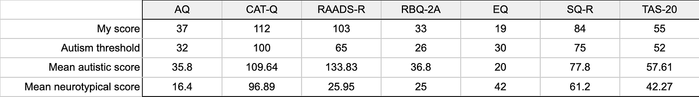

What does it mean to be neurodivergent? Essentially, it means you are not neurotypical, meaning you diverge from the norm in terms of your neurological functioning. But who defines what is typical? One could say that the World Health Organization defines it every time they publish a new edition of the [International Classification of Diseases (ICD)](https://www.who.int/standards/classifications/classification-of-diseases), which implies that anybody who doesn’t fit any of the diagnoses in the classification is neurotypical. But that would be missing the point of the neurodiversity paradigm.

The word “neurodiversity” was [coined](https://web.archive.org/web/20220604104736/http://www.myspectrumsuite.com/meet-judy-singer/) in 1998 by Australian sociologist Judy Singer, who was diagnosed with Asperger’s syndrome — an outdated label now considered part of the broader autism spectrum (ASD). Singer never claimed the concept was scientific; she described it as political. Indeed, she coined the term in support of the Autistic Self-Advocacy Movement, which focused on promoting legal rights, social acceptance, and accommodations for autistic people instead of focusing on treatment, which was the norm in the medical establishment. Today, these are known as the neurodiversity paradigm and the pathology paradigm, respectively. Personally, I think both paradigms have something to contribute to the autism debate, and in the following section I will explain why.

## Pathology vs. neurodivergence

Autism and ADHD are the conditions I’ll focus on here, as they resonate most with my personal experience. [According to the ICD-11](https://icd.who.int/browse/2025-01/mms/en#437815624) autism spectrum disorder (ASD) involves persistent social deficits and restricted or repetitive behaviors severe enough to impair functioning. But “sufficiently severe” is in the eye of the beholder. Two psychiatrists might disagree on whether someone qualifies, and neither would necessarily be wrong. That’s because ASD isn’t a natural kind with clear boundaries that can be discovered empirically — it’s a human-made category, a meme that survives for its utility.

The shift to a “spectrum” model has helped, but we’re still prone to binary thinking: is someone on the spectrum or not? In reality, the line between being on the spectrum or not is as fuzzy as the one between “mild autism” and “severe autism”. Some prefer the metaphor of a “[constellation](https://www.autisticscholar.com/the-autism-constellation/)” to highlight autism’s multidimensional nature.

So how should we draw these boundaries? That’s a prescriptive question. If the goal were to identify “genetically inferior” individuals for exclusion or worse — as in eugenic regimes — I would keep the category as narrow as possible, ideally diagnosing no one. If the purpose is to help people thrive, then we should err on the side of inclusivity. The narrower the label, the more people we risk excluding from support that might benefit them.

Here’s where the pathology and neurodivergence paradigms diverge. The pathology model treats neurodivergent traits as deficits to be corrected — via behavior therapy, empathy training, speech therapy, etc. This can be useful, especially in severe cases. I suspect I would have benefitted from some of these interventions as a child.

But the neurodiversity paradigm offers an important corrective: it challenges the assumption that neurodivergence is inherently disabling. Instead, it suggests our educational and professional systems also need to adapt. Sometimes, offering alternative learning environments or reasonable workplace accommodations can be more effective than individual treatment.

What we need is balance — an Aristotelian golden mean between personal growth and systemic change. Neurotypical and neurodivergent people alike must adapt to collaborate meaningfully. Some argue that the burden should fall entirely on neurotypicals — but this can backfire, breeding resentment. Take dating, for example: if an autistic man struggles to connect with women and ends up making them uncomfortable, few progressive feminists would say the solution is for women to unlearn their ableist biases. Most would agree it’s more helpful to teach neurodivergent men social skills, while *also* raising awareness about autism so that potential partners can better understand them. That’s what shared responsibility looks like — self-improvement on one side, empathy on the other.

Yes, accommodations should be made — but demanding too much too quickly can trigger backlash. We are already living in a world where people are tired of “woke snowflakes” telling them what they can and cannot say or do. Populist politicians have shown great skill at pandering to this frustration. We shouldn’t put fuel in the fire. If we want to foster real inclusion, we must aim for mutual adaptation, not one-sided assimilation.

## My autistic traits

I grew up in Brazil, a country [known to underdiagnose](https://www.statista.com/chart/34227/number-of-children-diagnosed-with-autism/) autism compared to more developed ones. I was a weird kid. Around age five, my parents sent me to a psychologist because of tics — neck twitches, exaggerated blinking, soft biting. They said I had anxiety. I didn’t see the problem with my tics, but since adults made a fuss, I began masking: twirling my hair, fidgeting, biting my nails, whatever seemed more acceptable.

In primary school, I was shy but not isolated. When puberty hit, however, the social world began changing in ways I couldn’t comprehend. I moved cities and changed schools twice, which only added to my confusion. Unable to keep up, I withdrew. Eventually, I realized that if I ever wanted to kiss a girl, I’d have to learn how to act “normal.” So I began studying social behavior like a foreign language: observing, mimicking, inventing mental algorithms. It was painful, but it worked.

I was often called autistic — sometimes mockingly, sometimes affectionately. Today I pass as neurotypical to most, but partners and close friends still see my quirks. Looking back, I see many signs of mild autism: tics, social awkwardness, difficulty reading between the lines or empathizing with fictional characters, an aptitude for STEM, obsessive interests, strict routines, and a tendency to systematize.

When I mention any one of these traits, people often say, “but everyone does that!” — as if autistic traits are exclusive to autistic people. They’re not. This reflects the outdated categorical approach, which tries to define autism based on a fixed set of necessary and sufficient conditions. But autism isn’t defined by a single trait or threshold. According to the dimensional approach, [now preferred by many researchers](https://www.nami.org/mental-health-systems/the-transdiagnostic-dimensional-approach-another-way-of-understanding-mental-illness/), it involves a *pattern* of traits, and being autistic means scoring high on enough of them. In this sense, autism is more of a [family resemblance](https://plato.stanford.edu/entries/wittgenstein/#LangGameFamiRese) or [prototype](https://en.wikipedia.org/wiki/Prototype_theory) category than a classical one.

People also misunderstand autism as a static rather than developmental condition. Many autistic adults are sociable and can pass as neurotypical. What distinguishes them is not where they are socially, but [how they got there](https://www.goodreads.com/quotes/12822557-neuroscientists-have-observed-that-autistic-brains-continue-to-develop-in): not through intuition, but through studied systems and shortcuts. That’s why childhood symptoms are often more visible.

In a [2001 study](https://pubmed.ncbi.nlm.nih.gov/11439754/), Simon Baron-Cohen introduced the Autism-Spectrum Quotient (AQ), where 32+ suggests clinically significant traits. I scored 37. I also scored above threshold on the CAT-Q, RAADS-R, RBQ-2A, EQ, SQ-R, and TAS-20:

I’ve also been diagnosed with ADHD, a common comorbidity with autism. Some researchers [suggest](https://pubmed.ncbi.nlm.nih.gov/11439754/) that ADHD symptoms may actually reflect undiagnosed ASD. So — does this mean I’m on the spectrum?

## What’s the point of labels?

According to the ICD, a person deserves an autism diagnosis only if their traits are “impairing enough”. But what if two people have identical traits, and only one gets diagnosed because external circumstances made it harder for them to adjust? Is one autistic and the other not? This exposes a key flaw of the pathology paradigm: it defines autism as necessarily pathological, ignoring those who manage to adapt without formal support.

That’s where the neurodivergence paradigm helps. It sees autism as a cluster of traits that may or may not cause problems depending on context. In *Neurotribes*, [Steve Silberman](https://www.goodreads.com/book/show/22514020-neurotribes) argues that figures like Newton or Dirac might have been on the spectrum. They flourished because they were raised in elite environments; others with similar traits but less privilege may have ended up institutionalized.

So how do we decide who counts as neurodivergent? With traits like height, we accept fuzziness: some people are “kind of tall”, and we don’t expect a universal cutoff. Similarly, identity labels like “metalhead” or “nerd” are self-ascribed and context-dependent. You might not look metal, but still feel part of the community due to your values or past experiences.

But labels are only useful when they help communicate. If I tell people I’m metal but I hate metal concerts, bars, and clothes, then my use of this label is hindering, not helping communication. Saying I’m autistic should help people understand my behavior, not mislead them. But that depends not just on my traits, but on their knowledge. If people associate autism only with severe disability, saying I’m autistic might confuse more than it clarifies.

So am I on the spectrum? That’s just another way of asking: does this label help others understand me better? Would it lead to more accurate, compassionate interactions? If so, then maybe yes — even without a formal diagnosis.

## External diagnosis

When I talk about my autistic traits, people often ask why I haven’t sought a formal diagnosis. Some are genuinely curious, but others respond with hostility. A few years ago, I mentioned possibly being on the spectrum, and someone replied:

> If you think you *might* be on a spectrum, go get the-ra-py and find out from a professional.

This attitude stems from the pathology paradigm: the idea that autism is a well-defined medical condition, objectively diagnosable by experts. But psychiatric categories aren’t natural kinds; they’re human-made conventions. Homosexuality was once considered a disorder. Today, if someone says they’re gay, nobody demands a medical certificate.

There are also culturally specific conditions — like *ataque de nervios* — that don’t appear in the DSM or ICD. Their absence doesn’t mean they’re imaginary, just that different communities cluster and label symptoms differently.

Still, many assume that calling oneself autistic is an empirical claim only a specialist can validate. There’s some merit to wanting impartiality, a core tenet of the scientific method. But in practice, what does an autism diagnosis even mean? It’s not like testing for a genetic disease. It’s a clinician judging that your traits cross an arbitrary threshold of impairment. So aside from appeasing skeptics, would I have anything else to gain from a formal diagnosis?

### The pros

In some countries, an autism diagnosis comes with concrete benefits. In the UK, the [Equality Act 2010](https://www.legislation.gov.uk/ukpga/2010/15/part/2/chapter/2/crossheading/adjustments-for-disabled-persons) requires employers to provide “reasonable accommodations” for disabled employees, including clearly written policies, reduced sensory distractions, quiet spaces, and autism awareness training. Brazil offers comparable rights under the [Berenice Piana](https://www.planalto.gov.br/ccivil_03/_ato2011-2014/2012/lei/l12764.htm) Law. In Romania, where I currently live, [Law 448/2006](https://legislatie.just.ro/Public/DetaliiDocument/77815) includes some of the same provisions, but only if you’re formally registered as having a disability of mild or higher degree — a process that is far more bureaucratic and time-consuming than simply getting a doctor’s letter.

I’ve rarely needed formal accommodations, but I did once hesitantly bring up neurodivergence during a feedback meeting with a manager when trying to explain my need for a more rigid product management methodology and my difficulties dealing with a colleague. Perhaps an official diagnosis would help me feel more confident bringing this up and asking for specific accommodations, even though I think most tech companies would offer the kind of accommodation I need without requiring any paperwork or medical justification.

There are other legal advantages as well. In the UK, for example, an autistic man [successfully sued](https://www.independent.co.uk/news/uk/autistic-man-ketan-aggarwal-wins-case-virgn-active-taught-himself-law-instructor-called-him-stupid-uxbridge-county-court-a7652856.html?amp) a gym for discrimination after being insulted by a trainer. Theoretically, similar protections exist in Romania. But for someone like me — who’s well adjusted, passes as neurotypical, and isn’t seeking to sue anyone — it’s unclear how useful they would be.

### The cons

The benefits of a diagnosis are real, but so are the drawbacks. A [recent survey](https://www.peoplemanagement.co.uk/article/1896055/half-neurodivergent-adults-discriminated-against-applying-job-research-finds) found that a third of neurodivergent job-seekers have been rejected after disclosing their condition. Many still don’t see neurominorities as “legitimate” minorities deserving accommodation.

I’ve felt this stigma myself. After applying for an Effective Altruism community building grant, I received feedback suggesting that a slightly awkward interaction at a conference counted as a reason to reject me. I explained my possible neurodivergence, but that seemed to reinforce their concerns. I was encouraged to contribute to the movement with my technical skills instead.

The diagnostic process itself is also a deterrent. In Romania there is no standard protocol for assessing autism in adults and it’s difficult to even find professionals willing to provide this service. If I turned to a [private clinic abroad](https://www.adultautism.ie/collaborative-autistic-identification), the cost could be as high as €2,500. That’s a steep price for a label.

More importantly, I’m philosophically uneasy with legitimizing the pathology paradigm. I don’t see autism as a disorder to be diagnosed but as a neurotype to be understood. Progressive clinics even offer “collaborative identification” instead of diagnosis in an attempt to distance themselves from traditional deficit models.

So if I don’t see myself as pathological, why would I seek a diagnosis?

## Self-determination

Instead of pursuing a formal diagnosis, I could simply present myself as AuDHD without medical validation. Many call this “self-diagnosis”, but as [Devon Price argues](https://www.goodreads.com/book/show/58537365-unmasking-autism), that term reinforces the pathology paradigm. He suggests “self-determination” or “self-realization” instead.

### The pros

This route avoids legitimizing the idea that only professionals can determine who qualifies for an identity. Just as nobody needs a doctor to say they’re tall, I don’t need one to say I’m autistic. I’m using the language of psychiatry because it’s the only one available — but I’m not granting it the authority to define who I am.

It’s also cheaper and less bureaucratic. A formal diagnosis could cost thousands and take months. By contrast, self-determination allows me to explore my neurotype now, using tools that already exist — books, articles, and self-report questionnaires developed by researchers.

More importantly, embracing this identity might help others relate to me more constructively. If people understand that I often fail to predict emotional responses — not because I don’t care, but because I literally don’t see them coming — they might interpret my behavior more charitably.

Finally, it connects me to a broader community. Identifying as autistic can lead to useful support networks and strategies tailored to people with similar cognitive styles. Since I started this article I’ve been researching autism-specific solutions for my struggles and it’s been more helpful than anticipated.

### The cons

Of course, self-identifying carries risks. Some people misidentify and pursue unhelpful tools while missing more accurate diagnoses. A [recent study](https://journals.plos.org/plosone/article?id=10.1371/journal.pone.0319335) raised concerns about the surge in ADHD self-diagnoses driven by low-quality online content. This is not only a danger for the individual, but it also reveals deeper social problems such as scientific illiteracy and epistemic irresponsibility. These problematic attitudes fuel the broader anti-science movement that dismisses experts in favor of “doing their own research”.

In my case, though, I’ve used validated tools (AQ, CAT-Q, RAADS-R, etc.), read academic literature, and spoken to professionals. Could I still be biased? To some extent, sure. Diagnostic tools that rely exclusively on self-report are always vulnerable to motivated reasoning and other limitations. Ideally, there should be a standard protocol that involves both self-assessment and external validation. Indeed, there are tools such as ADOS-2 and ADI-R that do not rely on self-report, but were developed under the pathology paradigm so neuroaffirming clinicians often prefer not to use them.

Another risk is social backlash. People may think I’m using the label to avoid responsibility or seek special treatment. And truthfully, I *do* want more understanding. Not because I want a free pass to be rude, but because my learning process involves trial and error. I can’t improve without feedback, and people are more likely to give constructive feedback when they assume good intent.

But disclosure can also backfire. I’ve learned that people’s understanding of autism is often shaped by portrayals of severe cases on TV or fleeting encounters in real life. Others resent what they see as the casual appropriation of psychiatric labels — including some formally diagnosed individuals who feel their struggles are being minimized. Coming out as autistic in this context might generate confusion — or even hostility.

So I hesitate. I don’t want to be pitied or excused. I want to be understood — and to keep growing. Whether self-determination will help with that depends on how society receives it. That’s an empirical question I have no answer to.

## Problems

If I don’t need legal accommodations or plan to sue anyone, what would a diagnosis actually solve? Some say it could give me closure, or finally confirm that my struggles had a cause. But this doesn’t make sense once we acknowledge that the boundaries of this category were invented within the pathology paradigm. Whether or not I should be included in this category is therefore a prescriptive question, not a descriptive one. Would the label help me function better in the world?

I do have a problem. I have traits — autistic or not — that lead to social friction in many areas of life. Sometimes I fail to notice when I’ve upset someone; other times I come across as too intense or repetitive. These moments aren’t constant, but they happen often enough to make me anxious. I’ve grown hesitant to message people, ask for favors, or propose collaborations — especially in volunteer contexts, where goodwill is everything.

In tech work, bluntness is often fine. But in activism, dating, or personal relationships in general, subtle cues matter. I’ve been called pushy or entitled for sending direct messages without the expected small talk. Once, during a debate at the office, a colleague said, “You don’t have to scream at me,” though I hadn’t even realized I’d raised my voice. Romantic partners have expressed feeling unimportant when I hyperfocus on special interests.

These aren’t grounds for a discrimination lawsuit. People aren’t being malicious — they just don’t know what’s going on in my head. Still, their reactions limit me. I avoid certain kinds of outreach, which makes me less effective as an organizer.

Would identifying as autistic change that? If I added a line to my bio or email signature, would people interpret me more charitably and respond more constructively? Possibly. Or it could backfire, reinforcing stigma and making people even less likely to collaborate.

That’s the dilemma. I’m not sure if embracing the label would help or hurt. But what’s clear is that I have a pattern of social friction that isn’t going away on its own. Whatever name we give it, I want to address it — ethically, constructively, and without shame.

## Solutions

At its core, my problem is simple: I have social difficulties, which lead to anxiety. Whether they stem from autism, trauma, ADHD, or just being “weird” doesn’t change the fact that they’re unchosen — and persistent. So how do I deal with them?

### Cultural change

In an ideal world, people would respond to miscommunications with curiosity, not judgment. That’s the spirit of nonviolent communication (NVC), a framework developed by psychologist Marshall Rosenberg. It encourages people to express emotions and unmet needs clearly, and to assume others act with good intentions — even when they cause harm.

NVC resonates with philosophical traditions I admire: Socratic dialogue, Spinoza’s rational forgiveness, and the principle of charity promoted by Dennett and many others. It’s based on the idea that conflict often results from misunderstanding, and that progress comes from cooperation, not retribution.

Of course, NVC is hard. It asks you to be vulnerable, to assume the best even when you’ve been hurt. But the rewards can be transformative. I’ve used NVC to resolve conflicts successfully. The problem is, I can’t expect others to use it with me. Asking everyone to adopt NVC tomorrow is unrealistic. Still, if people had more tools to interpret behavior compassionately, life would be easier for all of us — neurodivergent or not.

### Disclosure

Since cultural change is slow, maybe I can speed things up in my own life through disclosure. I don’t mean this in a manipulative sense. I mean offering context — mentioning my traits so others interpret my behavior charitably.

If I had a formal diagnosis, this disclosure might carry legal weight. But even without it, just saying I’m autistic (or presenting traits associated with autism) could change how people respond. I recently talked to a friend who was disappointed by something her boyfriend did and wondered whether his behavior was caused by his autism — as if that would make it more forgivable. I think that’s the wrong question. Even if it wasn’t autism, his behavior was still determined by something beyond his control. What matters isn’t the cause, but whether the behavior can change. If someone shows a pattern of hurtful behavior but is willing to work on it, they deserve a chance — diagnosis or not. If they’re unwilling or unable to change, it’s valid to walk away. We all have the right to decide which behaviors are tolerable in a relationship, and nobody gets to call us ableist for that.

Still, this story shows how people are more forgiving when there’s a medical explanation for someone’s behavior. Others, however, might not be that generous. They might see disclosure as an excuse — accusing me of “playing the neurodivergence card” or questioning my motives, since I don’t have “official” proof.

There’s also backlash to consider. Some resent identity-based language altogether, viewing it as attention-seeking, bandwagon effect, or part of a culture war. But at the end of the day, all I want is empathy. My whole life has been a struggle to decode neurotypical norms. If I slip up, the least I hope for is some benefit of the doubt.

### Personal change

Some people argue I shouldn’t need a label. If my social skills are imperfect, I should just improve them — like everyone else. Adolescence is hard for most people; maybe I’m not neurodivergent, just sensitive. Maybe I should toughen up and stop overanalyzing.

But that assumes there’s a clear boundary between “normal” and “neurodivergent” — and that falling on the “normal” side means I shouldn’t ask for accommodations. In this view, identifying as neurodivergent becomes a kind of cheating — asking for special treatment without “earning” it.

This concern isn’t entirely irrational. If we broaden the definition of autism too much, will everyone start claiming it to avoid accountability? Should we draw a sharper line to prevent misuse?

But that logic breaks down once we accept that autism is a spectrum and that its boundaries are conventional, not absolute. If we define neurodivergence as “having traits that make life harder in a neurotypical society,” then anyone with those traits should be allowed to use the label if it helps them get support.

And if you’re worried about fairness, remember: almost everyone has some difficult traits. Most people could probably benefit from more compassionate interpretation. If neurodivergence becomes a widely accepted spectrum, then *everyone* can benefit, you included. It’s not a cheat code — it’s just a shift in how we relate to each other.

If you don’t feel the need for a label, that’s completely valid. But if someone else finds it useful — because it helps them grow, connect, or explain themselves — why begrudge them that? People have the right to decide for themselves which labels to embrace, if any. Assuming their decision is uninformed — or that you know better — is uncharitable and risks coming off as dismissive or arrogant. If you’re skeptical of someone’s self-identification or doubt their epistemic rigor, you can always ask questions with openness and curiosity.

## Is everybody neurodivergent?

It might sound absurd to say “everyone is neurodivergent,” but the idea isn’t as far-fetched as it seems. Take the example of height. There’s no clear threshold for being “tall.” We could define it as anything above average, one or two standard deviations above, or even “taller than the shortest person alive.” All of these definitions are valid — but none are objectively right.

The same goes for autism. Suppose we had a unified test combining all current ones. We could then set a threshold: anyone above average? One SD above? Two? Each option would yield different populations. There’s no scientific truth about which line to draw — that’s a normative decision.

This is the classic *sorites paradox*: when does a heap become a heap? When does tall become “tall”? When does autistic become “autistic”? These are fuzzy categories with no fixed boundaries. That doesn’t make them meaningless — just contextual.

Of course, autism is more complex than height. There’s no single scale. It’s multidimensional, like a set of sliders for different traits: social cognition, sensory sensitivity, special interests, etc. Two people can have equally high autism scores but entirely different profiles. Because of that, some even prefer to speak of [“autisms”](https://www.cambridge.org/core/journals/the-british-journal-of-psychiatry/article/abs/from-autism-to-the-plural-autisms-evidence-from-differing-aetiologies-developmental-trajectories-and-symptom-intensity-combinations/4D9B0B35DCF03FDBA4E001F7DC9B02D6) in the plural.

So, is everyone neurodivergent? In a broad sense, yes — because no one’s brain functions in perfect alignment with the statistical average on all dimensions. But the real question isn’t whether you qualify. It’s whether the label helps you or others understand your experience better. If it does, use it. If not, don’t.

## Conclusion

We’re living through a paradigm shift. The pathology model of autism — focused on deficits and diagnoses — is slowly giving way to a neurodiversity paradigm that frames autistic traits as part of natural human variation. But in this transition, confusion is inevitable. Even clinicians struggle to keep up with shifting language, categories, and expectations.

Philosophy and psychology professor [Joshua May](https://psyche.co/ideas/why-we-should-think-of-neurodiversity-like-we-do-personality) argues that we should treat neurodiversity like personality — measurable, multidimensional, and not inherently pathological. Just as the [Big Five personality model](https://www.mccormick.northwestern.edu/news/articles/2018/09/are-you-average-reserved-self-centered-or-a-role-model.html) has yielded empirically derived personality types, we could one day identify autism subtypes without relying on DSM/ICD frameworks.

When I say I’m autistic, I’m not claiming to have a pathology or disability, which would indeed require a diagnosis. I’m saying I share a recognizable neurotype — an autistic personality. No one demands a diagnosis when someone identifies as neurotic or conscientious based on a personality test. Why should autism be different? There’s even increasing recognition of the [broad autism phenotype](https://www.verywellhealth.com/what-is-the-broad-autism-phenotype-260048), a subclinical pattern of traits that doesn’t meet the threshold for diagnosis but still shapes people’s lives.

So — am I neurodivergent? There’s no authority that can answer that definitively. But based on self-assessments and feedback from professionals, I clearly score higher than average on autistic traits — often at the same level as those formally diagnosed. Eventually, I did seek a more formal assessment from a recommended psychiatrist, and she also confirmed my suspicions. The process may not have been as rigorous as in the UK, where they have a [national protocol](https://www.nice.org.uk/guidance/cg142). But it did involve an initial consultation covering my developmental history, self-assessment tests for autism (as well as for other conditions to rule out alternative diagnoses), and a final discussion where we interpreted the results.

In Romania, this diagnosis is not sufficient to give me any legal benefits. If I wanted that, she would have to write a formal letter, which I would then use to apply for a certificate of mild disability. However, she said it’s virtually impossible for someone like me — an adult perceived as “high-functioning” — to get their application approved. In fact, she said the state’s understanding of disability is so narrow and antiquated that it is not uncommon for clinicians to give slightly different diagnoses in order to help their patients.

So I have a diagnosis, but I’m not disabled in the eyes of the Romanian state. Does that mean I’m entitled to special treatment? Not necessarily. Ideally, we should interpret each other charitably *regardless* of diagnosis, because none of us chose our minds or how we’re perceived.

In practice, however, the legacy of theological concepts like free will and moral desert remains powerful. As I’ve argued [elsewhere](https://arielpontes.medium.com/secular-superstitions-2bc2518afae2), these are secular superstitions that continue to shape how people think — and often cause harm. They lead people to fall prey to the fundamental attribution error, interpreting upsetting behavior as a sign of bad character rather than clumsiness or circumstance. That’s why disclosing my neurotype might make people more willing to give me the benefit of the doubt. Research even shows that autistic people are seen as less “creepy” when others are told in advance about their neurotype.

Then again, self-identifying could backfire — triggering skepticism or resentment, especially without a formal diagnosis. Whether to use the label depends on the context and how others are likely to respond.

And maybe “I’m autistic” isn’t the most helpful thing I can say anyway. The spectrum is so broad that the label alone communicates little. What *would* be useful is a personal profile — a clearer outline of which traits I have and how they affect me. An academically validated self-assessment test that yields an autistic profile — rather than a unidimensional score — would be ideal. Until then, we might have to settle for something simpler, like a [relationship user manual](https://loveuncommon.com/2017/04/13/user-manuals-an-introduction/), a tool common in the polyamorous community where, perhaps unsurprisingly, neurodivergent people are [overrepresented](https://neurodivergentinsights.com/autism-and-sexual-diversity/).

Ultimately, identity should serve communication, not dogma. If a label helps you understand yourself — or helps others understand you — use it. If not, don’t. But we should all have the freedom to explore, self-describe, and revise as we grow.
